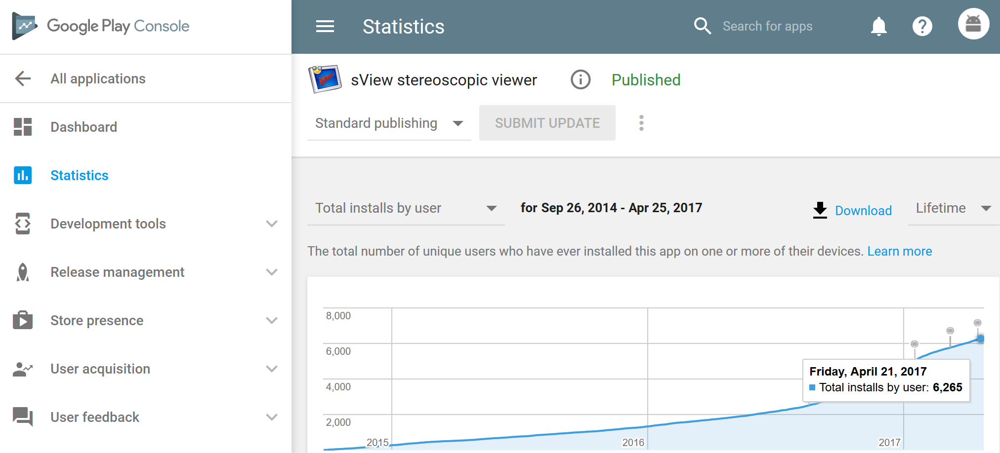
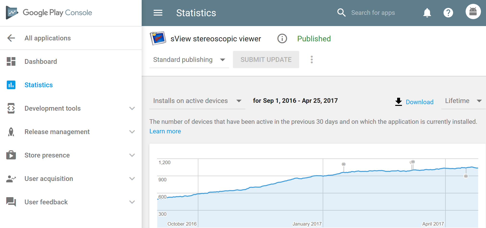
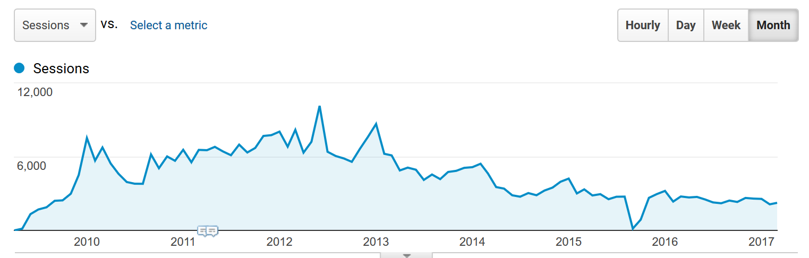
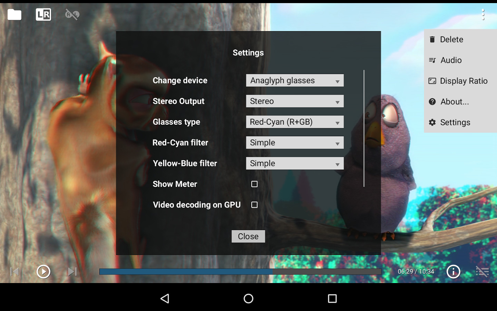

Having all these powerful tools (*Google Play*, *iTunes connect*, *Google Analytics*, I believe *Steam* provides something similar for developers as well)
collecting overwhelming statistics on your projects may play a weird joke with developer.
I have to admit that I became obsessed with stats – watching "what's new" becomes a part of everyday ritual, just like a cup of coffee in the morning.

I know perfectly well, that looking on statistics everyday will not change it, but still I'm unable to ignore it.
And there are so many metrics to play with – countries, devices, screen sizes, version of OS, etc.!
Knowing so much and nothing at the same time become a burden rather than a paradise...

<!--break-->

|  |
|:--:|
| *sView on Google Play – Total Installs by user* |

One interesting thing with *Google Play* statistics is that normal users see only overall installs counter,
while developers can see active installations – e.g. how many users have left application on their devices and use it from time to time.
Before "Installs on Active device" become available in September '2016, metric "Current installs" was used instead, which has shown only users that have not removed an application yet.

*Total installs* is usually dramatically greater than *Current installs*, because many user install applications without even reading its description
and just come through several applications in the category, and *Current installs* is greater than *Active devices* – because many users
do not bother with uninstalling unused applications at all and because of dead/lost devices.

Knowing the difference between *Active devices* and *Total installs* (which users actually see on *Google Play* page) for my own applications,
I become curious – which numbers of active users have other applications, popular on *Google Play* (e.g. with millions downloads...)?

|  |
|:--:|
| *sView on Google Play – Active Devices* |

You may also notices that although overall installs is continuously growing, the number of active users remain almost the same for a long time – just about thousand of users.
These numbers are real ones – no fake downloads, no massive ads. or any other service was used to improve these counters; but I suppose it is obvious anyway ;).

Before *Google Play*, I used to watching *Google Analytics* for a web-site `sview.ru` – which is just a home page for *sView* project
(without any ads. on it for entire lifetime) and some extra articles around 3D stereoscopy.
But at some point it is become just too boring for me.

|  |
|:--:|
| *Website statistics* |

*sView* project has been started in '2007 as proof of concept of stereoscopic image viewer for shutter glasses (in between my summer exams at University),
and later on become an open source functional media player.
So it is almost 10 years passed from the beginning!
During the lifetime, I have received a lot of feedback concerning a user interface – which is based on self-written widgets library and certainly lacks a hand of true artist.

|  |
|:--:|
| *sView on Android* |

*sView* became available on *Google Play* in '2014 – just because it was simpler to start with porting
a small OpenGL viewer before I started porting *Open CASCADE Technology* 3D Viewer onto *OpenGL ES 2.0* and *Android* platform.

Looking onto *sView* statistics from time to time, I'm asking myself – why I'm still working on it?
The project like *Bino3d* (another open source stereoscopic video player developed by group of developers) arrived much later than *sView*, but become much better known to users in a short time.
There was done something really wrong when I pushed sView as an open-source project, because I have not received any suggestion to join the development for entire decade, still remaining a sole developer of it!

But answer to my previous question is actually simple – I'm making small improvements to *sView* from time to time just because *I'm using it*,
enjoying it and would not like to use any other player currently available.
The last development effort has been done for supporting *VR HMDs*, and there is still work to do.
