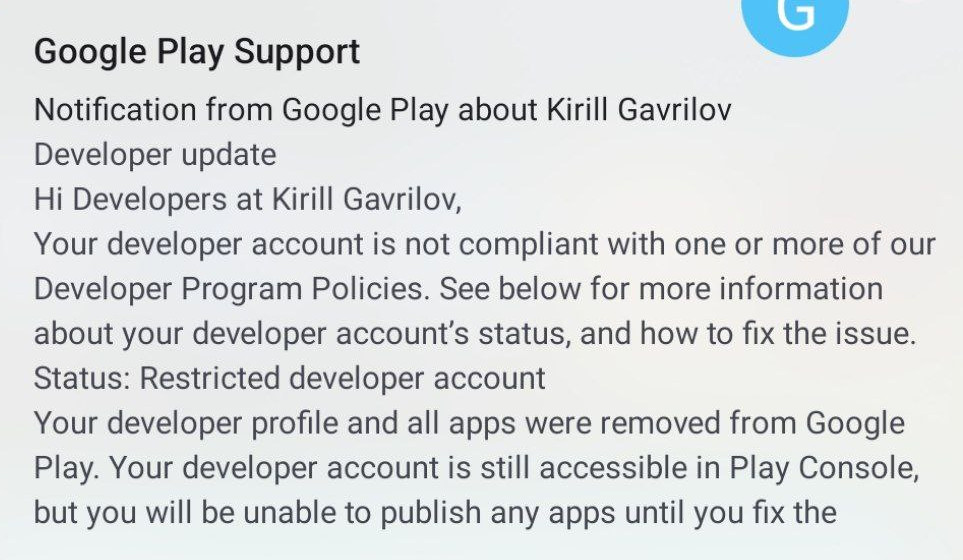
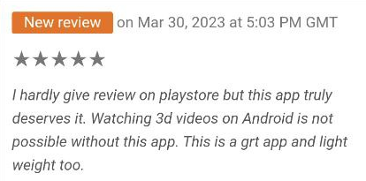
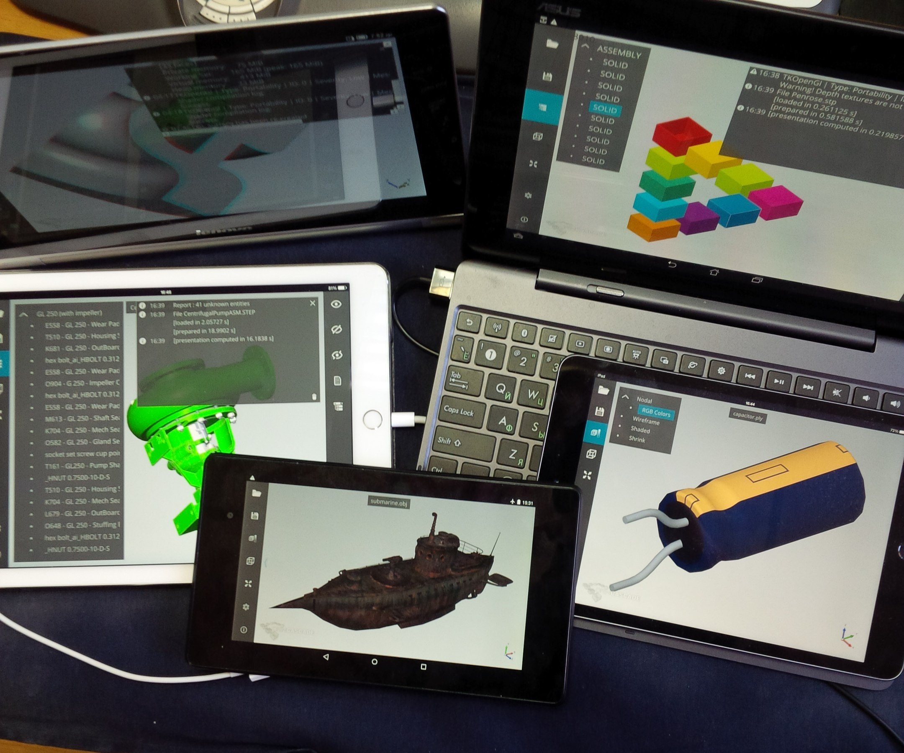
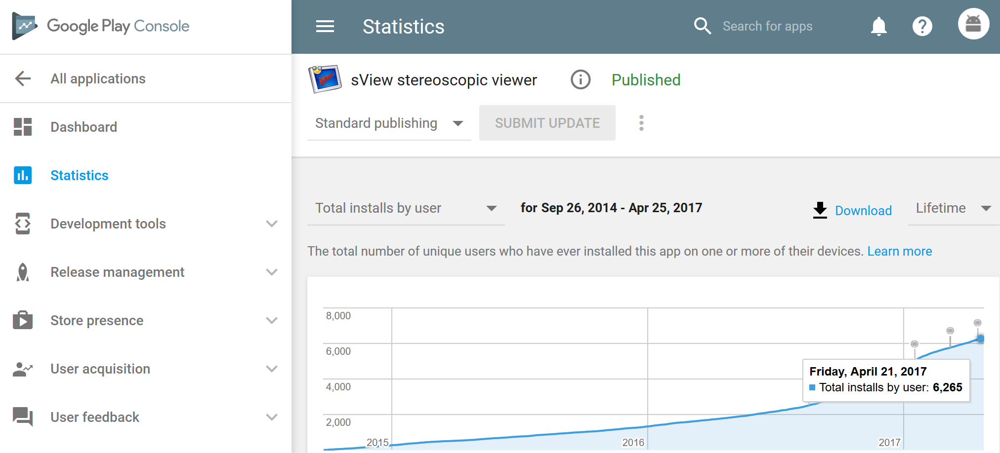

It was a long journey started in 2014 with porting *sView* onto *Android platform* and taking a first look onto marketplaces for applications.
I remember the first impressions from *Google Play*: plenty of rules, weird design of versioning *APKs* for different architectures,
nice-looking detailed statistics and weird metrics that you cannot compare with existing applications...

<!--break-->

|  |
|:--:|
| &nbsp; |

The first efforts were followed by [disappointing statistics](../2017-04-27-meditation-on-statistics/), crash reports, negative user feedback, and unbearable pressure from *Google Play*.
Year after year – new rules, new requirements, threats to remove an application or limit its accessibility,
if it will not be updated with newer SDK versions, and newer revisions of ugly APIs designed for 'protecting' user privacy.
Keeping application afloat on these marketplaces started looking more like [Fire And Motion](https://www.joelonsoftware.com/2002/01/06/fire-and-motion/)
activity draining resources (for free!), rather than moving forward and doing something really useful to me and end users.

|   |
|:--:|
| &nbsp; |

I have to collect a plenty of devices for testing applications with different versions of *Android platform*, from different vendors
(to debug bugs/features in their firmware), with different graphics hardware (to debug *OpenGL ES* drivers)...

|  |
|:--:|
| &nbsp; |

I still cannot understand why *macOS developers* were able to implement requests per-application permission to user's folders nicely and transparently, without asking developers
to modify their applications, while *Android SDK* invented a [mess of API](https://developer.android.com/training/data-storage/shared/documents-files)
with several revisions as a burden to application developers...
And this is just to allow browsing the phone's memory and opening files (who would expect *Media Player* or *File Manager* to dare accessing user files)!

It was mostly an experiment out of curiosity; I haven't any *Android phone* with *stereoscopic display* in my hands to use *sView* in its native space (nor I have nowadays).
And *Google Play* was already littered with an endless number of general-purpose video players and image viewers in '2014
(even though most of them were completely unusable) – hence, users were barely interested in giving a chance to a one more unknown player in an endless list of applications in the store.

|  |
|:--:|
| &nbsp; |

There were some nice memories too – browsing statistics and user feedback for *CAD Assistant*.
Here I've learned that even a good application receives hostile comments from superficial end users from time to time,
who are unable to read the application description and stamping it with *1 ★ star* for not doing something that it doesn't pretend to do! Learned to keep calm and let it go...

But now this journey is finally over! Keeping *sView* rolling in such a marketplace for free – just doesn't worth it.
Users, who'll find *sView* useful on their phones – will be able to download APK files from the project's home page.
