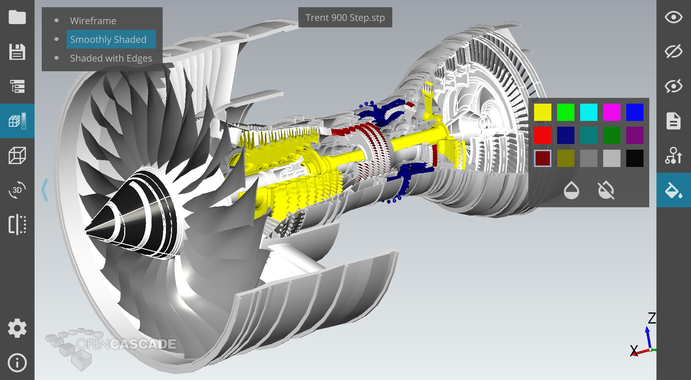

Some time ago at *Open Cascade* we have started a new project called *CAD Assistant*,
which became a small but powerful 3D viewer and converter for *CAD* models (*STEP*, *IGES*, *BREP*)
as well as Mesh files (*STL*, *OBJ*, *PLY*, *glTF*) available on many platforms (*Windows*, *OS X*, *Android*, *iOS*).

*Open Cascade* developed a plenty of desktop applications before, but mobile platforms and touch screen user interface were something new for most of developers at that time.
Making a new application for *Android* platform was a challenging yet inspiring task.
*CAD Assistant* development involved porting and testing of open-source *Open CASCADE Technology* framework onto *Android* platform – including its own 3D visualization toolkit.
The team decided to use *Qt5/QML* framework for the user interface as an opportunity to growth expertize in new technologies.

After a couple of years, I've decided writing a small article representing my personal impressions about this technology.

<!--break-->

## Precaution

This article is *not* about hating *QtQuick/QML* as it might look, though there are many reasons to dislike this technology.
This is rather a short story about problems of this technology, and after reading it developers looking for a good *GUI* framework
for their new project will be aware not only of benefits of this powerful cross-platform technology, but also of its hidden issues.

## Platform-aware framework

*Qt5* is a cross-platform framework - and it is one of the strongest reasons for choosing for cross-platform application.
*Qt* is not the only cross-platform *GUI* framework - there is a plenty of them, but *Qt* is one of the strongest amongst them.

In case of *GUI* framework cross-platform capabilities can be provided in different ways.
While some frameworks tend to adopt user interface to specific platforms, others provide a unified user interface across all platforms.

*Qt* is the one that traditionally simulates user interface to match native controls on specific platform.
While this improves user experience, this comes with a drawback of supporting platform-specific differences within developing a cross-platform application.

*QtQuick/QML* initially followed the same conception providing some standard controls like checkboxes and buttons with native look-and-feel,
but encouraging development of custom application-specific controls - which makes platform-specific customization less obvious and reasonable.

Apart from look-and-feel customization, *Qt* also provides a number of interfaces heavily relying on specific platform.
Although this functionality is wrapped by *Qt* interfaces (specific classes, enumeration values or methods), their usage is not transparently cross-platform.

This part of *Qt* framework makes it "***platform-aware***" library, e.g. it is aware of various platforms,
but it is up to application developer to use them depending on the platform.
Thus, an application actually has to implement some platform-specific code.
This is why I called it *"platform-aware"* - in similar way as some libraries are called not thread-safe but multithreading aware,
when it is up to application to properly use them in multithreading environment.

## High density screens and interface scalability

Supporting high density screens (e.g. *HiDPI*, *Retina*) and scalability of user interface is an important feature for modern applications.
However, various platforms (*OS X*, *Windows*, *Android*) provide different services for scaling the user interface and solving various issues
(including compatibility with old applications and connecting mixed *high-density*/*normal-density* screens at once).

And here *QtQuick/QML* disappoints an application developer - it comes with the same *"platform-aware"* solution
forcing application developer to mix up *QML* code with different code paths depending on the target platform.
This approach looks very weird in the context of *QtQuick/QML* which ***theoretically could unify dpi-awareness functionality across platforms***
and push developers for using proper approach handling various tricky issues, but it ***does not want to***, providing a mess of interfaces specific to various platforms.

This results eventually in a partially broken user interface with scaling issues, in case if an application developer is not skilled enough in this domain.
Even worse, it is impossible to detect all such issues without testing on all platforms (including *iOS*, *OS X*, *Windows 10* and *Android* with every platform having own issues!).

It was hard even ***explaining*** to colleagues my personal vision of how application should handle screens of various pixel density
based on research on this topic across platform specific APIs - and implemented earlier in my hobby project *sView* (stereoscopic media player)
coming with own tiny OpenGL-based C++ *GUI* framework *StGLWidgets*.
Finally, this approach has been also implemented in *CAD Assistant* and introduced within version 0.7 released in Summer '2016.

## User interface performance

*QtWidgets* module is known as a strong foundation for desktop applications - and it has been used in many applications ranging from small to large-scale ones,
however it is not suitable for touch-screens and mobile platforms.
Modern *QtQuick/QML* provides new ways for developing highly customizable user interface supporting multi-touch input and small mobile screens.
However, is it good for large-scale complex applications developed not only for mobile platforms with limited functionality, but also for traditional desktop platforms?

This is a very sensitive question, because up to the moment of this article writing we have not seen a single such application based on *QtQuick/QML* in the world.
But concerning the main criteria, performance scalability, the answer should be "YES" - it should be possible, though a plenty of optimization aspects should be taken into account.

An application should care about ***delayed loading of unused controls*** in order not to become a big slow monster with long loading time and responsive interface.
Another problem is about  general organization of the project resources: it is difficult to avoid creating one big *QtQuick* control on C++ side having hundreds callbacks
(entry points for application functionality) as well as big `"main.qml"` file defining too many things.

A special care should be taken while deciding which parts of application logic should be implemented C++ and which ones in *QML*.
Stuffing too much logic into *QML* level, as well as defining custom List models, has proven a bad idea leading to performance and maintaining issues.
Thus the rule of thumb is to ***leave as little as possible to QML - ideally just user interface layout, not application logic***.

## Custom controls everywhere

In terms of user interface extensibility, there is a big breaking stone - custom controls.
*QtQuick* is not just flexible, it actually ***forces*** application developers ***to create their own customized controls***.
With *QtWidgets*, a developer can rapidly design a plenty of forms and windows for an application using standard controls - that is not the case with *QtQuick/QML*,
and this is a great slowdown in application development because of necessity to design even simple controls by hands.

It is likely to take noticeable time for application developers to create their own bricks (custom controls) for faster user interface elements design for new functionality.
Though creating a large application using *QtQuick/QML* should be possible in theory, one should expect the ***development span***
and ***price*** of such application ***to be greater*** than in case of functionally comparable application based on more traditional technologies like *QtWidgets*.
This is not something specific to *Qt* framework itself - a similar trend is observed e.g. while comparing usage of *WinForms* vs. *WPF* technologies.

## Runtime vs. compile-time

One of the big problem of *QtQuick*/*QML*-based application is a ***maintainability issue***.
*QML* is a scripting language (basically *JavaScript* with *Qt*-specific extensions)
and it is a great way to extend logic using more friendly Web-oriented language, while keeping performance critical parts to a C++ code.
However, as mentioned above, putting too much logic into *QML* level is not really a good idea for a complex application.

When using *QtQuick*/*QML*, too many issues can not be detected at compile-time, appearing only at runtime.
Minor changes in *QML* code might lead to hidden regressions, that can be detected only while explicitly testing affected functionality.

It is always painful to check if a minor change in a script (like renaming a variable) does not lead to bugs somewhere else
(considering also a structural problem of multiple *QML* files and global variables not clearly visible in the code).
As a side effect, one would think twice while looking at an ugly code fragment prompting to clean it up, for no one is guaranteed to avoid hidden regressions after such code refactoring.
This is an opposite to C++ code refactoring, where you can rely largely on C++ compiler to verify that your modifications do not break anything.

It should be noted that runtime issues come not only from using *QML* (they can hardly be avoided while using an interpreted language).
These issues result also from core *Qt* feature - *Signal* and *Slots*, relying heavily on runtime type information.
*Qt* still uses own preprocessor generating a quite specific and partially unsafe C++ code, and this complicates the debugger call stack.
Due to flexibility of this mechanisms in *Qt*, it is possible to connect signals/slots with misprints, so that an error will not be seen at compile-time.
And the error will not occur on application startup, one will see it only when a specific line of code is executed.

As a conclusion, it is difficult to add more and more functionality to an application without expensive *Quality Assurance* and automated unit testing (which is also problematic).
And *QA* would require much more efforts compared to testing applications based on more traditional technologies like *QtWidgets*.

## Debugging

Debugging *QML* (*JavaScript*) code is not fun: C++ debugger has no use here (it is impossible to understand anything from the stack)
and the *QML* debugger is not as convenient and mature as the C++ one.
As a result, user interface issues are usually debugged using diagnostic console outputs, randomly inserted into the code.

## Mature technology for industrial applications

This is what a developer would like to find while choosing a library for a large several-years-long project.

Although *QML* was born long time ago in 2009, using it in big industrial projects is still disputable and risky.
It is amazing though still sad to realize that many things expected from any solid *GUI* framework
have been added only within recent *Qt* releases - and you still feel that many parts are missing while extending application functionality.
And you often find yourself writing necessary controls from scratch using basic *QML* blocks
(and sometimes rewriting code for using standard *QtQuick* controls introduced with the new *Qt* release).

So, while it is not a "new" technology anymore, it is still not so mature as it could be.

## Conclusions

Regardless from its weak points, it is difficult to find a cross-platform solution for writing a modern-style interface (with multi-touch support) than *QtQuick*/*QML*.
