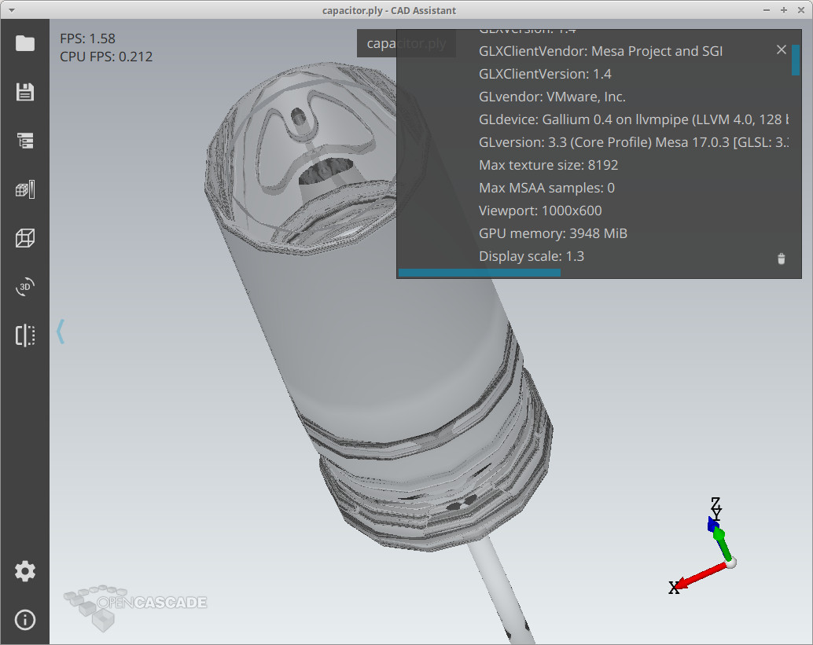

*CAD Assistant 0.9* released on 3rd of April, '2017.
This application is based on *Open CASCADE Technology* and demonstrates two of its strongest parts – data exchange
(import/export of files in open standards STEP and IGES) and efficient multi-platform visualization based on OpenGL / OpenGL ES.

This is a big step from previous release *0.8* with many new features and improvements in changelog:

- Import of *JT* models (only mesh, no LODs).
- Option to import multiple models into a single document.
- Assembly structure is now displayed also for mesh-only files.
- Improved performance while displaying big assemblies.
- Improved *glTF* mesh format support.
- Support of polygons with more than 4 nodes within mesh import.
- Option to control nodes merging for *STL* mesh import.
- Option to rotate around a picked point.
- Option to use shaded mode for highlighting a selected object.

<!--break-->

## Data exchange

Apart from *STEP* and *IGES*, *CAD Assistant* supports a range of file formats storing mesh data – from old but still popular *STL*, *PLY* (simple and popular for scanners and 3D printers),
and *OBJ* to modern *JT* (ISO standard) and [glTF](https://github.com/KhronosGroup/glTF/tree/master/specification) (an open standard for 3D assets developed by *Khronos group*).
*CAD Assistant* is not only able to read all these formats, but also supports conversion of one to another almost in all directions!

Thus *CAD Assistant* is not just a CAD viewer – it is also a mesh viewer (nice for presenting results of *FEM* analysis),
3D assets viewer and converter across various formats (including *STL* export for 3D printers).
*PLY* files with additional nodal/elemental properties can be displayed with an interactive color scale.

|  |
|:--:|
| *PLY mesh with Nodal+Elemental properties and interactive color scale in CAD Assistant (iPhone).* |

New version improves *STL* import by providing more options for smoothing normals of imported triangulation – so that sharp corners of the model are no more smoothed by default.
The smoothing angle can be configured in application *Import/Export* settings.

*glTF* is relatively new format, but being open from the beginning it became a good candidate for exporting 3D assets for 3D engines
and applications not working with CAD data – e.g. game engines and *WebGL* viewers.
*glTF* is much more efficient and better designed than, for example, an old *OBJ*, which is still often used for transferring model from modeling application to 3D viewer.
Draft version of *glTF 2.0* specification solves many issues of first version of this format, making it even better.

Currently, *CAD Assistant* supports only basic features of *glTF*, but still this should be enough for many applications.
*glTF* preserves assembly structure, mesh data and material definition – thus it can be useful for making lightweight models from CAD for displaying in *CAD Assistant*.
It does not support data compression or *LOD* definition like *JT* format, but *glTF* has already wider adoption and its basic features might be just enough.

## Visualization

*CAD Assistant* benefits from using 3D Viewer coming with *Open CASCADE Technology* – including ready-to-use presentation builders for CAD (*B-Rep*) models defined within framework itself,
interactive *BVH*-based detection / picking algorithms, transparent multi-platform support (including mobile platforms) and others.

Within new version *0.9*, the presentation of CAD (*B-Rep*) and Mesh-only data has been unified – so that Mesh-only models now have assembly structure
and available display modes now shared across Mesh-only and CAD models.

On desktop platform, *CAD Assistant* comes with advanced visualization features of *Open CASCADE Technology* – Ray-Tracing
(including hard shadows, light reflection and refraction) and photo-realistic Path-Tracing (global illumination)
available for all modern GPUs (*NVIDIA*, *AMD*, *Intel*); both developed by *Open Cascade* team.
These rendering modes are available in application settings and have a set of options affecting image quality and performance.

|  |
|:--:|
| *Ray-Tracing within glass model in CAD Assistant (Ubuntu).* |

|  |
|:--:|
| *Photorealistic Path-tracing within glass model in CAD Assistant (Ubuntu).* |

Tip: *CAD Assistant* lacks interface for defining physical material aspects – try [CADRays](https://dev.opencascade.org/project/cadrays)
if you are looking for fast, flexible and efficient tool for making nice pictures for your CAD models.

*CAD Assistant* also supports a couple of useful visualization features – 3D stereoscopic output (for compatible monitors or for Anaglyph glasses) and clipping planes with capping.
Stereoscopic output improves volume perception and overall user experience while working with 3D model.
And clipping plane allows to see into a hidden parts of the complex model.

|  |
|:--:|
| *Clipping plane with capped material in CAD Assistant (iPhone).* |

|  |
|:--:|
| *Anaglyph output in CAD Assistant (iPhone).* |

*CAD Assistant* was optimized for a wide range of hardware (including slow mobile devices) from the very beginning
and with this release it is going forward for making performance even better and handle assemblies containing many **thousands of parts**.

|  |
|:--:|
| *Big assembly defining thousands of parts in CAD Assistant (Windows).* |

With last version it is now possible configuring the center of gravity point used while rotating camera.
In addition to previously available mode for rotation around center of active/visible objects, user can not activate rotation around picked point – which might be convenient for big models and FEM analysis.

## User interface

Each *CAD Assistant* release introduces various improvements in user interface – adds small features, adjusts style, etc.
Last release provides a functionality for resetting settings to defaults and extends color picker control with more features.
The keyboard controls now provides first person navigation style through *WASD* combination – which is especially useful for walking through big models of entire cars, buildings or ships.

## Afterwords

*CAD Assistant* is a handy tool for CAD users – it can be used for investigating new models on the go,
for making presentation to customers, for converting CAD files into mesh formats for other application.
Always available in your pocket and even more powerful on your desktop!
