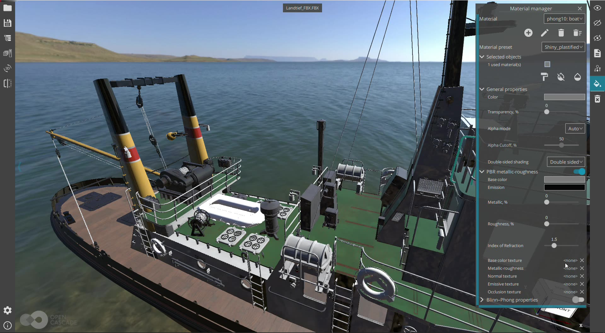

One more video with *CAD Assistant* – now showing Material Editor (introduced in CAD Assistant 1.4) for Metallic-Roughness PBR properties,
as well as playing with lights for making a nice photo-realistic image using Path-Tracing renderer in *CAD Assistant*.

<!--break-->

|  |
|:--:|
| *▶️ Video.* |
