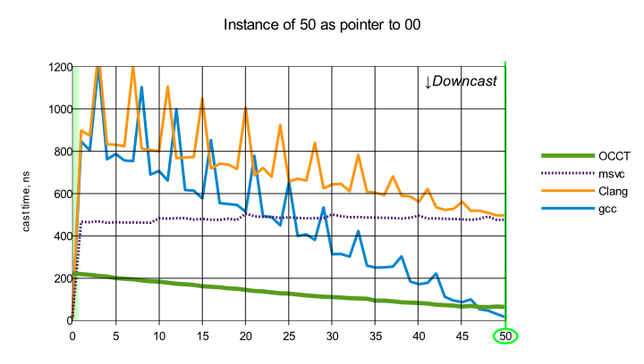
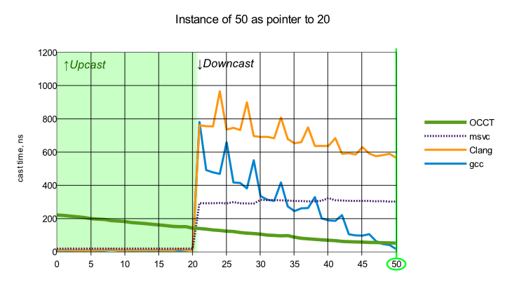
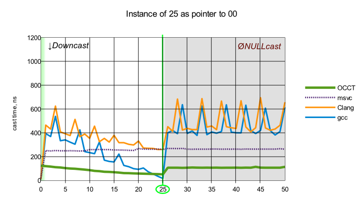
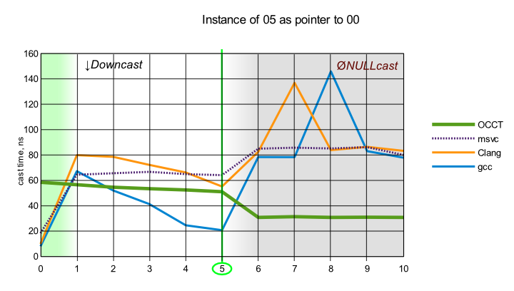

Run-Time Type Information (RTTI) is C++ mechanism to access type information in code at runtime, including well-known `dynamic_cast<>` operator.
Although this functionality is an integral part of modern C++ standard, this was not true at OCCT foundation time.
This is why OCCT has been designed with its own RTTI implementation.

Since any modern C++ compiler has built-in RTTI support, many users complain - why OCCT still uses their own implementation?
Well, migration to built-in C++ mechanisms would require significant changes due to design differences.
However this article covers another aspect of such possible migration - performance comparison.

<!--break-->

## Open CASCADE Technology RTTI overview

RTTI in OCCT consist of the following components:

- `Standard_Type` – the class storing type information such as class name, list of ancestors (multiple inheritance is not supported).
  Being developed in conjunction with *CDL* (class definition language), it also might be defined for enumerations and primitive types.
- `Standard_Transient` – the root of the transient classes' hierarchy. This class contains reference counter and provides the following type information methods:
  - `DynamicType()`
  - `IsInstance()`
  - `IsKind()`
- `Handle_Standard_Transient` – the root of smart-pointers classes' hierarchy.
  Holds the pointer to `Standard_Transient` instance and manages its lifetime in sync with the intrusive reference counter.
  *Handles* are always defined as parallel hierarchy to their base classes, so they can be transparently used as pointers to them.
- Auxiliary macros to define classes hierarchy:
  - `DEFINE_STANDARD_RTTI` – declares virtual `DynamicType()` method in class definition.
  - `IMPLEMENT_STANDARD_RTTIEXT` – implements `DynamicType()` method in object file (`.cxx`).
  - `DEFINE_STANDARD_HANDLE` – declares the smart pointer class.
  - `IMPLEMENT_STANDARD_HANDLE` – implements methods of smart pointer in object file (`.cxx`).
- `Handle(TheClass)::DownCast()` – runtime cast operation, analog of `dynamic_cast<>`

Early built-in RTTI implementations of C++ compilers have been considered noticeably slow.
But compilers have been improved a long time – does this statement still hold true?

OCCT has limited RTTI capabilities – there is no multiple inheritance, classes should have global unique names (`IsKind()` allows check by class text name), but sufficient for main usage scenarios.
The most interesting point is comparison of `DownCast()` operation – analog of `dynamic_cast<>`.

## Test description

The testing has been performed on workstation with CPU *Intel Core i5-3450* using following popular **x86_64** compilers:

- *msvc (VisualStudio 2010, Windows 7)*
- *gcc 4.7 (Linux, Ubuntu 13.04)*
- *clang 3.2 (Linux, Ubuntu 13.04)*

Dedicated classes hierarchy has been created for testing purposes:

```cpp
class qaclass00_50 : public Standard_Transient {};
class qaclass01_50 : public qaclass00_50 {};
class qaclass02_50 : public qaclass01_50 {};
...
class qaclass49_50 : public qaclass48_50 {};
class qaclass50_50 : public qaclass49_50 {};
```

Each test case contains the following steps:

- Create a class instance of specified hierarchy depth.
  ```cpp
    new qaclass50_50();`
  ```
- Store as pointer to class of specified hierarchy depth.
  ```cpp
    qaclass00_50* aPtr = new qaclass50_50();
  ```
- Perform down cast operation for each depth in hierarchy.
  ```cpp
    qaclass00_50* aCast00 = dynamic_cast(aPtr);
    qaclass01_50* aCast01 = dynamic_cast(aPtr);
    ...
    qaclass49_50* aCast49 = dynamic_cast(aPtr);
    qaclass50_50* aCast50 = dynamic_cast(aPtr);
  ```

Class `qaclass00_50`, "zero depth", represents the base class inheriting `Standard_Transient`, thus this class actually has one ancestor.

Different targets for dynamic cast operation are placed along the X-axis on the charts (`0` means `qaclass00_50`, `1` means `qaclass01_50`, etc.).

The source code of synthetic tests can be found in the git branch associated with issue [#0024870](http://tracker.dev.opencascade.org/view.php?id=24870).

## Performance comparison



First chart shows that OCCT RTTI has the best scalability – the casting time increases significantly slower than *gcc* implementation.
In general *clang*, *gcc* and OCCT draw the same dependency trend.

Microsoft implementation draws a different trend – it tends to keep almost constant time, depending mostly from the overall number of ancestors of the class instance.
Although such behavior might be considered a nice feature, it should be noticed that this constant time is still greater than OCCT RTTI.



The second chart shows that:

- OCCT RTTI is unable to detect static cast cases (*upcast*). This is not an important feature, though.
- OCCT, *gcc* and *clang* implementation does not depend from statically known type information (save the trivial static cast) – only actually instantiated class info stored in arbitrary pointer matters.
  In contrast, *msvc* implementation is able to use static type information to reduce casting time (instance of `50` stored in pointer to `20` is casted faster than the same instance but stored in pointer to `00`).



This chart shows that failed casting (`NULL`-cast) takes the maximum time – always greater than or equal to the slowest successful cast for all implementations.



The last chart shows that differences between implementation become less noticeable for small classes hierarchy.
*gcc* implementation has the best time for casting a class instance to itself, but goes bad in fail casting.

## Typical classes hierarchy depth in OCCT

Let's take a look at usual hierarchy depth in OCCT classes on `Geom_BSplineCurve` as example:

```cpp
class Geom_BsplineCurve : public Geom_BoundedCurve {};
class Geom_BoundedCurve : public Geom_Curve {};
class Geom_Curve : public Geom_Geometry {};
class Geom_Geometry : public MMgt_TShared {};
class MMgt_TShared : public Standard_Transient {};
class Standard_Transient
```

Therefore, this class has *__5__* ascenders in total.

The polling is the most stressful situation for dynamic cast operation, because it involves a significant amount of fail-castings, depending on the number of handled types and their order.
Polling between *__~10__* variants might be found in OCCT code - see `GeomTools_CurveSet::PrintCurve()` for example:

```cpp
Handle(Standard_Type) aType = C->DynamicType();
if (aType == STANDARD_TYPE(Geom_Line))
{
  Print(Handle(Geom_Line)::DownCast(C),OS,compact);
}
else if (aType ==  STANDARD_TYPE(Geom_Circle))
{
  Print(Handle(Geom_Circle)::DownCast(C),OS,compact);
}
else if (aType == STANDARD_TYPE(Geom_Ellipse))
{
  Print(Handle(Geom_Ellipse)::DownCast(C),OS,compact);
}
else if (aType == STANDARD_TYPE(Geom_Parabola))
{
  Print(Handle(Geom_Parabola)::DownCast(C),OS,compact);
}
else if (aType == STANDARD_TYPE(Geom_Hyperbola))
{
  Print(Handle(Geom_Hyperbola)::DownCast(C),OS,compact);
}
else if (aType == STANDARD_TYPE(Geom_BezierCurve))
{
  Print(Handle(Geom_BezierCurve)::DownCast(C),OS,compact);
}
else if (aType == STANDARD_TYPE(Geom_BSplineCurve))
{
  Print(Handle(Geom_BSplineCurve)::DownCast(C),OS,compact);
}
else if (aType == STANDARD_TYPE(Geom_TrimmedCurve))
{
  Print (Handle(Geom_TrimmedCurve)::DownCast(C),OS,compact);
}
else if (aType == STANDARD_TYPE(Geom_OffsetCurve))
{
  Print(Handle(Geom_OffsetCurve)::DownCast (C),OS,compact);
}
else
{
  GeomTools::GetUndefinedTypeHandler()->PrintCurve(C,OS,compact);
}
```

## Conclusion

The RTTI mechanism implemented in OpenCASCADE Technology shows best scalability.
In a realistic scenario with classes hierarchy of depth *__<= 10__*, standard compiler-provided implementations have comparable performance - slightly slower than OCCT one.

Although the time of dynamic cast operation is expected to be negligible in most use cases nowadays, there are no valuable reasons to replace OCCT RTTI by standard C++ from a performance point of view.
