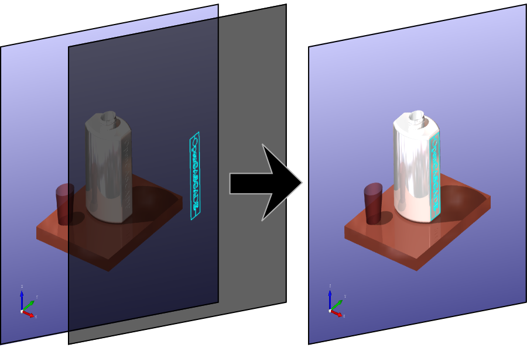
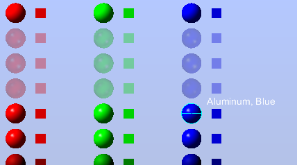
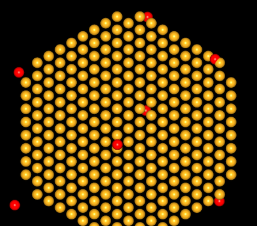

OCCT 3D viewer provides the way for rendering temporary presentations without redrawing previously drawn content.
This feature is designed to optimize viewer performance when only a small part of the scene is changed dynamically, usually providing some feedback for user actions.

This article describes this functionality and its evolution in recent versions of OCCT.

<!--break-->

## History

Historically this functionality has been called **Immediate Mode** (or transient mode) in OCCT,
recalling the part of OpenGL API for rendering primitives using `glBegin()`/`glEnd()` functions with the same name.
Although these two APIs share some ideas, the *Immediate Mode* in OCCT does not use removed functionality of OpenGL, and thus should not be confused with it.

Though not much useful for highly-interactive 3D applications like games (which usually require continuous redraw of the entire scene), this optimization makes sense for CAD applications.
Here the model complexity can not be simply reduced to improve performance - an engineer should see all the details regardless of hardware performance.
And at the same time animations are rare in CAD applications, thus caching of 2D images is feasible.

Traditionally, OCCT used this technique only for a single scenario - dynamic-highlighting of shape sub-parts during mouse movements within *Local Context*.

The initial implementation was kind of tricky (the following is just simplified concept):

- Viewer draws a main content into the **Back** window buffer, as usual in the **Dual-Buffer** rendering scheme.
- Viewer swaps the Front/Back window buffers in Neutral Point to make content appear on the screen, but not in Local Context.
- In *Local Context*, Viewer copies the image from **Back** to the **Front** buffer (performs blitting) to make content appear on the screen.
- Viewer draws dynamic highlighting presentations directly into the **Front** buffer.



These actions were intended to improve responsiveness of the Viewer to user inputs, like mouse movements, by caching main Viewer content and avoiding expensive redraws.

Unfortunately, this implementation can cause artifacts on the screen, due to blitting and immediate rendering directly into the Front buffer - exactly the problem,
which [Double-Buffer](https://en.wikipedia.org/wiki/Multiple_buffering#Double_buffering_in_computer_graphics) approach has been designed to avoid.

In addition, this optimization feature has been buried deep inside in OCCT Viewer, limiting its use to only dynamic highlighting in *Local Context* and nothing more.

To solve these problems, the *Immediate Mode* functionality has been completely re-designed in latest OCCT releases.

## Immediate Mode redesign

The first steps to redesign this functionality have been done in **OCCT 6.8.0** release,
where implementation of *Immediate Mode* has been cleaned from outdated optimizations and replaced by a more straight-forward approach.

Direct rendering has been replaced by a list of immediate presentations, with properly managed life-time.
New method `V3d_View::RedrawImmediate()` has been introduced to redraw this list of immediate presentations, and method `V3d_View::Invalidate()` to mark the cache of the main scene invalid.

**OCCT 6.9.0** goes further in this direction and introduces the following important improvements:

- Direct rendering into the **Front buffer** has been completely eliminated.
  Viewer now stores intermediate content into an auxiliary *Frame Buffer Object*.
  This allows using the *Double-Buffer* in a normal way and eliminates possible artifacts on the screen.
- *Immediate Mode* now preserves the **Depth buffer** of the main scene, allowing to render 3D objects with proper depth.
- Viewer now properly supports **stereoscopic rendering** within *Immediate Mode*.
- *Immediate Mode* is now available for **arbitrary presentation**.
  For this purpose Interactive Objects should be assigned to Z-layers with an appropriate flag.

## Examples

The most natural example where this optimization might be applied are on-screen **user interface elements** drawn directly into 3D Viewer and altered by mouse cursor position
(e.g. sketching, statistics nearby the cursor and so on).



One more way to use this mode is to optimize rendering of **animated objects** in front of a complex scene.
For instance, after modification of `spheres.tcl` sample, the animation of 8 spheres in front of 1000 can be performed without performance issues (**60+ FPS**),
while the entire scene can be rendered only at the low framerate at this workstation (**23 FPS**).



To achieve this, the animated objects have been displayed in Top later, and `vrepaint` calls have been replaced by alternative command calling `V3d_View::RedrawImmediate()` instead of `V3d_View::Redraw()`:

```
vdisplay -noupdate -mutable -top s$i$j$k
...
myRedrawImmediate
```

## User tips

This optimization is done implicitly for dynamic highlighting in *Local Context*.
Applications which would like to use it for custom presentations may need revising their code.
All places which cause implicit or explicit redrawing of the Viewer should be changed to postpone redraw.

At the end of each frame `V3d_View::RedrawImmediate()` should be used instead of `V3d_View::Redraw()`.
Application should explicitly invalidate a Viewer content on any change to make sure that caching would not cause visual artifacts.

One more thing that should be taken into account is that automatic Z-depth is conflicting with *Immediate Mode*,
and thus objects displayed in this mode should not move out from the bounding box of the main scene or they would be clipped by camera frustum.
