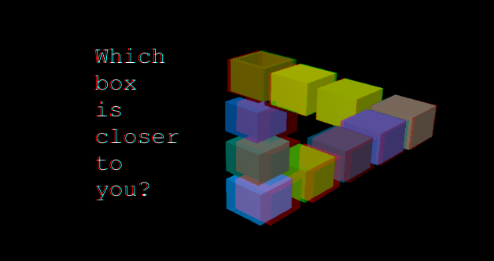
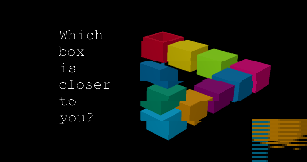
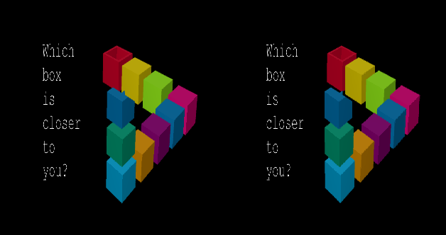
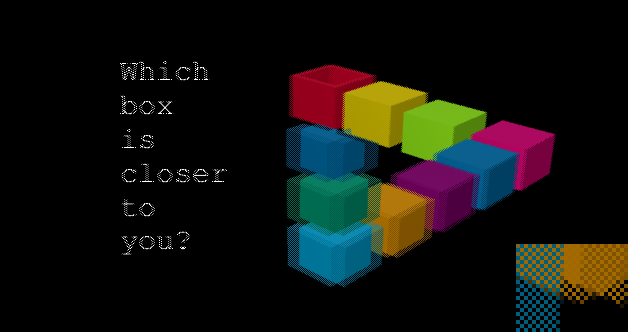
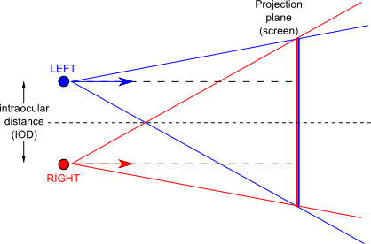
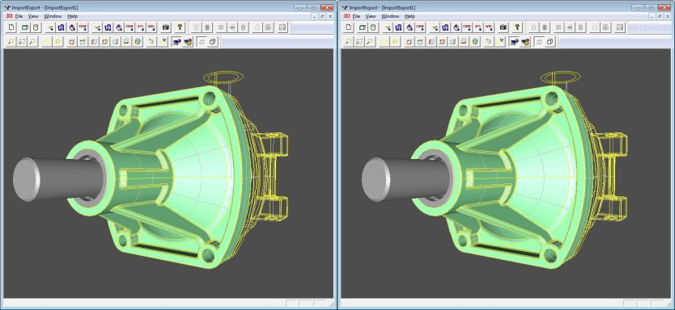

Stereoscopic rendering has been first introduced in Open CASCADE Technology **6.8.0**.
Initial support has been limited to shutter glasses and off-screen rendering.
**OCCT 6.9.1** improves this functionality and extends the list of supported consumer display devices.

<!--break-->

## Overview

Stereoscopic displays extend capabilities of conventional displays with 3D perception.
Such devices utilize the nature of human stereoscopic vision by preparing two slightly different image views, one for each eye.
Human brain is powerful enough to reconstruct 3D from a properly prepared stereoscopic pair, replacing traditional fake 3D on the flat screen by naturally looking 3D.

Stereoscopic rendering significantly improves 3D perception, however the technology in its current state has many issues.
The ways to make each prepared view to be seen only by a specific eye dramatically differ from one technology to another.
**OpenGL** graphic API defined stereoscopic pair in a form of **QuadBuffer** from the very beginning.
However this functionality has been limited by vendors to expensive professional cards for a long time.
And even now, OpenGL drivers usually support only **shutter glasses** devices within this API, while other technologies are not considered by any standard API.

There are some improvements on hardware level: **HDMI 1.4a** and **DisplayPort 1.2** standards support packed 3D formats.
However these improvements are not of much use for software developers since only GPU drivers communicate with displays on this level, and without standard API these capabilities can not be used by end-user applications.

Taking these issues into account, it is still important for applications to support some consumer stereoscopic devices natively.
This is possible for displays with known format of stereoscopic pair packing.
For example, **passive polarized displays** like those manufactured by LG typically use row-interlaced packing of a stereo pair,
which can be prepared at application level and transmitted to display without involving stereoscopic extensions in the hardware interfaces (DVI/HDMI/DisplayPort) as far as native display resolution is used.
And this is what Open CASCADE Technology actually does - it now comes with the list of natively supported stereoscopic devices.

The natural limitation of devices based on stereoscopic technology is the fixed head position.
Display usually shows a 3D object only from a single point of view (actually two views within a stereoscopic base).
Moving the head in any direction would break the illusion of 3D perception to some degree.
This limitation is solved by two options:

- **Multi-view displays**.<br>
  Display shows different image depending on head position, which can be seen by different viewers at the same moment.

- **Head-tracking**.<br>
  Display shows only a single image at each moment, but it changes depending on head position - mostly adopted by *HMD* (Head-mounted display).

Though OCCT can be used within multi-view displays and head-tracking devices, their support should be implemented on the application side.
One of the reasons for this status is limited availability of such displays and absence of common API.

## Supported outputs

Open CASCADE Technology 6.9.1 introduces native support of the following stereoscopic outputs (in addition to standard [OpenGL QuadBuffer API](https://en.wikipedia.org/wiki/Multiple_buffering#Quad_buffering) already used for **shutter glasses**):

- **Anaglyph** stereo pair.<br>
  A frame includes left and right frames in "red-cyan", "green-magenta", "yellow-blue" formats.
  To reduce the color reproduction issue, optimized conversion matrices can be used.
  This mode requires glasses with color filters and can be used with any RGB-based displays (LCD TFT, OLED, CRT and others) and even when printed on paper.<br>

  

- **Row-interlaced** or **column-interlaced** stereo pair.<br>
  A frame includes interlaced left and right frames compressed to 50% of normal vertical resolution.
  This is native format for TVs and monitors created by LG with passive glasses.
  Also used by some glasses-free displays for mobile devices.<br>

  

- **Vertical anamorphic** stereo pair ("Half OverUnder") and **Horizontal anamorphic** stereo pair ("Side-by-side").<br>
  A frame includes left and right frames arranged vertically or horizontally and compressed to 50% of normal resolution.
  Commonly supported format by TVs and Projectors (e.g. can be converted to native format by integrated firmware within specific options in menu).<br>

  

- **Chessboard** stereo pair.<br>
  Has been used by some 3D projectors and DLP TVs.

  

Open CASCADE Technology uses **GLSL programs** for rendering a stereo pair, and thus this feature is fully accelerated on GPU-side.
The minimal requirement is OpenGL 2.1 with `GL_ARB_framebuffer_object` extensions on desktop platforms and *OpenGL ES 2.0* on mobile platforms.
It should be noted that stereo pair requires rendering of two images, which naturally drops the frame rate twice (or even more on slow hardware) and slightly increases GPU memory utilization due to additional offscreen buffers.

Open CASCADE Technology defines two **asymmetrical frustums** for rendering a stereoscopic pair with most natural distortions.
It is also possible to activate stereoscopic rendering within the built-in Ray-Tracing engine.



## Usage

Row-interlaced output mode is probably the most easy to use; it allows immediate enabling 3D for objects displayed in the OCCT viewer on any device supporting row-interlaced stereo
(most computer monitors and consumer TV sets with passive 3D, some projectors).
Just connect your device to the computer running your application (or tablet running [CAD Assistant](https://dev.opencascade.org/project/cad-assistant)), and enable stereo.
(Here it is important to ensure that the display resolution used by the computer is native for a device.)

For instance, you can run Draw Harness and enable 3D by command `vstereo`, as follows:

```
box b 1 2 3
vstereo -mode row
vinit View1
vsetdispmode 1
vaxo
vdisplay f
vfit
vrotate -0.5 0.0 0.0
vfit
```

It is now possible to dump stereo pair as image by command `vdump`:

```
vdump stereo_sbs.png -stereo sbs
```

Image saved in *Side-By-Side* format is device-independent and can be displayed by stereoscopic viewers or even by custom HTML5-viewer:



Apart from the stereo pair format, the stereo pair generation is controlled by parameters like **IOD (intraocular distance)**
and **ZFocus Distance** which can be managed by command `vcamera` or by keys `'/'` and `'\*'` mouse scroll with `Ctrl` key held.

Here is the short sample in C++:

```cpp
Handle(V3d_View) theView;
theView->Camera()->SetProjectionType (Graphic3d_Camera::Projection_Stereo);
theView->ChangeRenderingParams()->StereoMode =
  Graphic3d_RenderingParams::Anaglyph_RedCyan_Optimized;
```

Stereoscopic output is not applicable for orthographic projection and the OCCT API defines it as an alternative to orthographic and perspective camera projections.
It is important to provide stereo camera adjustment options (*IOD* and *ZFocus Distance*) within an application, because the default values may be sub-optimal for the user or for specific display.

Shutter glasses require creation of a window with *QuadBuffer* support, this should be specified at application level before the 3D Viewer initialization.
Other stereo formats can be activated at any moment.

## Conclusion

Open CASCADE Technology now allows creation of immersive applications with 3D stereoscopic output on most popular consumer devices supporting 3D.
We will be glad to get feedback on your experience of using this functionality in applications.

## Live DEMO

The [live demonstration](https://draw.sview.ru/visualization-stereo) of OCCT 3D Viewer in the browser showing stereoscopic output can be found within Open CASCADE Technology examples.
