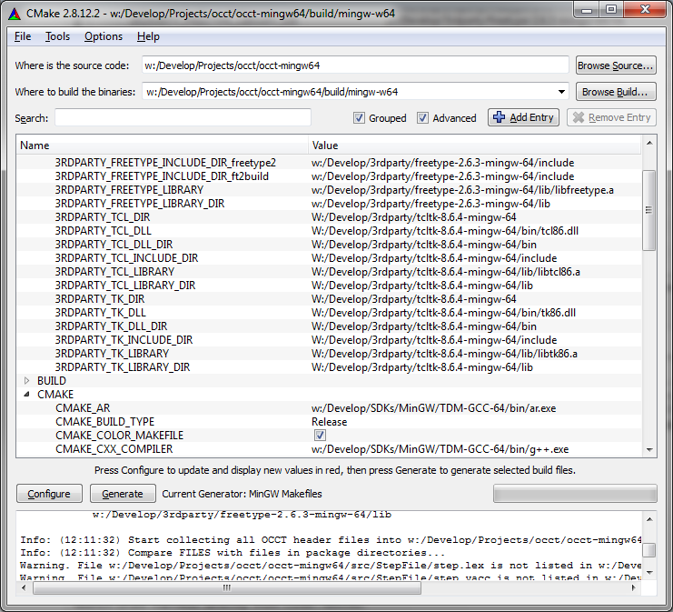
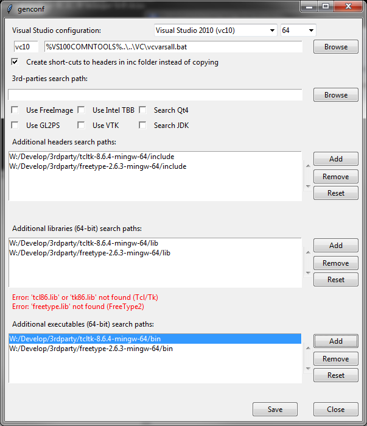

Open CASCADE Technology 7.0.0.rc can be built using [MinGW-w64](https://www.mingw-w64.org/) on *Windows* platform.

**MinGW** is a minimalistic development environment for developing native *Windows* applications based on **GCC**.
Project [MinGW-w64](https://www.mingw-w64.org/) is its fork aimed to support 64-bit target and new APIs.

**GCC (GNU Compiler Collection)** remains a main compiler on Linux platform,
but is a second-class citizen on platforms like *Windows* (with dominating *msvc* - a C/C++ compiler from Microsoft Visual Studio)
or *OS X* (where *Apple* has pushed developers towards *clang*).

*GCC* provides a strong C/C++ compiler supporting C/C++ features from the most recent standards (including *C99* standard abandoned by *Microsoft* in *msvc*) and efficient optimizations.
Although quite rarely used on *Windows*, *GCC* might be still a reasonable choice for developers within particular scenarios.

OCCT relies on *msvc* as a main compiler on *Windows* platform.
However, since OCCT 7.0.0 (see related issue on bugtracker [#0027197](https://tracker.dev.opencascade.org/view.php?id=27197)) it is now also possible to use *GCC* (*MinGW-w64*) for building.
It should be noted, however, that *MinGW* builds are not yet officially maintained by the *Open Cascade* team (no regression testing etc.).

<!--break-->

It is also important to note that *GCC* uses different mechanisms for implementing C++ features, which are completely incompatible with *msvc*.
Thus *DLLs* built using *MinGW* can be used only within an application using *MinGW* as well.
Moreover, *GCC* uses a different format for debugging symbols, which is not supported by *Visual Studio* compiler - [GDB](https://www.gnu.org/software/gdb/) should be used instead.

## Building OCCT using MinGW

Two ways can be considered to build *OCCT* using *MinGW* - *CMake* and [Code::Blocks](https://codeblocks.org/) project files generator (tcl-based `genproj.bat` tool packaged with *OCCT*).
*CMake* supports *Code::Blocks* project files as well ("CodeBlocks - MinGW Makefiles"), but in contrast to `genproj.bat`,
*CMake* generates these project files without keeping *OCCT* projects structure and relies on *Makefiles* rather than built-in *Code::Blocks* compiler plugins.

Cross-compiling should be also possible (one of the benefits of *MinGW*), but is not considered/tested within this article.

As a prerequisite for building *OCCT*, its dependencies should be built.
It is recommended to use [Msys2 project](https://msys2.github.io/) for this task, which dramatically simplifies building libraries like *Tcl/Tk* by providing shell and usual Unix tools.
The building of *OCCT* itself relies on *MinGW* only and does not depend on *msys2*.

### Configuring MinGW with CMake

For building using *CMake*, just follow the general guideline.
At the very first step you should specify one of the generator option supporting *MinGW* - e.g. `"MinWG Makefiles"`.
*CMake* will automatically find *MinGW* tools from current `%PATH%`, so if you have not configured it system-wide,
you can launch `cmake-gui` within `mingwvars.bat` environment (the script provided within *MinGW* installation path).
After generation, just go to the folder with generated *Makefiles* and use `mingw32-make.exe` as usual make tool in Unix environment.



### Generating Code::Blocks projects using genproj.bat

For using `genproj.bat` (as alternative to *CMake*), follow the general guideline for using `genproj` (configure dependencies using `genconf.bat`).



At the end of the script `genproj.bat` the `-target=%VCVER%` should be replaced by `-target=cbp` to generate *Code::Blocks* project files:

```
%TCL_EXEC% %~dp0adm/start.tcl genproj -path=. -target=cbp
```

After that, the *Code::Blocks* workspace should be started by `codeblocks.bat` script.
*Mingw* should be configured within *Code::Blocks* itself.
Activate project `DRAWEXE` within the workspace to launch *Draw Harness* directly from *Code::Blocks*.
The project files generated in this way will be portable - you will need only to call `genconf.bat` (or to edit `custom.bat` to use relative paths) when moving OCCT to another computer.

## Conclusion

*OCCT* can be built on one more platform - using *MinGW* for *Windows* target.
If you are using *MinGW* - please share your experience.
