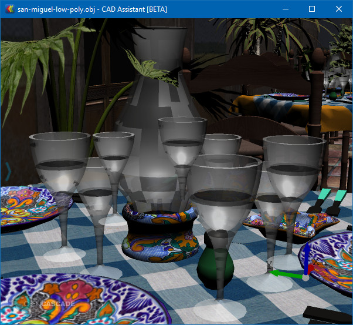
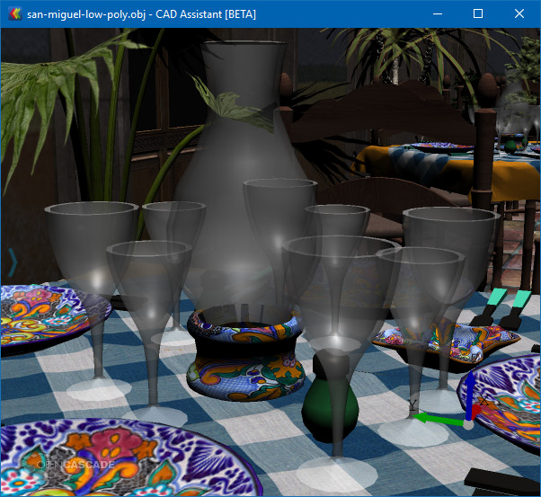

*Open CASCADE Technology __7.2.0__* introduces a new feature in OCCT 3D Viewer for handling translucent presentations - **Weighted Blended Order-Independent Transparency** (*OIT*),
[#0027925](https://tracker.dev.opencascade.org/view.php?id=27925).

<!--break-->

Apart from the new algorithm itself, the improvement simplifies handling of translucent presentations in general, when using a standard algorithm.
The viewer now automatically postpones translucent presentations to be rendered right after opaque presentations.
This means, that there is no more need to manage presentation priority at application level for proper rendering of such presentations,
and moreover it is now possible to combine transparent and opaque presentation groups within a single interactive object.

[Weighted Blended Order-Independent Transparency](https://en.wikipedia.org/wiki/Order-independent_transparency)
algorithm eliminates most obvious artifacts of order-dependent transparency rendering approach,
when blending result depends on the rendering order of transparent triangles and fragments (i.e. not just on order of objects).

Note that while this algorithm allows getting rid of common artifacts caused by different order of display of transparent objects and their parts (individual triangles and even fragments),
the resulting presentation is not correct in the sense that it does not depend on the order of displayed objects at all.

Still, this algorithm is a nice compromise between order-dependent blending (producing artifacts) and other more computationally intensive *OIT* algorithms (*Depth Peeling*, *OIT* using Linked Lists).
*Weighted Blended Order-Independent Transparency* algorithm is also available for mobile hardware (OpenGL ES 3.2+).

## Usage

Activation of the new algorithm is controlled by the flag `Graphic3d_RenderingParams::TransparencyMethod`, which can be set to `Graphic3d_RTM_BLEND_OIT`.

You can run *Draw Harness* and enable *OIT* using `vrenderparams` command, as follows:

```
pload MODELING VISUALIZATION
vinit View1
vsetgradientbg 180 180 180 255 255 255 2
box s1 0 0 0 1 2 3
box s2 2 0 0 2 1 3
vdisplay -dispMode 1 s1 s2
vfit
vaspects s1 -setTransparency 0.5 -setColor RED
vaspects s2 -setTransparency 0.5 -setColor BLACK

# OIT off
vrenderparams -oit off
# OIT on
vrenderparams -oit 1.0
```

## Screenshots

|  |
|:--:|
| *Usual order-dependent transparency - see triangle artifacts.* |

|  |
|:--:|
| *Weighted blended order-independent transparency.* |

## Live DEMO

The [live demonstration](https://draw.sview.ru/visualization-transparency2/) of OCCT 3D Viewer in the browser showing order-independent transparency can be found within Open CASCADE Technology examples.
