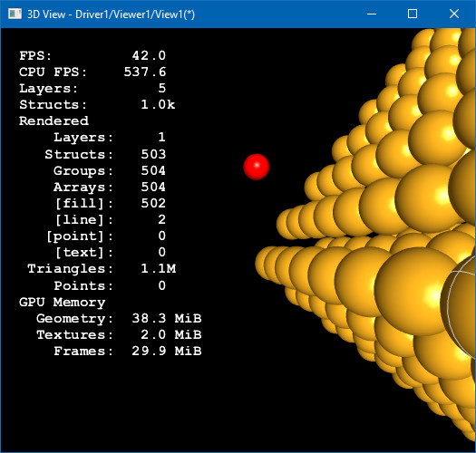

Development branch of *Open CASCADE Technology* (will be available in *OCCT 7.3.0*) introduces a new small feature
for analyzing rendering performance issues [#0029346](http://tracker.dev.opencascade.org/view.php?id=29346).
`Graphic3d_RenderingParams` structure has been extended with a set of new properties for collecting and displaying performance counters in 3D Viewer.

<!--break-->

`Graphic3d_RenderingParams::CollectedStats` manages the list of counters to be collected, and `Graphic3d_RenderingParams::ToShowStats` manages displaying them in 3D viewer.

While *FPS* can be easily determined at application side or even by using external diagnostic tools, other counters reveal structured information more specific to OCCT 3D Viewer internals:

- **FPS** – average frame rate (frames per second) between meter updates based on elapsed time.
- **CPU FPS** – frame rate based on *CPU* rendering thread utilization.
- **Layers** – amount of defined Layers (see `V3d_Viewer::GetAllZLayers()`).
- **Structs** – amount of defined Structures (OpenGl_Structure, which can be associated with AIS_InteractiveObject).
  - **Rendered**
    - **Layers** – amount of rendered Layers.
    - **Structs** – amount of rendered Structures.
    - **Groups** – amount of rendered Primitive Groups (`Graphic3d_Group`/`OpenGl_Group`).
    - **Arrays** – amount of rendered Primitive Arrays (`OpenGl_PrimitiveArray`).
    - **Triangles** – amount of rendered Triangles.
  - **GPU memory**
    - **Geometry** – estimated GPU memory utilized by *Vertex Buffer Objects* (*VBOs*) for rendering Geometry.
    - **Textures** – estimated GPU memory utilized by *Textures* (excluding *FBOs*).
    - **Frames** – estimated GPU memory utilized by off-screen *Frame Buffer Objects* (*FBOs*).

Curious users of *CAD Assistant* will found **FPS** and **CPU FPS** counters familiar – these could be seen in *CAD Assistant* a long time before.
**FPS** (*framerate*) is a usual measure of performance in 3D graphics showing the number of frames displayed per second (elapsed time).
At the same time, **CPU FPS** is less common – it shows the number of frames displayed per second of ***CPU time utilized by rendering thread***.

Such a metric can be interpreted as a framerate, which could be theoretically achieved in case
if rendering performance is limited only by CPU performance and not by GPU, while normal FPS counter is limited by both.
Combination of usual FPS and artificial CPU FPS meters allows you to make a rough conclusion
whether for the given configuration 3D rendering performance is limited by CPU or GPU power – FPS noticeably higher CPU FPS means that performance is limited by GPU,
while FPS around CPU FPS means that GPU might be stalling due to slow CPU.

The **Rendered** counts visible geometry being rendered within the current frame, filtered by *Frustum Culling*.
This, however, does not include geometry being rendered multiple times (due to enabled *Capping planes* or other reasons).

Big amounts of rendered **Arrays** (and **Structures**) is a most critical factor to make rendering performance *CPU-bound*.
It should be noted that mobile CPUs are much slower than desktop ones, and therefore, a much smaller amount of objects may cause performance issues.

**GPU memory** counters do not reflect full GPU memory actually utilized by application – these can be revealed by using OS tools.
Instead, these counters only estimate memory usage for most critical parts (geometry, textures, frames)
which can be actually controlled by application, without considering GPU memory fragmentation or memory paging rules.
Thus, it should be taken into account that real GPU memory utilization by application is always greater.
