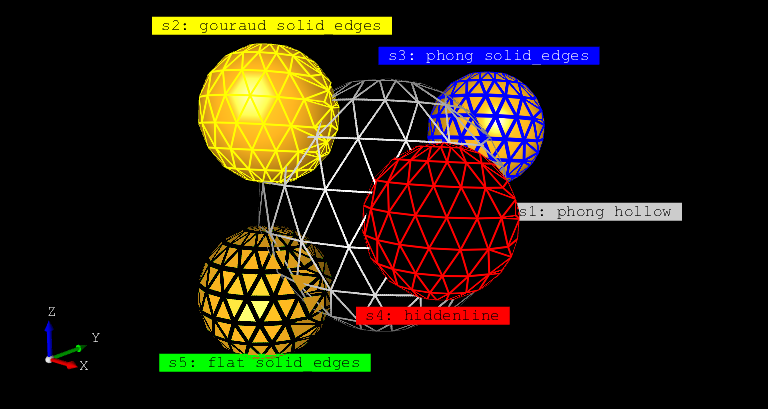
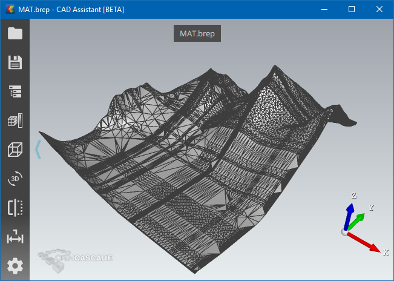
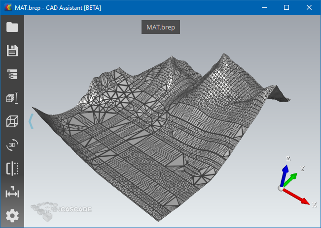
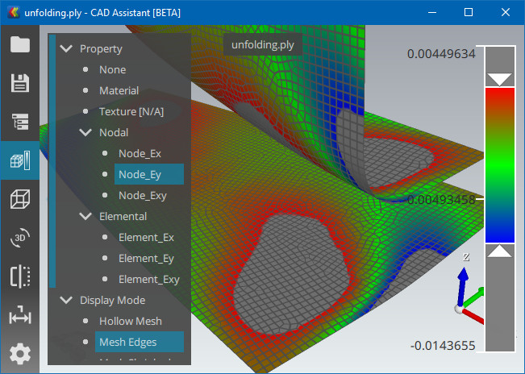
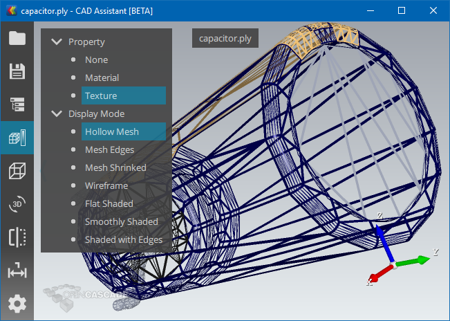
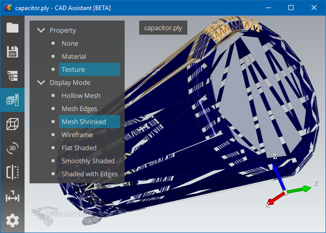
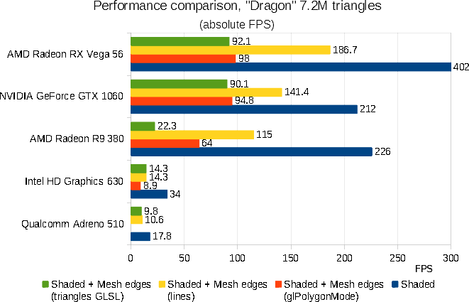
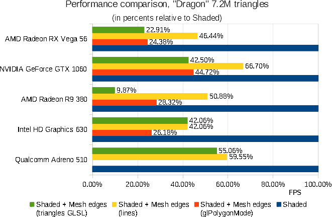
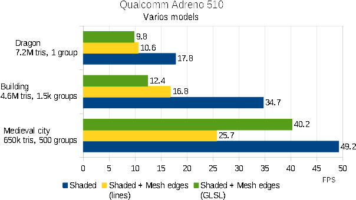

Mesh displayed in *OCCT* 3D Viewer might come from different sources – imported from external file (*glTF*, *JT*, *STL*, *PLY*, *OBJ*),
computed for analytical *B-Rep* geometry by `BRepMesh` and `ExpressMesh` algorithms or generated directly by application code.

The mesh is usually displayed shaded, but this presentation is not suitable for analysis of mesh structure.
In many cases, application developer needs other mesh presentations to locate issues (too many details, not enough details, local deviations, etc.)
and make corrections based on analysis results (adjust mesh generation or export parameters).

In this case, mesh edges presentation becomes very helpful.

<!--break-->



Historically, *OCCT* provides **Shaded** [`AIS_Shaded`] and **Wireframe** [`AIS_WireFrame`] display modes for BRep shapes (`AIS_Shape`),
but the latter one should not be confused with mesh edges presentation (mesh wireframe, as often referenced in various other visualization applications).
`AIS_WireFrame` consists of face boundaries, surface isolines, free edges, and has nothing in common with mesh edges presentation (apart from displaying thin edges).

Actually, *OCCT* provided a way for displaying mesh edges for `AIS_Shaded` presentation –
through `glPolygonMode(GL_LINES)` feature of *OpenGL* library, accessible via `Graphic3d_AspectFillArea3d` properties.

Polygon mode feature is, however, not coming with *OpenGL ES* (mobile) *API*, and also has limitations on *desktop OpenGL* implementations.
Forthcoming *OCCT 7.4.0* release introduces improved Draw Edges option using *Geometry Shader*
available on modern graphic hardware, including mobile one (*OpenGL 3.2+* and *OpenGL ES 3.2+*).
The feature has been developed in scope of issue [#0029076](https://tracker.dev.opencascade.org/view.php?id=29076) "Visualization – implement element shrinking Shader".

## Alternative Approaches

Three mesh edges presentations have been compared, each with its own cons and pros:

1. **Polygon Mode** for array of triangles [`glPolygonMode`].
   - CONS:
     - Unavailable on *OpenGL ES*.
     - Rendering interior + mesh edges requires 2 passes.
     - Hardware has to render edges shared between triangle twice, reducing performance.
     - Wide lines are rendered with visual artifacts.
     - Fixed line width (1 pixel) on *OpenGL, Core Profile*.
     - Triangles only.
   - PROS:
     - Easy to switch on.
     - Line width in pixels.
2. **Dedicated lines array**.
   - CONS:
     - Extra memory footprint for additional data.
     - Presentation data should be recomputed.
     - The same limitations with line width as `glPolygonMode`
       (1 pixel width with *Core Profile*, visual artifacts on wide lines).
   - PROS:
     - Better performance than `glPolygonMode()`, due to filtering non-unique triangle edges.
     - Can be computed for arbitrary polygons (triangles/quads/polygons).
3. **Geometry Shader** program for array of triangles.
   - CONS:
     - Requires *Geometry Shader* stage, which is unavailable on old graphic hardware or can be slow on old hardware.
     - Variable line width, becoming twice thicker on edges shared between triangles.
     - Visually hollow presentation without anti-aliasing might look not that good as normal lines array.
   - PROS:
     - Arbitrary line width, no limitation within *Core Profile*, no artifacts on wide lines.
     - Variable line width, becoming thinner at large camera distance;
       this avoids mesh becoming a solid mess at distance.
     - Rendering interior + mesh edges presentation within single pass.
     - Shrinking element presentation (as transparent mesh edges).
     - Triangles and quads edges;
       quads should be split into triangles in specific edges order.
     - Switching on the fly without recomputing presentation,
       as in case of glPolygonMode.
     - Smooth mesh edges on top of interior without anti-aliasing.

The 3rd approach provides a good compromise between performance, functionality and simplicity to activate.
Since mesh edges presentation is usually auxiliary one, used for application development or for mesh analysis,
the ability to activate this presentation for already computed triangulation arrays without expensive re-computation is very important.
The second approach remains available, but is expected to be implemented at application level, if needed/preferred depending on application context.
*Geometry Shader* is now used by default, while first (glPolygonMode) can be enabled via `OpenGl_Caps::usePolygonMode` option.

## Visual Comparison

`glPolygonMode()` approach looks very close to dedicated lines array, while *Geometry Shader* result is quite different.

|  |
|:--:|
| *Edges drawn using dedicated Lines array.* |

|  |
|:--:|
| *Edges drawn using Geometry Shader.* |


*Geometry Shader* defines threshold making lines thinner for too small triangles, so that geometry details and interior color remain distinguishable.

|  |
|:--:|
| *Edges on Quad-dominant mesh (Geometry Shader).* |

|  |
|:--:|
| *Hollow Mesh presentation (Geometry Shader).* |

|  |
|:--:|
| *Shrunk Mesh presentation (Geometry Shader).* |

*Geometry Shader* also allows implementing another nice looking presentation of mesh – *Shrunk Mesh*.
And all these modes (Hollow Mesh, Mesh Edges, Mesh Shrunk, Smoothly Shaded, Flat Shaded) can be switched on the fly within next *Open Cascade CAD Assistant* release.

## Performance Comparison





The first test has been done using "Dragon" model, which is a *PLY* file defining *7.2M triangles* and no assembly structure.
This is a good test for a raw rendering performance of different approaches.

As can bee seen on comparison charts, unique Mesh Edges collected in advance and drawn using `GL_LINES` primitives
on top of triangulation demonstrates the best performance results, but requires extra geometry data.
*Radeon* hardware reacts badly on presence of *Geometry Shader*, so that on *Radeon R9 380* using `glPolygonMode()` is faster than extra *Geometry Shader*,
while *GeForce GTX 1060* and *Radeon RX Vega* demonstrate performance similar to `glPolygonMode()`.
At the same time, *Intel HD Graphics 630* and *Qualcomm Adreno 510* demonstrate performance close to dedicated lines array when using *Geometry Shader*.



The second test has been done only on *Qualcomm Adreno 510*, on the various models.
It shows, that depending on model structure, *Geometry Shader* approach might be even faster than dedicated geometry drawing lines.

## GLSL Program

*OCCT* uses simple code generation within its Shader Manager (`OpenGl_ShaderProgram`),
so that mesh edges drawing code can be embedded into various shader programs.

Here is a quotation from source code of *GLSL* program generated for *Gouraud shading*:

- *Geometry Shader*

```glsl
    layout (triangles) in;
    layout (triangle_strip, max_vertices = 3) out;
    uniform vec4 occViewport;
    uniform bool occIsQuadMode;
    uniform float occLineWidth;
    in VertexData
    {
      vec4 FrontColor;
      vec4 BackColor;
    } geomIn[3];
    out VertexData
    {
      vec4 FrontColor;
      vec4 BackColor;
    } geomOut;
    THE_SHADER_OUT vec3 EdgeDistance;
    vec3 ViewPortTransform (vec4 theVec)
    {
      vec3 aWinCoord = theVec.xyz / theVec.w;
      aWinCoord    = aWinCoord * 0.5 + 0.5;
      aWinCoord.xy = aWinCoord.xy * occViewport.zw + occViewport.xy;
      return aWinCoord;
    }
    void main()
    {
      vec3 aSideA = ViewPortTransform (gl_in[2].gl_Position) - ViewPortTransform (gl_in[1].gl_Position);
      vec3 aSideB = ViewPortTransform (gl_in[2].gl_Position) - ViewPortTransform (gl_in[0].gl_Position);
      vec3 aSideC = ViewPortTransform (gl_in[1].gl_Position) - ViewPortTransform (gl_in[0].gl_Position);
      float aQuadArea = abs (aSideB.x * aSideC.y - aSideB.y * aSideC.x);
      vec3 aLenABC    = vec3 (length (aSideA), length (aSideB), length (aSideC));
      vec3 aHeightABC = vec3 (aQuadArea) / aLenABC;
      aHeightABC = max (aHeightABC, vec3 (10.0 * occLineWidth));
      float aQuadModeHeightC = occIsQuadMode ? occLineWidth + 1.0 : 0.0;

      geomOut.FrontColor = geomIn[0].FrontColor;
      geomOut.BackColor = geomIn[0].BackColor;
      EdgeDistance = vec3 (aHeightABC[0], 0.0, aQuadModeHeightC);
      gl_Position = gl_in[0].gl_Position;
      EmitVertex();

      geomOut.FrontColor = geomIn[1].FrontColor;
      geomOut.BackColor = geomIn[1].BackColor;
      EdgeDistance = vec3 (0.0, aHeightABC[1], aQuadModeHeightC);
      gl_Position = gl_in[1].gl_Position;
      EmitVertex();

      geomOut.FrontColor = geomIn[2].FrontColor;
      geomOut.BackColor = geomIn[2].BackColor;
      EdgeDistance = vec3 (0.0, 0.0, aHeightABC[2]);
      gl_Position = gl_in[2].gl_Position;
      EmitVertex();
      EndPrimitive();
    }
```

- *Fragment Shader*

```glsl
    uniform float occLineWidth;
    uniform float occLineFeather;
    uniform vec4 occWireframeColor;
    in VertexData
    {
      vec4 FrontColor;
      vec4 BackColor;
    };
    THE_SHADER_IN vec3 EdgeDistance;
    vec4 getColor(void) { return gl_FrontFacing ? FrontColor : BackColor; }
    vec4 getFinalColor(void)
    {
      float aDistance = min (min (EdgeDistance[0], EdgeDistance[1]), EdgeDistance[2]);
      bool isHollow = occWireframeColor.a < 0.0;
      float aMixVal = smoothstep (occLineWidth - occLineFeather * 0.5, occLineWidth + occLineFeather * 0.5, aDistance);
      vec4 aMixColor = isHollow
                     ? vec4 (getColor().rgb, 1.0 - aMixVal)
                     : mix (occWireframeColor, getColor(), aMixVal);
      return aMixColor;
    }
    void main()
    {
      occSetFragColor (getFinalColor());
    }
```
