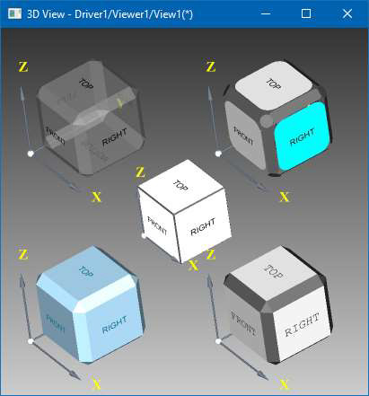

*Open CASCADE 7.4.0* brings new handy class `AIS_ViewController`.

3D Viewer needs handling mouse input to bring interactivity to it.
`AIS_ViewController` class takes responsibility for mapping user input events (mouse, keyboard, etc.)
onto 3D viewer camera manipulations (rotation, panning, zooming) as well as highlighting objects in scene.
Basically, it provides a more solid, cross-platform interface to `V3d_View` and `AIS_InteractiveContext` methods.
`AIS_ViewCube` is another new class in *OCCT 7.4.0* displaying an interactive cube for selecting 3D viewer camera direction.

As existing *OCCT* users might be curious what `AIS_ViewController` is, I have decided writing a small memo in *Questions & Answers* form.

<!--break-->

### Q. How AIS_ViewController is different from existing V3d_View methods rotating/zooming/panning view?

**A.** `AIS_ViewController` defines gestures to be mapped onto specific combination of mouse button and modifier key, and manages transition from one gesture to another.
Previously, this error-prone logic has to be written at application side.
Default mapping scheme is also provided for consistent behavior across OCCT-based applications;
the scheme has been improved comparing to previous one used by *Draw Harness*.
`AIS_ViewController` also uses 3D coordinates information of object under mouse cursor from `AIS_InteractiveContext`
to provide extended modes like rotation around picked point or to handle panning in perspective camera, which is impossible to implement at `V3d_View` level.

### Q. Are there any code samples for using AIS_ViewController?

**A.** At the moment of *OCCT 7.4.0* publication, `AIS_ViewController` has been used by `ViewerTest` *Draw Harness* plugin,
which can be used as example for redirecting `WinAPI`, `XLib` and `Cocoa` mouse events.
More samples are expected in next release (and already exist in development branch).

### Q. Should I rewrite existing application code to use AIS_ViewController?

**A.** If existing 3D Viewer behavior in application is satisfactory – then probably no, there is no need rewriting code.
Developers of new application, however, may take advantage of new tool for more faster and robust *OCCT Viewer* integration.

### Q. Why AIS_ViewController is not part of AIS_InteractiveContext?

**A.** Indeed, `AIS_ViewController` looks like a logical extension to `AIS_InteractiveContext` functionality for highlighting objects under mouse cursor.
However, `AIS_InteractiveContext` interface is already quite heavy in size, and `AIS_ViewController` is not small at all, so that it was decided creating a new class instead.

### Q. Why there is an animation property in AIS_ViewController?

**A.** `AIS_ViewController` is designed to be used in two-steps manner:

1. Accumulating input events (within *GUI* thread);
2. Flushing (processing) events and redrawing *View* (within *GL thread*).

As you can see, `AIS_ViewController` provides *API* friendly to *GUI* frameworks offloading *OpenGL* rendering
into dedicated thread – like *QtQuick*, although thread safety is still responsibility of application.
Handling properly an animation within 3D Viewer is non-trivial task, and `AIS_ViewController` suggests a proper way – updating animation before frame redraw.
`AIS_ViewController` and `AIS_ViewCube` are made to work in unison here, so that camera animation started by *View Cube* is processed by *View Controller*,
and what is most important – user may abort animation at any moment by making another mouse click.
This connection is done via `AIS_AnimationCamera` property, which instance should be shared between *View Cube* and *View Controller*.

### Q. Why there is a keyboard input in AIS_ViewController?

**A.** Current version of `AIS_ViewController` doesn't handle any keyboard events by itself.
Subclasses might use this interface for their own needs, when found suitable – like handling viewer hot-keys.
In future, *Draw Harness* might use this interface for implementing first-person alike flight navigation mode through *WASD* keys.

### Q. Is AIS_ViewController interface stable?

**A.** At the moment, `AIS_ViewController` is used by a couple of applications.
A great amount of effort has been put to unify years of experience in various applications into single reusable tool – hopefully designed well enough.
However, as more application developers will adopt `AIS_ViewController` to their needs in other projects and give feedback,
new pitfalls of class design might arise requiring modifications.

### Q. What could I expect from AIS_ViewController in future?

**A.** Historically `AIS_InteractiveContext` provided methods highlighting objects under mouse cursor and managing selection (`MoveTo()` and `Select()` methods),
while more complicated actions, like object dragging, have to be implemented at application side.
`AIS_ViewController` brings new callbacks for more user input states (like mouse button press / release and others), so that it is able handling more scenarios.
It already handles rubber-band selection (using `AIS_RubberBand` presentation) and manipulator (`AIS_Manipulator`),
but more unified interface of draggable object and widget-alike object might be introduced within `AIS` in future.

## Live DEMO

The [live demonstration](https://draw.sview.ru/visualization-viewcube) of OCCT 3D Viewer in the browser
showing `AIS_ViewCube` with different styles can be found within *Open CASCADE Technology* examples.
