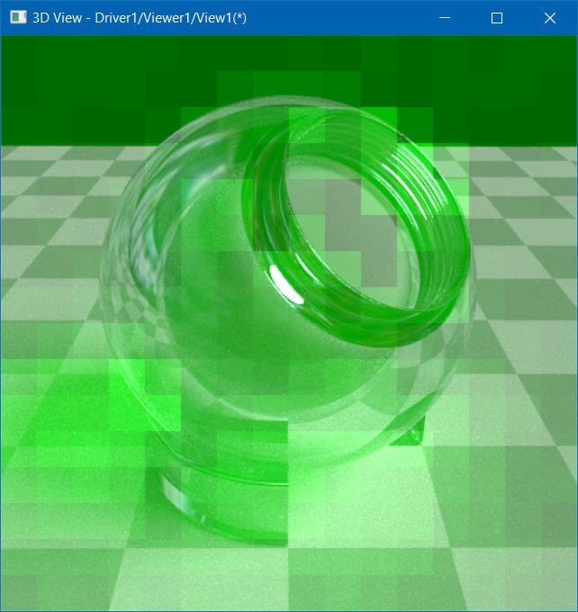
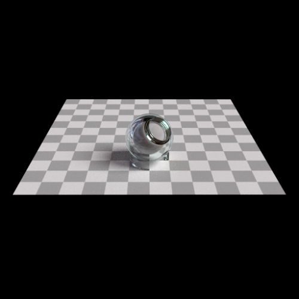
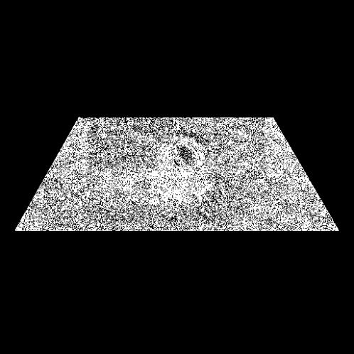

Mutex is an essential tool for any multi-threaded application.
But when it comes to small primitive types, and not structures, there are more options to consider.

Atomic operations, or simply atomics, are handy CPU or GPU instructions allowing to concurrently modify a value of primitive type without involving expensive tools like mutexes.

This small article is not intended to clarify usage of ***atomic*** operations, but to share a tricky experience of such operations in GPU program.

<!--break-->



## Atomic operations on CPU

Here is a code snippet demonstrating usage of mutex for thread-safe access to the variable:

```cpp
struct MyInteger {
  int getValue() const {
    std::lock_guard<std::mutex> aLock(myMutex);
    return myInt;
  }
  void setValue (int theValue) const {
    std::lock_guard<std::mutex> aLock(myMutex);
    myInt = theValue;
  }
  int increment (int theInc) const {
    std::lock_guard<std::mutex> aLock(myMutex);
    myInt += theInc;
    return myInt;
  }
protected:
  int myInt = 0;
  mutable std::mutex myMutex;
};
```

The code ensures the proper synchronization for reading and writing an integer value across the threads,
but mutexes are expensive resources for protecting every single variable with dedicated object.

It might be interesting to note that modern CPUs perform most operations with 4-bytes (or even 8-bytes) alignment.
For instance, assigning different values to the following structure:

```cpp
struct MyGuid {
  unsigned long  Data1;
  unsigned short Data2;
  unsigned short Data3;
  unsigned char  Data4[8];
};
```

concurrently from multiple threads without a mutex will lead to a ***mixture*** of different values stored within the structure fields,
but result of concurrent assignments to primitives of `int` or `float` types (4-bytes in size or smaller) will be one of assigned values, not a mixture.

This behavior does not require any extra keyword in code, not something specified in C++ standard – it is just implied by CPU architecture.
So that it should never be expected *per se* by cross-platform code, although behavior will unlikely change in future.

This behavior can be abused for simplifying the code around a variable changed solely by a single thread and read by other threads.
Just one more thing to care is to prevent CPU caching obsolete variable state in register, which is traditionally done by marking variable as `volatile`.
***Volatile*** definition in C++ standard is confusing and debatable,
and even [proposed for deprecating](https://www.open-std.org/jtc1/sc22/wg21/docs/papers/2019/p1152r1.html) in favor of `volatile_load<T>` / `volatile_store<T>`, but still commonly used:

```cpp
volatile int myInt = 0;
...
for (; myInt != 0;) { ... }
```

Scenario mentioned above is quite specific, but happens from time to time.

Consider another scenario, when variable is written concurrently from multiple threads and result of operation depends on previous variable state.
In this case, just relying on volatile is not enough, and explicit atomic operations should be used instead:

```cpp
std::atomic<int> myInt (0);
...
int aNewValue = --myInt;
if (aNewValue == 0) {}
```

Atomic operations are commonly applied to integer values for synchronization purposes – like
a counter within smart pointer implementation (`Standard_Transient` in *Open CASCADE Technology*).
`std::atomic<T>` was introduced by C++11, so that [older code](https://github.com/gkv311/sview/blob/master/include/StThreads/StAtomicOp.h)
has to use either assembly code for specific CPU, compiler extensions or OS-specific functions:

```cpp
static int64_t Decrement(volatile int64_t& theValue) {
#ifdef __GCC_HAVE_SYNC_COMPARE_AND_SWAP_8
  // g++ and CLang
  return __sync_sub_and_fetch(&theValue, 1);
#elif defined(_WIN32)
  return InterlockedDecrement64(&theValue);
#elif defined(__APPLE__)
  return OSAtomicDecrement64Barrier(&theValue);
//#elif defined(__ANDROID__)
// analog of __sync_fetch_and_sub()
//return __atomic_dec(&theValue) - 1;
#else
  #error "No atomics!"
  return --theValue;
#endif
}
```

By the way, some earlier compilers implemented `std::atomic<T>` with the help of mutex,
making them very slow compared to atomics performed by dedicated CPU instructions,
but that shouldn’t be a problem in any modern environment.

C++ defines more atomic operations than increment and decrement.
Older 32-bit CPUs supported atomic operations only on 32-bit integer values, while 64-bit CPUs support also 64-bit integers.

Atomic operations performing integer arithmetic are pretty common. But what about floating point numbers?
First thing you may notice is that `std::atomic<float>` in C++11 has no specialization providing arithmetic operations,
and the same is true also for compiler intrinsics (built-in compiler functions, commonly used as replacements for assembly code) like `__sync_add_and_fetch()`.
This limitation looks strange, but from another side, it is not that simple to imagine scenario,
where atomic operations on floating point numbers would make any sense.

## Atomic operations on GPU

GPUs have been designed to perform the same instructions on large sets of data.
This is a crucial difference allowing to achieve significant performance boost and scalability compared to similar computations being done on a common CPU
(let's take apart *MMX*/*SSE*/*AVX* computing units designed for a similar purpose).

Achieving good performance requires different approach to processing the data, which is reflected in *GLSL* program stages:
*Vertex Shader* processing many vertices in parallel with the same instructions,
*Fragment Shader* processing many pixels in parallel with the same instructions, and other stages following the same approach.

Memory synchronization barriers are very expensive for GPU programs,
so that the very design of graphics API specifically tries to avoid operations on overlapped data,
to avoid mutable structures, to keep caches valid as long as possible, etc.

Modern GPUs, however, do provide atomic operations for integer arithmetic, similar to CPUs,
although their usage should be carefully considered to avoid performance issues.
Such operations are less useful in traditional *GLSL* program, designed to compute a color for a very single fragment within *Frame Buffer*,
but become handy in *Compute Shaders* with random concurrent writes to buffers or images ([OpenGL 4.2+](https://www.khronos.org/registry/OpenGL-Refpages/gl4/html/imageAtomicAdd.xhtml)):

```glsl
int imageAtomicAdd (gimage2D image, ivec2 P, int data);
```

Most GPUs (including *AMD Radeon*), do not provide atomics for floating point numbers,
with only one exception – [`GL_NV_shader_atomic_float`](https://www.khronos.org/registry/OpenGL/extensions/NV/NV_shader_atomic_float.txt)
OpenGL extension allows using such operations on GeForce hardware.
Other GPU vendors seems to be have no plans introducing this feature in their hardware.

## Adaptive screen sampling

OCCT Path Tracing rendering engine (Ray-Tracing with global illumination) implements
an interesting option – adaptive tiled rendering `Graphic3d_RenderingParams::AdaptiveScreenSampling`. This option does following:

- *Splits frame into tiles.*
- *Collects per-tile visual error (within GLSL program).*
- *Redistributes tiles basing on visual error.*
- *Defines limit of amount of tiles rendered within single frame.*

Tiles with larger visual error receive more samples, so that result image gets less noisy in shorter time.
This trick relies on the fact that different parts of the frame need different number of samples to reach final color – depending on material properties and environment.

|  |
|:--:|
| *Adaptive Screen Sampling tiles with visual error levels.* |

Without *adaptive screen sampling*, all fragments receive the same number of samples,
sparing computing resources among fragments with noticeable and unnoticeable visual improvement uniformly.
Tiles with the largest visual error are normally most computationally expensive (due to number of ray refractions / reflections),
so that *adaptive screen sampling* reduces overall time to reach final image of good quality, while rendering single frame becomes slower.
To keep viewer interactive, the number of rendered tiles within single frame redraw can be limited.
As visual result differs, direct performance comparison (by framerate) with and without adaptive sampling is pointless.

*Adaptive sampling* needs the same tile to be rendered more than once within the single draw call,
resulting in concurrent read-write access to frame values – and here is where atomic arithmetics might become useful:

```glsl
  // accumulate RGB color and depth
  addRenderImageComp (aFragCoord, ivec2 (0, 0), aColor.r);
  addRenderImageComp (aFragCoord, ivec2 (1, 0), aColor.g);
  addRenderImageComp (aFragCoord, ivec2 (1, 1), aColor.b);
  addRenderImageComp (aFragCoord, ivec2 (2, 1), aColor.w);
```

For that reason, first implementation of *Adaptive Screen Sampling* in *OCCT* required `GL_NV_shader_atomic_float` extension,
making feature unavailable on *AMD* and *Intel* graphics hardware.
There are several options to replicate it on hardware not supporting atomic operations on floating numbers:

- Emulating floating point numbers arithmetic with integers, which has atomics on all modern GPUs.
  Unfortunately, the most straightforward approach defining a range of values doesn't look applicable to Path-Tracing, as this would increase error.
- Rendering tiles into intermediate image buffer and flushing (merging) results within dedicated render pass.
- Splitting frame render pass into several smaller ones with explicit memory synchronization barrier.

The last approach has been chosen for *OCCT*, so that `glMemoryBarrier()` calls are required between draw calls
(more details can be found in the source code of *Open CASCADE Technology*):

```cpp
const int aNbPasses = myTileSampler.MaxTileSamples();
for (int aPassIter = 0; aPassIter < aNbPasses; ++aPassIter)
{
  glDrawArrays (GL_TRIANGLES, 0, 6);
  glMemoryBarrier (GL_SHADER_IMAGE_ACCESS_BARRIER_BIT);
}
```

The following Draw Harness script has been written to compare Path Tracing options:

```
source $env(CSF_OCCTSamplesPath)/tcl/pathtrace_ball.tcl
vcaps -vsync 0
# no Adaptive Screen Sampling
vrenderparams -iss 0 -issatomic 0
vviewparams -scale 26.4 -proj 0.88 -0.0061 0.47 -up -0.47 -3.7e-05 0.88 -at 0.9 0.07 10.79
vfps -duration 60
# Adaptive Screen Sampling without atomic floats
vrenderparams -iss 1 -issatomic 0 -nbtiles 2048
vviewparams -scale 26.4 -proj 0.88 -0.0061 0.47 -up -0.47 -3.7e-05 0.88 -at 0.9 0.07 10.79
vfps -duration 60
# Adaptive Screen Sampling with atomic floats
vrenderparams -iss 0 -issatomic 1 -nbtiles 2048
vviewparams -scale 26.4 -proj 0.88 -0.0061 0.47 -up -0.47 -3.7e-05 0.88 -at 0.9 0.07 10.79
vfps -duration 60
```

|  |
|:--:|
| &nbsp; |


The performance results for *FullHD* frame can be seen on a chart above.
As has been expected, *Adaptive Screen Sampling* drops down average framerate while rendering entire frame (*4096 tiles*).
This happens for multiple reasons – additional synchronization (visual error buffer should be fetched from GPU memory),
atomic operations within *GLSL* program and computationally more expensive portions of frame rendered with more samples.
The result is, however, better visual result (less noise) for the same rendering duration (60 seconds).

|  |
|:--:|
| *No Adaptive Screen Sampling.* |


|  |
|:--:|
| *Adaptive Screen Sampling with 256 tiles per frame limit.* |

|  |
|:--:|
| *Adaptive Screen Sampling with 4096 tiles per frame limit.* |

Low framerate is no good for interactive viewer operations (panning, rotation, zooming, etc.),
and restricting the number of tiles (per single frame draw) helps to leverage this problem.
The drawback is, however, the more time needed to reach good visual result.
In fact, default value of *256 tiles* for *FullHD* frame (*~4000* tiles) gives visual result close to or even worse than no *Adaptive Screen Sampling* for the same time.
So that number of tiles limit is a handy parameter for increasing viewer interactivity (average framerate),
while computing the final image would be more efficient with no limit set.

Usage of atomic operations on floating point number gives a nice performance boost (from *+9%* to *+32%* framerate on this test case).
Atomic operations on floats, however, has a side effect.

|  |
|  |
|  |
|:--:|
| *Image difference.* |

The two screenshots above have been produced with the same parameters using atomic floating point arithmetic.
They look exactly the same at first glance, but image diff tool has another opinion.

Algorithm produces visually close result, but the color difference is noticeable – it is not just 1-2% deviation in magnitude.
Such difference shouldn’t be a problem for real applications, but it was a problem for non-regression testing within OCCT framework.

Image difference is one of the tools controlling deviations while testing patch,
and having constant noise of irrelevant differences jeopardizes testing system. But why this actually happen?

The root cause is floating point arithmetic. Indeed, graphics hardware takes care that number is correctly fetched,
incremented and then stored back into image buffer – atomically.
However, floating addition arithmetic operation doesn't strictly satisfy associative property, which has nothing to do with atomics:

```
(a+b)+c != a+(b+c)
```

Floating point represents a number with limited precision, which makes multiplication or addition result depending on the order of arguments.
For sure, result values are still close to each other, but not exact.
This is something that every developer familiar with numerical methods should be already aware, but it strikes again with atomic floating point arithmetic ;).
