RGB (red+green+blue) is the most commonly used color model, and computer graphics is not an exception.
Mixture of ***red***, ***green*** and ***blue*** (also called ***primaries*** for RGB)
with different proportions allows defining any other color distinguishable by the human eye, which is known to everybody from early school days.

Artists, however, usually aware of much more terms with and without RGB in name - ***sRGB***, ***AdobeRGB***, ***scRGB***, ***DCI-P3***, ***Rec. 2020***, wide-gamut RGB.
And developers of graphics applications, including 3D Viewer, should be aware of them too.

<!--break-->

| 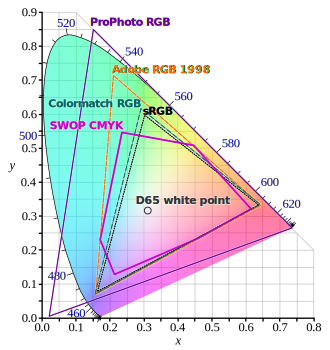 |
|:--:|
| *Color spaces comparison chart from [Wikipedia](https://en.wikipedia.org/wiki/ProPhoto_RGB_color_space).* |

### sRGB and Standard RGB color space

While picking a pure green color in a paint program, ask yourself - is it really the very extent of green color you ever seen, or there are more "greener" shades in the world?
The correct answer would be *no*, the green color you see on the screen is not the very extent, although it might be close to what the human eye may distinguish in case of a good monitor.  

The same is true for all *3 primary* components, which absolute values define the range of color values, or coverage, usually displayed as a triangle.
*AdobeRGB*, *sRGB* and others are color spaces defining different extremes for *RGB primaries*.
*CRT*, *LCD*, *OLED* displays also rely on *RGB triad* to represent a color, but each physical display actually has its own unique RGB color space.
Predefined *profiles* in a monitor allow representing standardized color spaces like *AdobeRGB* or *sRGB* on a *calibrated device*.
This representation might be incomplete, so that you may see labels like *"87% sRGB coverage"*,
which means that display may physically represent *only 87%* of colors from *sRGB color space*, while others will be usually *clamped*.

Color reproduction is a great concern for artists, as color distortion might ruin aspects and hide important details when displayed on various displays.
[Color Profiles](https://en.wikipedia.org/wiki/ICC_profile) (or *ICC* profiles) have been designed to carefully reproduce the color,
by embedding profile into source (image), output (display or printer) and providing conversion rules between them.
The color conversion is usually defined through another standardized *color space XYZ*, and is quite a complicated process.

As there are more than one RGB color space, you may ask, which colors do you enter in applications like *Paint*?
Professional image and video processing software is aware of color spaces, so a user may specify color space explicitly, but simple software has no such options.  

[sRGB](https://en.wikipedia.org/wiki/SRGB) defines a ***standard RGB*** color space,
to be used *"by default"* - by monitor, printer and even Internet content, so that it is reproduced properly (although printers use another color model called *CMYK*).
Displays with extended output color range (covering *AdobeRGB* or similar) are mostly used by experienced users working with professional software, which is aware of color profiles.
But even these devices provide an *sRGB color profile*.

### sRGB linearization

Due to the nonlinear nature of color perception by human's eye, storing linear RGB color values within *8-bit* (*255 gradations*)
per channel image formats (*24-bit per pixel* or smaller) leads to visually lower precision.
To improve visual quality, sRGB was defined with *gamma correction* coefficient, making its values distributed nonlinearly.
At the same time, image formats with more than *8 bits per component* do not suffer from this precision issue, and gamma shift becomes redundant.

| 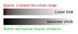 |
|:--:|
| &nbsp; |

sRGB gamma shift is defined as an exponent function with approximately *2.2* coefficient.
The exact formula listed below is slightly more complicated to handle the shades of dark values linearly:

```cpp
float Convert_sRGB_FromLinear (float theLinearValue) {
  return theLinearValue <= 0.0031308f
       ? theLinearValue * 12.92f
       : powf (theLinearValue, 1.0f/2.4f) * 1.055f - 0.055f;
}

float Convert_sRGB_ToLinear (float thesRGBValue) {
  return thesRGBValue <= 0.04045f
       ? thesRGBValue / 12.92f
       : powf ((thesRGBValue + 0.055f) / 1.055f, 2.4f);
}
```

Formula above expects well-defined values, while some *OpenGL* extensions also map `NaN` input values to zero and clamp output to `[0, 1]` range.  
Software just displaying sRGB content on sRGB display may pass-through RGB values as is.
Within 3D renderer, however, input colors are altered by lighting and blending equations.
These equations make sense only when applied to linear (RGB) values.

### RGB and color blending in 3D rendering

Lets take a look to the shading drawn by sRGB-unaware and sRGB-aware renderers:

| 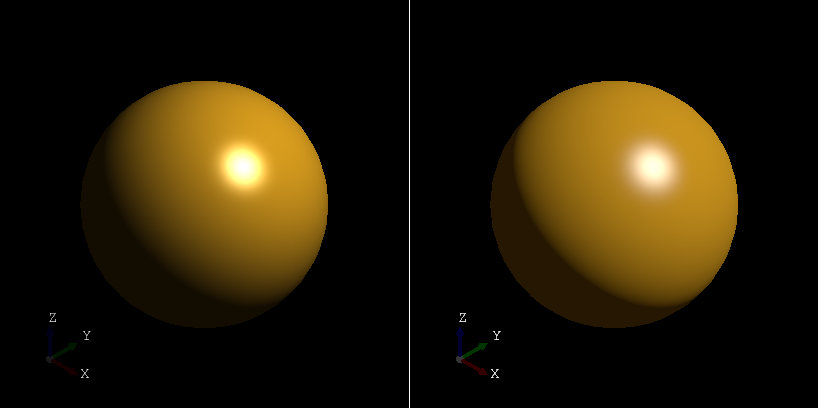 |
|:--:|
| *Sphere lighting before (left) and after (right) switching to sRGB-aware renderer.* |

The left image demonstrates a soft transition of a light into a shadow, while the right one shows more rapid transition.
Left image might look softer, but which one is closer to real life?

| 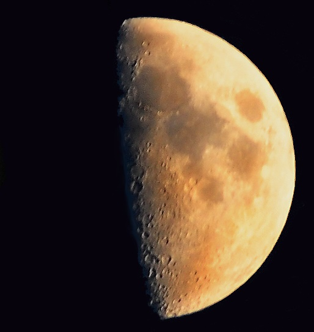 |
|:--:|
| *Moon photo from [wikipedia](https://en.wikipedia.org/wiki/Moon).* |

Photo of the moon might be not a perfect reference, but allows to see that sRGB-unaware renderer produces visually incorrect result.

Result of lighting, blending and some other color math on nonlinear sRGB values is wrong,
but still may be acceptable to some extent (until you look deeper in detail to realize why it is wrong).
Therefore, for proper rendering of the scene where colors are defined using sRGB values,
the gamma shift should be first eliminated, to convert color to linearized RGB value before any math.

The tricky point to realize is that *linearization* of sRGB values still gives color within sRGB color space
(not *AdobeRGB*, *scRGB* or any other *RGB* color space), just with linear properties.
Although practically speaking it is none of concern to a *GLSL* program as long as RGB values are linear (in any color space),
and appropriate (reverse) conversion is done when displaying the result on sRGB monitor.

The [following video](https://www.youtube.com/watch?v=LKnqECcg6Gw) demonstrates in an entertaining manner
which kind of visual defects might appear when sRGB linearization is ignored in the rendering pipeline.

In earlier days of *GLSL*, most code sensible to color manipulations performed *sRGB linearization* explicitly like this:

```glsl
void main() {
  vec3 aColorL = texture2D(uLeftSampler,  vec2(0.0, 0.0)).rgb;
  vec3 aColorR = texture2D(uRightSampler, vec2(0.0, 0.0)).rgb;
  // linearize values before math
  aColorL = pow(aColorL, vec3(2.2));
  aColorR = pow(aColorR, vec3(2.2));
  // perform color math
  vec3 aColor = uMultR * aColorR + uMultL * aColorL;
  // de-linearize before writing into FBO
  gl_FragColor = vec4(pow(aColor, 1.0/vec3(2.2))), 1.0);
}
```

As you may see, code just `pow(2.2)` input color, performs math, and then `pow(1/2.2)` before writing the result.
`2.2` is a good approximated exponent for sRGB conversion, used quite intensively in graphics.
Sometimes you can find `(x\*x)` with `sqrt(x)` combination in code, giving still good enough linearization but avoids expensive `pow()` calls.

Beware, that when working with `RGB(A)` values, only `RGB` should be passed through sRGB linearization, while ***alpha*** ***remains linear***!

### Color pickers

Most applications provide color input in non-linear sRGB color space.
This can be easily assumed when you see input controls with `[0..255]` integer range.
*HEX* encoding is another popular `RGB(A)` representation of nonlinear sRGB values, known as [web colors](https://en.wikipedia.org/wiki/Web_colors).
Here you can see screenshots from several popular editors:

| 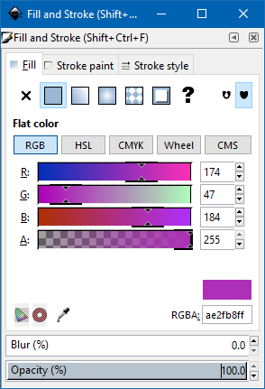 | 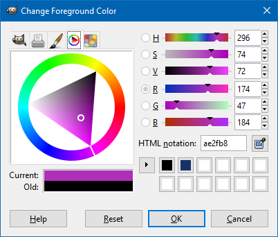 | 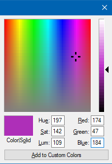 |
|:--:|
| | *Color pickers in [Inkscape](https://inkscape.org/), [Gimp](https://www.gimp.org/), MS Paint* | |

User interface of other editors goes further and provides clear means of color space of picked color.
As you may see [Krita](https://krita.org) and [Blender](https://www.blender.org/) display linear RGB values within floating number input.
Developer should NOT be mistaken in an attempt to convert integer sRGB values by simply using `255` as a denominator, as sRGB linearization formula should be also applied.

| <span> 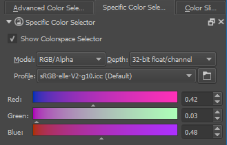 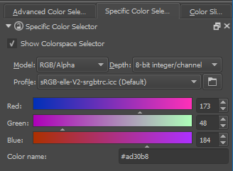 </span> |
|:--:|
| *Color pickers in [Krita](https://krita.org)* |

| <span> 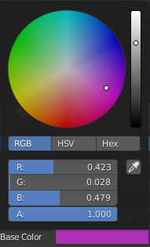 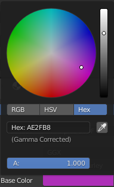</span> |
|:--:|
| *Color pickers in [Blender](https://www.blender.org/)* |

Here is sample output for one color:

* **HEX**<br>
  `#ae2fb8`
* **sRGB non-linear 0..255**<br>
  Red `173`, Green `48`, Blue `184`
* **sRGB non-linear float**<br>
  Red `0.678`, Green `0.188`, Blue `0.721`
* **RGB linear float**<br>
  Red `0.423`, Green `0.028`, Blue `0.479`

### Linear Gradients

Let's take a look at how color gradient looks when applied to linear RGB (correct) and nonlinear sRGB (incorrect) values:

| 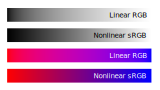 |
|:--:|
| &nbsp; |

Linear interpolation of nonlinear color values gives an unexpected muddy result within red-to-blue gradient, while interpolation of linear RGB values gives a clean color.
[Here](http://scanline.ca/gradients/) you will find more images comparing linear gradients of different color spaces.
At the same time, grayscale gradient visually looks more uniform in case of interpolation of sRGB values - which might be confusing,
but rather expected as human eye perception of intensity is non-linear.

*SVG* format allows defining interpolation scheme through [color-interpolation](https://www.w3.org/TR/SVG11/painting.html#ColorInterpolationProperty) property,
which gives an idea that interpolation of nonlinear color values still may be used in some contexts. One obvious use case is defining a gradient of grayscale values.

### Color operations

What kind of math operations can be done on RGB values?

- **Linear RGB**<br>
  Two colors in linear RGB can be mutually added and multiplied.  
- **Gamma-shifted**<br>
  Two colors with gamma-shifted RGB values can be mutually multiplied, but not added.
- **Nonlinear sRGB**<br>
  Neither multiplication, nor addition can be done.

Note that more operations are applicable to trivially gamma-shifted RGB values.
This is because true sRGB color space has a breaking point for small values (see formula above).

### OpenGL and sRGB linearization

Nowadays, *OpenGL* provides interfaces necessary for handling sRGB values without ad-hoc color conversion math:

- **sRGB textures**

  This feature basically allows to avoid manual linearization of values fetched from sRGB images.
  *8-bits* per channel gives only *255 grades*, so that conversion can be done via a tiny look-up table on graphics hardware with close to zero no `pow()` calls at all.

  More importantly, ***mip-map filtering*** is now done correctly in linear color space for sRGB textures, an operation that cannot be implemented in *GLSL* code.

- **sRGB framebuffers**

  This feature basically allows to avoid manual de-linearization of color values computed in linear space.

  More importantly, ***color blending*** done by fixed-function hardware blocks can be also done properly in linear color space before writing result into a buffer,
  although this is not true for every hardware (initial *OpenGL* specs declare this to be optional).
  This also cannot be implemented in *GLSL* code.
  Beware that *OpenGL* specs also specify `glLogicOp()` logical operations being disabled with sRGB framebuffer target.

### sRGB vs. linear RGB textures

Image formats with more than *8-bit* per channel have enough precision to store linear color values without banding artifacts.
For that reason, *OpenGL* specifies non-linear sRGB texture formats only for *8-bit* images.
Normally, all color textures should be in sRGB color space, since it allows preserving better color accuracy for the human eye.
At the same time, material properties like transparency, roughness, metalness
(in case of PBR metal-roughness material workflow) have nothing to do with a color, so that these texture maps should not be interpreted as sRGB.  

Interesting point is that actually even in case of *8-bit* per channel color textures sRGB is not always the best choice.
[CryTek researcher suggests](http://advances.realtimerendering.com/s2010/Kaplanyan-CryEngine3%28SIGGRAPH%202010%20Advanced%20RealTime%20Rendering%20Course%29.pdf)
deciding upon sRGB / linear RGB basing on image histogram:

> *Linear space has better precision above the value 116/255. And the gamma space is more precise below it.*
> *So, we use the more appropriate color space for each particular texture judging by the texture's histogram.*
> *The rule of thumb that works for us is to switch to linear color space each time the number of texels above the median point in the texture is more than 75%.*

### sRGB framebuffer vs. gamma-shift

Although sRGB framebuffer looks like a native approach for rendering, it is ignored in many cases.
Modern game engines perform most rendering into floating-point frame buffers to preserve computed colors with high precision,
and then show it on the screen with post-processing applied.  

The post-processing step usually includes gamma-correction / tone-mapping.
This is close to what linear-to-sRGB conversion does, but gives a user control over actual gamma-shift value.
The benefit is that the user is able performing a calibration of game output,
making the image darker/lighter to adapt to the lighting environment in the user's physical room.

### GLSL Inputs and outputs

So how exactly would the rendering look considering sRGB textures and sRGB frame buffers? Here is a general summary for *OpenGL*.

- **Packing/unpacking**
  - **Texture uploading** → <span style='color:green'>pass-through</span><br>
    with proper internal texture format (linear RGB or sRGB).
    OpenGL does not perform any sRGB/linear color space conversion.
  - **FBO blitting** → <span style='color:green'>pass-through</span><br>
    OpenGL does not perform any sRGB/linear color space conversion within `glBlitFramebuffer()`.
  - **FBO dump** → <span style='color:green'>pass-through</span><br>
    OpenGL does not perform any sRGB/linear color space conversion within `glReadPixels()`.
  - **FBO clearing** → <span style='color:orange'>implicit linearization</span><br>
    `glClearColor()`+`glClear()` usage might be confusing (difficult to find behavior in specs),
    but seems to be `glClear()` takes into account sRGB FBO flag, so that color passed to `glClearColor()`
    should be in linear color space, as long as there are no bugs in OpenGL driver.

- **GLSL Inputs** should be in **linear RGB** color space
  - **Uniforms**
    - Materials / light sources → <span style='color:green'>pass-through</span><br>
      Everything is expected in linear RGB color-space
  - **Textures**
    - **RGB(A) float** → <span style='color:green'>pass-through</span>
    - **sRGB8 nonlinear** → <span style='color:orange'>implicit linearization</span><br>
      (implicit conversion is always done for sRGB internal texture formats within <span style='color:orange'>OpenGL 2.1+</span>, <span style='color:orange'>OpenGL ES 3.0+</span>
      or extension [`GL_EXT_texture_sRGB`](https://www.khronos.org/registry/OpenGL/extensions/EXT/EXT_texture_sRGB.txt))
      *Older OpenGL specs and some extensions define 1-2 color component sRGB internal texture formats like `GL_SLUMINANCE8`;*
      *there are also extensions like `GL_EXT_texture_sRGB_R8` and `GL_EXT_texture_sRGB_RG8`.*
    - **RGB(A)8, RG8, R8** → <span style='color:green'>pass-through</span><br>
      Components are expected in linear RGB color space or having non-color nature (roughness, metalness, etc.).
    - **YUV, XYZ, Rec. 2020** → <span style='color:red'>explicit conversion</span>
  - **Vertex attributes**
    - **RGB(A) float** → <span style='color:green'>pass-through</span>
    - **RGB(A)8** → <span style='color:green'>pass-through</span> or <span style='color:red'>explicit conversion</span><br>
      *It might be reasonable packing vertex colors in sRGB,*
      *however explicit linearization will be required for extraction;*
      *glTF 2.0 specs currently define no conversion in this case,*
      *although [open discussion](https://github.com/KhronosGroup/glTF/pull/1729#issuecomment-569473865)*
      *clarifies that some graphic engines handle nonlinear sRGB conversion.*
- **GLSL main**
  - **Color math** is expected to be done in linear RGB color space
- GLSL writing into **Frame Buffer**
  - **RGB(A) float** → <span style='color:green'>pass-through</span>
  - **sRGB FBO** → <span style='color:orange'>implicit delinearization</span><br>
    Requires <span style='color:orange'>OpenGL 3.1+</span>, <span style='color:orange'>OpenGL ES 3.0+</span>.
    Requires also `glEnable(GL_FRAMEBUFFER_SRGB)` on desktop OpenGL.
    *Shader writes values in RGB linear color space, while OpenGL driver performs conversion into sRGB FBO automatically (after blending or before blending on old hardware).*
    *Beware that only `GL_SRGB8_ALPHA8` is guaranteed to be renderable.*
  - **RGB(A)8** FBO → <span style='color:red'>explicit delinearization</span><br>
    Fallback for old OpenGL versions
  - **sRGB-ready Window Buffer** → <span style='color:orange'>implicit delinearization</span><br>
    Requires one of `GLX`/`WGL` extensions (`GLX_ARB_framebuffer_sRGB` / `GLX_EXT_framebuffer_sRGB`
    from [`GL_EXT_framebuffer_sRGB`](https://www.khronos.org/registry/OpenGL/extensions/EXT/EXT_framebuffer_sRGB.txt),
    `WGL_ARB_framebuffer_sRGB` / `WGL_EXT_framebuffer_sRGB` from [`GL_ARB_framebuffer_sRGB`](https://www.khronos.org/registry/OpenGL/extensions/ARB/ARB_framebuffer_sRGB.txt),
    [`WGL_EXT_colorspace`](https://www.khronos.org/registry/OpenGL/extensions/EXT/WGL_EXT_colorspace.txt))
    or `EGL` extension [`EGL_KHR_gl_colorspace`](https://www.khronos.org/registry/EGL/extensions/KHR/EGL_KHR_gl_colorspace.txt).

    This is the least clear part of sRGB API - one should care creating OpenGL window with "sRGB-capable" attribute,
    so that `glEnable(GL_FRAMEBUFFER_SRGB)` would affect writes into window buffer as into sRGB FBO buffers.
    OpenGL ES provides `glEnable(GL_FRAMEBUFFER_SRGB)` only via extension `EXT_sRGB_write_control`.
  - **Not sRGB-ready Window Buffer** → <span style='color:red'>explicit delinearization</span><br>
    As it is not guaranteed that sRGB-capable window will be created (the extension might be even not supported!),
    there is an additional headache for providing a fallback for such cases.

    The simplest solution is probably using `glBlitFramebuffer()` from offscreen sRGB FBO (which is expected to pass-through values without color conversion)
    and/or custom FBO blitting GLSL program performing de-linearization for blitting from sRGB FBO.

    In a more general case, it would be required to duplicate all *GLSL* programs writing into a window buffer with color de-linearization code.

sRGB texture input and sRGB offscreen framebuffer rendering logic looks straight-forward.
Rendering into the window frame buffer, however, has some issues.
The problem is that sRGB color space has been expected on the screen long before sRGB rendering pipeline
became well-defined by OpenGL and other graphics API - so that some applications performed gamma correction on their own.

While creation of sRGB FBO clearly indicates developer intentions, window buffer was de-facto sRGB for many years,
so that it makes no sense introducing new sRGB window Pixel Formats.
To workaround this problem, `GLX`/`WGL`/`EGL` introduced *"sRGB-capable"* attribute,
actually indicating not what is stored inside window buffer,
but rather that OpenGL application telling that it is going to write linear RGB values,
and API has to convert them into non-linear sRGB color space.

At the same time, `GLX`/`WGL`/`EGL` implementation is not guaranteed to provide sRGB-capable pixel format even when it was requested.
Here is a [quotation from discussion](https://bugs.freedesktop.org/show_bug.cgi?id=92759)
related to *Mesa* bug returning non-sRGB-capable format in case when `ALPHA` component wasn't request:

> *Arguably there is a bug in supertuxkart too because perhaps it shouldn't assume it always gets an sRGB visual and it should fall back if one isn't available.*
> *However in practice if we fix this bug in Mesa then there's probably no cases where that would happen except for the broken Mesa versions.*

`EGL` allows requesting sRGB-capable buffer only via `EGL_KHR_gl_colorspace` extension or since EGL 1.5+,
and I have at least one device providing *OpenGL ES 3.1* support (hence, supporting sRGB FBOs)
without `EGL_KHR_gl_colorspace` extension (*EGL 1.4*), so that only fallback solution can be used.
According to some discussions, it is quite possible that *EGL 1.4* will still accept `EGL_VG_COLORSPACE_sRGB` defined for *OpenVG* and not *OpenGL ES*, but this would be undefined behavior.

*WebGL 2.0*, for instance, being an analog of *OpenGL ES 3.0* for web,
also supports sRGB textures and FBOs, but does not provide any means of color space control for a canvas element.
In fact, the canvas buffer is treated as a pass-through RGB buffer, so that sRGB offscreen FBO blitting into the window buffer (canvas) causes a color shift.
This problem is currently under discussion within the [canvas color space proposal](https://github.com/WICG/canvas-color-space/blob/master/CanvasColorSpaceProposal.md).

### Hardware support

sRGB rendering with fallback tricks requires at least *GLSL* support - which is basically any modern *OpenGL 2.1+* / *OpenGL ES 2.0+* hardware.
Fallback means that you have to add gamma correction to the result color in every *GLSL* shader,
tolerating incorrect blending performed by fixed-function hardware blocks.
Providing texture lookup fallback would be more tricky - of course,
it is still possible adding linearization gamma shift to every texture fetch, but this doesn’t look nice.

Native sRGB texture support requires *OpenGL 2.1+* and *OpenGL ES 3.0+*.
Desktop software reached *OpenGL 3.3* several years ago (*Intel* was the slowest vendor providing most recent *OpenGL* versions to integrated graphics),
so that the main concern here is *OpenGL ES 2.0* out of the boat (there is also `GL_EXT_sRGB` extension, but the only known *OpenGL ES 2.0* hardware with it is rare *NVIDIA Tegra 4*).
Practically speaking, this is not that critical now, since *OpenGL ES 2.0* devices are rapidly dying.
Here is a statistics for *Open Cascade [CAD Assistant](https://www.opencascade.com/content/cad-assistant)* on *Google Play*:

- OpenGL ES 2.0: <span style='color:red'>**1609** 	(**2.27%**)</span>
- OpenGL ES 3.0: 9175 	(12.95%)
- OpenGL ES 3.1: 14660 	(20.69%)
- OpenGL ES 3.2: <span style='color:green'>**59541** 	(**84.05%**)</span>

Statistics look very promising - just *2%* of active *OpenGL ES 2.0* devices!
Still, have to be considered to not drop out users...
It is also good to see that *OpenGL ES 3.2* support already dominates in statistics.

The [general statistics](https://developer.android.com/about/dashboards) for entire *Android* platform
looks not that nice with ***fifth*** part of devices running obsolete *OpenGL ES 2.0*:

- OpenGL ES 2.0: <span style='color:red'>**21.1%**</span>
- OpenGL ES 3.0: 29.8%
- OpenGL ES 3.1: 13.6%
- OpenGL ES 3.2: <span style='color:green'>**35.5%**</span>

It should be noted though, that devices barely supporting *OpenGL ES 3.0* (and not newer) are known to have troubles (driver bugs) with it,
so that Open CASCADE Technology prefers obsolete *GLSL* syntax of *OpenGL ES 2.0* (*GLSL ES 1.00*)
on these devices to workaround driver bugs and improve application stability.
These devices could potentially bite on trying to use sRGB textures / sRGB FBOs,
and the worst thing is that there are no more devices at hand to test - e.g. such issues
will be observed by remnants of users of these devices before we will be able acknowledging them on our own.
The same problem may occur on *OpenGL ES 2.0* devices as well, which also had very strict hardware limitations and highly likely some driver bugs.

Avoiding FBO writing fallback requires at least *OpenGL 3.1* and (same as for textures) *OpenGL ES 3.0*, so that it doesn't change the picture.

### Porting OCCT - challenges

*Open CASCADE Technology* (*OCCT*) used the classical *Blinn-Phong* shading model defined by the very first versions of *OpenGL*.
At these days, graphics hardware had no programmable cores, and even no dedicated hardware
for computing *T&L* (transformation and lighting) - it was done mostly on CPU,
which was rather slow to think about such a subtle matter as real-time physically correct lighting.

*OCCT* reflected this pipeline and passed-through colors to *OpenGL* as is,
even after it migrated to a programmable pipeline implementing *Phong shading* using *GLSL* programs.

*OCCT* has two classes `Quantity_Color` and `Quantity_ColorRGBA` defining floating point `RGB(A)` colors.
The definition includes an enumeration of named colors (filled with *X11* colors), commonly used across the code.
As you may expect, the named colors have been actually defined in nonlinear sRGB color space.

So one of the tricky steps in migrating into proper sRGB handling by a 3D renderer
is defining how `Quantity_Color` should be treated - in linear or nonlinear sRGB color space?
Stating `Quantity_Color` being *linear RGB* color means that existing software should be ported taking into account this breaking change.
Although in many cases there will be no visible difference (colors with maximum/minimum values)
or application users will not notice any change (apart from slightly changed color intensity).

Finally, it was decided to declare `Quantity_Color` values being in linear RGB color space,
so that no conversion is necessary to pass values to *GLSL* programs.
Color class now supports `Quantity_TOC_sRGB` for passing / receiving nonlinear sRGB values with appropriate conversion.

The change affected not only *Visualization*, but also the *Data Exchange* component.
Unlike video/image files, most file formats for 3D assets and CAD data lack information about RGB color space, leaving the room for ambiguity.

*glTF 2.0* is one of a few standards trying to clarify this aspect in format specifications.
Old file formats (including *STEP*, *IGES* and *OBJ*) are now considered to store sRGB color values,
so that OCCT performs appropriate color conversion on import/export steps.

Image below shows how standard *OCCT* materials looked before (*OCCT 7.3.0*) and after (*OCCT 7.4.1dev*) migration to sRGB-aware rendering pipeline.

| 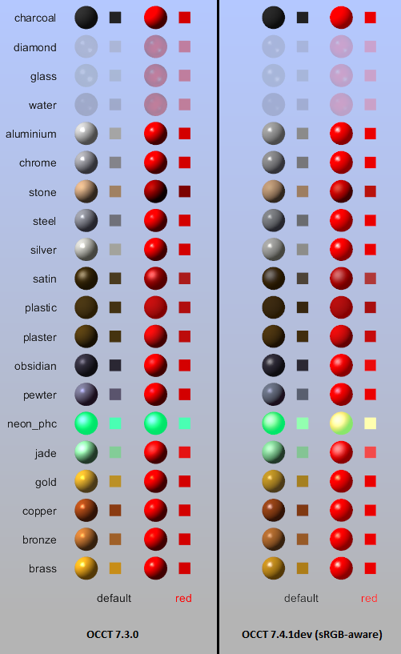 |
|:--:|
| *Standard OCCT materials before (left) and after (right)<br>migration to sRGB-aware rendering pipeline.* |

Common material properties like *diffuse*, *ambient*, *specular*, and *emissive* colors should be defined in linear RGB color space for lighting math,
yet direct conversion of standard OCCT materials for proper rendering into sRGB framebuffer required manual adjustments.
Applications defining custom materials might also require adjustments after porting to the new version of *OCCT*.

*Blending* in linear RGB color space also changed behavior of semitransparent materials, as well as text rendering on various backgrounds.

| 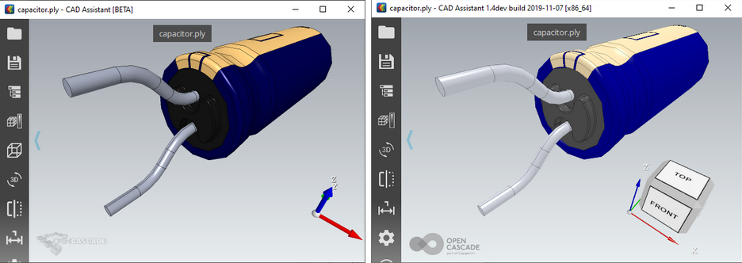 |
|:--:|
| *Color vertex attributes before (left) and after (right)<br>migration to sRGB-aware rendering pipeline.* |

Per-vertex attributes are interpreted in linear RGB color space (with no conversion in *GLSL* program).
On screenshots above you can see the visual difference - the new version looks brighter due to gamma shift applied on result.

It was decided to target *OpenGL 3.2+* / *OpenGL ES 3.0+* devices supporting sRGB offscreen framebuffer format.
Limited compatibility with *obsolete OpenGL* versions is done by de-linearization of colors before passing them to *OpenGL*,
so that result is visually different, but acceptable as a fallback solution.

### Further thoughts

Modern displays exceed limits of sRGB color space, giving more work to support ***scRGB***, ***DCI-P3*** at application side.
Different platforms (see [Android documentation](https://source.android.com/devices/tech/display/color-mgmt)
and [macOS/iOS documentation](https://developer.apple.com/library/archive/technotes/tn2313/_index.html#//apple_ref/doc/uid/DTS40014694-CH1-COLOR_MANAGEMENT_WORKFLOWS-CONTROLLING_COLOR_CONVERSIONS), for example)
define various ways for color management with weak links to OpenGL and other graphic APIs.
