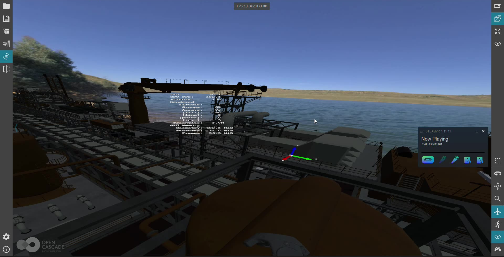
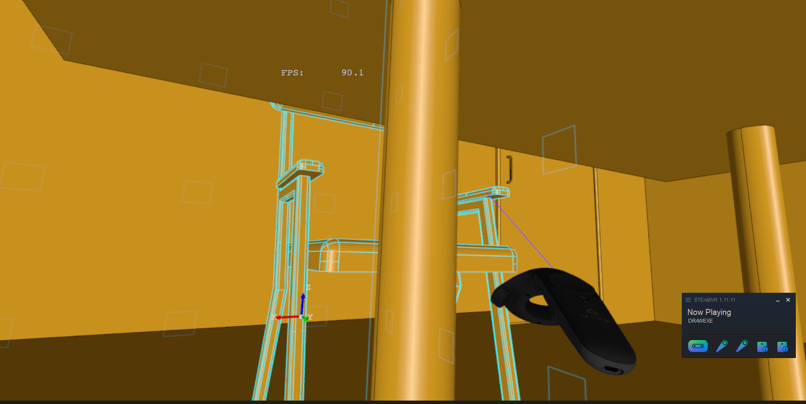

Release of **"Half Life: Alyx"** for Virtual Reality shown to me, that VR is not only about funny mechanics.
Exploration of deeply detailed world can be joyful even without interactions, although they make world more realistic.

This reminded me about unfinished two-years-old patch for *Open CASCADE Technology* adding *OpenVR* support.
Looks like a good time to complete the patch!

<!--break-->

| [](https://www.youtube.com/watch?v=f5TWSfZbC30) |
|:--:|
| *▶️ Video.* |

You may ask why bothering with *OpenVR*, while really open standard [OpenXR](https://www.khronos.org/openxr/) has been published by *Khronos Group* a year ago?
Unfortunately, *SteamVR* still doesn't provide *OpenXR* support, making it unavailable for users of two major VR headset vendors – *HTC Vive* and *Valve Index*.

Current VR support in *OCCT* (which will be available in next release *OCCT 7.5.0*)
is very basic – stereoscopic output, head position tracking, simple teleportation-style navigation and object picking (highlighting).
API is pretty rough for now, and can be changed in future with moving to *OpenXR* and supporting more devices.

Two-year before, I was struggled by one problem – where to put floating camera management into *OCCT* API?
But new class [`AIS_ViewController`](../2019-11-06-ais_viewcontroller-in-occt-7-4-0/) introduced in *OCCT 7.4.0* solved this problem perfectly!

Applications already using `AIS_ViewController` would need just a couple of changes to enable basic VR support – in the same way as enabling stereoscopic output.
So that it is available even in *Draw Harness*!
However, for deeper development of VR worlds, application developers should look into new API provided by `Aspect_XRSession` class.

```cpp
    Handle(V3d_View) theView;
    theView->ChangeRenderingParams().StereoMode = Graphic3d_StereoMode_OpenVR;
    theView->Camera()->SetProjectionType (Graphic3d_Camera::Projection_Stereo);
```

The sample *Tcl* script for *Draw Harness*:

```
    dtracelevel trace
    pload XDE MODELING VISUALIZATION OCAF
    vinit View1 -width 768 -height 768
    vzbufftrihedron
    vrenderparams -perfCounters fps
    for {set i 0} {$i < 5} {incr i 1} {
      for {set j 0} {$j < 5} {incr j 1} {
        for {set k 0} {$k < 5} {incr k 1} {
          box b$i$j$k $i $j $k 0.5 0.5 0.5
          vdisplay -noupdate -dispMode 1 b$i$j$k
        }
      }
    }

    vfit
    vcamera -persp -lockZUp
    vright
    vrenderparams -msaa 4
    vstereo -mode openvr -mirrorComposer 1 -unitFactor 1
    vglinfo
```

New feature requires building *OCCT* with *OpenVR* library.
For the moment, the option is provided only `genproj.tcl` project file generator, as it is expected that soon support should be replaced by *OpenXR*.

|  |
|:--:|
| *VR in Draw Harness.* |
