Next *OCCT 7.5.0* release will add a new *PBR* (physically-based rendering) mode to real-time rendering engine.
OCCT implements PBR metal-roughness material workflow described by core [glTF 2.0](https://www.khronos.org/gltf/) specifications and also includes glTF data exchange components.
New functionality opens a door to a new level of realism and visual quality of displayed models, and improves interoperability across various 3D engines supporting the same material workflow.

<!--break-->

| 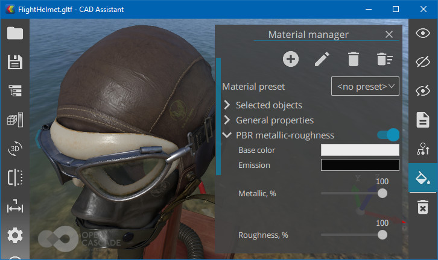 |
|:--:|
| &nbsp; |

## Common material workflow

Before going forward to new PBR capabilities, let's take a look at a shading model available in previous versions of OCCT 3D Viewer.

The [Phong/Gouraud reflection model](https://en.wikipedia.org/wiki/Phong_shading) has been widely used in real-time graphics for a long time.
Thanks to its simplicity, convincing look and affordable performance, this model has been implemented
by fixed-function [Transformation & Lighting (T&L)](https://en.wikipedia.org/wiki/Transform,_clipping,_and_lighting) hardware blocks on graphical cards of the past.
Introduction of programmable pipeline with first GPUs has given more flexibility to application developers, providing nice improvements like switching from *per-vertex* (*Gouraud*) to *per-fragment* (*Phong*) shading.

| 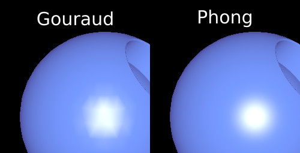 |
|:--:|
| *Per-vertex (left) vs. per-fragment (right) shading.* |

Common (*Phong*) material model consists of the following components (see `Graphic3d_MaterialAspect` and `XCAFDoc_VisMaterialCommon` structures):

- **Ambient color** (a constant multiplied by active light);
- **Diffuse** **color** (main object color reflected);
- **Specular** **color** (blicks of the light on the object);
- **Emissive** **color** (added regardless of active light);
- **Shininess** **factor** (defines a size of light blicks);
- **Transparency factor**.

| 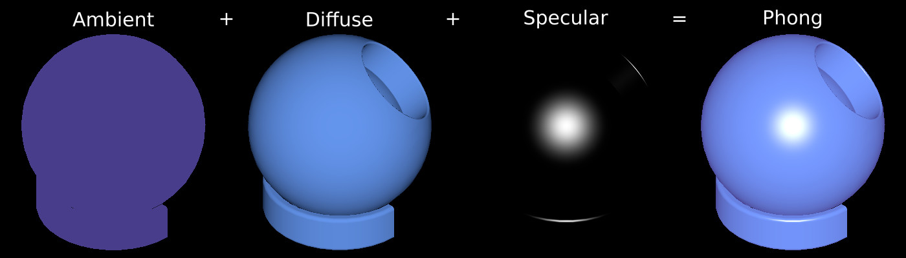 |
|:--:|
| *Components of Phong material model.* |

*Phong shading* is an ***empirical*** illumination model, which means that it does not try to comply with physical laws of light distribution.
Even more, in pursuit of better visual appearance, material workflow implies the lighting environment to be partially baked into an object's material.
Dynamic lighting remains computed in real-time, but the object's material, being artistically prepared for a specific environment, looks natural only there and has to be adjusted for another environment.

## PBR Metal-roughness material workflow

The limitations of conventional shading models and growing power of GPUs have pushed developers to look for better and more universal models.

**Physically-Based Rendering** (**PBR**) illumination models aim to fit surface shading formulas
into constraints of physical laws of light propagation / absorption / reflection - hence called *"physically-based"*.
This comes to the concept of ***energy conservation***, which states that an object can not reflect more light than it receives.

Various PBR engines define different material models, but ***metallic-roughness*** PBR material workflow became most commonly used
thanks to several game engines implementing it and open [glTF 2.0](https://www.khronos.org/gltf/) 3D asset exchange format specification relying on this model.
A common material model is a good step forward to interoperability across engines, so that 3D artists now can be sure that their models look consistent and as designed.
There is still some diversity across engines, like PBR specular glossiness material workflow, though.

Compared to Phong shading, *PBR model* relies on even smaller number of key material properties (see `Graphic3d_PBRMaterial` and `XCAFDoc_VisMaterialPBR` structures):

- **Base color** (or ***albedo***);
- **Emissive color** (added regardless of light);
- **Metallic flag** (switching between metal and dielectric properties);
- **Roughness factor** (the level of material polishness);
- **Transparency factor.**

| 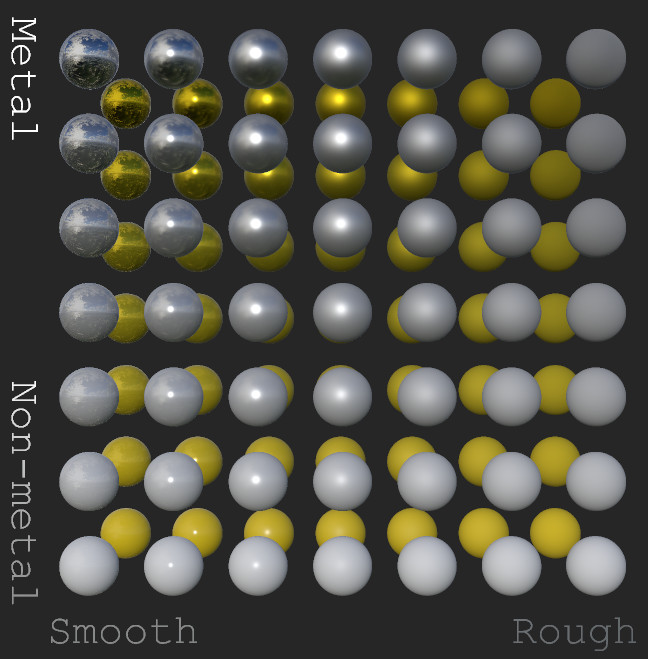 |
|:--:|
| *Metal-roughness PBR material properties.* |

***Emissive color*** has the same meaning as in case of a *Phong shading*, as it is applied regardless of lighting - its purpose is defining a cheap fake light source baked into an object.

***Base color*** has a meaning very close to diffuse color in *Phong shading*.
The latter one, however, may include baked properties like self-shadow, inappropriate to a clean albedo texture.
Therefore, diffuse texture from Phong material can be passed directly to the PBR pipeline,
but to eliminate visual artifacts an artist should manually [preprocess texture](https://marmoset.co/posts/pbr-texture-conversion/) and clean up from unexpected content.

***Roughness factor*** defines microsurface material properties.
Roughness can be considered as the opposite to polishness (or to glossiness, used by another PBR material model).

***Metallic flag*** defines whether material should behave as metal or as dielectric while responding to the light.
In real life, material should be either metal or non-metal, but PBR material workflow supports metallic factors in-between.
Such values can be used for displaying a smooth material transition on boundaries - like from corrugated to non-corrugated metal.
Usage of non-binary metallic values is discouraged in any other cases, as it may cause unexpected visual results.

With some practice, it soon becomes clear that defining an *artistic PBR Metallic-Roughness material* is much simpler than defining a similar material for Common material workflow.
And unlike Phong shading, the material will behave reasonably in various environments within a proper PBR engine. This also allows the same model to be displayed correctly in different 3D engines.

Exact conversion between *Common* and *PBR metal-roughness* material models is impossible.
But some material properties have close relations like diffuse color and albedo, shininess and roughness, so that a non-exact lossy conversion is provided by OCCT.

A special care must be taken while defining ***transparent materials*** in PBR.
First of all, semi-transparent metal makes no sense from a physical point of view.
For this reason, applying synthetic transparency might give unexpected results - it is desired resetting material metalness to zero for a natural look.
One more material parameter affects transparency - ***Index of Refraction (IOR)***.

## Additional texture maps

PBR models may be accompanied by base color (albedo) and metal-roughness texture maps, which meaning is clear.
In addition, the following texture maps are supported by *OCCT* and defined by *glTF 2.0* core specification:

- **Emissive map** (adds color regardless of lighting);
- **Normal map** (adds small surface details without extending geometry);
- **Occlusion map** (defines a pre-baked global illumination).

As these extra maps have no direct relationship to PBR metal-roughness material workflow,
*OCCT* 3D Viewer now supports these texture maps in both PBR and Phong shading models.

| 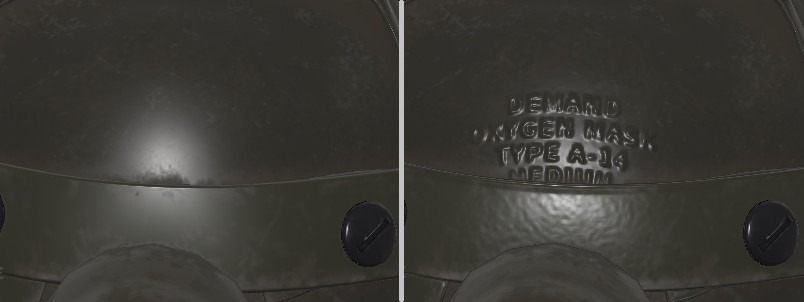 |
|:--:|
| *Normal texture may add extra details like scratches or imprints without altering geometry.* |

| 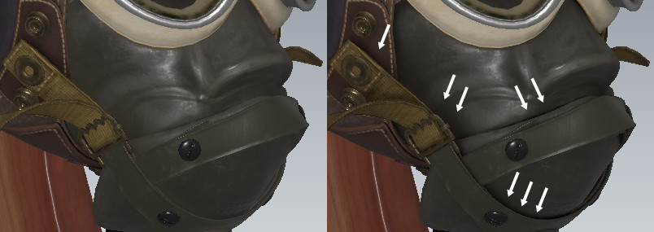 |
|:--:|
| *Occlusion texture adds pre-baked global illumination (smooth shadows at geometry corners).* |

## PBR renderers in OCCT

*OCCT* provides two PBR renderers:

- Cinematic non-real-time renderer (ray-tracing/path-tracing);
- Real-time renderer (rasterization).

Cinematic renderer is designed for uncompromisable quality, for which it relies on ray-tracing rendering pipeline (`Graphic3d_RM_RAYTRACING`).
Performance of current graphics hardware does not make it possible using computationally-intensive path-tracing renderer in real-time graphics,
but with some limitations it can be used in an interactive fashion.
*OCCT* includes a Path-Tracing rendering engine since *7.0.0* release, and implemented using *GLSL* programs.

| <span>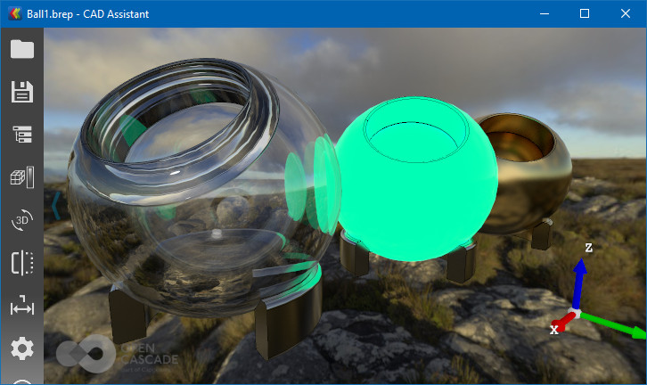 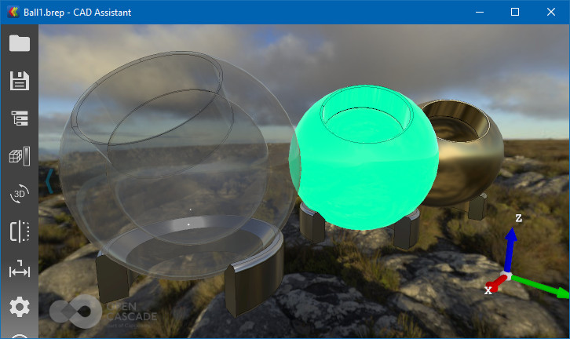</span> |
|:--:|
| *Photorealistic Path-Tracing (top) vs. real-time PBR (bottom) rendering engines in OCCT.* |

The objective of real-time PBR renderer is to be fast enough even on low-end graphics hardware.
For that, it heavily relies on traditional rasterization rendering pipeline (`Graphic3d_RM_RASTERIZATION`), various approximations and tricks making it applicable in real-time,
while looking good enough and preserving most important physical properties.

*OCCT 7.5.0* introduces a real-time PBR renderer supporting metal-roughness material workflow.
The math behind OCCT renderer can be found directly in [OCCT documentation](https://dev.opencascade.org/doc/overview/html/specification__pbr_math.html).
Current implementation handles transparent materials taking an Index of Refraction into account;
more [advanced transparent material](https://github.com/KhronosGroup/glTF/tree/master/extensions/2.0/Vendor/ADOBE_materials_thin_transparency) properties might be considered in the future.

The math requires light computations to be done in linear color space, while computer displays use non-linear color space reflecting properties of the human eye.
For this reason, OCCT renderer has been improved to handle properly **sRGB**/RGB color conversions.
This has been done as a [general improvement](../2020-01-08-srgb-color-space-in-opengl/) affecting not only *new PBR renderer*,
but the *Phong shading model*, RGB color definition (`Quantity_Color`) and color import/export in *Data Exchange* components (*STEP*, *IGES*, *glTF*, *OBJ*, etc.).

The Path-Tracing engine relies on a more advanced BSDF (Bidirectional Scattering Distribution Function)
material model (`Graphic3d_BSDF`), so that auxiliary conversion tools have been introduced.
In particular, built-in OCCT materials have been updated to support PBR metal-roughness material by conversion from previously defined BSDF material properties.

New renderer extends the list of shading models (`Graphic3d_TypeOfShadingModel` enumeration) with `Graphic3d_TOSM_PBR`/`Graphic3d_TOSM_PBR_FACET` values.
This makes it possible to mix objects with Phong, Unlit and PBR materials in a single scene, though results might be unexpected.

This is because apart from different material properties, PBR rendering has one more important difference compared to Phong shading - ***light source intensity***.
Within Phong shading, light sources have color values within normalized `[0; 1]` range - so that both a sun and a tiny lamp would have comparable color values in the scene.
Obviously, this contradicts physical laws, and PBR introduces unnormalized light intensity property - which should be scaled according to an energy emitted by a light source in the real world.

Therefore, a proper light sources setup becomes more critical in PBR workflow and requires more attention.
Exactly the same light source definition applied to PBR and Phong shading models produces different results due to unnormalized / normalized light intensity definition.

## Image-based lighting

A good light sources' setup is crucial for a nice-looking PBR rendering results, and it might become a problem.
Directional light sources give only a small blick on metals, while uniform ambient light sources result in too whitish results, which is no good.

Much better results give an **Image-Based Lighting** (**IBL**) - an environment (ambient) lighting based on a predefined image.
*OCCT 7.4.0* introduced support of cubemaps for viewer background, and *OCCT 7.5.0* PBR renderer uses this image background for a realistic environment lighting effect.

| 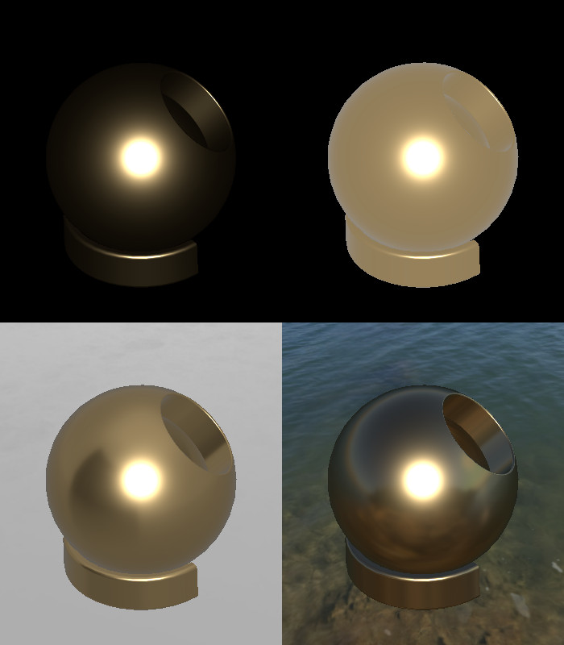 |
|:--:|
| *No ambient light (top-left), uniform white ambient (top-right),<br>white room environment (bottom-left) and lake environment (bottom-right).* |

So far, *OCCT* does not come with any environment maps, and application developers are responsible for providing them to OCCT 3D Viewer.
Normally, an application should provide a list of such images in settings, as different models might look better / more natural in different environments.

***Point light*** sources are handled physically by PBR renderer, so that their attenuation has a squared distance dependency
and constant/linear attenuation factors (supported by Phong shading) are ignored.
In addition, point light now provides an optional cut-off distance at which light source should be
fully attenuated - this is not physically correct (realistic light has an infinite zero attenuation distance),
but artistic/optimization feature allowing to manage numerous point sources in a scene.

## Performance comparison

Real-time PBR renderer uses various approximations, a lookup table and special textures for *Image-Based Lighting* pre-baked from an environment image - the generation of these maps,
and optimizations of generation of these maps can be considered as subject for a dedicated article.
Even with all these tricks, PBR is considerably more computationally intensive than conventional Phong shading.

It is clear that switching from Phong to PBR will affect performance, but to which extent?
Well, practically speaking, this is not that crucial on modern graphics hardware.
First of all, it should be noted that the main computational complexity resides in a *Fragment Shader*, while a vertex processing part remains the same.
This gives a nice quality to renderer - performance depends more on a frame buffer resolution rather than on a number of triangles.

Tests on modern desktop and mobile hardware show framerate drop from *0%* to *15%*, but older hardware and extra conditions might give more considerable slowdown.

## Data Exchange

*XCAF document* structure has been extended with a new element - ***visualization material*** (`XCAFDoc_VisMaterial`).
It should not be mistaken with previously defined material element (`XCAFDoc_Material`) defining physical properties (e.g. density).

Visualization material can define Common `XCAFDoc_VisMaterialCommon` (obsolete), PBR Metal-roughness `XCAFDoc_VisMaterialPBR` (new) properties, or both at the same time.
This gives application flexibility to either rely on automatic conversion between material models or to define specific properties (as automatic conversion can give undesirable results).

The document defines a plain list of Visualization materials, which are assigned to specific parts or sub-shapes.
Data Exchange components have been improved to use new elements:

- *XBF* document stores any combination of material and color labels.
  It should be noted, however, that assigning both color and material to the same part gives not well defined result and should be avoided.
- *STEP*, *IGES* and similar formats storing only color information keep using a color table in an *XCAF* document.
  Visualization materials in the document are exported as colors.
- *JT* reader/writer now translates material properties into a Common material definition in an *XCAF* document.
- *glTF* reader/writer now translates material properties into PBR material definition in an *XCAF* document.

`XCAFPrs_Style` now stores both color and visualization material properties, `XCAFPrs::CollectStyleSettings()` collects
overwhelming information from the document and `XCAFPrs_AISObject` supports displaying visualization material.

## Conclusion

PBR dramatically improves the visual quality of rendered models at minor performance costs (on modern hardware).
It is not limited to use cases, where realistic look is crucial - PBR is universal and can be used in a wide range of scenarios, from CAD to cartoon animations.

*OCCT* 3D Viewer supports a wide range of platforms and brings PBR renderer to desktop, mobile and web platforms.
The minimal requirement is *OpenGL 3.0+* or *OpenGL ES 3.0+* capable hardware.

*Metallic-roughness material workflow* improves interoperability with other 3D engines supporting this workflow and ensuring consistent look of a model.
Built-in *glTF 2.0* data exchange component allows easily transmit models between *OCCT* and other systems like *Blender*.

| 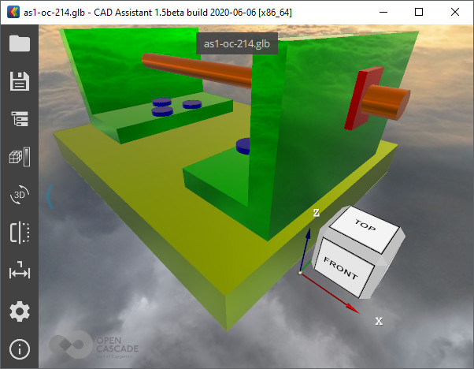 <br> 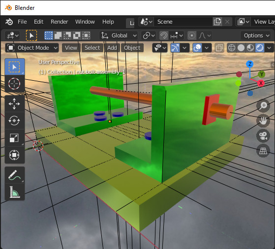 <br> 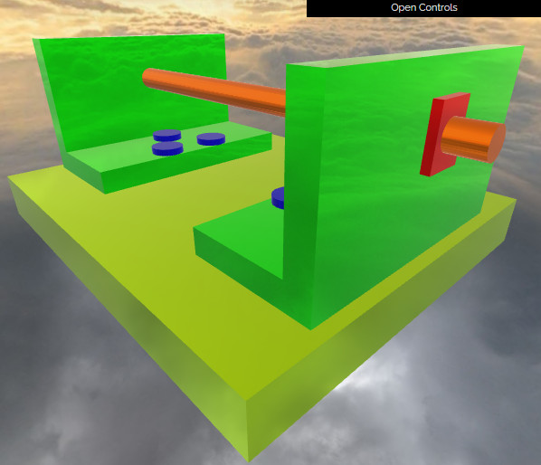 |
|:--:|
| *A sample glTF model displayed in CAD Assistant, Blender and three.js with similar environment setup.* |

## Materials in Draw Harness

The following tcl script defines a sample scene using Phong and PBR shading models.

```
pload OCAF XDE MODELING VISUALIZATION
vinit View1 -w 350 -h 400

# create an XCAF document from a sample model
restore [locate_data_file Ball.brep] ball
XNewDoc Doc
XAddShape Doc ball 0

# define a sample Common material
vrenderparams -shadingModel PHONG
XAddVisMaterial Doc matCommon -shininess 0.5 -ambient DARKSLATEBLUE -diffuse CORNFLOWERBLUE -specular WHITE
XSetVisMaterial Doc ball matCommon
XDisplay -dispMode 1 Doc
vfit

# define a sample PBR material
vrenderparams -shadingModel PBR
vlight -clear
vlight -add AMBIENT -intensity 1
vlight -add DIRECTIONAL -intensity 5 -headlight -direction 0 0 -1

XAddVisMaterial Doc matPbr -metallic 1 -roughness 0.5 -albedo CORNFLOWERBLUE
XSetVisMaterial Doc ball matPbr
XDisplay -dispMode 1 Doc
vfit

# use cubemap for better ambient lighting
#vbackground -cubemap cubemap.png
```

## Live DEMO

The [live demonstration](https://draw.sview.ru/xde-import-gltf-helmet) of OCCT 3D Viewer in the browser showing *glTF 2.0* model
with PBR materials can be found within *Open CASCADE Technology* examples.
