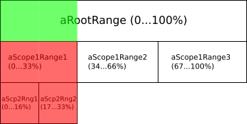

---
layout: post
date: 2020-10-17
title: Progress Indication changes in OCCT 7.5.0
categories: occt
tags: gui opencascade opensource tutorial
permalink: /occt/2020-10-17-progress-indication-changes-in-occt-7-5-0/
thumbnail: /occt/2020-10-17-progress-indication-changes-in-occt-7-5-0/_images/cadass_progress.png
author: Kirill Gavrilov Tartynskih
--- 

*OCCT 7.5.0* introduces a redesigned progress indication API with the `Message_ProgressIndicator` class as an entry point.
The redesign was focused on the following objectives:

- Allow propagating a progress indicator to nested algorithms within multiple working threads.
- Handle various inconsistencies and bugs in existing design (e.g. causing incorrect progress indication due to internal bugs).
- Improve logic to detect and reveal API misuse (e.g. causing incorrect progress indication due to incorrect API usage).
- Make the public API more straight-forward and clear for using in algorithms.

<!--break-->

|  |
|:--:|
| &nbsp; |

# What's changed; porting example

The redesign affects both an internal logic and public API, so that progress indication code of existing applications should be updated.
Let's take a look onto typical algorithm using an old API:

```cpp
class MyAlgo
{
public:
  //! Algorithm entry point taking an optional Progress Indicator.
  bool Perform (const Handle(Message_ProgressIndicator)& theProgress = 0)
  {
    Message_ProgressSentry aPSentry0 (theProgress,"Processing", 0, 1, 1);
    {
      Message_ProgressSentry aPSentry1 (theProgress, "Stage 1", 0, NBSTEPS, 1);
      for (int anIter = 0; anIter < NBSTEPS; ++anIter, aPSentry1.Next())
      { 
        if (!aPSentry1.More()) { return false; } 
        // do some job here...
      }
    }
    aPSentry0.Next();
    {
      perform2 (theProgress);
    }
    aPSentry0.Next();
    bool wasAborted = !theProgress.IsNull() && theProgress->UserBreak();
    return !wasAborted;
  }
private:
  //! Nested sub-algorithm taking Progress Indicator.
  bool perform2 (const Handle(Message_ProgressIndicator)& theProgress)
  {
    Message_ProgressSentry aPSentry2 (theProgress, "Stage 2", 0, 100, 1);
    for (int anIter = 0; anIter < 100 && aPSentry2.More();
         ++anIter, aPSentry2.Next())
    {
      // do some other job... 
    }
    return !aPSentry2.UserBreak();
  }
};

...

// application executing an algorithm
Handle(Message_ProgressIndicator) aProgress = new MyProgress();
MyAlgo anAlgo;
anAlgo.Perform (aProgress);
```

Elaborating the previous design and it's issues would require writing another article, so lets focus here only on the new API and the key changes.
The following guidance can be used to update a code using an old API:

1. Replace `const Handle(Message_ProgressIndicator)&` with `const Message_ProgressRange&` in arguments of the methods that support progress indication.
   - `Message_ProgressIndicator` object should be now created only at the place where application launches an algorithm,
     while the algorithm itself should work only with `Message_ProgressRange` object.
2. Replace `Message_ProgressSentry` with `Message_ProgressScope`.
   - Class `Message_ProgressSentry` is still defined (marked as *deprecated*) providing API more close to the old one,
     and can be used to reduce porting efforts, but new code should rely on a new class `Message_ProgressScope`.
     Notice that `Message_ProgressScope` takes a smaller number of arguments (e.g. no "minimal value").
     In other aspects, `Message_ProgressScope` mimics an iterator-style interface (with methods `More()` and `Next()`) close to the old `Message_ProgressSentry`.
     Note that method `Message_ProgressScope::Close()` is equivalent to the method `Relieve()` of `Message_ProgressSentry` in the previous version.
3. Each `Message_ProgressScope` should take the next `Message_ProgressRange` object to work with.
   - Within the old API, `Message_ProgressSentry` received the `Message_ProgressIndicator` object, which maintained the sequence of ranges internally.
     `Message_ProgressScope` takes `Message_ProgressRange`, which should be taken from the return value of `Message_ProgressScope::Next()` method of the parent scope.
     Do not use the same Range passed to the algorithm for all sub-Scopes like it was possible in the old API; each range object may be used only once.

Take a look onto ported code and compare with code above to see the differences:

```cpp
class MyAlgo
{
public:
  //! Algorithm entry point taking an optional Progress Range.
  bool Perform (const Message_ProgressRange& theProgress =
                                          Message_ProgressRange())
  {
    Message_ProgressScope aPScope0 (theProgress,"Processing", 2);
    {
      Message_ProgressScope aPScope1 (aPScope0.Next(), "Stage 1", NBSTEPS);
      for (int anIter = 0; anIter < NBSTEPS; ++anIter, aPScope1.Next())
      {
        if (!aPScope1.More()) { return false; };
        // do some job here...
      }
    }
    perform2 (aPSentry.Next());
    return !aPSentry.UserBreak();
  }
private:
  //! Nested sub-algorithm taking Progress sub-Range.
  bool perform2 (const Message_ProgressRange& theProgress)
  {
    Message_ProgressScope aPScope2 (theProgress, "Stage 2", 100);
    for (int anIter = 0; anIter < 100 && aPScope2.More();
         ++anIter, aPScope2.Next())
    {
    }
    return !aPScope2.UserBreak();
  }
};

...

// application executing an algorithm
Handle(Message_ProgressIndicator) aProgress = new MyProgress();
MyAlgo anAlgo;
anAlgo.Perform ("FileName", aProgress->Start());
```

You may notice that old code relying on `Message_ProgressSentry` looks almost the same using new API with minor renamings and movements.
Old code working with `Message_ProgressIndicator` directly should be ported to use `Message_ProgressScope`.

# Protection against misuses

An extra caution should be taken while passing `Message_ProgressRange` to `Message_ProgressScope` constructors and to nested algorithms!
Once an instance of `Message_ProgressRange` is passed to `Message_ProgressScope`, it becomes *"disarmed"*
and can be no more used for indicating progress - this is the crucial design change important to understand.

There is no C++ syntax which would protect from `Message_ProgressRange` misuse, but luckily,
the new implementation provides a debug assertion which would help application developers to fix such errors in code.
In release builds, such errors will be silently ignored, having only a side effect of losing progress indication details.
Progress indicator misuse was a problem of an old API as well, but there was no simple mechanism to localize such places in code.

# How it works

`Message_ProgressRange` represents a portion (*Range*) of a progress bar - so that `Message_ProgressIndicator::Start()` returns a *Range* of entire progress bar (*100%*),
while `Message_ProgressScope` splits the given *Range* into smaller chunks (*sub-ranges*) returned by `Message_ProgressScope::Next()` method.
Creation of a `Message_ProgressRange` doesn't increment the *Progress* - the commitment is done in the *class destructor*,
if the instance of this progress range has not been used in creation of a new progress scope.

In such design, `Message_ProgressIndicator` has no more need to know about created ranges and their sub-ranges - it cares only about incrementing of entire progress,
which is now mutex-protected in method `Message_ProgressIndicator::Increment()`.

Let's take a look at the following pseudocode demonstrating this logic:

```cpp
Handle(Message_ProgressIndicator) theProgress;
{
  Message_ProgressRange aRootRange = theProgress->Start();
  {
    Message_ProgressScope aScope1 (aRootRange, "", 3);
    Message_ProgressRange aScope1Range1 = aScope1.Next();
    Message_ProgressRange aScope1Range2 = aScope1.Next();
    Message_ProgressRange aScope1Range3 = aScope1.Next();
    {
      Message_ProgressScope aScope2 (aScope1Range1, "", 2);
      Message_ProgressRange aScp2Rng1 = aScope2.Next();
      {
        Message_ProgressRange aScp2Rng2 = aScope2.Next();
        //!< Breakpoint #1 Here >!//
      }
      //!< Breakpoint #2 Here >!//
    }
    //!< Breakpoint #3 Here >!//
  }
}
```

If we will set a breakpoint `#1` at commented line, the progress state will correspond to the following image:

|  |
|:--:|
| &nbsp; |

Note that at this point the overall progress will be still *0%* as all ranges and sub-ranges are in open state.
So that we have only logically split our range without making any progress.
The progress will be incremented by closing the sub-ranges (either by the end of C++ block scope in `Message_ProgressRange` destructor or by calling `Message_ProgressRange::Close()` method explicitly).
Here are breakpoints `#2` (`aScp2Rng2` is Closed) and `#3` (`aScope2` is Closed):

|  <br>  |
|:--:|
| &nbsp; |

Passing the *Range* to the *Scope* constructor doesn't Close it immediately but rather deactivates, so that the initial *Range* will be Closed now by *Scope* itself - either by *Scope destructor*,
explicit `Message_ProgressScope::Close()` call or by Closing all sub-ranges created by `Message_ProgressScope::Next()` method.

# Using in multi-threaded algorithm

There is no need to close *Ranges* in the order opposite to their construction - this could be done in arbitrary order,
and the user will see the overall progress as a sum of closed ranges.
This mechanism could be utilized for progress indication in multithreaded algorithm like this:

```cpp
class MyParallelFunctor
{
public:
  MyParallelFunctor (const Message_ProgressRange& theRange, int theNbSteps)
  : myScope (theRange, "", theNbSteps)
  {
    for (int aRangeIter = 0; aRangeIter < theNbSteps; ++aRangeIter)
    {
      mySubRanges.push_back (myScope.Next());
    }
  }

  void operator() (int theIndex) const
  {
    Message_ProgressScope aSubScope (mySubRanges[theIndex], NULL, 1);
    performAlgo (theIndex, aSubScope.Next());
  }
public:
  Message_ProgressScope myScope;
  std::vector<Message_ProgressRange> mySubRanges;
};

const Message_ProgressRange& theRange;
MyParallelFunctor aFunctor (theRange, 3);
OSD_Parallel::For (0, 3, aFunctor);
```

The basic idea is to pre-allocate the list of sub-ranges in the main thread and then close these ranges / pass them to nested algorithms concurrently within multiple working threads.
The allocation of sub-range is not protected by mutex (for performance reasons), so calling `Message_ProgressScope::Next()`
in concurrent threads for the same Scope will lead to issues, but closing Ranges is thread-safe operation.

# Implementation of virtual method Show()

The last portion of the changed API is `Message_ProgressIndicator::Show()` method.
Previously, progress indicator itself held information about created sub-ranges, so that an application showing detailed information about the progress just accessed these properties.
Within the new API, progress indicator itself holds only overall progress information, while local details can be retrieved from `Message_ProgressScope` passed by argument to the method.

The call of the method `Message_ProgressIndicator::Show()` from the method `Message_ProgressIndicator::Increment()` is now mutex-protected,
and the method `Show()` implementation may collect the tree of Scopes from the given leaf Scope and print information about each one.
Within the multithreaded algorithm, `Show()` might be called for different sub-scopes at some tree level - so that progress information
will be local to the leaves of this tree branch (other leaves will have its own local progress) while overall progress will be uniform.

|  |
|:--:|
| &nbsp; |

The sample code formatting progress details could be found in `Draw_ProgressIndicator` class implementation used by *Draw Harness*.
The code could look like this:

```cpp
void MyIndicator::Show (const Message_ProgressScope& theScope,
                        const Standard_Boolean theToForce)
{
  Standard_Real aPosition = GetPosition();
  // Prepare textual progress info
  std::stringstream aText;
  aText.setf (std::ios::fixed, std::ios::floatfield);
  aText.precision(0);
  aText << "Progress: " << 100. * aPosition << "%";
  NCollection_List<const Message_ProgressScope*> aScopes;
  for (const Message_ProgressScope* aPS = &theScope; aPS;
       aPS = aPS->Parent()) { aScopes.Prepend(aPS); }

  for (NCollection_List<const Message_ProgressScope*>
       ::Iterator it(aScopes); it.More(); it.Next())
  {
    const Message_ProgressScope* aPS = it.Value();
    if (!aPS->Name()) continue; // skip unnamed scopes
      aText << " " << aPS->Name() << ": ";

    Standard_Real aVal = aPS->Value();
    if (aPS->IsInfinite()) // handle infinite scopes specifically
    {
      if (Precision::IsInfinite(aVal)) { aText << "finished"; }
      else { aText << aVal; }
    }
    else
    {
      aText << aVal << " / " << aPS->MaxValue();
    }
  }
  std::cout << aText.str().c_str() << "\n";
}
```
