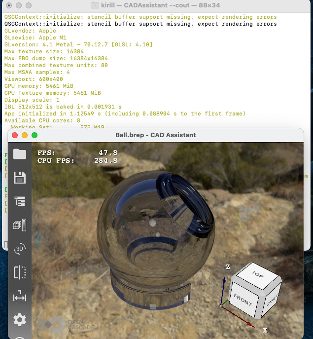
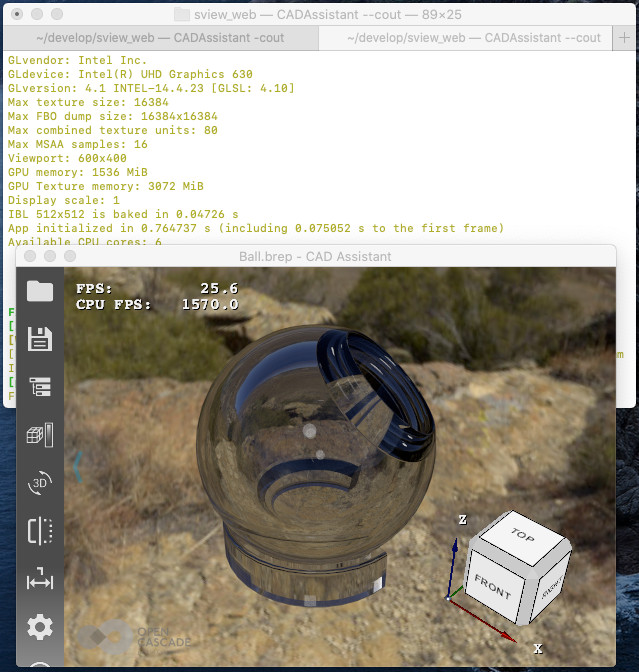
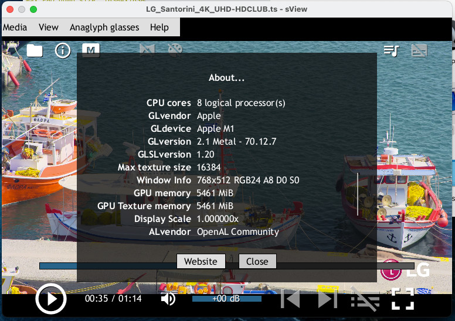
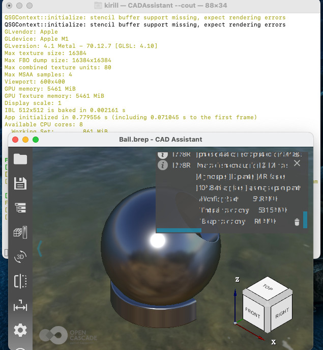

*Apple* has deprecated *OpenGL* since *macOS SDK* for *Mojave 10.14*, making me curious about *OpenGL* support since the very announcement of *Mac mini* based on *Apple M1* (ARM) SoC.
It was claimed in many places that *macOS Big Sur* remains compatible with OpenGL applications,
but so far no details could be found anywhere ***which OpenGL version*** will be supported on *M1 GPU*
([OpenGL compatibility table](https://developer.apple.com/opengl/OpenGL-Capabilities-Tables.pdf) has not been updated since '2017).

<!--break-->

|  |
|:--:|
| &nbsp; |

The fog of obscurity has been finally cleared!
It is ***OpenGL 4.1*** implemented on top of *Metal*, which is the highest OpenGL version available on *macOS* platform also on other GPUs.
Below is the same screenshot of *CAD Assistant* on *Intel UHD Graphics 630* rendering a glass via Path-Tracing engine in *Open CASCADE Technology*.

|  |
|:--:|
| &nbsp; |

The framerate isn't bad compared to old *Intel*: *25 FPS* vs. *48 FPS* (*Intel HD 630* vs. *Apple M1*) for a small window
and *6.5 FPS* vs. *14.8* for *1080p* resolution (hence, ***about x2 faster***).
For sure, *M1* is a no competitor to real force like mid-range 4-years-old mobile version of *GeForce 1060 GTX* showing *100+ FPS* in the same conditions – it can be compared only to low-end GPUs.

***Rosetta*** is an *Apple's* solution for running *x86-64* applications on *ARM64* hardware.
Clearly, such a tool is a mandatory brick for providing smooth transition.
But *Apple* shows her muscles here (again) – while you can barely find any ARM-compatible applications soon after *Apple M1* release, *Rosetta* is NOT installed on a fresh *macOS* installation!
Launching an old application built for Intel just silently fails and shows no error message.
However, running an installation package `.pkg` directly suggested to install *Rosetta*.

*Rosetta* work isn't perfect yet based on experience with a couple of tested applications
(though some issues might be actually related to *macOS Big Sur*, and not to *Rosetta* itself):

- Telegram seems to be working fine.
- Edge seems to work.
- Firefox starts but doesn't work as expected / crashes.
- sView works fine, but crashes on attempt to resize a window.
  - Seems to be related to some bugs in *OpenGL* implementation related to multi-threaded usage, which *Apple* deprecated in new versions of *macOS*.
    *sView* has an option disabling threaded OpenGL renderer:
    ```
    > open -a /Applications/sView.app --args --cocoa-threaded=off
    ```
- *CAD Assistant* starts, but text rendering artifacts occur in *QtQuick* renderer.
  - It seems this issue is a [bug in OpenGL implementation specific to Apple M1](https://bugreports.qt.io/browse/QTBUG-86429) (not reproducible on *Intel GPU*).
    *Qt* even has an environment variable, which helps to workaround the bug:
    ```
    > export QT_ENABLE_GLYPH_CACHE_WORKAROUND=1
    > open -a "/Applications/CAD Assistant.app"
    ```

I would be optimistic hoping that Rosetta will work better with macOS updates,
if I haven't already seen similar stability issues on *Intel*-based *Android devices* running ARM applications with various sudden crashes.
So I tend to be pessimistic here and expect *Rosetta* being only a limited solution until the majority of developers will not release application updates ported onto the new platform.

|  |
|:--:|
| &nbsp; |

|  |
|:--:|
| &nbsp; |

```
Draw[10]> vglinfo -complete
OpenGL info:
GLvendor: Apple
GLdevice: Apple M1
GLversion: 4.1 Metal - 70.12.7
GLSLversion: 4.10
Max texture size: 16384
Max FBO dump size: 16384x16384
Max combined texture units: 80
Max MSAA samples: 4
Viewport: 409x409
GPU memory: 5461 MiB
GPU Texture memory: 5461 MiB
GLextensions: GL_ARB_blend_func_extended GL_ARB_draw_buffers_blend GL_ARB_draw_indirect GL_ARB_ES2_compatibility GL_ARB_explicit_attrib_location GL_ARB_gpu_shader_fp64 GL_ARB_gpu_shader5 GL_ARB_instanced_arrays GL_ARB_internalformat_query GL_ARB_occlusion_query2 GL_ARB_sample_shading GL_ARB_sampler_objects GL_ARB_separate_shader_objects GL_ARB_shader_bit_encoding GL_ARB_shader_subroutine GL_ARB_shading_language_include GL_ARB_tessellation_shader GL_ARB_texture_buffer_object_rgb32 GL_ARB_texture_cube_map_array GL_ARB_texture_gather GL_ARB_texture_query_lod GL_ARB_texture_rgb10_a2ui GL_ARB_texture_storage GL_ARB_texture_swizzle GL_ARB_timer_query GL_ARB_transform_feedback2 GL_ARB_transform_feedback3 GL_ARB_vertex_attrib_64bit GL_ARB_vertex_type_2_10_10_10_rev GL_ARB_viewport_array GL_EXT_debug_label GL_EXT_debug_marker GL_EXT_framebuffer_multisample_blit_scaled GL_EXT_texture_compression_s3tc GL_EXT_texture_filter_anisotropic GL_EXT_texture_sRGB_decode GL_APPLE_client_storage GL_APPLE_container_object_shareable GL_APPLE_flush_render GL_APPLE_rgb_422 GL_APPLE_row_bytes GL_APPLE_texture_range GL_NV_texture_barrier
ResolutionRatio: 1
```
