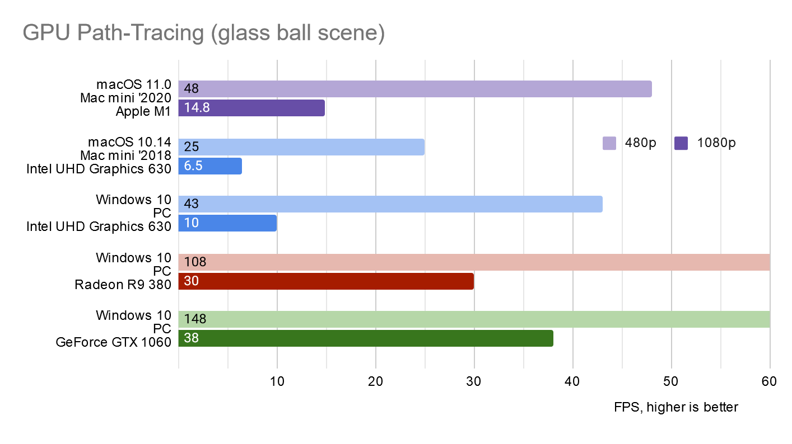
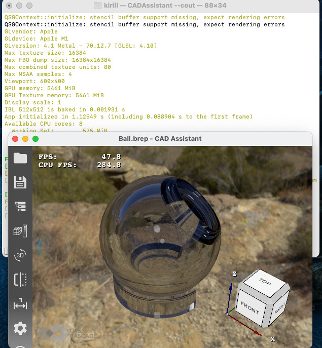
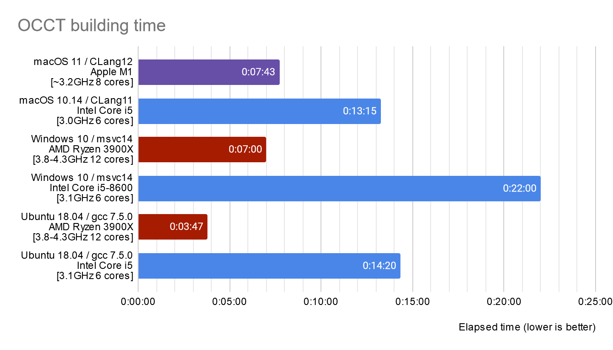
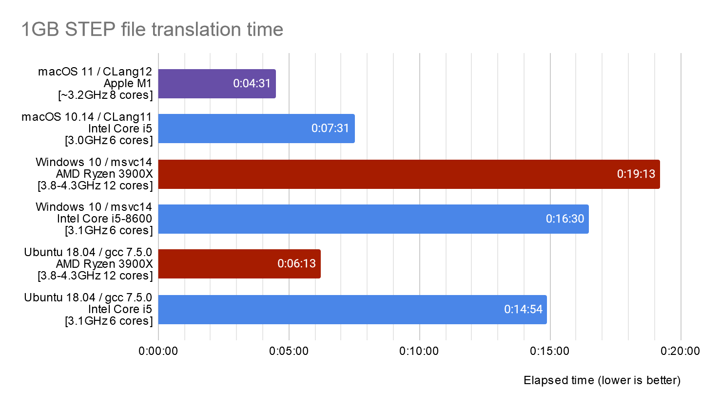
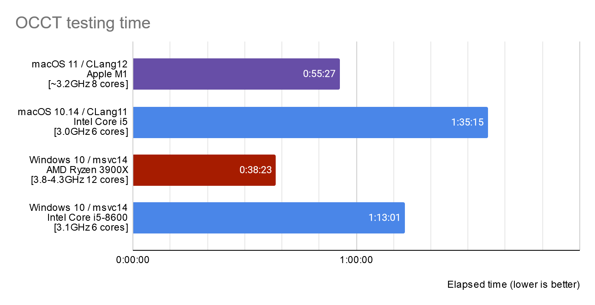

*Apple* has just released its first generation of ARM-based desktop computers.
*Macs* used exclusively *Intel* CPUs since [transition from IBM PowerPC](https://en.wikipedia.org/wiki/Mac_transition_to_Intel_processors) in 2006,
but now *Apple* believes that their own SoC, originally developed for mobile devices (*iPhone* and *iPad*),
may replace *Intel* CPUs within the whole line of products ***in just 2 years***!

[Apple M1 SoC](https://en.wikipedia.org/wiki/Apple_M1) became the heart of several low-end devices within the '2020 line of products,
but Apple promises an outstanding performance difference compared to previous Intel-based generation of products.
This is difficult to believe! Could this be true?

<!--break-->

|  |
|:--:|
| &nbsp; |

CPUs on ARM architecture developed by various vendors usually do not make records in operational frequencies,
so there is some skepticism whether ARM hardware may compete with *x86* in performance.
Thanks to low power consumption design, [ARM64 CPU architecture](https://en.wikipedia.org/wiki/AArch64) dominates in smartphones and tablets,
but desktop and server markets remain shared by Intel and AMD CPUs on [x86_64 architecture](https://en.wikipedia.org/wiki/X86-64)
(an *AMD*'s 64-bit extension to x86 CPU architecture originally developed by *Intel*) delivering an outstanding performance in general-purpose computations.

Performance comparison is an interesting point, but as a developer of an open-source CAD kernel, I'm also curious if our software has any issues specific to ARM hardware.
This question arises due to two aspects - CAD algorithms in [Open CASCADE Technology](https://dev.opencascade.org/) (*OCCT*)
may suffer from floating point instabilities (implementations differ on various CPUs) and lack/inaccessibility of ARM-based hardware for comprehensive testing.

*OCCT* is already used on ARM-based *Android devices* for long enough, but testing on such a platform is complicated due to limitations of Android itself and slowness of mobile hardware.
New *Mac mini* with an *ARM64* CPU gives a new opportunity of testing *OCCT* on a more traditional desktop OS and fast enough hardware - and this is the actual subject of this article!

## Test configuration

The following configurations have been used for the tests (prices are taken from online markets at the moment of publication, see also comments):

|               &nbsp; | OS          | CPU                                                         | GPU                                    | RAM              | SSD                           | Price                                    |
| :------------------: | :---------: | :---------------------------------------------------------: | :------------------------------------: | :--------------: | :---------------------------: | :--------------------------------------: |
| ***Mac mini '2020*** | macOS 11.0  | ***Apple M1***<br>*(3.2 GHz, 8 cores, 5 nm)*                | ***Apple M1***<br>*(OpenGL 4.1)*       |   8 GB LPDDR4    | 500 GB                        | ~$900<br>*(locally available ~$1200)*    |
|   **Mac mini '2018** | macOS 10.14 | Intel Core i5<br>*(3.0 GHz, 6 cores, 14 nm)*                | Intel UHD Graphics 630<br>*OpenGL 4.1* |   8 GB DDR4-2677 | 250 GB                        | ~$1100<br>*(for 500 GB version)*         |
|   **Intel-based PC** | Windows 10  | Intel Core i5-8600<br>*(3.1 GHz, 6 cores, 14 nm)*           | Radeon R9 380<br>*OpenGL 4.6*          |  32 GB DDR4-2400 | 500 GB<br>*(Patriot Burst)*   | ~$1400<br>*(~$900 without discrete GPU)* |
|     **AMD-based PC** | Windows 10  | Ryzen 3900X<br>*(3.8-4.3 GHz, 12 cores / 24 threads, 7 nm)* | Radeon Vega<br>*OpenGL 4.6*            | 128 GB DDR4-2900 |   1 TB<br>*(Samsung 970 Pro)* | ~$2100<br>*(~$1650 with 16GB RAM)*       |

*Apple M1* in *Mac mini '2020* is an *8-core* CPU with *4* fast and *4* slower cores - it is the main guest of this show.
*Mac mini '2018* with *6-cores* *Intel Core i5* is used for direct comparison between products sold by *Apple* at close price.

*Intel*-based PC is a competitor based on an independent from *Apple* platform - it uses *Intel Core i5* close to *Mac mini '2018*
and represents a several-years-old typical developer's workstation with a good performance/price ratio of the time (before newer generations of *AMD Ryzen* CPUs arrived).

*AMD*-based PC is obviously far from the other computers in the table by the price range, it has been put to show some numbers with more expensive configuration.

## GPU Path-Tracing

[Previous publication](../2020-12-09-opengl-on-apple-m1/) has been focused on *OpenGL support* and GPU part of *Apple M1* SoC - so let's just put numbers into the table.
GPU Path-Tracing algorithm is implemented in *OCCT* via relatively complex *GLSL* program requiring *OpenGL 4+* graphics.
[CAD Assistant](https://old.opencascade.com/content/cad-assistant) application exposes Ray-Tracing options to a user and allows executing simple performance tests.

|  |
|:--:|
| &nbsp; |

Test scene with a glass ball shows that the new GPU in *Apple M1* is faster than *Intel GPU* in previous-generation *Mac mini*, but far behind any middle-range GPU.

|  |
|:--:|
| &nbsp; |

## Building OCCT

Configuring *OCCT* to target native ARM64 architecture on *macOS* is not a problem
thanks to *CMake* - just need to specify **arm64** or **x86_64** to `CMAKE_OSX_ARCHITECTURES` parameter and this is it:

```
anAbi=arm64
#anAbi=x86_64
export MACOSX_DEPLOYMENT_TARGET=10.10

# paths to pre-built 3rd-parties
aRapidJson=$HOME/develop/rapidjson-1.1.0
aFType=$HOME/develop/freetype-2.10.4-macos-$anAbi
aFImage=$HOME/develop/freeimage-3.18-macos-$anAbi

aPlatformAndCompiler=mac-${anAbi}-clang
aWorkDir=work/${aPlatformAndCompiler}-make
aDestDir=$aCasSrc/work/$aPlatformAndCompiler

pushd $aWorkDir
cmake -G "Unix Makefiles" \
  -D CMAKE_BUILD_TYPE:STRING="Release" \
  -D BUILD_LIBRARY_TYPE:STRING="Shared" \
  -D CMAKE_OSX_ARCHITECTURES:STRING="$anAbi" \
  -D INSTALL_DIR:PATH="$aDestDir" \
  -D INSTALL_DIR_INCLUDE:STRING="inc" \
  -D INSTALL_DIR_LIB:STRING="lib" \
  -D INSTALL_DIR_RESOURCE:STRING="src" \
  -D INSTALL_NAME_DIR:STRING="@executable_path/../Frameworks" \
  -D 3RDPARTY_FREETYPE_DIR:PATH="$aFType" \
  -D 3RDPARTY_FREETYPE_INCLUDE_DIR_freetype2:FILEPATH="$aFType/include" \
  -D 3RDPARTY_FREETYPE_INCLUDE_DIR_ft2build:FILEPATH="$aFType/include" \
  -D 3RDPARTY_FREETYPE_LIBRARY_DIR:PATH="$aFType/lib" \
  -D 3RDPARTY_FREETYPE_LIBRARY:FILEPATH="$aFType/lib/libfreetype.dylib" \
  -D USE_RAPIDJSON:BOOL="ON" \
  -D 3RDPARTY_RAPIDJSON_DIR:PATH="$aRapidJson" \
  -D 3RDPARTY_RAPIDJSON_INCLUDE_DIR:PATH="$aRapidJson/include" \
  -D USE_FREEIMAGE:BOOL="ON" \
  -D 3RDPARTY_FREEIMAGE_DIR:PATH="$aFImage" \
  -D 3RDPARTY_FREEIMAGE_INCLUDE_DIR:FILEPATH="$aFImage/include" \
  -D 3RDPARTY_FREEIMAGE_LIBRARY_DIR:PATH="$aFImage/lib" \
  -D 3RDPARTY_FREEIMAGE_LIBRARY:FILEPATH="$aFImage/lib/libfreeimage.a" \
  -D BUILD_MODULE_Draw:BOOL="ON" \
  "$aCasSrc"
```

Of course, you will also need to build all other 3rd-party libraries for a target architecture, which would require burning into various building environments.
One curious thing to note - *macOS 11.0* is the first official OS release with *ARM64* support, but it is allowed setting
[`MACOSX_DEPLOYMENT_TARGET`](https://cmake.org/cmake/help/latest/variable/CMAKE_OSX_DEPLOYMENT_TARGET.html#variable:CMAKE_OSX_DEPLOYMENT_TARGET) to target *older macOS* releases, even *macOS 10.10*.
This makes porting an application to new CPU architecture much more pleasing to a developer, as there is no need to bother about numerous deprecated APIs and other annoying changes in *macOS SDK*.

*Tip: the CPU architecture of an executable or dynamic library can be checked by command `file`; command `lipo` will show an architecture of a static library.*
*[Multi-Architecture Binaries](https://en.wikipedia.org/wiki/Universal_binary) (also known as fat binaries) for macOS and iOS might pack several architectures at once:*

```
> file libfreetype.dylib
libfreetype.dylib: Mach-O universal binary with 2 architectures
libfreetype.dylib (for architecture x86_64): Mach-O 64-bit dynamically linked shared library x86_64
libfreetype.dylib (for architecture i386): Mach-O dynamically linked shared library i386
> lipo info libfreeimage.a
Architectures in the fat file: ./libfreeimage.a are: x86_64 arm64
```

Compilation is a regular process of software development and reducing time spent by a developer for this task is always desirable.
So let's take a look at numbers showing *OCCT* building time on various configurations.

|  |
|:--:|
| &nbsp; |

Modern building environments efficiently utilize multiple CPU cores, and *8-cores Apple M1* shows pretty good time compared to the old *Intel Core i5* CPU (*1.5-1.7x* times faster).
It is painful to recall past times when *OCCT* building took more than *1 hour* (almost *2 hours* on an old *MacBook* with *Intel Core2Duo* CPU)!

## Reading a large STEP file

A large 1GB *STEP* file has been chosen for testing performance of long single-threaded execution of *OCCT* algorithms (here multiple CPU cores will not help scaling performance).
Parsing a text file is just a small part of the process, as *STEP* translator involves computationally intensive *Shape Healing* algorithms in *OCCT*.

|  |
|:--:|
| &nbsp; |

The comparison shows about *1.6x better* time on *Apple M1* system compared to an older *Mac mini* with *Intel Core i5*.
Surprisingly, this specific test case shows tremendous difference between various compilers (*CLang*, *msvc* and *GCC*).
This makes numbers taken from other systems not very illustrative as even *Intel*-based PC having CPU close to *Mac mini '2018* demonstrates a large difference.
Alas, I have no time to try other compilers or to find another use case where a compiler does not affect results in such magnitude.

## OCCT Test Suite

*OCCT Test Suite* is based on *Draw Harness* - a *Tcl*-based framework wrapping *OCCT* algorithms.
It consists of about *20 thousand of test cases* of different complexity involving a major part of *OCCT* functionality.
Serial execution of such a large number of tests would be painfully slow, so tests are normally executed in multiple parallel processes
printing success / failure statuses into log files and producing various file artifacts like 3D Viewer screenshots.

|  |
|:--:|
| &nbsp; |

*OCCT* testing shows *Apple M1* is *~1.7x* faster than older *Intel Core i5* CPU for this task.

The difference between **msvc14** (*Visual Studio 2015*) and **CLang** (*XCode*) compilers still can be seen on the chart,
but now fluctuations in particular algorithms are averaged by numerous tests and this chart illustrates a more general picture than a specific case of loading a single large *STEP* file.

The low number of failed tests (just *~150* cases) on *macOS* platform was a good surprise to me, as I was afraid of much worse results:

- *macOS M1*    (ARM64):  `153 FAILED`
- *macOS Intel* (x86_64): `148 FAILED`
- *Windows PCs* (x86_64): `15 FAILED`

Most failures are small deviations from reference values caused by floating point computation error,
plus issues with limitations and bugs of *OpenGL* implementation on *macOS* platform.
So that it could be stated that *CLang12* + *Apple M1* (ARM64) + *macOS* configuration has generally passed *OCCT* testing with minor deviations.

## Afterwords

Hardware and software configurations used in performance tests were quite bitty – different RAM, different GPUs, different SSDs and different compilers.
This does not allow us to say if one CPU is clearly better than another.
But let professional journalists make in-deep research and overwhelming performance testing in various software products to show clearer vision
if *Intel* and *AMD* should become worried about *Apple M1* and possible expansion of ARM on desktop PC market.

This small research shows that CAD kernel *OCCT* works quite well on the new *Apple M1* SoC based on *ARM64* architecture with performance quite comparable to or even better than typical *Intel* CPUs.
*Mac mini '2020* is also colder and quieter than *Mac mini '2018* at peak load, but this aspect is less important for a desktop computer.
At the same time, GPU remains very basic, so I believe that *Apple* will keep using *AMD Radeon* graphics in their powerful configurations of *MacBooks* and *iMacs*.

Looking forward to the next generations of *Apple* ARM-based SoCs!
