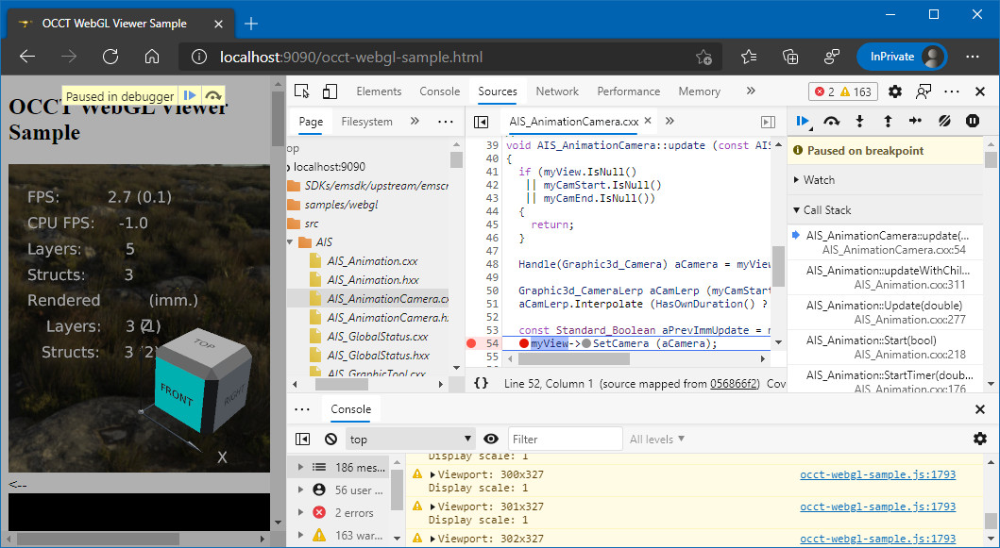
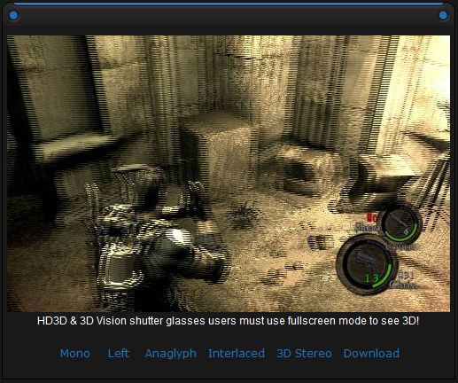
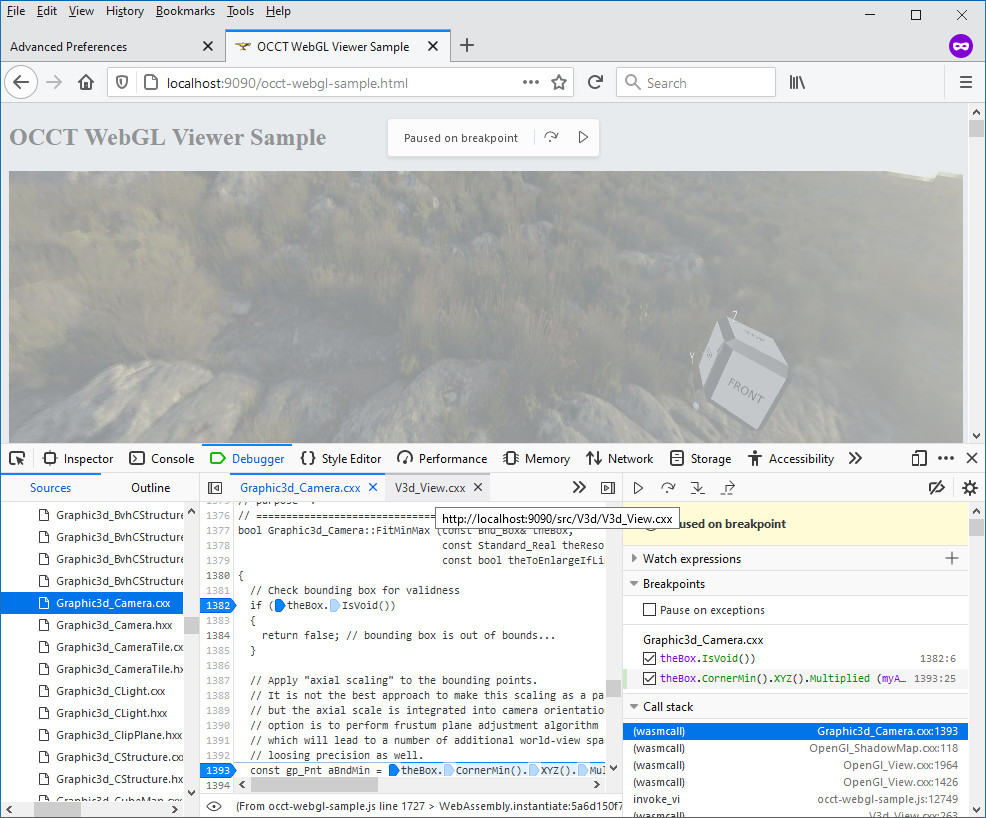

Web browsers become stronger and bigger in their attempt to become an OS inside of OS and supersede native applications without losing functionality or performance.
*JavaScript* engines became much faster within the past decade, but demands in using development languages like C++ for web-development persist over time.

<!--break-->

|  |
|:--:|
| &nbsp; |

[NPAPI](https://en.wikipedia.org/wiki/NPAPI) (*Netscape Plugin Application Programming Interface*) introduced by *Netscape Navigator 2.0* in *1995* and later adopted by other browser,
was a first successful attempt to bring native extensions to the web. Later it was followed by a similar [ActiveX](https://en.wikipedia.org/wiki/ActiveX) in *Internet Explorer*.
These were plugin-based interfaces allowing to load dynamic libraries (DLLs) and execute some functions on a page.

*Plugins* have been used for many purposes and filled big holes in *HTML* functionality of that time like a lack of *3D rendering* capabilities.
So that some plugins allowed to embed a 3D viewer into a page a long time before the introduction of [WebGL](https://en.wikipedia.org/wiki/WebGL) in *2011*.

|  |
|:--:|
| *Open Cascade e-Viewer plugin displaying CAD Models.* |

Some plugins were developed specifically for a single site, while others used on numerous sites.
[Java Applets](https://en.wikipedia.org/wiki/Java_applet), [Adobe Flash Player](https://en.wikipedia.org/wiki/Adobe_Flash_Player)
and [Microsoft Silverlight](https://en.wikipedia.org/wiki/Microsoft_Silverlight) have a large impact on the web (*Adobe Flash* first of all)
and created the whole new ecosystem for embedding multimedia content into web applications.

## Security, security, security...

Power comes with a price. Unrestricted execution of native code made users of Internet browsers
vulnerable to numerous security issues due to bugs, mistakes and hidden functionality in installed plugins.
Browser developers worked hard to fix security issues in code of a browser itself, but cannot push third-parties developing browser plugins to fix their vulnerabilities rapidly.

Becoming preoccupied by security concerns, browser developers tried to put each plugin
into a [sand-box](https://en.wikipedia.org/wiki/Sandbox_(computer_security)) environment and experimented
with "more secure" plugin interface [PPAPI](https://en.wikipedia.org/wiki/Google_Native_Client#Pepper),
The efforts ended up in deprecation and removal of native plugins APIs in favor of [asm.js](https://en.wikipedia.org/wiki/Asm.js) and then *WebAssembly*.

[WebAssembly](https://en.wikipedia.org/wiki/WebAssembly) allows compiling a code in various languages
like C/C++ into an intermediate platform-independent binary format, translated and efficiently executed directly by JavaScript runtime.
*WebAssembly* functionality is restricted by *HTML5* features, so that there is no direct access to local file system or to system-specific native APIs.
This leverages security to a high extent, but doesn’t make WebAssembly a complete functional replacement to native applications and previously supported plugins.
From the other side, a single `.wasm` binary running fine on *x86_64* and *AMR64* processors,
on desktop and mobile devices, and on major browser engines makes *WebAssembly* much more portable.

For instance, there is no way implementing a *WebAssembly* module similar to *sView NPAPI plugin*,
bringing support for various stereoscopic displays, shutter glasses and *VR* headsets, not supported by browser itself.
[WebVR](https://en.wikipedia.org/wiki/WebVR) (superseded later by WebXR) is supposed to fill the gap in supporting VR headsets, but there is no HTML API working with stereoscopic monitors.
Obviously, browser developers are not interested in supporting niche technologies, which previously could be covered by native plugins developed by third parties.

|  |
|:--:|
| *sView NPAPI plugin in MTBS 3D gallery.* |

Development of *WebAssembly* modules in C/C++ language could be done thanks to [Emscripten SDK](https://emscripten.org/),
which provides an *LLVM*-based compiler toolchain and a comprehensive platform SDK.
This SDK exposes a number of [POSIX](https://en.wikipedia.org/wiki/POSIX) functions, actually implemented using *JavaScript* / *HTML5* API.
The list of "system libraries" includes *OpenGL ES 2.0*/*3.0* and *EGL* APIs implemented on top of *WebGL 1.0*/*2.0*.

To run *WebAssembly* module, *JavaScript* engine allocates a dedicated memory heap, so that C/C++ code cannot map JavaScript objects
into native memory and to C/C++ objects / classes are nothing but numbers to *JavaScript* code (offsets in the memory heap).
This sort of sand-boxing protects JavaScript engine from memory issues caused by bugs in C/C++ code, so that these issues become local to executed native code and it's memory heap.

## Debugging nightmare

Desktop browsers provide built-in developer tools for debugging *JavaScript* code, but this debugger is not applicable to a *WebAssembly* module,
as it gives only machine instructions to addresses in a *JavaScript*-allocated memory heap.
So, how native code could be actually debugged? Several options could be considered:

- Standalone application;
- Console printouts;
- Debugging assembly code;
- Using source maps.

The most efficient option is development of a ***standalone application*** in parallel to *WebAssembly* module.
This approach allows using powerful and familiar to C++ developer native tools like *Visual Studio debugger* and others.
However, reproducing the same scenarios in a standalone application as in the web requires extra efforts and sometimes not possible at all.

In many cases ***verbose printouts*** are the only reliable option to localize and debug a problem in a web application, though this experience might be exhausting and time consuming.
Most browsers provide built-in *JavaScript* console activated from developer menus.
*OCCT* algorithms put messages into `Message::DefaultMessenger()` interface, which could be redirected into JavaScript console using `Message_PrinterSystemLog` class:

```cpp
Handle(Message_PrinterSystemLog) aJSConsPrinter =
  new Message_PrinterSystemLog ("web", Message_Trace);
Message::DefaultMessenger()->AddPrinter (aJSConsolePrinter);
Message::SendInfo ("Hello World!");
Message::SendFail ("Error!");
```

*Messages* of different `Message_Gravity` are printed with different statuses, so that errors and warnings could be easily filtered with browser console controls.

Browsers' *JavaScript debugger* allows catching failures via an automatic breakpoint and see *JavaScript stacktrace*.
The trace may include some remnants of names of C++ methods, but *WebAssembly* code itself is available only as an ***assembly code*** difficult to read.

Finally, modern Internet browsers has a nuclear feature - debugging a native code using ***source maps*** directly in *JavaScript debugger*.
Basically, this feature allows navigating through a real C++ code, putting breakpoints and investigating C++ code stack directly from Internet Browser!

## Using source maps

To make debugging possible, the following steps should be taken:

- Build libraries with debug information.
  - Pass `CMAKE_BUILD_TYPE:STRING="Debug"` to *CMake* configuration<br>
    or `-g` to compiler flags.
- Build the *WebAssembly* module (e.g. "executable") with debug information and *source maps*.
  - Pass `-g4` to compiler flags (default debug option `-g` is treated as `-g3`).
  - Pass `--source-map-base` to compiler flags. This option should specify a web-server where native source could be retrieved.<br>
    E.g., `--source-map-base [http://localhost:9090/](http://localhost:9090/)`
- Copy generated `MyModule.wasm.map` file to a proper http-server location.
  - With a map file, a *JavaScript debugger* should start displaying a list of folders and files, but attempting to open them will show an error.
- Copy source code of a project and *OCCT* to the expected location on an http-server.
  - It would be more practical creating symbolic links to folders instead of copying them after each (re)build.
  - Keep in mind that source map specifies file paths relative to the building environment.
    - E.g., source code for *OCCT* looks like `src/AIS/AIS_CubeMap.cxx`,
      source code for *OCCT WebGL sample* looks like `samples/webgl/WasmOcctView.cpp`
      and source code for *OCCT* header files used for building *WebGL sample* will have confusing paths like `occt-wasm32/inc/Standard_Transient.hxx`.

After these steps, debugging of a native code could be possible directly from a *JavaScript debugger* built-in into desktop browsers like *Firefox* or *Chromium*.
Severe drawbacks of this approach should be considered:

- `-g4` option makes building several times slower;
- `.wasm` file will have a larger size;
- Unoptimized code runs really slow in a browser;
- There are no watchers for C++ objects.

Practically speaking, debug builds are ***too slow***, painfully slow for regular development.
Without watchers, there is no much use in debugger without additional print-outs to console.
Debugging with source maps could be considered as a last chance for debugging annoying bugs with no clue how to localize the problem with smaller efforts.

|  |
|:--:|
| *OCCT WebGL sample in Firefox Debugger.* |

|  |
|:--:|
| *OCCT WebGL sample in Edge (Chromium) Debugger.* |
