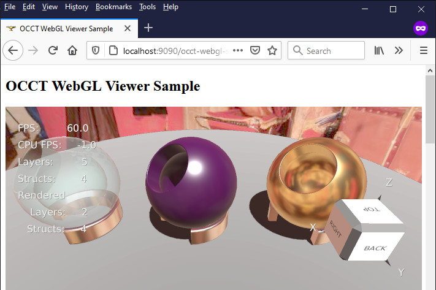
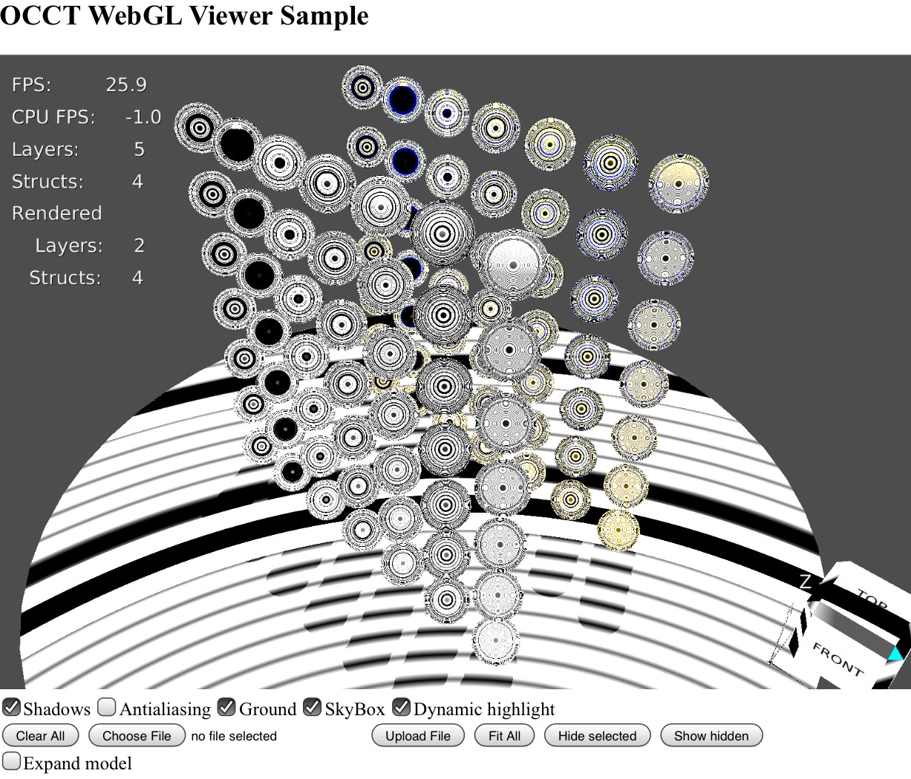
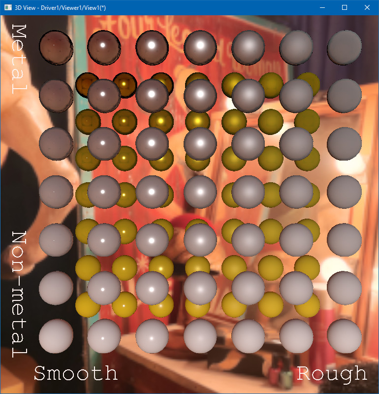
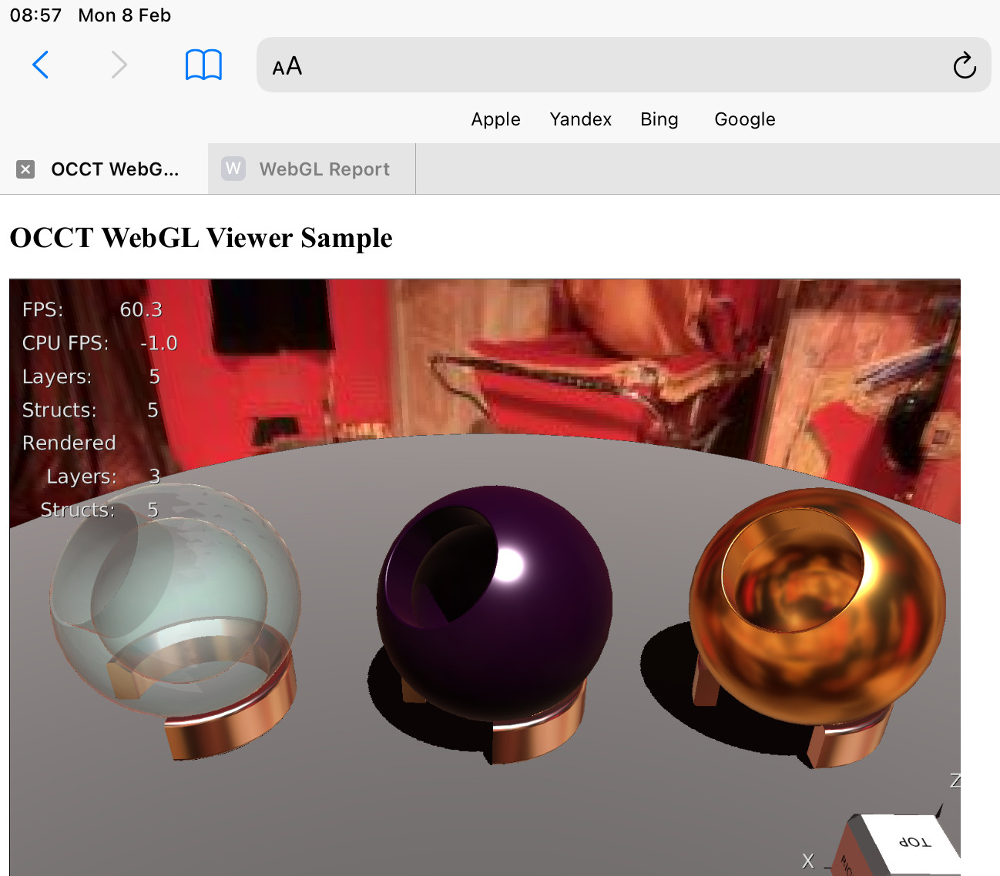

*OCCT 7.5.0* [has introduced](https://unlimited3d.wordpress.com/2020/07/18/pbr-in-occt-3d-viewer/) *PBR*
(physically-based rendering) metal-roughness material workflow in it's real-time rendering engine.
This feature brings more realistic rendering of metal materials and, which might be even more important,
an industry-adopted material definition supported by many 3D applications (thanks to [glTF 2.0](https://www.khronos.org/gltf/) aka *"JPEG for 3D"* wide adoption).

<!--break-->

|  |
|:--:|
| &nbsp; |

*PBR* is considerably much more [computationally intensive](https://dev.opencascade.org/doc/overview/html/specification__pbr_math.html)
compared to old simplified approximations like *Phong*/*Gouraud shading* models, and involves a lot of optimization tricks to bring *PBR* to real-time.
At the moment of development of *PBR* in *OCCT*, [OpenGL 3.0](https://en.wikipedia.org/wiki/OpenGL#OpenGL_3.0) (released in *'2008*)
with it's mobile counterpart [OpenGL ES 3.0](https://en.wikipedia.org/wiki/OpenGL_ES#OpenGL_ES_3.0_2) (specs released *'2012*)
was considered a good baseline covering the majority of modern devices for *PBR* implementation. But what about *WebGL*?

*Google Play* statistics for [CAD Assistant](https://www.opencascade.com/content/cad-assistant) collected in *2020*
revealed *less than 3%* of [OpenGL ES 2.0 users](https://unlimited3d.wordpress.com/2020/01/08/srgb-color-space-in-opengl/).
Even if it is possible to run *PBR* using only *OpenGL ES 2.0* features, it is quite realistic to assume that such old hardware will suffer from a too low framerate.

However, testing of an *OCCT WebGL sample* in various web browsers revealed a deviation in this assumption.
As of *2021*, one major browser, Safari, still does not support [WebGL 2.0](https://en.wikipedia.org/wiki/WebGL) ('2017), a functional counterpart of *OpenGL ES 3.0*.
This browser is kind of *stuck in 2011*, when *WebGL 1.0* based on *OpenGL ES 2.08 was released.

Graphics hardware of modern *Apple* devices, including mobile GPUs, should be fast enough for *PBR* support, but *WebGL 1.0* prevents unleashing these hardware capabilities.
And while macOS users are able to install alternatives like *Mozilla Firefox* or *Google Chrome*, *iOS* users are out of luck, as other browsers running on *iOS*
are nothing but a [skin to the same WebKi](https://apple.stackexchange.com/questions/350671/does-safari-and-google-chrome-for-macos-use-the-same-rendering-engine) built-in into OS.
This decision was made by other browser vendors because *AppStore* rules restrict shipment of alternative web-engines to *iOS* platform.

As a matter of fact, *Safari* provides experimental *WebGL 2.0* support for a while.
In practice, however, this implementation is still incomplete, although progress looks promising - according to some publications,
an experimental *WebGL 2.0* is [almost working in iOS 14](https://forum.babylonjs.com/t/ipad-safari-with-enabled-webgl-2-0-does-not-work-with-babylon/14555) compared to earlier iOS versions,
and indeed, I was able to run *OCCT WebGL sample* with *PBR* turned on with several manual workaround applied to the code generated by *Emscripten* like this:

```diff
 function _glUniform4fv(location, count, value) {
   GL.validateGLObjectID(GL.uniforms, location, 'glUniform4fv', 'location');
   if (GL.currentContext.version >= 2) {
      // WebGL 2 provides new garbage-free entry points to call to WebGL.
      // Use those always when possible.
-     GLctx.uniform4fv(GL.uniforms[location], HEAPF32, value>>2, count*4);
-     return;
+     //GLctx.uniform4fv(GL.uniforms[location], HEAPF32, value>>2, count*4);
+     //return;
   }
...
```

Apparently, *WebGL 2.0* provides optimized routines handy for passing *Emscripten*-managed memory blocks (allocated in C++ heap), which *WebKit* doesn't implement.
This is likely not an issue for *JavaScript*-only 3D engines, but kind of a bad fortune for *WebAssembly*.

But as *WebGL 2.0* remains an experimental feature in *Safari*, this option could be considered only for experienced users, and a real-world web application would better not rely on it.
At the same time, using *Phong shading* doesn't look as a reliable fallback due to the dramatic difference in visual look
and necessity to customize materials for both workflows at once as automatic material conversion gives far from perfect results.

## Challenge: OCCT PBR in WebGL 1.0

As a result, a mini-challenge was established: to run *OCCT PBR* on an *iPad device* in *Safari* browser!
Actually, browsers/devices supporting a bare *WebGL 1.0* context without extensions could be barely found nowadays, so that the goal was set on running *PBR* on *WebGL 1.0* + widely adopted extensions.
Let's take a look at the list of *WebGL 1.0* extensions available on *iPad '2020* device ([Apple A12 Bionic](https://en.wikipedia.org/wiki/Apple_A12)) running on *iOS 14.4* / *Safari* browser:

```
EGLVersion: 1.4 Emscripten EGL
EGLVendor: Emscripten
GLvendor: WebKit
GLdevice: WebKit WebGL
GLunmaskedVendor: Apple Inc.
GLunmaskedDevice: Apple GPU
GLversion: OpenGL ES 2.0 (WebGL 1.0)
GLSL: OpenGL ES GLSL ES 1.00 (WebGL GLSL ES 1.0 (1.0))
Max texture size: 16384
Max FBO dump size: 16384x16384
Max combined texture units: 32
Viewport: 1560x1080
GLextensions: GL_EXT_blend_minmax GL_EXT_sRGB GL_OES_texture_float GL_OES_texture_half_float GL_OES_texture_half_float_linear GL_OES_standard_derivatives GL_EXT_shader_texture_lod GL_EXT_texture_filter_anisotropic GL_OES_vertex_array_object GL_OES_element_index_uint GL_WEBGL_lose_context GL_WEBGL_compressed_texture_astc GL_WEBGL_compressed_texture_etc GL_WEBGL_compressed_texture_etc1 GL_WEBKIT_WEBGL_compressed_texture_pvrtc GL_WEBGL_depth_texture GL_ANGLE_instanced_arrays GL_WEBGL_debug_shaders GL_WEBGL_debug_renderer_info GL_EXT_color_buffer_half_float
```

Debugging a web-application in mobile browser is close to nightmare, so that at first step more options have been elaborated providing *WebGL 1.0* implementation, including:

- Disabling *WebGL 2.0* in *Firefox* (advanced options).
  - Managed by `webgl.enable-webgl2=false` option on `about:config` page.
  - Provides a hardware-accelerated *WebGL 1.0* implementation, which might tolerate some deviations from *WebGL 1.0* specifications on *WebGL 2.0*-capable hardware.
  - Allows using *JavaScript console*.
- Disabling creation of *WebGL 2.0* by *Emscripten*.
  - Use `MAX_WEBGL_VERSION=1` build option.
  - Provides a hardware-accelerated *WebGL 1.0* implementation.
  - Allows using *JavaScript console* (on desktop browsers).
- Disabling hardware acceleration in *Chromium*-based browser settings in addition to `MAX_WEBGL_VERSION=1`.
  - Provides a software-emulated *WebGL 1.0* implementation, which is usually more strict to specifications than hardware-accelerated implementations.
  - Allows using *JavaScript console* (on desktop browsers).
- Building *Draw Harness* on desktop with *OpenGL ES* (*Angle*) option.
  - Provides the same *OpenGL ES* implementation as used by desktop browsers.
  - `vcaps -maxversion 2 0` would ask for an *OpenGL ES 2.0* context.
  - Pretty helpful, but behavior is not exactly the same without an additional *WebGL* layer.
- Running *Safari* browser on *macOS*.
  - Provides a hardware-accelerated *WebGL 1.0* implementation.
  - Behavior on *Apple M1* (*ARM64*) is close to *iPad*, but different!
  - Allows using *JavaScript console*.
- Running *Safari* browser on *iOS*.
  - Provides a hardware-accelerated *WebGL 1.0* implementation.
  - No *JavaScript console*.

A plenty of options give different results (different set of *WebGL* extensions, different errors, different bugs)... but also give more input in the debugging process.
The following issues have been identified on attempt to port existing *OCCT PBR engine* to *WebGL 1.0*:

- Uploading pre-computed PBR lookup table `128x128` from `GL_RG32F` format into `GL_RG16F` texture.
  - Problem *#1*: `GL_RG32F`/`GL_RG16F` texture formats are not supported by *iPad* + *WebGL 1.0*
    (there is no [`GL_EXT_texture_rg`](https://www.khronos.org/registry/OpenGL/extensions/EXT/EXT_texture_rg.txt) extension).
  - Problem *#2*: `GL_RGBA32F` texture format is not filterable on *iPad* + *WebGL 1.0*.<br>
    *iPad* has no [`GL_OES_texture_float_linear`](https://www.khronos.org/registry/OpenGL/extensions/OES/OES_texture_float_linear.txt) extension,
    though non-filterable floating textures are supported via [`GL_OES_texture_float`](https://www.khronos.org/registry/OpenGL/extensions/OES/OES_texture_float.txt).<br>
    However, *iPad* supports [`GL_OES_texture_half_float_linear`](https://www.khronos.org/registry/OpenGL/extensions/OES/OES_texture_float_linear.txt), so half-float textures are filterable.
  - Problem *#3*: `GL_RGBA16F` texture format can be uploaded from float data within *OpenGL ES 3.0* / *WebGL 2.0*,
    but *WebGL 1.0* + [`GL_OES_texture_half_float`](https://www.khronos.org/registry/OpenGL/extensions/OES/OES_texture_float.txt) disallows that.
- Baking *Specular PBR map* into `9x1` `GL_RGBA32F` texture.
  - Problem: `GL_RGBA32F` is not a renderable texture format on *iPad* + *WebGL 1.0*.<br>
    *iPad* does not support [`WEBGL_color_buffer_float`](https://www.khronos.org/registry/webgl/extensions/WEBGL_color_buffer_float/) extension.
- Baking *Diffuse PBR map* into mipmap levels of `512x512x6` `GL_RGBA8` cubemap texture.
  - Problem: *iPad* + *WebGL 1.0* disallows rendering into non-zero mipmap level
    (there is no [`GL_OES_fbo_render_mipmap`](https://www.khronos.org/registry/OpenGL/extensions/OES/OES_fbo_render_mipmap.txt) extension).
- *PBR GLSL programs* rely on manual mipmap level selection for handling a roughness material parameter.
  - Problem: `textureCubeLod()` is unavailable in `GLSL 100 es`,
    but available with [`GL_EXT_shader_texture_lod`](https://www.khronos.org/registry/OpenGL/extensions/EXT/EXT_shader_texture_lod.txt) extension on *iPad* + *WebGL 1.0*.
- *PBR GLSL programs* contain large for-loop blocks, if statements and modulus `% operator`.
  - Problem *#1*: modulus `% operator` is unavailable in `GLSL 100 es`, although it could be replaced by `mod()` function.
  - Problem *#2*: *constant arrays* cannot be initialized in `GLSL 100 es`.
  - Problem *#3*: `GLSL 100 es` disallows *non-constant index expressions*.
- *sRGB* render buffer and an environment cubemap texture.
  - Problem *#1*: [`GL_EXT_sRGB`](https://www.khronos.org/registry/OpenGL/extensions/EXT/EXT_sRGB.txt) is exposed by *iPad* + *WebGL 1.0*,
    but has different semantics and disallows generation of mipmaps via `glGenerateMipmap()`.
  - Problem *#2*: generation of mipmap levels is *enormously slow* for sRGB textures within *WebGL 2.0* (*5 seconds!*).

## Finding solutions

Non-filterable texture format is one of the nastiest bugs, as OpenGL gives completely no feedback on such kind of issues.
No GL errors, no WebGL warnings - everything looks clear, apart from broken rendering results (practically, such texture returns all zeros in GLSL program),
and it takes some time to realize where the problem comes from.

To handle uploading of `GL_RGBA16F` textures within* WebGL 1.0* + [`GL_OES_texture_half_float`](https://www.khronos.org/registry/OpenGL/extensions/OES/OES_texture_float.txt)
required implementing a software conversion of *32-bit float* values into *16-bit float*,
as there is no built-in *16-bit floating point* type in C/C++ - a nasty code which *OpenGL 3.0* and *OpenGL ES 3.0* allows to avoid.
A funny effect has been observed in a temporary code uploading `GL_RGBA32F` data into `GL_RGBA16F` texture (e.g. *32-bit floats* interpreted as *16-bit floats*):

|  |
|:--:|
| *16-bit float lookup PBR texture uploaded with incorrectly reinterpreted 32-bit float data.* |

Non-renderable `GL_RGBA32F` is a big issue in implementation, as smaller precision wouldn't be enough for this map.
Luckily, the *PBR Specular map* is just `9x1` in size - a texture of such small size could be even computed on the CPU side,
if this wouldn't require implementing texture-filtering from a cubemap texture...
Instead, a more nasty approach has been implemented: floating point values have been rendered packed into a temporary `9x3` `GL_RGBA8` texture,
then read back using `glReadPixels()`, unpacked and then uploaded into `GL_RGBA32F` texture.

Filling mipmap levels of *PBR Diffuse cubemap* was another pain, but the workaround was relatively simple - rendering into temporary texture
and then copying result into destination mipmap level using `glCopyTexImage2D()`.
Actually, a zero mipmap-level of the same texture was used as a temporary render target - cannot say if rendering into
one mipmap level and copying results into another mipmap level of the same texture involves any undefined behavior, but it works and doesn’t generate any warnings / errors.

Without `textureCubeLod()` it is practically impossible implementing a valid PBR behavior,
but luckily, all tested *WebGL 1.0* implementations supported [`GL_EXT_shader_texture_lod`](https://www.khronos.org/registry/OpenGL/extensions/EXT/EXT_shader_texture_lod.txt) extension,
which can be enabled like this in *GLSL header*:

```glsl
#extension GL_EXT_shader_texture_lod : enable
#define textureCubeLod textureCubeLodEXT
```

Here is an example how PBR will look alike if `textureCubeLod()` will be simply replaced by `textureCube()`, e.g. with automatic mipmap level selection:

| <span> </span> |
|:--:|
| *PBR using textureCubeLod (top) and textureCube (bottom).* |

`GLSL 100 es` syntax limitations put into frustration of "coping with the past".
And if modulus `% operator` can be replaced with `mod()` relatively easily, other limitations are much more painful to overcome. In particular:

- It is impossible initializing constant arrays like:
  ```
  > const float aSHBasisFuncCoeffs[9] = float[9] { 0.0, 1.0, 2.0, ... };
  ```
  - As a workaround, such arrays could be declared as uniforms and uploaded from the CPU side - which is kind of not equivalent to a constant array, but could be close enough.
- Non-constant number of iterations is disallowed within for-loop.<br>
  PBR baking program using several constants managing a number of sample to be used for computations:
  ```
  > uniform int uSamplesNum;
  > for (int aSampleIter = 0; aSampleIter < uSamplesNum; ++aSampleIter) {}
  ```
  - More samples improve quality but take more time, so that baking process makes these parameters configurable and moreover dynamically reduces the number of samples for mipmap levels,
    where visual difference will not be noticeable.<br>
    `GLSL 100 es` limitation breaks this logic - a uniform should be replaced by a compile-time constant.
- Non-constant index expressions are disallowed.<br>
  PBR baking GLSL programs relies on a code like this:
  ```
  > int anIndex = int(gl_FragCoord.x);
  > float aCoef = aSHCosCoeffs[anId] * aSHBasisFuncCoeffs[anId];
  ```
  - `GLSL 100 es` limitation pushes such code to be ugly-refactored to `if`/`else` statements making practically the same thing with more lines.
    ```
    >  if      (anId == 0) { aCoef = aSHCosCoeffs[0] * aSHBasisFuncCoeffs[0]; }
    >  else if (anId == 1) { aCoef = aSHCosCoeffs[1] * aSHBasisFuncCoeffs[1]; }
    >  else if (anId == 2) { aCoef = aSHCosCoeffs[2] * aSHBasisFuncCoeffs[2]; }
    ```

Some `GLSL 100 es` restrictions are reminders of hardware of a past, when *OpenGL shading language* was just introduced.
Graphics hardware of that time didn't supported efficient branching, and while *GLSL* syntax allowed to use loops and `if`-`else` statements,
these have to be *trivially unrollable* - as GPU always computed all branches in the code and just "mixed" values from different branches into result afterwards.

## sRGB textures

[sRGB-aware rendering](../2020-01-08-srgb-color-space-in-opengl/) is quite important for producing consistent image results.
Unfortunately, a severe issue has been observed on using sRGB textures:
*WebGL 1.0* + [`GL_EXT_sRGB`](https://www.khronos.org/registry/OpenGL/extensions/EXT/EXT_sRGB.txt) disallows generation of mipmap levels,
making it practically useless, as generation of mipmap levels in software will be too slow and they are necessary not only for better image quality,
but actually for implementing some features like baking a PBR environment.

But even within WebGL 2.0, where mipmap levels generation is supported for sRGB textures, this support looks quite dubious.
Generation of mipmap levels for `2048x2048x6` cubemap texture takes almost *5 seconds* on a fast desktop computer!
Such behavior is obviously not a GPU performance issue, as it is not observed while running the same code within a non-web *OpenGL* / *OpenGL ES* application.

I haven't been able to find exact references to this issue, but it looks like *WebGL* fallbacks to
software implementation for mipmap level generation in this case to ensure sRGB conversion is done strictly following specifications (with proper colorspace conversions).
So far, no simple workaround is available to the issue - the most optimal solution would be probably avoiding sRGB texture format for environment cubemap.

As a result of the efforts, it was finally possible to see *OCCT 3D Viewer* rendering PBR materials on *iPad* using *WebGL 1.0 context*.
Device used for testing is relatively new one (*iPad '2020*, based on *Apple A12 SoC* announced in *2018*), but hopefully older devices will be able to run the DEMO too.

|  |
|:--:|
| *OCCT WebGL sample demonstrating PBR materials on iPad.* |

## Conclusions and afterwords

Sluggishness in development of web standards related to 3D rendering and of some web engines vendors in particular,
slows down development of modern web-applications looking and working comparable to native desktop applications.
The efforts put into compatibility with such relics like *WebGL 1.0* (released in *2011) look like an unfair burden on application developers.
More than *8 years* have passed since *OpenGL ES 3.0* release, but here in *2021*, there are still web browsers not supporting this bare minimum for desktop/mobile 3D applications.

In this context, the drowning of obsolete web engines like *Internet Explorer*
and [Microsoft Edge Legacy](https://techcommunity.microsoft.com/t5/microsoft-365-blog/new-microsoft-edge-to-replace-microsoft-edge-legacy-with-april-s/ba-p/2114224)
(non-Chromium based) feels like a fresh air to a web-developer, although a diminishingly small number of competing full-scale web-engines
(*Mozilla Firefox*, *Chromium*, *Safari*/*WebKit*) raises severe concerns in a future of users and application developers freedoms if only one browser will dominate over the web.

*Apple*'s strategy on controlling the *iOS ecosystem* and [preventing competing engines](https://developer.apple.com/app-store/review/guidelines/#software-requirements) to be presented there,
leaves users with no choice but to live with outdated "[*think different*](https://en.wikipedia.org/wiki/Think_different)" technologies.
The progress in long-standing [experimental WebGL 2.0](https://trac.webkit.org/wiki/AngleforWebGL) support in *WebKit*
gives some hope that this particular brick will be finally broken soon, although when exactly remains unclear.

## Live DEMO

The [live demonstration](https://draw.sview.ru/webgl-webgl1-pbr-spheres) can be found within *Open CASCADE Technology examples*.

## Update from 2021-11-10

*Finally, Safari 15 on iOS 15 (released in September 20, 2021) introduced WebGL 2.0 support!*
*WebGL 1.0 is officially dead. Long live the WebGL 2.0!*
