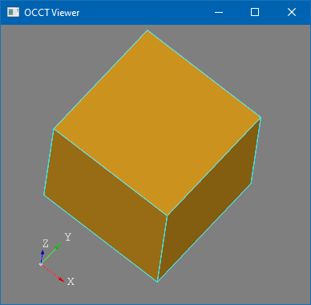

3D Viewer is an integral part of *Open CASCADE Technology* framework.
There are plenty of graphic engines around, but built-in *OCCT 3D Viewer* remains a natural choice for *OCCT*-based applications
providing straight-forward to use presentations for *B-Rep* geometry and interactive functionality essential for CAD-alike applications.
But naturally *OCCT Viewer* usage is not limited to CAD.

This article is devoted to the very beginning - 3D viewer setup, or *"Hello World"* from *OCCT 3D Viewer*.
It is, however, expected that the developer is already familiar with basic OCCT - *handles* (smart-pointers), shapes, development environment, etc.

<!--break-->

## API Layers

OCCT 3D Viewer design could be split into several layers:

- **High-level**<br>
  *Application Interactive Services* (`AIS`) and standard presentations - `TKV3d`;
- **Middle-leve**<br>
  Platform-independent primitive arrays and graphical structures independent - `TKService`;
- **Low-level**<br>
  Classes and structures relying on a specific graphic library (*OpenGL*, *OpenGL ES*, etc.) - `TKOpenGl`.

*High-level API* allows creation of standard presentations with minimal knowledge in graphics.
*OCCT* already provides read-to-use objects displaying Shapes (`AIS_Shape`), Dimensions and Relations (`PrsDim_Dimension`), Text Labels (`AIS_TextLabel`),
Video Playback (`AIS_MediaPlayer`), various auxiliary objects (`AIS_Manipulator`, `AIS_RubberBand`) and many others - a pretty good starting point for development of application.

*And when it comes to extensions, Open Cascade provides also a set of commercial modules implementing AIS interface - including PMI Visualization*
*(displaying various PMI properties in STEP file), Point Cloud renderer (large point sets), Volume Renderer (CT and MRT scans).*

A custom subclass of `AIS_InteractiveObject` (middle-level) can be used for displaying specific data structures, auxiliary presentations and manipulator objects.
Knowledge of low-level graphic libraries wouldn't be required here, but could be helpful for faster learning of *OCCT* interfaces and for performance optimizations.

The lowest level in API relies on a graphic library performing an actual rendering.
Higher layers of abstraction allow to avoid writing this low-level code at an application side.
Advanced applications may benefit from using *OpenGL API* directly to implement some special features or to integrate existing renderer into *OCCT 3D Viewer*.

Integration of one renderer into another - like *QtQuick* and *OCCT* - is not that trivial, even when both use the same graphics library,
and requires some knowledge about graphics API and its usage by both engines.

## Graphic driver

*OCCT Viewer* setup starts from *Graphics Driver* initialization.
All low-level details are hidden by `Graphic3d_GraphicDriver` abstraction layer, so that application just needs choosing driver implementation:

```cpp
Handle(Aspect_DisplayConnection) aDisplay =
  new Aspect_DisplayConnection();
Handle(OpenGl_GraphicDriver) aGlDriver =
  new OpenGl_GraphicDriver (aDisplay);
aGlDriver->ChangeOptions().swapInterval = 1;
Handle(Graphic3d_GraphicDriver) aDriver = aGlDriver;
```

`OpenGl_GraphicDriver` from `TKOpenGl` library is the main implementation of this interface in OCCT.
As can be deduced from it's name, this driver relies on [OpenGL](https://en.wikipedia.org/wiki/OpenGL) - the mature graphic API available on almost every modern platform.
A dedicated chapter at the end of the articles elaborate more details of various graphic APIs.

## Windowing system

To show 3D Viewer content on the screen it is necessary creating a window implementing `Aspect_Window` interface.

```cpp
Handle(Aspect_DisplayConnection) aDisplay =
  new Aspect_DisplayConnection();
Handle(Aspect_Window) aWindow =
  new Xw_Window (aDisplay, "Window Title",
                 0, 0, 512, 512);
```

As in case of `Graphic3d_GraphicDriver`, OCCT provides a list of standard implementations:

- `Xw_Window`<br>
  for [Xlib](https://en.wikipedia.org/wiki/Xlib) window (*Linux*, *Unix*);
- `WNT_Window`<br>
  for [WinAPI](https://en.wikipedia.org/wiki/Windows_API)/Win32 window (*Windows*);
- `Cocoa_Window`<br>
  for an AppKit/[Cocoa](https://en.wikipedia.org/wiki/Cocoa_\(API\)) (*macOS*) and [UIKit](https://en.wikipedia.org/wiki/UIKit) (*iOS*) window;
- `Aspect_NeutralWindow`<br>
  for another window (like *Android*).

`Aspect_Window` exposes only a minimal interface for creation of an (*OpenGL*) window.
It doesn't cover all aspects of a windowing system like a message loop, and a plenty of platform-dependent code has to be written at application level to actually process window events.

This simplification has its rationale, though - as *OCCT* doesn't implement a rich set of widgets for drawing a complex user interface,
some other GUI toolkit is expected to be used for this purpose anyway - *Qt*, *Gtk*, *MFC*, *WinForms*, *WPF* and so on.

You can find plenty of samples coming with OCCT demonstrating 3D Viewer integration into various GUI frameworks.
`samples/glfw` based on [GLFW](https://en.wikipedia.org/wiki/GLFW) library is probably the most compact cross-platform (*Linux*, *Windows*, *macOS*) sample demonstrating *OCCT 3D Viewer*.

## Viewer and Views

*OCCT* defines two basic classes for the viewer management - `V3d_Viewer` and `V3d_View`.

```cpp
Handle(Graphic3d_GraphicDriver) theDriver;
Handle(V3d_Viewer) aViewer =
  new V3d_Viewer (theDriver);

Handle(V3d_View) aView = new V3d_View (aViewer);
aView->SetImmediateUpdate (false);
aView->SetShadingModel (Graphic3d_TOSM_FRAGMENT);
Handle(Aspect_Window) theWindow;
aView->SetWindow (theWindow);

aView->SetBackgroundColor (Quantity_NOC_GRAY50);
aView->Camera()->SetProjectionType (Graphic3d_Camera::Projection_Orthographic);
aView->TriedronDisplay();
```

A bare `V3d_View` wouldn't show something useful on the screen, though you may set up a view background - a solid color, a gradient, a 2D image or a cubemap.
`V3d_Viewer` is associated with a graphic driver, while `V3d_View` is associated with a single window.
Multiple windows (`V3d_View`) may share the same `V3d_Viewer` instance, in which case all views will show the same list of presentations defined by `V3d_Viewer` at different view angles.

*It might be interesting to note that older OCCT defined separate classes for 2D and 3D viewers like `V2d_Viewer` and `V3d_Viewer`.*
*Hierarchy of 2D classes has been completely removed from OCCT at some point in favor of 3D classes.*
*So that applications drawing 2D objects should use 3D classes for that purpose.*

`Graphic3d_Camera` class holding the camera definition of a *View* can be accessed through `V3d_View::Camera()` property.
Camera supports two different projections - [orthographic](https://en.wikipedia.org/wiki/Orthographic_projection) (used for measurement) and *perspective* (more realistic),
as well as special cases for rendering a *stereoscopic* pair.
Application may manipulate `Graphic3d_Camera` properties directly, rely on auxiliary `V3d_View` methods (`FitAll()`, `Rotation()`, `Panning()`, `Zoom()` and similar)
or use an auxiliary object `AIS_ViewController` translating various user input events (mouse, touchscreen, keyboard) into camera movements.

`Graphic3d_RenderingParams`, accessible through `V3d_View::ChangeRenderingParams()`, is another useful structure defining a set of rendering parameters.
The list also includes [antialiasing](https://en.wikipedia.org/wiki/Aliasing) configuration and pixel density resolution for text / line rendering.

## Interactive objects

`AIS_InteractiveObject` is a root interface defining an abstract interactive object in *OCCT 3D Viewer*.
This class inherits two base classes at once - `PrsMgr_PresentableObject` and `SelectMgr_SelectableObject`,
indicating that an *Interactive Object* can be displayed (defines presentation) and picked (defines selection sensitivities).

Selection mechanism in *OCCT 3D Viewer* is completely detached from *Presentation* and a *Graphic Driver*, which can be seen from this hierarchy,
although practically speaking, an application always works with `AIS_InteractiveObject` implementing both interfaces.

`AIS_InteractiveContext` is the root class managing the list of presentations, object's visibility and selection states, as well as picking routines and highlighting.
*Interactive Context* is bound to the `V3d_Viewer` instance.

```cpp
Handle(V3d_Viewer) theViewer;
Handle(AIS_InteractiveContext) aContext =
  new AIS_InteractiveContext (theViewer);

TopoDS_Shape aShape =
  BRepPrimAPI_MakeBox (100, 100, 100).Solid();
Handle(AIS_InteractiveObject) aShapePrs =
  new AIS_Shape (aShape);
aContext->Display (aShapePrs, AIS_Shaded, 0, true);
```

If you'll try running the code, at this point you may find objects drawn completely black!
This is because our viewer setup misses light sources. The simplest way to solve the issue is calling `V3d_Viewer::SetDefaultLights()`,
which would add default ambient and directional light sources into the scene:

```cpp
Handle(V3d_Viewer) theViewer;
theViewer->SetDefaultLights();
theViewer->SetLightOn();
```

This method is handful for a fast start, and "default" light sources might look fine for a usual CAD viewer.
But later on it would be useful revisiting this place, and realistic [PBR lighting](../2020-07-18-pbr-in-occt-3d-viewer/)
will certainly require a more thoughtful setup of `Graphic3d_CLight` (light sources) and `V3d_View::SetBackgroundCubeMap()` (*image-based environment lighting*).

## Viewer redraws

For a new application developer, it might be unclear when 3D viewer content should be presented onto the screen (redrawn).
*Immediate updates* is the most trivial approach, redrawing the viewer on ***every*** single change - like adding a new object,
changing camera position, setting up view background and so on.
Historically *OCCT* encouraged following this approach in it's API - as the most simple way to ensure that viewer content is up-to-date.

Unthoughtful redundant redraws reveal not only undesired transient details, but may cause severe performance issues - like
redrawing a View after displaying each object of thousands new objects in a loop.
For this reason, immediate and implicit *Viewer* updates are discouraged to be used in application design - an application developer
should thoughtfully separate Viewer content modifications from Viewer redraws.

`AIS_ViewController` not only helps in mapping user input events to camera manipulations, but also suggests a workflow,
where viewer is redrawn only once - within `AIS_ViewController::HandleViewEvents()` call.
This approach ensures consistency of the *Viewer* content and that all accumulated events (user input, camera manipulations, animations) are handled before *Viewer* redraw.
[`AIS_ViewController`](../2019-11-06-ais_viewcontroller-in-occt-7-4-0/) usage probably worths a dedicated article.

## Complete code sample

Here is a [final sample](https://github.com/gkv311/occt-hello/tree/master/occt-ais-hello) for *Windows* platform composed from code pieces through the article and amended by *WinAPI* usage details.
The sample is not intended to be used for writing an application from scratch, but can be useful in understanding the very first steps in *OCCT 3D Viewer* setup
shared between all other available samples (*Qt*, *MFC*, *GLFW*, *WinForms*) without a burden of sample functionality.

|  |
|:--:|
| &nbsp; |

```cpp
#include <windows.h>

#include <AIS_InteractiveContext.hxx>
#include <AIS_Shape.hxx>
#include <AIS_ViewController.hxx>
#include <BRepPrimAPI_MakeBox.hxx>
#include <OpenGl_GraphicDriver.hxx>
#include <V3d_View.hxx>
#include <V3d_Viewer.hxx>

#include <WNT_WClass.hxx>
#include <WNT_Window.hxx>

#pragma comment(lib, "TKOpenGl.lib")
#pragma comment(lib, "TKV3d.lib")
#pragma comment(lib, "TKPrim.lib")
#pragma comment(lib, "TKTopAlgo.lib")
#pragma comment(lib, "TKBRep.lib")
#pragma comment(lib, "TKService.lib")
#pragma comment(lib, "TKMath.lib")
#pragma comment(lib, "TKernel.lib")

//! Sample single-window viewer class.
class MyViewer : public AIS_ViewController
{
public:
  //! Main constructor.
  MyViewer()
  {
    // graphic driver setup
    Handle(Aspect_DisplayConnection) aDisplay = new Aspect_DisplayConnection();
    Handle(Graphic3d_GraphicDriver) aDriver = new OpenGl_GraphicDriver (aDisplay);

    // viewer setup
    Handle(V3d_Viewer) aViewer = new V3d_Viewer (aDriver);
    aViewer->SetDefaultLights();
    aViewer->SetLightOn();

    // view setup
    myView = new V3d_View (aViewer);
    const TCollection_AsciiString aClassName ("MyWinClass");
    Handle(WNT_WClass) aWinClass =
      new WNT_WClass (aClassName.ToCString(), &windowProcWrapper, 0);
    Handle(WNT_Window) aWindow = new WNT_Window ("OCCT Viewer", aWinClass,
                                                 WS_OVERLAPPEDWINDOW,
                                                  100, 100, 512, 512, Quantity_NOC_BLACK);
    ::SetWindowLongPtrW ((HWND )aWindow->NativeHandle(), GWLP_USERDATA, (LONG_PTR )this);
    myView->SetImmediateUpdate (false);
    myView->SetShadingModel (Graphic3d_TOSM_FRAGMENT);
    myView->SetWindow (aWindow);
    myView->SetBackgroundColor (Quantity_NOC_GRAY50);
    myView->Camera()->SetProjectionType (Graphic3d_Camera::Projection_Orthographic);
    myView->TriedronDisplay (Aspect_TOTP_LEFT_LOWER, Quantity_NOC_WHITE, 0.1);
    myView->ChangeRenderingParams().RenderResolutionScale = 2.0f;

    // interactive context and demo scene
    myContext = new AIS_InteractiveContext (aViewer);

    TopoDS_Shape aShape = BRepPrimAPI_MakeBox (100, 100, 100).Solid();
    Handle(AIS_InteractiveObject) aShapePrs = new AIS_Shape (aShape);
    myContext->Display (aShapePrs, AIS_Shaded, 0, false);
    myView->FitAll (0.01, false);

    aWindow->Map();
    myView->Redraw();
  }

private:
  //! Window message handler.
  static LRESULT WINAPI windowProcWrapper (HWND theWnd, UINT theMsg,
                                           WPARAM theParamW, LPARAM theParamL)
  {
    MyViewer* aThis = (MyViewer* )::GetWindowLongPtrW (theWnd, GWLP_USERDATA);
    return aThis != NULL
         ? aThis->windowProc(theWnd, theMsg, theParamW, theParamL)
         : ::DefWindowProcW (theWnd, theMsg, theParamW, theParamL);
  }

  //! Window message handler.
  LRESULT WINAPI windowProc (HWND theWnd, UINT theMsg,
                             WPARAM theParamW, LPARAM theParamL)
  {
    switch (theMsg)
    {
      case WM_CLOSE:
      {
        exit (0);
        return 0;
      }
      case WM_PAINT:
      {
        PAINTSTRUCT aPaint;
        ::BeginPaint(theWnd, &aPaint);
        ::EndPaint  (theWnd, &aPaint);
        myView->Redraw();
        break;
      }
      case WM_SIZE:
      {
        myView->MustBeResized();
        AIS_ViewController::FlushViewEvents (myContext, myView, true);
        break;
      }
      case WM_LBUTTONUP:
      case WM_MBUTTONUP:
      case WM_RBUTTONUP:
      case WM_LBUTTONDOWN:
      case WM_MBUTTONDOWN:
      case WM_RBUTTONDOWN:
      {
        const Graphic3d_Vec2i aPos (LOWORD(theParamL), HIWORD(theParamL));
        const Aspect_VKeyFlags aFlags = WNT_Window::MouseKeyFlagsFromEvent (theParamW);
        Aspect_VKeyMouse aButton = Aspect_VKeyMouse_NONE;
        switch (theMsg)
        {
          case WM_LBUTTONUP:
          case WM_LBUTTONDOWN:
            aButton = Aspect_VKeyMouse_LeftButton;
            break;
          case WM_MBUTTONUP:
          case WM_MBUTTONDOWN:
            aButton = Aspect_VKeyMouse_MiddleButton;
            break;
          case WM_RBUTTONUP:
          case WM_RBUTTONDOWN:
            aButton = Aspect_VKeyMouse_RightButton;
            break;
        }
        if (theMsg == WM_LBUTTONDOWN
         || theMsg == WM_MBUTTONDOWN
         || theMsg == WM_RBUTTONDOWN)
        {
          ::SetFocus  (theWnd);
          ::SetCapture(theWnd);
          AIS_ViewController::PressMouseButton (aPos, aButton, aFlags, false);
        }
        else
        {
          ::ReleaseCapture();
          AIS_ViewController::ReleaseMouseButton (aPos, aButton, aFlags, false);
        }
        AIS_ViewController::FlushViewEvents (myContext, myView, true);
        break;
      }
      case WM_MOUSEMOVE:
      {
        Graphic3d_Vec2i aPos (LOWORD(theParamL), HIWORD(theParamL));
        Aspect_VKeyMouse aButtons = WNT_Window::MouseButtonsFromEvent (theParamW);
        Aspect_VKeyFlags aFlags   = WNT_Window::MouseKeyFlagsFromEvent(theParamW);
        CURSORINFO aCursor;
        aCursor.cbSize = sizeof(aCursor);
        if (::GetCursorInfo (&aCursor) != FALSE)
        {
          POINT aCursorPnt = { aCursor.ptScreenPos.x, aCursor.ptScreenPos.y };
          if (::ScreenToClient (theWnd, &aCursorPnt))
          {
            aPos.SetValues (aCursorPnt.x, aCursorPnt.y);
            aButtons = WNT_Window::MouseButtonsAsync();
            aFlags   = WNT_Window::MouseKeyFlagsAsync();
          }
        }

        AIS_ViewController::UpdateMousePosition (aPos, aButtons, aFlags, false);
        AIS_ViewController::FlushViewEvents (myContext, myView, true);
        break;
      }
      case WM_MOUSEWHEEL:
      {
        const int aDelta = GET_WHEEL_DELTA_WPARAM (theParamW);
        const double aDeltaF = double(aDelta) / double(WHEEL_DELTA);
        const Aspect_VKeyFlags aFlags = WNT_Window::MouseKeyFlagsFromEvent (theParamW);
        Graphic3d_Vec2i aPos (int(short(LOWORD(theParamL))),
                              int(short(HIWORD(theParamL))));
        POINT aCursorPnt = { aPos.x(), aPos.y() };
        if (::ScreenToClient (theWnd, &aCursorPnt))
        {
          aPos.SetValues (aCursorPnt.x, aCursorPnt.y);
        }

        AIS_ViewController::UpdateMouseScroll (Aspect_ScrollDelta (aPos, aDeltaF,
                                                                   aFlags));
        AIS_ViewController::FlushViewEvents (myContext, myView, true);
        break;
      }
      default:
      {
        return ::DefWindowProcW (theWnd, theMsg, theParamW, theParamL);
      }
    }
    return 0;
  }

private:
  Handle(AIS_InteractiveContext) myContext;
  Handle(V3d_View) myView;
};

int main()
{
  MyViewer aViewer;
  for (;;) // message loop
  {
    MSG aMsg = {};
    if (GetMessageW (&aMsg, NULL, 0, 0) <= 0)
    {
      return 0;
    }
    TranslateMessage(&aMsg);
    DispatchMessageW(&aMsg);
  }
  return 0;
}
```

*OCCT 7.6.0* introduced auxiliary methods `WNT_Window::ProcessMessage()`, `Xw_Window::ProcessMessage()` and `Wasm_Window::ProcessMessage()`,
which could further diminish native message processing routines to the bare minimum:

```cpp
static LRESULT WINAPI windowProcWrapper (HWND theWnd, UINT theMsg,
                                         WPARAM theParamW, LPARAM theParamL)
{
  MyViewer* aThis = (MyViewer* )::GetWindowLongPtrW (theWnd, GWLP_USERDATA);
  if (aThis != NULL)
  {
    Handle(WNT_Window) aWindow = Handle(WNT_Window)::DownCast (aThis->myView->Window());
    MSG aMsg = { theWnd, theMsg, theParamW, theParamL };
    if (aWindow->ProcessMessage (*aThis, aMsg)) { return 0; }
  }
  if (theMsg == WM_CLOSE) { exit (0); return 0; }
  return ::DefWindowProcW (theWnd, theMsg, theParamW, theParamL);
}
```

## Graphic driver implementations

Currently OCCT provides just one complete driver implementation `OpenGl_GraphicDriver` from `TKOpenGl` library, and one auxiliary `D3DHost_GraphicDriver` from `TKD3DHost` library.
Internally, there are more graphic APIs involved in `TKOpenGl` (listed below) and more graphic drivers can be introduced in future.

### OpenGL (desktop)


[OpenGL](https://en.wikipedia.org/wiki/OpenGL) is the main graphic driver supported by OCCT.
This is an ultimate choice for an open source cross-platform toolkit, bringing *OCCT 3D Viewer* to all major desktop platforms - including *Windows*, *Linux* and *macOS*.
*OpenGL* was originally developed by [SGI](https://en.wikipedia.org/wiki/Silicon_Graphics), but nowadays it is developed
by [Khronos Group](https://en.wikipedia.org/wiki/Khronos_Group) - non-profit consortium focused on development of open standards.

Backwards compatibility, open specifications and wide adoption are keystones of *OpenGL* success.
It is fascinating that *OpenGL 1.1* rendering code, e.g. using the very first version of this library released in *1992* (almost three decades ago),
still can be compiled and run unmodified on the most modern desktop systems!
But, of course, modern applications would vastly benefit from using newer API revisions like *OpenGL 4.6* (released in *2017*), providing the newest features of modern GPUs.

The legacy of first versions of API became its burden at some point.
There was only one API breakage attempt with deprecation of obsolete [FFP](https://en.wikipedia.org/wiki/Transform,_clipping,_and_lighting) functionality
since *OpenGL 3.0* and its removal by so-called *Core Profile* in *OpenGL 3.1* (but *OpenGL 4.6 Compatible Profile* still supports all deprecated features of *OpenGL 1.1*-*2.0*).
Since that, some new APIs like *Vulkan* (initially developed by *Khronos Group* with code name *glNext*) made attempts to supersede *OpenGL* as a key cross-platform graphics API.

*OCCT* relies on **OpenGL 3.2** as a baseline for 3D Viewer functionality, although particular features might require *OpenGL 4.x* or *OpenGL* extensions.
*Fixed-function pipeline* (*FFP*) is still supported by *OCCT* as a fallback rendering path with limited functionality for running on ancient *OpenGL 1.1*.

### OpenGL ES (mobile)


[OpenGL ES](https://en.wikipedia.org/wiki/OpenGL_ES) is a little brother of *OpenGL* focused on *embedded systems* (smartphones first of all).
Original intention of *OpenGL ES* was bringing a functionally-restricted *OpenGL* version to mobile devices - too slow or/and incapable of implementing full-featured *desktop OpenGL* specifications.

Functionally speaking, *OpenGL ES 2.0* is a close friend of *OpenGL 2.1*, and *OpenGL ES 3.0* is a close friend to *OpenGL 3.1*.
With the knowledge of both APIs it is possible to write portable code, reusable across *OpenGL* and *OpenGL ES* implementations, with *OpenGL ES* used as a baseline.
That's what *OCCT* actually does - *OpenGL ES* and *OpenGL* share the same codebase
(hence, the same class `OpenGl_GraphicDriver` and the same library `TKOpenGl`, although in future *OpenGL ES* support can be moved to dedicated library `TKOpenGles`).

*OCCT* relies on **OpenGL ES 3.0** as a baseline for 3D Viewer functionality,
but also supports fallback rendering paths for *OpenGL ES 2.0* (but not *OpenGL ES 1.0*), and optionally uses some features of *OpenGL ES 3.2*.

*OpenGL ES* support brings the *OCCT* viewer to *Android*, *iOS*, *QNX* and other *embedded platforms*.

### WebGL (browsers)


[WebGL 1.0](https://en.wikipedia.org/wiki/WebGL) specifications are based on *OpenGL ES 2.0*, and *WebGL 2.0* is based on *OpenGL ES 3.0*,
which makes the existing *OpenGL ES* graphic driver `OpenGl_GraphicDriver` easily portable to *WebGL*.
As *OCCT* is a C++ framework, it's adoption to the web is done using *Emscripten SDK* implementing *OpenGL ES API* on top of *WebGL*.
Practically, there is only a small piece of code in *OCCT* itself responsible for handling *WebGL* limitations and enabling extensions.

*WebGL* support brings the *OCCT viewer* to browsers like *Mozilla Firefox*, *Google Chrome*, *Microsoft Edge* and *Apple Safari*.

### D3DHost (WPF)


It is easy to figure out from the suspicious name that `D3DHost` is *NOT* a full-featured implementation of `Graphic3d_GraphicDriver` on top of *DirectX*.
Instead, `TKD3DHost` relies on the existing `TKOpenGl` driver and implements a glue layer for embedding an *OpenGL*-based viewer
into a [Direct3D9](https://en.wikipedia.org/wiki/Direct3D)-based application like a *WPF*.

Functionally speaking, this driver provides all capabilities of *OpenGL*-based driver and supports hardware-accelerated rendering
on drivers implementing [`WGL_NV_DX_interop`](https://www.khronos.org/registry/OpenGL/extensions/NV/WGL_NV_DX_interop.txt) extension - which includes *NVIDIA*, *AMD* and *Intel* drivers.

### Vulkan


*OCCT* doesn't yet support this graphics API, although there is some prototyping in progress.
Practically speaking, [Vulkan](https://en.wikipedia.org/wiki/Vulkan_(API)) is supposed to provide a cross-platform portability close to *OpenGL*+*GLES* (*Windows*, *Linux*, *Android*),
but limited to modern platforms and graphics hardware.

*Vulkan* may bring performance benefits on some implementations, allow using more CPU cores for rendering and access some new graphics features (which may be not exposed to *OpenGL* for some reasons).
Some features, however, might become impossible or more involving using a *Vulkan* driver - like custom *GLSL programs*.

Practically speaking, while *Vulkan* sounds like a future of graphics API, in its current state it is not a superior version of *OpenGL*.
The older API provides better compatibility (with old systems first of all) and has a lower level of complexity.
It is expected that *OpenGL* will remain a main graphic driver for the nearest future, while *Vulkan* might be considered by performance-focused applications
(practically speaking *OpenGL* implementations on top of *Vulkan* might supersede native *OpenGL* implementations in GPU drivers).

### Other graphic APIs

There are more graphic APIs like *Microsoft Direct3D* (*9*, *10*, *11*, *12*), *Apple Metal* and many others.
Using these APIs (in addition to *OpenGL*) may bring benefits in some cases, where portability is less important than functionality, performance and robustness.
However, implementing these platform-specific APIs would require considerable efforts, not justified by potential benefits available only to users of a specific platform.
For this reason, *OCCT 3D Viewer* currently doesn’t support these APIs.
