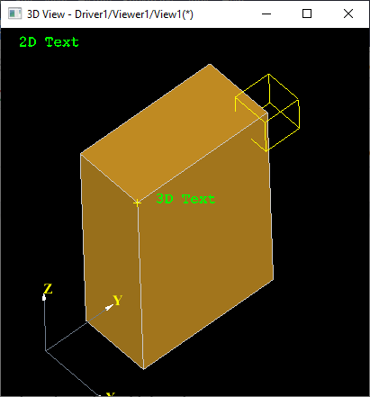
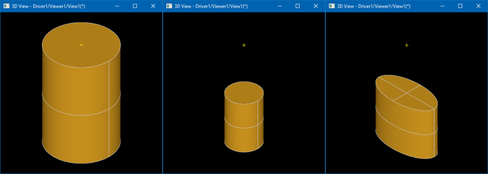
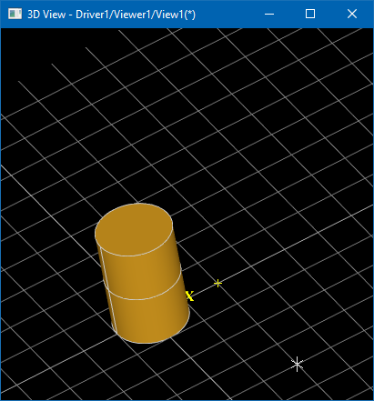
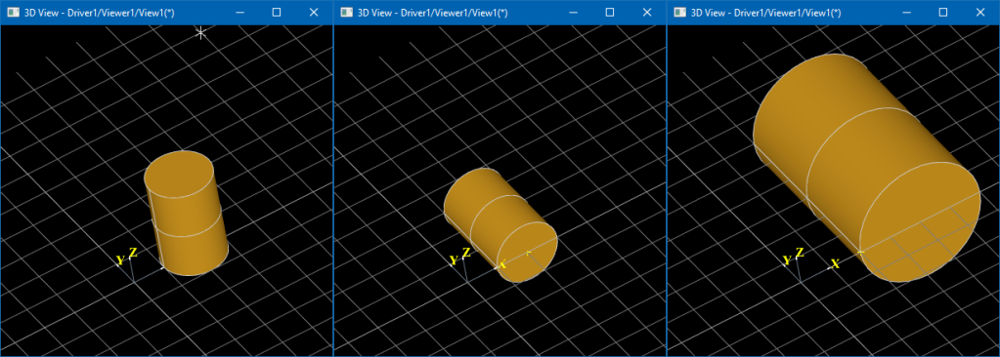
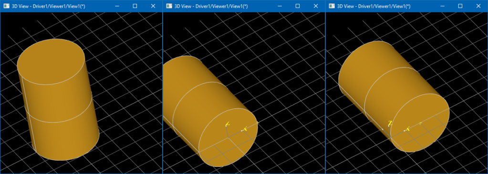

Transformation matrix is a fundamental entity in areas like graphics, robotics, animations, modeling and many others.

<!--break-->

|  |
|:--:|
| &nbsp; |

*OCCT* provides several classes for working with transformations in 3D space:

- `gp_Vec`<br>
  *3-component vector* defining translation;
- `gp_Quaternion`<br>
  *4-component vector* defining rotation quaternion;
- `gp_Mat`<br>
  *3x3 matrix* which may define rotation, scaling, mirroring;
- `gp_Trsf`<br>
  *4x3 matrix* defining a common transformation (excluding affinity and similar);
- `gp_GTrsf`<br>
  *4x3 matrix* defining a general transformation (including affinity);
- `NCollection_Mat4`<br>
  *4x4 matrix* defining an arbitrary transformation;
- `TopLoc_Datum3D`, `Geom_Transformation`<br>
  *Handle* classes over `gp_Trsf` (for using via smart-pointers);
- `TopLoc_Location`<br>
  Sequence of transformations defined by `TopLoc_Datum3D`/`gp_Trsf`;
- `BRepBuilderAPI_Transform`<br>
  Algorithm applying common `gp_Trsf` transformation onto shape (`TopoDS_Shape`);
- `BRepBuilderAPI_GTransform`<br>
  Algorithm applying general `gp_GTrsf` transformation onto shape (`TopoDS_Shape`).

2D space transformation classes look very close to their 3D analogs:

- `gp_Vec2d`<br>
  *2-component vector* defining translation;
- `gp_Mat2d`<br>
  *2x2 matrix*;
- `gp_Trsf2d`<br>
  *3x2 matrix* defining a common transformation;
- `gp_GTrsf2d`<br>
  *3x2 matrix* defining a general transformation;
- `Geom2d_Transformation`<br>
  *Handle* class over `gp_Trsf2d` (for using via smart-pointers).

## Transformation in Geometry

From [linear algebra](https://en.wikipedia.org/wiki/Transformation_matrix) you may know how useful a `4x4` matrix could be.
This matrix may define almost any form of transformation, including translation, scaling, rotation, shear, mirror, and projection.
Applying transformation to 3D point is as simple as multiplying `4x4` matrix to 4D vector with 4th component set to `1.0`.

```
   V1  V2  V3   T    XYZ     XYZ
| a11 a12 a13 a14 | | x |   | x'|
| a21 a22 a23 a24 | | y |   | y'|
| a31 a32 a33 a34 | | z | = | z'|
|   0   0   0   1 | | 1 |   | 1 |
```

*4x4 matrix with a dummy 4th row (4x3 matrix), from `gp_Trsf` documentation.*

Moreover, thanks to [associative property](https://en.wikipedia.org/wiki/Associative_property), a sequence of `4x4` matrices
can be pre-multiplied into a single one defining a total transformation - pretty handful way to spare memory
and to dramatically reduce the amount of calculation on applying the same transformation to a large number of points.
These reasons made 4x4 matrices commonly adopted in 3D graphics APIs and applications, so that languages like *GLSL* (*OpenGL Shading Language*) even define such matrices as primitive types:

```glsl
mat4 uProjMat, uModelMat; // projection and model-view matrices
vec4 thePnt;              // input 3D point to transform
//vec4 aPos =  uProjMat  *  uModelMat * thePnt;  // intended transformation
//vec4 aPos =  uProjMat  * (uModelMat * thePnt); // same result
//vec4 aPos =  (uProjMat * uModelMat) * thePnt;  // same result
mat4 uCombMat = uProjMat * uModelMat;            // combined matrix
vec4 aPos = uCombMat * thePnt;                   // also the same result
```
*GLSL pseudo-code demonstrating matrix / vector operations.*

Such flexibility of `4x4` matrix has side effects. A matrix projecting 3D point onto 2D screen might be useful for rendering, but dramatically changes shape properties.
For this reason, *OCCT* defines two basic transformation classes: `gp_GTrsf` (*4x3 matrix*) for general transformations and `gp_Trsf` for most commonly applied transformations.

`gp_GTrsf` allows affinity modifications changing shape properties - e.g. making an ellipse from a circle and so on.
These transformations are dangerous, as they imply changes in underlying geometry like redefinition
of making an `Geom_Ellipse` from `Geom_Circle` - something that cannot be done easily on-the-fly.
For that reason, `gp_GTrsf` is never used as a transient modifier and usually requires applying transformation operators like `BRepBuilderAPI_GTransform`.

`gp_Trsf` further restricts the set of transformations and allows only translation, uniform scaling, rotation and mirroring.
With these restrictions, `gp_Trsf` preserves original shape properties and proportions, so that it can be safely applied on geometry on-the-fly.

*Draw Harness* script below demonstrates uniform (`gp_Trsf`, command `tscale`) and non-uniform (`gp_GTrsf`, command `scalexyz`) scale transformations.

|  |
|:--:|
| *From left to right: original cylinder (`radius=1.0`, `height=3.0`),<br>uniformly scaled down (scale factor `0.5`),<br>and non-uniformly scaled (`SX=2.0`, `SY=1.0`, `SZ=1.0`)* |

```
pload MODELING VISUALIZATION
# create cylinder
pcylinder cyl 1 3
vinit View1
vdisplay -dispMode 1 cyl
vfit
# apply uniform scale
tscale cyl 0 0 0 0.5
vdisplay -dispMode 1 cyl
# apply non-uniform scale
scalexyz cyl3 cyl 2.0 1.0 1.0
vdisplay -dispMode 0 cyl3
```

*TRS* (*Translation* + *Rotation* + *Scaling*) is a golden triplet defining most commonly used transformations.
Defining the translation part of `gp_Trsf` looks straightforward - it is just a vector.
Scaling takes two parameters - scale factor and scale origin:

```cpp
gp_Trsf aTranslation;
aTranslation.SetTranslation (gp_Vec (10.0, 0.0, 0.0));

gp_Trsf aScaling;
aScaling.SetScale (gp_Pnt (10.0, 0.0, 0.0), 5.0);
```

Rotation part is more involving and may be defined in numerous ways:

- Axis (`gp_Ax1`) and angle.
- Euler angles triplet.
- 4-component quaternion (`gp_Quaternion`).
- 3x3 rotation matrix (`gp_Mat`).

```cpp
gp_Trsf aRotation;
gp_Quaternion aQuat;
aQuat.SetEulerAngles (gp_YawPitchRoll, M_PI, M_PI * 0.5, 0.0);
aRotation.SetRotation (aQuat);
```

`gp_Trsf` might be also defined as a transformation from one coordinate system (`gp_Ax3`) to another one:

```cpp
gp_Ax3 anAxes1 = gp::XOY();
gp_Ax3 anAxes2 = gp::YOZ();
gp_Trsf aTrsf;
aTrsf.SetTransformation (anAxes1, anAxes2);
```

It is important to remember that matrix multiplication (and, hence, `gp_Trsf`) is not commutative - the multiplication order matters!
So that `Translation -> Rotation -> Scaling` is not the same as `Scaling -> Rotation -> Translation`.

From a logical point of view, though, any multiplication order might make sense, but *usually* the scale is applied first, then comes the rotation, and then the translation.
Imagine that scale factor defines length unit conversion (*meters* to *mm*), so that within `T->R->S` translation should be defined in initial units (*meters*)
and within `S->R->T` translation should be defined in destination units (*mm*).

Note that transformation order of `gp_Trsf` should be read from ***right to left*** within multiplication sequence:

```cpp
gp_Trsf aTranslation, aRotation, aScaling;
aTranslation.SetTranslation (gp_Vec (10.0, 0.0, 0.0));
aRotation.SetRotation (gp_Ax1 (gp::Origin(), gp::DZ()), M_PI);
aScaling.SetScale (gp_Pnt (10.0, 0.0, 0.0), 5.0);

// Scale -> Rotate -> Translate
gp_Trsf aTrsfSRT = aTranslation * aRotation * aScaling;
// Translate -> Rotate -> Scale
gp_Trsf aTrsfTRS = aScaling * aRotation * aTranslation;
// aTrsfTRS != aTrsfSRT
```

Most geometric entities from package `gp` define methods `Transform()`/`Transformed()` to apply `gp_Trsf` transformation.
It is important to use a class for `XYZ` triplet applicable to a specific context to avoid logical errors.
`gp_Pnt`/`gp_XYZ`/`gp_Vec`/`gp_Dir` - look all the same from the first glance, but `gp_Dir::Transform()` takes into account
that scale and translation parts should not be considered for a unit vector, while `gp_Pnt::Transform()` respects transformation as whole.

Take a look at the *Draw Harness* script below performing the same transformations in different order (commands `tscale`, `ttranslate`, and `trotate).

|  |
|:--:|
| *0) Cylinder in initial state.* |

|  |
|:--:|
| *1) Translation -> Rotation -> Scaling.* |

|  |
|:--:|
| *2) Scaling -> Rotation -> Translation.* |

```
pload MODELING VISUALIZATION
vinit View1
vtrihedron t
vpoint p200 200 0 0

# 1) translate -> rotate -> scale
pcylinder cyl 100 300
vdisplay -dispMode 1 cyl
# 1.1) translate DX=200
ttranslate cyl 200 0 0
vdisplay cyl
# 1.2) rotate 90 degrees around OX axis
trotate cyl 0 0 0 1 0 0 -90
vdisplay cyl
# 1.3) 2x scale
tscale cyl 0 0 0 2.0
vdisplay cyl

# 2) scale -> rotate -> translate
pcylinder cyl 100 300
vdisplay -dispMode 1 cyl
# 2.1) 2x scale
tscale cyl 0 0 0 2.0
vdisplay cyl
# 2.2) rotate 90 degrees around OX axis
trotate cyl 0 0 0 1 0 0 -90
vdisplay cyl
# 2.3) translate DX=200
ttranslate cyl 200 0 0
vdisplay cyl
```

## Transformation path in Topology

Each `TopoDS_Shape` has a location represented by a `TopLoc_Location` object.
`TopLoc_Location` has a peculiar property - it defines not just a final (combined) transformation,
but a sequence of transformations - `TopLoc_Datum3D` objects, `Handle`s (smart-pointers) to `gp_Trsf`.

*`gp_Trsf` allows defining a scale factor, but it is better avoiding scale within `TopLoc_Location` definition to avoid issues with OCCT algorithms.*
*Such transformations might become [explicitly forbidden](https://tracker.dev.opencascade.org/view.php?id=27457) in future versions of OCCT.*
*`BRepBuilderAPI_Transform` should be used to apply a scale factor on a lower geometry level, instead of topology level.*

```
Compound -> Shell #1 (Location #1) -> Face #1 (same TShape)
         └> Shell #2 (Location #2) -> Face #2 (same TShape)
```

Two `TopoDS_Shape` objects may share the same geometry (`TopoDS_TShape`), and `TopLoc_Location` definition allows identifying
such shapes stored in different places of assembly structure as non-identical sub-shapes.

Moreover, two `TopLoc_Location` defining exactly the same `gp_Trsf` transformation (or even identity transformation)
are not necessarily equal - when `TopLoc_Datum3D` are defined by different objects (smart-pointers).
In this case `TopoDS_Shape::IsSame()` will return `FALSE` for two shapes sharing the same `TShape` but having ***logically*** (but not geometrically) different locations!
Take a look at the following code sample:

```cpp
TopLoc_Location aLoc1 = TopLoc_Location();
TopLoc_Location aLoc2 = TopLoc_Location(gp_Trsf());
TopLoc_Location aLoc3 = TopLoc_Location(gp_Trsf());
std::cout << "aLoc1 vs. aLoc2: " << aLoc1.IsEqual (aLoc2) << "\n"; // aLoc1 != aLoc2
std::cout << "aLoc2 vs. aLoc3: " << aLoc2.IsEqual (aLoc3) << "\n"; // aLoc2 != aLoc3

Graphic3d_Mat4d aMat1, aMat2, aMat3;
aLoc1.Transformation().GetMat4 (aMat1);
aLoc2.Transformation().GetMat4 (aMat2);
aLoc3.Transformation().GetMat4 (aMat3);
std::cout << "aTrsf1 vs. aTrsf2: " << aMat1.IsEqual (aMat2) << "\n"; // TRUE
std::cout << "aTrsf2 vs. aTrsf3: " << aMat2.IsEqual (aMat3) << "\n"; // TRUE
```

All three `TopLoc_Locations` (`aLoc1`, `aLoc2` and `aLoc3`) define ***geometrically*** equal (identity) transformations, but `TopLoc_Location::IsEqual()` would return `FALSE`.
Extending the code further with multiplications shows that:

```cpp
TopLoc_Location aLoc23  = aLoc2 * aLoc3;
TopLoc_Location aLoc32  = aLoc3 * aLoc2;
TopLoc_Location aLoc321 = aLoc3 * aLoc2 * aLoc1;
std::cout << "aLoc23  vs. aLoc32: " << aLoc23 .IsEqual (aLoc32) << "\n"; // FALSE
std::cout << "aLoc321 vs. aLoc32: " << aLoc321.IsEqual (aLoc32) << "\n"; // TRUE
```

Two locations are equal if they are composed from the same sequence of same locations, `TopLoc_Location` with an empty constructor is not considered
(but the result is not the same as constructing `TopLoc_Location` from identity `gp_Trsf`!).

Shape iterators `TopExp_Explorer` and `TopoDS_Iterator` by default (see optional arguments) accumulate locations in a path to the sub-shape,
so that returned `TopoDS_Vertex` within explored `TopoDS_Compound` will have location combined from its own transformation,
it's parent `TopoDS_Edge`, it's parent `TopoDS_Wire`, its' parent `TopoDS_Face`, and `TopoDS_Compound` itself.

This *OCCT* concept is important to remember, when working with `TopoDS_Shape` hierarchies, to avoid misunderstanding and logical errors in algorithms.

*Conventional box definition would require 8 shared vertices (`TopoDS_TVertex`), 12 edges (`TopoDS_TEdge`), and 6 faces (`TopoDS_TFace`).*
*Consider solving a puzzle - how with help of `TopLoc_Location` to make a box with a minimal amount of primitives?*
*Is it possible to define a `TopoDS_Edge` from a single `TopoDS_TVertex` having two different locations?*
*What about defining all edges in the box from a single `TopoDS_TEdge`. All faces from a single `TopoDS_TFace`?*

## Transformation of Interactive Object

*Interactive Objects* in *OCCT 3D Viewer* may have individual *Local Transformations*
defined by `AIS_InteractiveObject::LocalTransformation()` property in the form of `TopLoc_Datum3D` / `gp_Trsf` object.

It is important to note that `AIS_Shape` local transformation is applied ***independently*** from location stored within displayed `TopoDS_Shape`.
If you would like moving location of shape to Interactive Object this would look like this:

```cpp
Handle(AIS_InteractiveContext) theCtx;
TopoDS_Shape theShape;

const gp_Trsf aShapeLoc = theShape.Location();
TopoDS_Shape aShape = theShape.Located (TopLoc_Location());
Handle(AIS_Shape) aShapePrs = new AIS_Shape (aShape);
aShapePrs->SetLocalTransformation (aShapeLoc);
theCtx->Display (aShapePrs, AIS_Shaded, 0, false);
//theCtx->SetLocation (aShapePrs, aShapeLoc); // for already displayed object
```

Assigning transformation to *Interactive Object* has one important advantage over displaying `TopoDS_Shape` non-identity location - presentation transformation can be applied dynamically,
while modifying `TopoDS_Shape` location would require recomputing the entire presentation.

This is because location stored within `TopoDS_Shape` itself becomes ***pre-multiplied*** within presentation data (triangulation and polyline nodes),
while the *Interactive Object's* transformation is defined externally.
This is a big deal when modifying location interactively or in animation (like robotics simulation).
`AIS_AnimationObject` defining object's animation and `AIS_Manipulator` dynamically modifying object's position are two examples where this difference could be easily noticed.

It is important to use the method `AIS_InteractiveContext::SetLocation()` instead of `AIS_InteractiveObject::SetLocalTransformation()` to modify the location of the already displayed object.
*Interactive Context* will call `AIS_InteractiveObject::SetLocalTransformation()` internally, but will also handle dynamic highlighting and selection entities.

The following Draw Harness script demonstrates a simple animation based on object transformation:

```
pload MODELING VISUALIZATION
box b 1 2 3
vinit View1
vdisplay -dispMode 1 b
vfit
vzoom 0.5
vanimation a -object b -rot1 0 0 0 1 -rot2 1 0 0 1 -start 0 -duration 1
vanim a -play
```

*OCCT viewer supports parent/children relationships (`AIS_InteractiveObject::Parent()` / `AIS_InteractiveObject::Children()` and `Graphic3d_Structure::Connect()`).*
*This is one of the reasons why transformation is called "local" in `AIS_InteractiveObject::LocalTransformation()` property - because*
*final transformation `AIS_InteractiveObject::Transformation()` is defined implicitly as a sequence of transformations of this and parent object(s).*

*These low-level relationship mechanisms theoretically allow propagating an assembly structure onto a scene graph, but may easily lead to bugs and undefined behavior.*
*The most straightforward way propagating an assembly structure is creating a plain list of objects from tree leaves with combined transformations.*

## Transformation persistence

Apart from traditional transformations, *OCCT 3D Viewer* provides an API called *Transformation Persistence* and defined by class `Graphic3d_TransformPers`.
This mechanism allows an object to ignore camera orientation, or it’s particular aspect - rotation (`Graphic3d_TMF_RotatePers`),
zoom (`Graphic3d_TMF_ZoomPers`), panning (`Graphic3d_TMF_TriedronPers`) or all of them at once (`Graphic3d_TMF_2d`).

To use *Transformation Persistence* efficiently, it is important to understand which local coordinate system each persistence defines, and how it correlates to *Local Transformation*:

- `Graphic3d_TMF_None`

  *Local Transformation* defines the entire transformation.

- `Graphic3d_TMF_ZoomPers`/`Graphic3d_TMF_RotatePers`/`Graphic3d_TMF_ZoomRotatePers`

  `Graphic3d_TransformPers::AnchorPoint()` defines an origin in world coordinates of the *Local Coordinate System* of the object.
  *Local Transformation* defines additional transformation within this *Local Coordinate System*.

  With the `Graphic3d_TMF_ZoomPers` flag applied, the translation part of this transformation is practically interpreted in pixels.

- `Graphic3d_TMF_2d`<br>
  `Graphic3d_TransformPers::Corner2d()` defines the view corner – an origin of the *Local Coordinate System* of the object;
  `Graphic3d_TransformPers::Offset2d()` defines an additional offset (in pixels) from this view corner.

  *Local Transformation* defines additional transformation within this *Local Coordinate System* with translation part interpreted in pixels;
  practically speaking there is rare need using Local Transformation in case of 2D persistence.

- `Graphic3d_TMF_TriedronPers`

  This flag is very close to `Graphic3d_TMF_2d`, but allows rotating an object with the camera.

```cpp
Handle(AIS_Shape) aShapePrs = new AIS_Shape (theShape);
gp_Pnt anAnchorPoint (300.0, 200.0, 100.0);
Handle(Graphic3d_TransformPers) aZoomPers =
  new Graphic3d_TransformPers (Graphic3d_TMF_ZoomPers, anAnchorPoint);
aShapePrs->SetTransformPersistence (aZoomPers);
```

`Graphic3d_TransformPers::AnchorPoint()` is a common source of misunderstanding - this is the only way
to specify the object's 3D position in world coordinates, as *Local Transformation* is applied locally.
If you would like the object to rotate around its center, its local coordinate system should be defined there - which might be corrected by applying *Local Transformation*.

Objects with `Graphic3d_TMF_ZoomRotatePers` flag behave like [sprites](https://en.wikipedia.org/wiki/Sprite_(computer_graphics))
(although point sprites are implemented in a different way), while `Graphic3d_TMF_RotatePers` can be also called **billboards** or **Z-sprites** in other graphic applications.

|  |
|:--:|
| &nbsp; |

The following *Draw Harness* script demonstrates transformation persistence use cases:

```
pload MODELING VISUALIZATION

# display a normal 3D object
vinit View1
box b 100 200 300
vdisplay -dispMode 1 b
vfit

# display on-screen 2D text label
text2brep text2d "2D Text"
vdisplay  text2d -2d topLeft 20 20 -topmost

# display text at specified 3D point
vpoint pnt1 100 0 300
text2brep text3d "3D Text"
vdisplay  text3d -trsfPers zoomRotate -trsfPersPos 100 0 300
# shift label 20 pixels right from 3D point
vlocation text3d -location 20 0 0

# display trihedron at View corner with 50 pixels offset
vtrihedron trih
vdisplay   trih -trihedron bottomLeft 50 50 -topmost

# display non-zoomable 3D object
box bb 50 50 50
vdisplay  bb -trsfPers zoom -trsfPersPos 100 200 300
# move box local coordinate system to its center
vlocation bb -location -25 -25 -25
```
