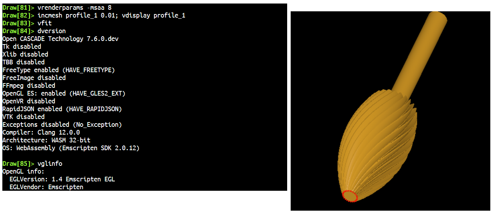
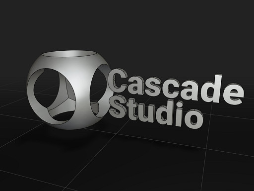
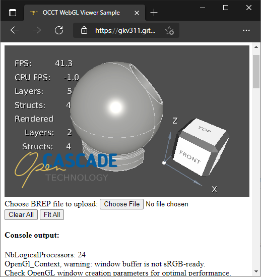
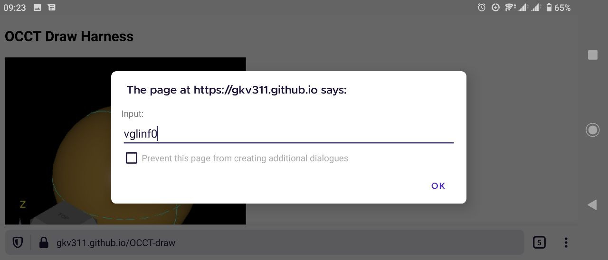
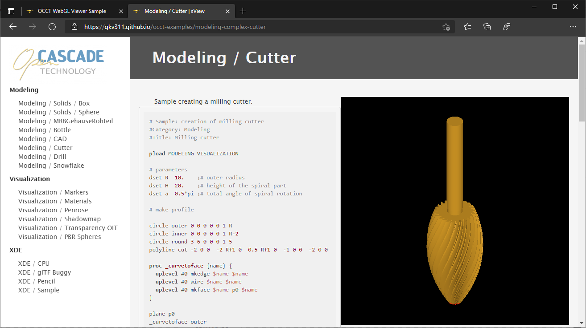

**Draw Harness** is a *Tcl interpreter* exposing *Open CASCADE Technology* framework.
Being an integral part of *OCCT* itself, *Draw Harness* provides out-of-the-box facilities for evaluation,
testing and automation of *OCCT* algorithms - including ***modeling***, ***data exchange*** and ***visualization***.

Modern browser technologies like *WebAssembly* allow bringing existing C++ projects to a web world.
I'm using *Draw Harness* in my day-by-day routines, and was eager to see it working in a web environment, which required some adaptations.

It is always challenging, but also interesting porting applications to a new platform, learning new platform APIs,
fighting with awkward limitations and bugs of the platform, and it's been a while since I became curious about portability of *Tcl* interpreter to unusual platforms.
After all, the main purpose of porting *Draw Harness* to the web is ***having fun*** ;-).

<!--break-->

|  |
|:--:|
| &nbsp; |

## Why does Draw Harness use Tcl?

There is a plenty of projects providing bindings for C++ classes from [OCCT](https://dev.opencascade.org/) framework to the other languages:
*C#* and *Java* ([Open Cascade advanced samples](https://www.opencascade.com/components/wrappers/)), *Python* ([pythonOCC](https://github.com/tpaviot/pythonocc),
[pyOCCT](https://github.com/trelau/pyOCCT), [OCT](https://github.com/CadQuery/OCP)), *JavaScript* ([opencascade.js](https://github.com/donalffons/opencascade.js)).
The key objective of these projects is making *C++ classes* available to *other languages* with minimal modifications.

[Draw Harness](https://dev.opencascade.org/doc/overview/html/occt_user_guides__test_harness.html) is different from the other wrapping projects as it provides a set of ***manually written*** *Tcl* commands.
[Tcl language](https://en.wikipedia.org/wiki/Tcl) is a nice scripting language, but rarely used nowadays being considered *"outdated"* or *"sugar-free"*.
Indeed, *Tcl* does not evolve that fast as many other popular languages, but *Tcl* is very convenient for ***interactive input***.
*Tcl* serves well as a ***scripting language*** with all elements necessary for efficient scripting aboard, it is also easily ***embeddable*** and ***portable***.

```
	pload MODELING VISUALIZATION XDE OCAF
	# spheric body
	psphere s 1
	box b 0 0 -2 1.5 1.5 4
	bcut sb s b
	# toroidal handle
	ptorus t 1 0.5
	trotate t 0 0 0 0 0 1 -90
	ttranslate t 1.5 1.5 0
	bcut tb t b
```
*Typical Tcl code using Draw Harness commands.*

Not yet convinced in *Tcl*? Consider reading an article ["I can't believe I'm praising Tcl"](http://yosefk.com/blog/i-cant-believe-im-praising-tcl.html).
While I wouldn't dare to use a bare *Tcl* for writing any complex application, this language perfectly fits needs as a scriptable and embeddable interpreter,
with complex stuff being written in C++ and exposed to *Tcl* like *Draw Harness* does.

*Tcl* was one of the most popular scripting languages ***in the 1990s***, when *Draw Harness* was first introduced.
One could say that *Tcl* is just a legacy of the past - nowadays, when *Tcl* is not that popular, it sounds strange maintaining and improving a *Tcl* interpreter in *OCCT*.
But that would be a rather biased superficial answer, as *Tcl* still works well for its purpose.

It is interesting that [HTML 4.01 specs](https://www.w3.org/TR/html4/interact/scripts.html) included *Tcl* language (`"text/tcl"`) as one of the alternatives to *JavaScript* for a `<script>` tag in *HTML*.

```html
	<script type="text/tcl">
	  proc edit1_changed {} {
	    if {[edit value] == abc} {
	      button1 enable 1
	    } else {
	      button1 enable 0
	    }
	  }
	  edit1 onChange edit1_changed
	</script>
```
*Hypothetical HTML `<script>` using Tcl language.*

Unfortunately, *Tcl* never came aboard to Browsers.
A couple of projects made an attempt to implement a *Tcl interpreter* written in *JavaScript* language like [Tcl.js](https://github.com/cyanogilvie/Tcl.js?files=1), but with limited functionality.
Anyhow, these projects wouldn't make *Draw Harness* available in the Browser, as *OCCT* itself is written in *C++* and depends on a *native Tcl library* written in *C*.
A native browser plugin could do the trick, but plugin APIs have been removed from modern browsers.

## OCCT to JavaScript

[Emscripten SDK](https://emscripten.org) allows building *C++* projects like *OCCT* as a portable [WebAssembly](https://en.wikipedia.org/wiki/WebAssembly) module,
which could be launched in numerous *JavaScript* environments (*Browsers* first of all) and on multiple platforms with different CPU architectures.

*WebAssembly module* is a bridge between the *native code* (compiled from *C++* or another language) and *JavaScript code* with bi-directional interoperation mechanisms.
These mechanisms, however, do not automatically make entire *C++* classes hierarchies being directly accessible from *JavaScript* code.
This requires extra work, as in case of *C++*/*CLI* for *C#* or *JNI* for *Java*.

There are two common approaches in bringing a *C++* library to another language:

- Wrapping a large set of *C++* classes to be directly accessible in another language.
- Developing a *proxy library* exposing only a small subset of specifically wrapped *C++* functionality.

Even considering tools like [SWIG](https://www.swig.org/), semi-automated wrapping of a large *C++* framework is a challenging
and complex job - not something you would want to start your own project from, if writing the wrapper itself is not the main part of the project.

|  |
|:--:|
| &nbsp; |

Luckily, there is a project called [opencascade.js](https://github.com/donalffons/opencascade.js), which already wraps the major part of *OCCT API* into *JavaScript* language.
The wrapper allows using *OCCT API* (almost directly) from *JavaScript*, but has considerable trade-offs of a wrapping layer - additional complexity,
library size, non-trivial and time-consuming wrapping process, API limitations, memory-related and other issues.

```js
  const makeBottle = (openCascade, myWidth, myHeight, myThickness) => {
  const aPnt1 = new openCascade.gp_Pnt_3(-myWidth / 2., 0, 0);
  const aPnt2 = new openCascade.gp_Pnt_3(-myWidth / 2., -myThickness / 4., 0);
  const aPnt3 = new openCascade.gp_Pnt_3(0, -myThickness / 2., 0);
  const aPnt4 = new openCascade.gp_Pnt_3(myWidth / 2., -myThickness / 4., 0);
  const aPnt5 = new openCascade.gp_Pnt_3(myWidth / 2., 0, 0);

  const anArcOfCircle = new openCascade.GC_MakeArcOfCircle_4(aPnt2, aPnt3, aPnt4);
  const aSegment1 = new openCascade.GC_MakeSegment_1(aPnt1, aPnt2);
  const aSegment2 = new openCascade.GC_MakeSegment_1(aPnt4, aPnt5);
```
*Typical JavaScript code using `opencascade.js` wrapper.*

*JavaScript* has one important limitation - it lacks [finalizer](https://en.wikipedia.org/wiki/Finalizer) mechanism, available in other more mature languages like *C#* and *Java*.
*Finalizer mechanism* is essential for implementing a reliable and automated destruction of objects in *C++ memory heap* linked to *JavaScript* objects, when such *JavaScript* objects are *garbage-collected*.
Automation is impossible without this mechanism, and a developer has to either manually delete *C++* objects from *JavaScript*
or design API in a way that avoids referring to *C++* objects from *JavaScript* objects.
This ruins the *JavaScript* developer experience normally relying on automated garbage collection
of released objects - and even to a *C++* developer accustomed to *smart-pointers* this limitation looks very unnatural.

I have to admit that so far I haven't used the aforementioned *JavaScript* wrapper personally,
and considerations above are mostly based on my theoretical knowledge about *JavaScript*, *WebAssembly* and *Emscripten SDK*
(see [related bug](https://github.com/donalffons/opencascade.js/issues/50) in `opencascade.js`: *"Every `const o = new opencascade.Anything();` needs one `o.delete()`"*).

From the other side, development of a *proxy C++ library* exposing only small subset of functionality necessary for an application
requires a strong *C++* expertise and an extra time for development of a proxy layer,
but brings a clear separation between ***algorithms*** (developed in *C++* for optimal performance) and ***user interface*** (less performance-critical) in the application architecture.

Practically speaking, both approaches are suitable (with some efforts) in achieving good performance and quality, and it could be difficult to choose the "better" one at project start.
Switching to another approach in the middle of the project should be avoided, as it would require a lot of code to be re-written.

*C++* is my preferred language, so it is not a surprise that I would prefer development of a proxy library rather than using a full-scale wrapper.
[WebGL sample](https://gkv311.github.io/occt-webgl/) coming with *OCCT* demonstrates this approach - depending on *OCCT* functionality
the library size could be squeezed into *3 MiB* for a minimal *3D viewer* setup (the *WASM* file within the sample is *10 MiB* in size to work with *B-Rep*).

|  |
|:--:|
| *WebGL sample from OCCT.* |

But I still wanted to have a *JavaScript* library wrapping a large subset of the *OCCT* framework and making it available for scripting.
*Draw Harness* application does bring a considerable part of *OCCT* functionality and does allow scripting (although with help of *Tcl* language).
In addition, everything-is-a-string conception of *Tcl* interpreter allows avoiding memory-related issues while exposing *C++* objects to *JavaScript*,
as the only objects worth exposing are text ***strings*** and a ***global Tcl interpreter*** instance!

## Draw Harness WebAssembly

*Draw Harness* is an interactive command-line interpreter with *3D Viewer* and minimalistic user interface.
It's major dependencies are the *OCCT* framework itself (*C++*) and *Tcl* library (original project, written in *C* language) - sounds like a feasible input for *Emscripten SDK*.

Direct porting of this application to the web can be decomposed into the following steps:

- Porting and building the main *OCCT* modules.
  - Already done, since *OCCT 7.5.0*.
- Building **Tcl library**.
  - *Tcl* source code required a couple of minor corrections to exclude usage of some function stubs in *Emscripten SDK* throwing exceptions.
- Building **Tk library**.
  - *Tk* is a minimalistic GUI framework on top of *Tcl*.
    *Draw Harness* depends weakly on this library, so it was decided just excluding this dependency via `USE_TK` configure option
    (previously, *Tk* was a mandatory dependency for building *Draw Harness*).
- Building `DRAWEXE` with **statically linked plugins**.
  - Dynamic linking is technically feasible with *WebAssembly*, but *Emscripten SDK* has various limitations and problems with this functionality.
    Building `DRAWEXE` with a predefined list of statically linked plugins sounds like a more reasonable solution in the short term.
    At the same time, supporting statically linked plugins also required some adaptations in *OCCT*.
- *OCCT Viewer* within **ViewerTest** plugin.
  - *OCCT 7.5.0* introduced a *WebGL sample*, but `ViewerTest` code was not ported at that time - so the sample code has been reused.
    Only a single viewer instance is currently considered due to limitations in *EGL* implementation within *Emscripten SDK*.
- **JavaScript API** exposed by `DRAWEXE`.
  - *JavaScript* interface for *Tcl* commands evaluation has been implemented via [Embind](https://emscripten.org/docs/porting/connecting_cpp_and_javascript/embind.html) mechanism.
- **Terminal** emulation within `DRAWEXE` web application.
  - [Xterm.js](https://xtermjs.org/) library has been chosen for the prototype.
- **File download/upload** operations.
  - It is essential to expose some *Tcl* commands for exporting/importing files from/to an *emulated file system*.
    Commands `jsupload` and `jsdownload` have been implemented at *JavaScript* level.
- Porting non-*OpenGL* 3D viewer (commands `axo`, `smallview`, etc.).
  - With some exceptions (presentations of low-level geometry entities), OpenGL-based viewer is preferred over non-OpenGL.
    For now, the viewer code has been just disabled for a *WebAssembly* target.

*Emscripten* generates a *WASM* file of *64 MiB* in size (release build) for `DRAWEXE` application with statically linked plugins (not all *OCCT* plugins enabled).
Debug build is considerably larger in size and causes memory issues in [Browser debuggers](../2021-02-03-debugging-occt-in-a-web-browser/).

I was surprised to know that `DRAWEXE` may work even without Terminal emulation - with just a standard infinite loop in `main()` reading input from `std::cin`.
The behavior is awkward though - *Browser* continuously shows a modal dialog with an input field,
and to actually send a *Tcl* command you have to click *OK* once and click *Cancel* next - and repeat *OK*/*Cancel* for further commands.
A couple of sequential *Cancel* clicks stops input dialogs to appear and at that moment you are no more able to interact with `DRAWEXE`.
A weird experience, but good for the first steps - and it works even on mobile devices!

|  |
|:--:|
| *Draw Harness without Terminal emulator in the Browser* |

*Terminal emulator* changes the whole experience.
Result of this experiment can be evaluated on the [following page](https://gkv311.github.io/occt-draw/).
[GitHub Pages](https://pages.github.com/), a free hosting for open-source projects like *OCCT*, has been used as the simplest way for making a static page available from the web.

|  |
|:--:|
| *Draw Harness with Terminal emulator in the Browser.* |

Initially I hoped that some existing *JavaScript* library would implement a comprehensive *Terminal emulator* with minimal efforts,
but soon realized that there are only low-level libraries like `Xterm.js` with much more logic to be implemented at application level.

So far I've implemented command history with up/down arrow keys and some basic input capabilities, but it clearly requires more work to finalize
(like handling more special symbols and fixing issues on mobile platforms with a virtual onscreen keyboard).

*Draw Harness* plugins are statically linked, hence always preloaded, but for consistency with desktop environments it is still necessary calling `pload PLUGIN` for loading commands of specific plugin.

```js
createDRAWEXE().then ((theModule) => {
  DRAWEXE.terminalWriteInfo ("Hello!");
  return DRAWEXE.termEvaluateCommand ("pload MODELING VISUALIZATION");
}).then ((theRes) => {
  return DRAWEXE.uploadUrl ("/models/Bottom.brep", "Bottom.brep");
}).then ((theRes) => {
  return DRAWEXE.termEvaluateCommand ("restore Bottom.brep b");
}).then ((theRes) => {
  return DRAWEXE.termEvaluateCommand ("vinit View1; vdisplay b");
});
```
*Working with the Draw Harness interpreter from JavaScript.*

Commands `jsupload` and `jsdownload` have been implemented with a hacky integration.
These commands help to upload files (like *STEP model* on a web-server or from a local computer) into an emulated memory-based file system and use them in *OCCT* algorithms in a usual way.
No attempts have been made to optimize memory usage, so that the whole files are loaded into *C++* memory via [MEMFS](https://emscripten.org/docs/api_reference/Filesystem-API.html).

Some attempts have been made to execute a sequence of *Tcl* commands with breaks for GUI input via `setTimeout()` interface and to expose *Promise* interface for working with *Tcl interpreter*.

## OCCT Learning Portal

Looking at documentation of numerous *JavaScript* libraries makes me envious.
Accompanying a *JavaScript* code sample with a live demonstration of this code run directly in the browser looks like a natural and common practice.

***What would be a user experience in learning OCCT SDK with live demonstrations run directly in the Browser?***
*OCCT*, being a *C++* framework, cannot provide such interactive experience.

But *WebAssembly* makes dreams possible! Building a dozen of *C++* samples for a web using *Emscripten* might do the trick,
but they would lack interactivity as one couldn't rebuild a *C++* sample directly in the *Browser* after source code modification.

A reader may realize now the hidden background for bringing *Draw Harness* to the web on my winding path.
*Draw Harness* doesn't allow direct evaluation of modified *C++* code, but has a lot of benefits compared to possible alternatives:

- *Draw Harness* comes with *OCCT* framework and is always kept in an up-to-date state.
- *Draw Harness* provides an interactive input for learning step-by-step.
- *Draw Harness* commands are simple to remember and to enter by hand.
- *Tcl* brings powerful scripting capabilities, including loops and procedures.
- *Draw Harness* already comes with *Tcl* samples and test scenarios.
- *C++* source code of commands can be used for learning *OCCT*.

For many years *Draw Harness* remains a close friend to *OCCT* developers, but external users rarely give *Draw Harness* a try.
This is sort of expected but regretful flaw, as *Draw Harness* might become much more mature and advanced with help of more end users and contributors.

So the idea of *OCCT learning portal* came to my mind at some moment.
The main idea is preparing a set of small examples demonstrating *OCCT capabilities* and introducing newcomers to the *OCCT algorithms* - including *modeling*, *data exchange* and *visualization*.
The learning portal may consists of the following elements:

- List of the samples split into categories, with each sample coming with:
  - Small description<br>
    referring to the key *C++ classes* and *Draw Harness commands* related to demonstrated functionality;
  - *Tcl script*<br>
    executed in *Draw Harness terminal*;
  - *C++* code snippets<br>
    (not self-sufficient code, but describing usage patterns);
  - *Draw Harness console*<br>
    executing *Tcl script*;
  - Interactive *3D Viewer*<br>
    bound to *Draw Harness*.

A small draft has been prepared relying on *Jekyll* static generator, [highlight.js](https://highlightjs.org/) library for *Tcl* scripts
(as [Rouge](http://rouge.jneen.net/) coming with *Jekyll* has poor *Tcl* support) and the *Draw Harness WebAssembly* module.
*GitHub Pages* has been used for experimental hosting, which clarifies *Jekyll* choice.

The *live demo* of this prototype can be found on the [following page](https://gkv311.github.io/occt-examples/).

|  |
|:--:|
| *OCCT Learning Portal (an early draft).* |

## What's next?

I'm writing this article while still working on the prototype.
I beg your pardon if you'll find live DEMOs in a broken state accidentally.

Algorithms work considerably slower in the *Browser* environment compared to native builds on the same device,
and long algorithms trigger *"hanging JavaScript"* user message in the *Browser*, as `DRAWEXE` commands are executed within the main GUI thread.

As you may figure out looking onto prototype, there are a lot of things to complete or improve:

- Fix up layout and contents of the pages.
- Fix some bugs with *Terminal* input.
- Collect and fill in as many *Tcl*/*C++* examples as possible.<br>
  Code snippets from *MFC*/*Qt* Tutorials might be a good start, but there are many more ideas for samples to try, like visualization features to demonstrate.
  Some ideas might require implementing improvements in existing *Draw Harness* commands.
- Define some standard mechanisms for *asynchronous* (non-blocking) file/image operations within *OCCT* itself for more natural incorporation with *Browser APIs*.
- Merge browser *image decoding* capabilities into `Image_AlienPixMap` (via *Emscripten*).
- Experiment with enabling [SIMD vectorization](https://emscripten.org/docs/porting/simd.html) instructions.<br>
  *Emscripten SDK* provides vectorization building options, but this is still an experimental feature in *WebAssembly* with limited support in *browsers*.
- Experiment with enabling [multi-threading](https://emscripten.org/docs/porting/pthreads.html).<br>
  *Emscripten SDK* implements multi-threading support via the `pthread` library, but this feature has been disabled in browsers for some time due to security risks.
- Consider running `DRAWEXE` in a *background thread* to avoid *"hanging script"* issues.
- Experiment with defining *JavaScript* functions as commands registered in *Tcl interpreter*.

*GitHub Pages* is a nice service for hosting static pages - conveniently integrated with a static generator *Jekyll*.
It has some limitations though, like not supporting pre-compressed assets (`DRAWEXE.wasm.gz` shows very good compression ratio,
but it cannot be pushed to a git repository in compressed state due to *GitHub Pages* limitations)
and lack of alternative static generators like *Doxygen* used in *OCCT* documentation system.

Once the prototype will be completed (to some reliable state), based on the user feedback, this functionality might be considered to be merged into *OCCT* itself
as a part of it's documentation system and hosted on *Development Portal*.
This would require some adoption for using *Doxygen* instead of *Jekyll*, or maybe these two tools could be used together.

I can imagine some nice collaboration features for *Draw Harness* like a *Tcl* script editor window with *Reset* / *Run* buttons (as online compilers provide),
interface for *sharing URLs* with written *Tcl scripts* and more, but this might require dynamic server side support which the current solution completely avoids.

