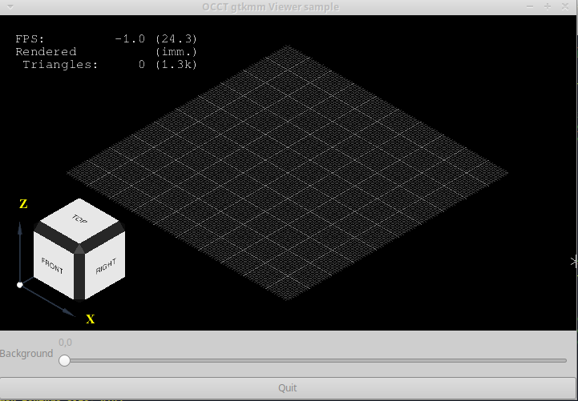
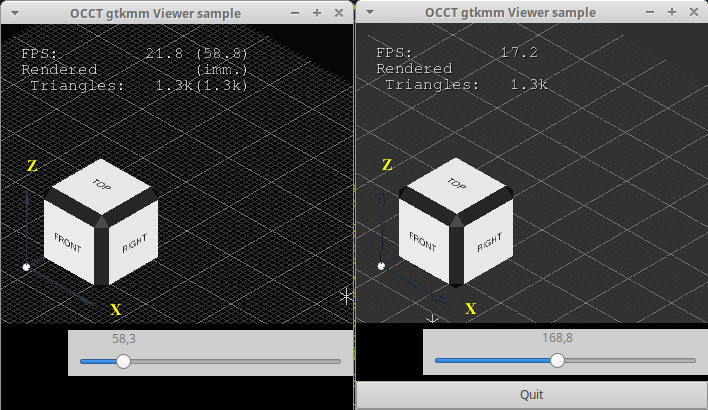

It's been a while since I've written an application using the [GTK framework](https://en.wikipedia.org/wiki/GTK).
Developers of industrial cross-platform applications strongly prefer the *Qt framework* as it tries to mimic GUI per platform, while *GTK* brings the same uniform experience to all platforms.
But apart from strange movements of [GNOME](https://en.wikipedia.org/wiki/GNOME) developers in *GNOME 3*, *GTK* remains a strong framework for development of native *Linux* applications.

*Open CASCADE Technology* (*OCCT*) users may easily find code samples embedding *OCCT 3D Viewer* into *Qt*-based, *MFC*-based, *WinForms*-based and even *WPF*-based applications,
but one may barely find any working sample based on *GTK framework*.

Following a recent question on this topic on *Stackoverflow*, I've decided to take a look onto this problem
and to prepare a simple *Hello OCCT Viewer* sample using [gtkmm](https://en.wikipedia.org/wiki/Gtkmm) (*GTK* for *C++*).

<!--break-->

## OCCT Viewer and GUI frameworks

Embedding *OCCT Viewer* into a specific GUI framework might be challenging to users starting to work with *Open CASCADE Technology*,
and having no knowledge of *OpenGL* and native window systems used on target platforms.
Even experienced developers might be put into frustration by major breaking changes in GUI framework (*Qt4* -> *Qt5*, *Qt5* -> *Qt6* and similar).

There are two basic approaches for embedding *OpenGL*-based viewer into GUI framework:

1. Ask *OCCT* to **create** *OpenGL context* for a *native window* taken from a normal widget or entire window.
2. Wrap **existing** *OpenGL context* created by GUI library itself via special widget, like `Gtk::GLArea` in case of *GTK* or `QOpenGLWidget` in *Qt*.

The first approach is used by conventional samples for *Qt Widgets* and *MFC* coming with the *OCCT framework*.
It avoids various problems and simplifies code as 3D Viewer basically lives independently from the other GUI controls.
However this approach also brings an ["airspace" problem](https://learn.microsoft.com/en-us/dotnet/desktop/wpf/advanced/technology-regions-overview) - it is usually
impossible drawing other GUI controls on top of a 3D viewer or applying some effects.

The second approach relies on GUI framework developers in a creation of *OpenGL context* and it's communication with other (non-*OpenGL*) GUI widgets.
This solves the "airspace" problem and drop limits implied by the first approach, but requires extra coding for embedding an external 3D Viewer like *OCCT* into existing *OpenGL* widget.

Both approaches should be technically feasible with *GTK*, but I've chosen the second one for prototyping a sample using the `Gtk::GLArea` widget.

## OCCT Viewer in Gtk::GLArea

The complete code of the sample itself could be fetched from a [repository on GitHub](https://github.com/gkv311/occt-samples-gtk).
Let me highlight and comment here the most tricky parts of putting the *OCCT Viewer* into `Gtk::GLArea`.

|  |
|:--:|
| *OCCT Viewer within GTK-based application.* |

### Wrapping a native window

*OCCT Viewer* should be mapped to a window defined by `Aspect_Window` interface.
Existing window could be wrapped into `Xw_Window`, a more general `Aspect_NeutralWindow`
or another `Aspect_Window` subclass - basically *OCCT* needs just window dimensions and a handle to a platform-dependent native window (`XID` of *Window*, `HWND`, etc.).

```cpp
::Window anXWin = gdk_x11_window_get_xid (
  gtk_widget_get_window ((GtkWidget* )myGLArea.gobj()));
Handle(Aspect_NeutralWindow) aWindow = new Aspect_NeutralWindow();
aWindow->SetNativeHandle (anXWin);
aWindow->SetSize (aViewSize.x(), aViewSize.y());
```

### Wrapping existing OpenGL context

By default, *OCCT Viewer* would try creating a new *OpenGL context* for a specified native window.
To reuse existing context created by `Gtk::GLArea`, it should be passed as `Aspect_RenderingContext` parameter of `V3d_View::SetWindow()` method.

The following code relies on a fundamental *OpenGL API* property - the context is bound to a *current working thread*,
so that `OpenGl_Context::Init()` is able to retrieve necessary information from using methods like `glXGetCurrentContext()`.

```
Handle(OpenGl_Context) aGlCtx = new OpenGl_Context();
bool isCoreProfile = true
if (!aGlCtx->Init (isCoreProfile)) { /* error */ }
myView->SetWindow (aWindow, aGlCtx->RenderingContext());
```

It should be possible to retrieve these details from *GTK* itself (e.g. using methods of `Gdk::GLContext`), but I haven't checked this and there shouldn't be any practical difference.

*Important notice - GTK always creates an OpenGL Core Profile.*
*OCCT Viewer supports both Compatible and Core Profiles, but some functionality like line width greater than 1 pixel wouldn't work within Core Profile.*

### Wrapping existing FBO

`Gtk::GLArea` doesn't render content using *OpenGL* directly to a window.
Instead, it creates an *offscreen buffer object* (*FBO*) and copies its content into a window when necessary.

*OCCT 3D Viewer* by default would try rendering into a window itself, so that it should be explicitly asked to render into a specific *FBO* defined by an `OpenGl_FrameBuffer` class.
Here once again we rely on *OpenGL* global state, which is retrieved by `OpenGl_FrameBuffer::InitWrapper()` from a working thread.
Alternative would be trying to retrieve this information from *GTK* itself.

```cpp
Handle(OpenGl_GraphicDriver) aDriver =
  Handle(OpenGl_GraphicDriver)::DownCast (myContext->CurrentViewer()->Driver());
const Handle(OpenGl_Context)& aGlCtx = aDriver->GetSharedContext();
Handle(OpenGl_FrameBuffer) aDefaultFbo =
  new OpenGl_FrameBuffer();
aGlCtx->SetDefaultFrameBuffer (aDefaultFbo);
if (!aDefaultFbo->InitWrapper (aGlCtx)) { /* error */ }
```

### Managing viewer redraws

Legacy applications often followed an approach of immediate updating of *OCCT Viewer* in place when something has been changed (object displaying, camera manipulations, etc.).
This wouldn't work in modern GUI frameworks putting *OpenGL* widgets into a general rendering pipeline of entire window content (including other widgets).

For this, *OCCT Viewer* updates should be put into callback for `Gtk::GLArea::signal_render()` signal and disallow any implicit/explicit `V3d_View::Redraw()` in application code.
Instead, any viewer modifications should request widget updates via `Gtk::GLArea::queue_draw()`.

```cpp
Handle(V3d_Viewer) myViewer;
Handle(V3d_View)   myView;
Handle(AIS_InteractiveContext) myContext;
...
myView = myViewer->CreateView();
// prevent unintentional implicit viewer redraws
aView->SetImmediateUpdate (false);

// let Gtk::GLArea to manage buffer swap
Handle(OpenGl_GraphicDriver) aDriver = new OpenGl_GraphicDriver (aDisp, false);
aDriver->ChangeOptions().buffersNoSwap = true;

// define a callback for repainting viewer (widget) content
myGLArea.signal_render().connect (sigc::mem_fun (
  *this, &OcctGtkViewer::onGlAreaRender), false);

...

bool OcctGtkViewer::onGlAreaRender (const Glib::RefPtr<Gdk::GLContext>& theGlCtx)
{
  // flush pending input events and redraw the viewer
  FlushViewEvents (myContext, myView, true);
  return true;
}
```

### Handling user input

To interact with the 3D Viewer, user input events (mouse, keyboard, touches, etc.) should be redirected.
Historically, implementing standard mouse input schemes for camera navigation in *OCCT Viewer* required a lot of code at application level,
but nowadays this burden can be charged to [`AIS_ViewController`](../2021-03-27-occt-minimal-viewer-setup/).

Here is a code sample handling mouse cursor movements - other events should be also mapped.

```cpp
static Aspect_VKeyFlags mouseFlagsFromGtk (guint theFlags)
{
  Aspect_VKeyFlags aFlags = Aspect_VKeyFlags_NONE;
  if ((theFlags & GDK_SHIFT_MASK) != 0)
  {
    aFlags |= Aspect_VKeyFlags_SHIFT;
  }
  if ((theFlags & GDK_CONTROL_MASK) != 0)
  {
    aFlags |= Aspect_VKeyFlags_CTRL;
  }
  if ((theFlags & GDK_MOD1_MASK) != 0)
  {
    aFlags |= Aspect_VKeyFlags_ALT;
  }
  return aFlags;
}

bool OcctGtkViewer::onMouseMotion (GdkEventMotion* theEvent)
{
  const Aspect_VKeyMouse aButtons = PressedMouseButtons();
  const Graphic3d_Vec2i aNewPos (theEvent->x, theEvent->y);
  const Aspect_VKeyFlags aFlags = mouseFlagsFromGtk (theEvent->state);
  if (UpdateMousePosition (aNewPos, aButtons, aFlags, false))
  {
    myGLArea.queue_draw();
  }
  return true;
}

...

// connect to mouse input events
myGLArea.add_events (Gdk::POINTER_MOTION_MASK);
myGLArea.signal_motion_notify_event() .connect (
  sigc::mem_fun (*this, &OcctGtkViewer::onMouseMotion), false);
```

## Experienced bugs

Initially I was optimistic about `Gtk::GLArea` and expected it to work naturally with other *GTK widgets*.
Unfortunately, even a very basic sample (before embedding *OCCT viewer*) displayed artifacts on *Xubuntu 18.04* within a virtual machine and software-emulated *OpenGL* implementation.

|  |
|:--:|
| *Randomly black GTK widgets on Xubuntu 18.04.* |

I don't know much about other *GTK*-based *OpenGL* applications to compare, so I cannot say if there is something wrong with the code or could be worked around, or if this is just a bug in *GTK* itself / *gtkmm*.
As the sample works as expected on *Ubuntu 21.04* (within *Xorg* session), I've concluded that this *GTK* bug has been solved some years ago (though *Xubuntu 18.04* doesn't look too old to me yet).

## Wayland vs. X11

It is important to note, that *GTK* may be run in different context:

- [X11 server](https://en.wikipedia.org/wiki/X_Window_System) - *X Window* is created and [GLX](https://en.wikipedia.org/wiki/GLX) is used for *OpenGL*.
- [Wayland](https://en.wikipedia.org/wiki/Wayland_(display_server_protocol)) - native window is not *X Window*, and *EGL* is used for *OpenGL context*.
- *GTK* also has an option to use *OpenGL ES* instead of a *desktop OpenGL*.

For the moment, *GLX* remains the main configuration supported by *OCCT* on a *Linux* platform.
*OCCT* does support *EGL*, but as a dedicated configuration alternative to *GLX*, while *GTK* handles this at runtime somehow.

In addition, *OCCT* does not (yet) provide any wrapper for a *Wayland* native window, though it might be not critical for wrapping an existing native window to be passed as is to the *EGL* interface.
But at least *OCCT* should be aware that native window might be either *X Window* or *Wayland window*
and dynamically handle these scenarios - to be able to work on *Linux* distros providing both *Wayland* and *Xorg* interactive sessions at onces.

And this looks really necessary, as *Wayland* integration as replacement of *Xorg* in main distros was delayed for too many years,
showing again and again that *Wayland* is not yet ready to replace *X11* as a main interactive graphic server in *Linux*.

Recent patches within the development branch of (forthcoming) *OCCT 7.6.0dev* refactored *Xlib*, *GLX*, *EGL* and *OpenGL*/*OpenGL ES* dependencies.
So that there are dedicated toolkits `TKOpenGl` (*desktop OpenGL*) and `TKOpenGles` (*OpenGL ES*), which could be built simultaneously, and *GLX* dependency became optional on *Linux* platform.

However, supporting *Wayland* in *OCCT* requires further research and modifying *OCCT* source code.
Unfortunately, there is not much of the *Linux* community showing an interest in providing *Wayland* compatibility patches to *OCCT* - so that this task remains
a low priority feature with *XWayland* as a working fallback.
