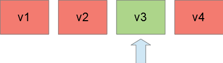
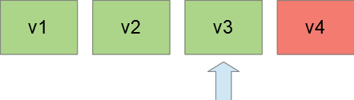
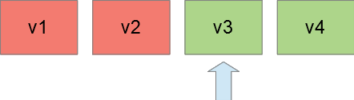
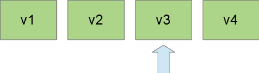
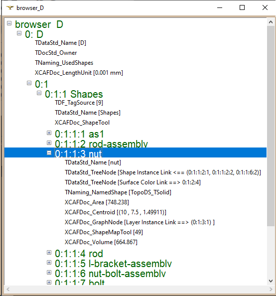
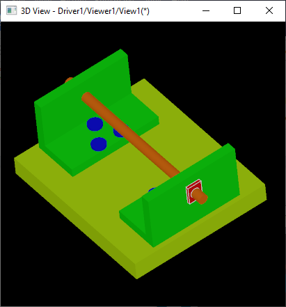
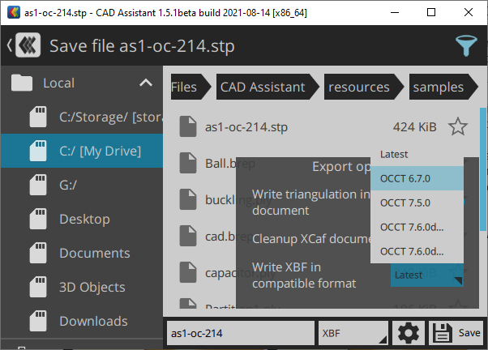

Forthcoming *OCCT 7.6* release will introduce some improvements in *XCAF* and *B-Rep* file formats, which break backward compatibility with older *OCCT* releases.
Anticipating users' frustration due to file format incompatibilities, this small article is intended to shed some light on the background of new changes.

<!--break-->

## Introduction

PC users got accustomed to various file formats - *JPEG* for photos, *MP3* for music, *WEBM* for videos, *DOCX* for text documents and many other popular formats used in everyday routines.
It is easy to fall into frustration when you receive an important document from a friend or colleague,
and your application is unable to open because *"File uses a newer format version than supported by application"*.

Not every user understands complex design issues showing up to software developers in designing and improving a file format through a long application life cycle.
I would like to highlight the following conceptions applicable to file format design related to handling file format revisions:

- **Single-version compatible**<br>
  Document written by a previous version of an application cannot be opened by a new version and vice versa.
  Often, this also means no format revision information stored in a file format, or only a single format revision (current one) being supported by a specific application version.<br>
  Though it sounds terrifying behavior, such file formats are used more often than one would expect.
  Common reasons include poor (non-provisional) design, or a transient nature of file content like user settings, that could be dropped on application upgrade with minor usability caveats.<br>
  

- **Backward compatible**<br>
  [Backward-compatible](https://en.wikipedia.org/wiki/Backward_compatibility) format means
  that newer versions of an application should be able to open (but not to write) files generated by older versions of the same software.
  This is the most fair behavior which most users expect from a regular software for important file artifacts - like results of their work.<br>
  

- **Forward compatible**<br>
  [Upward-compatible](https://en.wikipedia.org/wiki/Forward_compatibility) format is a wild beast which allows an older software
  being able to open files generated by newer versions of the same software (introducing format changes).
  Compatibility in forward direction normally requires designing a provisional and extensible file format with skippable unknown sections.<br>
  Obviously, an older application wouldn't be able to read and use new information, but it should be able to read ***main*** information from it.
  Otherwise, an older application will end up reading an empty document content without errors, which is kind of useless.<br>
  

- **Forward and backward compatible**<br>
  Combination of backward and forward compatibility.<br>
  

CAD users have to deal with plenty of vendor-specific (or *"native"*) and vendor-neutral file formats.
The latter formats are designed for data exchange across CAD applications (like [STEP](https://en.wikipedia.org/wiki/ISO_10303-21), *IGES* standards).
A dedicated article would be necessary just to make a short overview of major file formats used in CAD and their features, but further sections will focus on file formats native to *Open CASCADE Technology*.

## XCAF Document

[OCAF](https://dev.opencascade.org/doc/overview/html/occt_user_guides__ocaf.html) (*Open CASCADE Application Framework*) is a powerful API for defining an application-specific document structure.
*OCAF* defines various storage interfaces represented by plugins and drivers, but it doesn't define any file formats on its own.

*XCAF*, a basis of [XDE](https://dev.opencascade.org/doc/overview/html/occt_user_guides__xde.html) (*eXtended Data Exchange*),
is a framework based on *OCAF* designed for storing *B-Rep* shapes as an assembly structure with various attributes.
This document can be stored using two main storage formats - binary version **BinXCAF** producing `.xbf` files and **XmlXCAF** producing `.xml` files.
Older versions of *OCCT* also defined some other legacy storage formats unused nowadays.

*OCCT*-based applications do not necessarily support these *XBF* and *XML* file formats,
but when supported - this format is a very efficient and robust way for transferring geometry with assembly structure across applications.
Reliable support of open, *ISO*-standardized and vendor-neutral formats like *STEP*, *IGES* and *glTF* is one of strongest sides of *OCCT framework*,
but involves various excessive and expensive data translation procedures to and from *OCCT* definition, making native *OCCT* formats a preferable choice.

<!--break-->

| <span> </span> |
|:--:|
| *XCAF document structure using `DFBrowse` command.* |

Although *OCAF* doesn't define a specific document format, it does define a useful binary storage language conceptually similar to *XML*,
[EBML](https://en.wikipedia.org/wiki/Extensible_Binary_Meta_Language), and *JSON*.
This language writes sections that could be skipped by a reader, which allows composing an ***OCAF-based document compatible in both directions - forwards and backwards***.
The only exception are fixes of major flows and overlooked limitations - like supporting documents *larger than 2GiB* in size due to usage of *32-bit integer numbers* for document length.

This design allows extending *XCAF* formats (`.xbf` and `.xml`) with new features without breaking compatibility.
For instance, *OCCT 7.5.0* introduced new drivers for storing *PBR material* definition using `XCAFDoc_VisMaterial` attributes,
but old applications are able to read new documents (with *PBR materials*) by skipping unknown drivers, as *B-Rep shape* definition remained unmodified in the document.

## B-Rep storage

*B-Rep* geometry (`TopoDS_Shape`) storage is handled by a dedicated driver within *XCAF*.
Each driver defines a kind of format inside format - so that it might have it's own versioning and complex compatibility rules independently from *OCAF document* as whole.
This is exactly what *B-Rep* geometry driver does - it defines it's own storage format with an ***independent versioning***.

*XmlXCAF* relies on the `TopTools_ShapeSet` tool defining a text format, which is also used by `BRepTools::Write()`/`BRepTools::Read()`
methods and known as `.brep` file format described by a [dedicated specification](https://dev.opencascade.org/doc/overview/html/specification__brep_format.html).
*BinXCAF* relies on `BinTools_ShapeSet` similar to `TopTools_ShapeSet`, but defines a binary file format.

*B-Rep* storage formats were rarely touched, but when this happened, backward compatibility was always implemented.
At the same time, forward compatibility wasn't preserved, and `.brep`, `.xbf` and `.xml` files written by *newer OCCT* cannot be opened by older versions.
Such breaking changes occurred in *OCCT 7.6*.

As *B-Rep* storage format is defined independently from *OCAF*, it doesn't inherit forward-compatibility features in design - that's why even small extensions required format compatibility breaking changes.
It sounds interesting to make this format extensible / forward-compatible as current format still lacks some feature desirable to add in future, but this would require considerable reworking.

## XCAF format changelog

Historically, *OCCT* developers have been focused on preserving backward compatibility - applications based on *newer OCCT* versions have written documents in the latest file format,
with older formats supported only in read-only direction.

With the growing ecosystem of *OCCT*-based applications, however, the matters of forward compatibility become more important.
As a first step, *OCCT* developers have done a retrospective analysis through the code modifications and associated *Bugtracker* tickets
to weed out and document major *XCAF* format modifications done within previous releases.
Revision numbers previously hidden from public API have been moved out into dedicated enumerations:

- `TopTools_FormatVersion`<br>
  Defines revision of text-based [B-Rep format](https://dev.opencascade.org/doc/overview/html/specification__brep_format.html).
  - 1 - first revision;
  - 2 - added storing of CurveOnSurface UV Points;
  - 3 - *[OCCT 7.6]* added storing of per-vertex normal information<br>
    and dropped storing of CurveOnSurface UV Points.

- `BinTools_FormatVersion`<br>
  Defines revision of binary-based B-Rep format.
  - 1 - first revision;
  - 2 - added storing of CurveOnSurface UV Points;
  - 3 - *[OCCT 6.2.1]* fixed processing of geometry with points on Curve,<br>
    or point on Surface, or points on curve of surface;
  - 4 - *[OCCT 7.6]* added storing of per-vertex normal information<br>
     and dropped storing of CurveOnSurface UV Points.

- `TDocStd_FormatVersion`<br>
  Defines revision of *XCAF* document (unified for *BinXCAF* and *XmlXCAF*)
  - 2 - first supported revision
  - 3 - *OCCT 6.3.0*
    - *BIN*: Add Delta to numbers data, changes in ShapeSection.
    - *XML*: Adding DeltaOnModification functionality to set of Standard attributes.
  - 4 - *OCCT 6.3.1*
    - *BIN*: entry, ContextLabel for tree.
    - *XML*: Naming mechanism improvement.
  - 5 - *OCCT 6.3.1*
    - *BIN*: Convert old format to new.
    - *XML*: Separation of OCAF to Lite and Standard parts completion.
  - 6 - *OCCT 6.5.0*
    - Added location.
  - 7 - *OCCT 6.7.0*
    - Added orientation, type migration.
  - 8 - *OCCT 7.0.0*
    - *BIN*: Stop convert old format.
    - *XML*: Replace `TPrsStd_AISPresentation` attribute with `TDataXtd_Presentation`.
  - 9 - *OCCT 7.1.0*
    - *BIN*: Added GUIDs and processing of user-defined GUIDs.
  - 10 - *OCCT 7.2.0*
    - *BIN*: ReadTOC changed to handle *64-bit* file length.
  - 11 - *OCCT 7.6.0*
    - B-Rep format version changed to preserve per-vertex normal attributes.
  - 12 - *OCCT 7.6.0*
    - *BIN*: New binary format for fast reading of part of OCAF document.

First thing to note from the list above is that *Binary* and *Text* formats have a considerable overlap in changes, but have been incremented independently at some step.
Since *OCCT 7.6.0*, it has been decided to unify *BinXCAF* and *XmlXCAF* versioning, so that a single enumeration `TDocStd_FormatVersion` is now defined for this purpose.
*B-Rep* binary and text formats also have common history, but it was decided to keep independent versioning for them (`BinTools_FormatVersion` and `TopTools_FormatVersion`).

Some highlights in changelog have very short descriptions and are difficult to recognize even for *OCCT* developers.
Another point to note (which would also require a deep analysis of source code changes) is that some version bumps look redundant.
Something that should be checked more thoroughly in future.
Several *OCCT* releases have more than a one format version bump - which is fine considering that many applications rely on rolling (intermediate) *OCCT* builds.

This *changelog* is based on *XCAF* version bumps, but as many format modifications could be done without breaking compatibility with old applications,
these remain unversioned and not (consistently) documented in a single place.
This includes numerous extensions like introduction of new entities related to *STEP AP242*, *PMI*, *PBR Materials* and other features.
A good point for further improvements in format documentation.

## Writing document with older version

An old document storage API provided no way to specify *XCAF* format version, and was practically written the latest format revision.
Now format storage revision could be specified by method `TDocStd_Document::ChangeStorageFormatVersion()`, which should allow writing a document compatible with older *OCCT* releases.
This could be done using the following commands in *Draw Harness*:

```
pload XDE OCAF MODELING VISUALIZATION
box b 1 2 3
XNewDoc D
XAddShape D b
set aLatest [lindex [GetStorageFormatVersion D] 0]
XSave D test-${aLatest}.xbf
SetStorageFormatVersion D 10; # OCCT 7.2.0+
XSave D test-10.xbf
```

This feature has limited usage, as not all revisions could be correctly written - consider using versions from `TDocStd_FormatVersion_VERSION_7` (*OCCT 6.7.0*).
In addition, specifying an older format version would not remove *XCAF* entities.
It is expected that unknown sections / drivers will be automatically skipped by older *OCCT* versions thanks to forward-compatible design of *OCAF* persistence,
while newer *OCCT* versions will be still able to read them.

In this context, *XCAF* provides only a rudimentary upgrade / downgrade interface which is unable to handle tricky cases
like changes in data meaning rather than in data structure - like gamma correction in `Quantity_Color` introduced in *OCCT 7.5.0*.
Other frameworks like [TObj](https://dev.opencascade.org/doc/overview/html/occt_user_guides__ocaf.html#occt_tobj), which is also based on *OCAF*, imply more sophisticated document upgrade practices.
Another point to consider improving in the future.

|  |
|:--:|
| *Choosing the XBF version within the CAD Assistant save dialog.* |

`writebrep` is another new helpful *Draw Harness* command introduced by *OCCT 7.6*.
The command allows dumping *B-Rep* shapes into a `.brep` file, which previously could be done by a general-purpose `save` command
(applicable to any *Drawable* object in *Draw Harness*, not only to *B-Rep* shapes).
The new command allows specifying format revision, selecting between *Binary* and *Text* versions, and adjusting other options:

```
writebrep shape filename [-binary=off]
                         [-version Version=4] [-noTriangles=off]
: Save the shape in the ASCII (default) or binary format file.
:  -binary  write into the binary format (ASCII when unspecified)
:  -version a number of format version to save;
:           ASCII  versions: 1, 2 and 3    (3 for ASCII  when unspecified);
:           Binary versions: 1, 2, 3 and 4 (4 for Binary when unspecified).
:  -noTriangles skip triangulation data (OFF when unspecified).
:           Ignored (always written) if face defines only triangulation.
```

It worth mentioning, that the new command follows the name convention used by *Data Exchange* commands with `read*`/`write*` prefixes for simple shape importers/exporters
(like `writestl` and `writegltf` for *STL* and *glTF* formats) and has a counterpart `readbrep` for reading a shape back
(`Read*`/`Write*` prefixes are used for importers/exporters of an *XCAF* document like `WriteStep` and `WriteGltf` for *STEP* and *glTF* formats).

## Vertex normal attributes

As can be seen in revision history, the first breaking *XCAF* format compatibility change in *OCCT 7.6* is related to storage of *vertex normal attributes*.
This feature might need some elaboration.

Historically, *B-Rep* shape format supports `Poly_Triangulation` storage in `TopoDS_Face`, including 3D vertex positions, UV surface coordinates and triangle indexes.
Vertex normals, however, an essential information for 3D visualization, have not been considered, as they could be easily restored from the original surface also stored in `TopoDS_Face` based on UV coordinates.

Meshing algorithms like `BRepMesh` or `ExpressMesh` do not fill in vertex normals while generating triangulation.
Visualization tools have to call `StdPrs_ToolTriangulatedShape::ComputeNormals()` before displaying a shape in a 3D viewer, which takes some time, considerable on large models.

| <span> </span> |
|:--:|
| *Smooth shading relying on vertex normals from B-Spline surface (left)*<br>*compared to averaged vertex normals resulting in degraded look (right).* |

Moreover, some geometry might have no analytical surface to reconstruct normals (like in case of triangulation imported from *glTF*/*STL*/*OBJ*/*JT* formats),
so that normals might be lost by *XCAF* persistence leading to poorer shaded model look in 3D viewer.

Latest *XCAF* and *B-Rep* formats allow preserving this important information.

## CurveOnSurface UV Points removal

Second *B-Rep* format revision added storing `BRep_CurveOnSurface::UVPoints()` information.
This information can be reconstructed from geometry definition, so that original intent of this modification was improving performance by caching values.

Latest tests show that this caching is mostly unused by *OCCT algorithms* and doesn't bring considerable performance improvements.
Therefore, it was decided to drop this information from the latest format revisions
(`TopTools_FormatVersion_VERSION_3` and `BinTools_FormatVersion_VERSION_4`, in parallel with adding vertex normal storage) to spare file size.

## XCAF length unit

The *XCAF document* has been extended by the `XCAFDoc_LengthUnit` attribute for storing length units information.
This information should be helpful to identify inconsistencies on opening documents saved by other *OCCT* applications with different *length units*.

Applications are expected to set up system units at document creation time.
This information will be also automatically handled by *Data Exchange* translators to properly scale geometry within data import from / export into external file formats like *STEP* or *glTF*.

```cpp
Handle(TDocStd_Document) theDoc;
XCAFDoc_DocumentTool::SetLengthUnit (theDoc, 0.001); // mm

RWGltf_CafReader aGltfReader;
aGltfReader.SetDocument (theDoc); // translator will configure m -> mm scaling
aGltfReader.Perform();
```

## Other improvements

*XCAF API* has been extended with an interface `PCDM_ReaderFilter` allowing to skip specific entities (by type) while reading a large document and to load them later on.
This feature required not forward-compatible *XCAF* format storage modifications requiring a version bump.

In addition to format changes, *OCAF* storing / restoring interfaces have been improved to report file format incompatibility issues in a more human-readable way.
