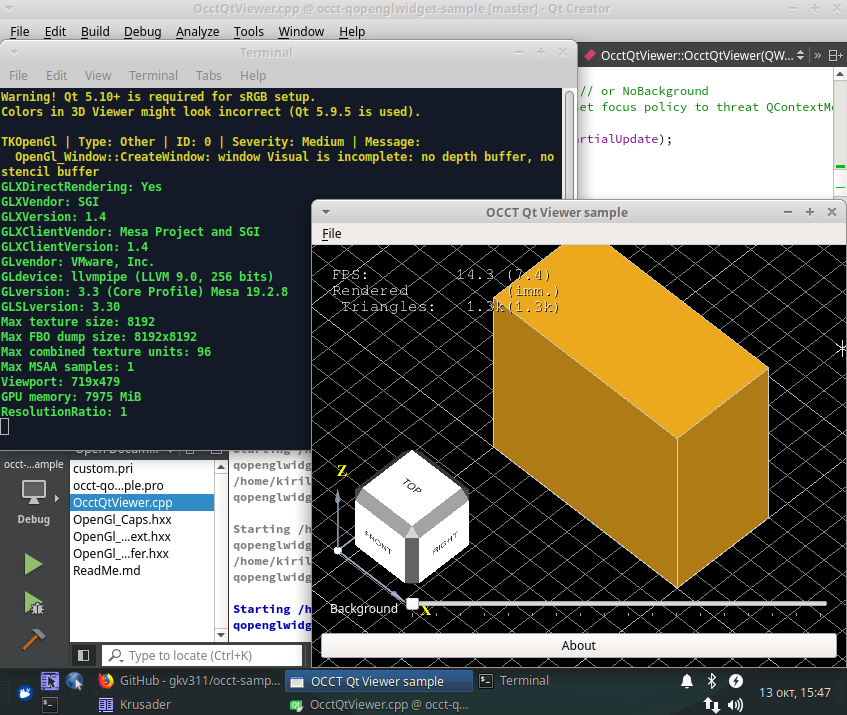

As a follow-up of my previous experiment with *GTK*, I've finally found some time to resurrect my earlier drafts for `QOpenGLWidget` sample.

<!--break-->

|  |
|:--:|
| &nbsp; |

Conventional *OCCT samples* integrating 3D Viewer into *Qt Widgets* rely on drawing *OpenGL* into a native window created by a dedicated `QWidget` or `QGLWidget`.
Such integration has an important drawback with no other `QWidget` being able to be drawn on top of 3D Viewer semi-transparently.

A long time ago, *Qt 5.4* has introduced another widget class `QOpenGLWidget` intended to overcome this limitation and to smoothly combine low-level *OpenGL*-rendered content with *Qt*-rendered elements.
The main trick that `QOpenGLWidget` does is that it renders *OpenGL* content not directly into a native window,
but into offscreen framebuffer (*FBO*), which is composite with other *Qt* elements later on.
Such design, however, requires extra efforts in embedding an external 3D engine like *OCCT* one.

The [new sample](https://github.com/gkv311/occt-samples-qopenglwidget) is almost identical to *GTK* one described in detail by the [previous article](../2021-07-29-occt-viewer-and-gtk/).
At least, it is very close in the ways it interacts with *OCCT 3D Viewer*, follows *Single Document Interface*,
redirects events to `AIS_ViewController` and wraps *OpenGL context* created by GUI framework, but using *Qt*-specific APIs.

Some problems have been observed while testing the sample.
For instance, dimensions returned by `QOpenGLWidget::rect()` do not match offscreen FBO created by *Qt*.
In addition, it seems that *Qt 5.10+* is required for proper color reproduction in 3D Viewer (or deeper hacks will be necessary to implement):

```cpp
QSurfaceFormat aGlFormat;
aGlFormat.setColorSpace (QSurfaceFormat::sRGBColorSpace);
QOpenGLWidget::setTextureFormat (GL_SRGB8_ALPHA8);
```

Sample also relies on some improvements in *OCCT 7.6.0* (currently in *BETA* state), so it will not build on older versions without modifications.
The sample might be also further improved to implement *OpenGL* resources cleanup or to check *Qt6* compatibility.

|  |
|:--:|
| &nbsp; |
