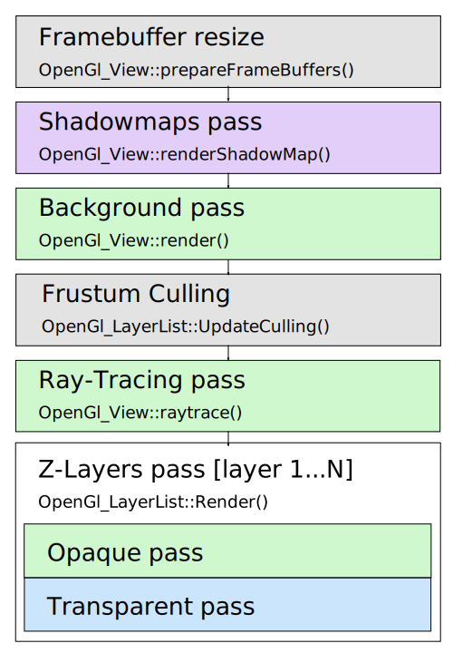

This article provides a high-level overview of a *frame rendering graph* implemented by `TKOpenGl` (`OpenGl_GraphicDriver`).
Although it is named here as a "graph", it's not that flexible and the overall structure looks pretty flat, as could be seen later on diagrams.

The article might be useful to *advanced OCCT users* wanting to learn more about low-level *OpenGL* rendering aspects of *OCCT 3D Viewer*,
to see a better correlation between high-level (`AIS`) and low-level (`OpenGl`) layers,
to figure out how and where to implement tricky effects or to understand how to optimize application rendering performance.

<!--break-->

## Drawing a frame

Straight to the subject! At the very top level the frame is drawn in two passes - one for Persistent content and another for Immediate content.
`OpenGl_View::Redraw()` draws both of them, while `OpenGl_View::RedrawImmediate()` updates only immediate content
reusing persistent content cached in an offscreen framebuffer - which are called internally by `V3d_View::Redraw()` and `V3d_View::RedrawImmediate()` methods respectively.

|  |
|:--:|
| *Frame redraw - `OpenGl_View::Redraw()`.* |

Separation between *Persistent* and *Immediate* layers brings a better interactivity to *OCCT Viewer* while displaying a heavy scene.
With this approach, transient presentations (dynamic highlight / small animated objects / GUI elements) could be updated instantly on mouse movement without redrawing the entire scene content.
Quite a common scenario for a typical CAD application, though not that useful for a game application.

|  |
|:--:|
| *Immediate content (dynamic highlighting) rendered on top of Persistent content.* |

*The name "immediate" has been inherited from old OCCT times, where dynamic highlight was drawn on top of the main screen*
*directly into the window so that a user might be able to see the rendering process sometimes.*
*The implementation also looked close to the obsolete immediate rendering API in OpenGL (`glBegin()`/`glEnd()` with no caching).*
*But don't worry, OCCT hasn't used these archaic methods for a [long time](../2015-04-26-immediate-mode-in-occt-3d-viewer/).*

Immediate content is defined by a list of *Z-Layers* with `Graphic3d_ZLayerSettings::IsImmediate()` property set.
It is not limited to dynamic highlighting and can be utilized by an application for various scenarios.

In case of a *stereoscopic* rendering, transient offscreen framebuffers are doubled and rendering of both Persistent and Immediate content is done twice.
Though, doubling is avoided in some specific cases like *OpenVR* / *HMD* output, where frame caching is useless due to the ever-moving headset.

## Drawing Z-Layers

Rendering of Immediate and Transient content is very similar with a few exceptions - basically they both pass through the list of Z-Layers filtered by immediate flag.
The chart below shows major stages of rendering scene content at the level above Z-Layers.

|  |
|:--:|
| *Rendering Z-Layers - `OpenGl_View::render()`.* |

Rendering starts with updating offscreen framebuffers to fit window dimensions and other parameters like *MSAA* / *SSAA* dimensions
(`Graphic3d_RenderingParams::NbMsaaSamples`, `Graphic3d_RenderingParams::RenderResolutionScale`), auxiliary buffers (*OIT*, `Graphic3d_RenderingParams::TransparencyMethod`) and others.

*OCCT Viewer* avoids rendering directly into the window buffer - content is first drawn into offscreen buffers and only final result is blitted into the window buffer.
This allows properly handling features like *multisampling antialiasing* and others, but could be disabled (`OpenGl_Caps::useSystemBuffer` option) to improve performance on low-end mobile devices.

|  |
|:--:|
| *Shadowmap render pass.* |

*Shadowmap* texture(s) are rendered for each directional light source with cast shadows turned on (`Graphic3d_CLight::ToCastShadows()`).
The rendering itself is similar to rendering of main scene content described below, just with different camera setup and without a color buffer.

|  |
|:--:|
| *Background render pass.* |

Background is what is rendered first that the user may actually see on the screen.
*OCCT Viewer* supports various backgrounds - including solid color (`V3d_View::SetBackgroundColor()`), gradient (`V3d_View::SetBgGradientColors()`),
2D image (`V3d_View::SetBackgroundImage()`) and cubemap (`V3d_View::SetBackgroundCubeMap()`).
The latter also implies the baking of skybox for *Image-Based Lighting* (*IBL*, `V3d_View::SetImageBasedLighting()`) when the background image changes.

|  |
|:--:|
| *Camera frustum culling - green sphere might be entirely skipped by a renderer.* |

Early presentation culling performs traversal of *BVH tree(s)* with displayed structures and marks AABB / camera frustum test results within the structure itself.
Size and distance culling tests are done here as well (when enabled).

*Ray-Tracing pass performs rendering of triangulated primitives when `Graphic3d_RenderingParams::Method` is set to `Graphic3d_RM_RAYTRACING`,*
*with other primitives (lines, text, immediate content) rendered on top.*
*The Ray-Tracing engine is a thing itself, so let’s skip details in this article and focus on the main rasterization pipeline.*

|  |
|:--:|
| *Persistent (top) and Immediate (bottom) content render passes.* |

All presentations in *OCCT 3D Viewer* are grouped into *Z-Layers* (`PrsMgr_PresentableObject::ZLayer()`).
The following Layers are predefined and enforce objects to be rendered in desired order with a single *Depth buffer* clearance barrier
and separation between Persistent / Immediate content - see `Graphic3d_ZLayerId` enumeration:

- **Persistent content**
  - **Underlay** (`Graphic3d_ZLayerId_BotOSD`) 
    For rendering background presentations.
  - **Default** (`Graphic3d_ZLayerId_Default`) 
    For rendering Persistent content.
    - Examples: `AIS_Shape`.
- **Immediate content**
  - **Top** (`Graphic3d_ZLayerId_Top`) 
    For rendering Immediate content interleaved with Persistent content (sharing common Depth buffer state).
    - Examples: dynamic highlight of `AIS_Shape`.
  - **Topmost** (`Graphic3d_ZLayerId_Topmost`) 
    For rendering 3D presentations with a pop-up effect (Depth buffer cleared). 
    - Examples: `AIS_ViewCube`.
  - **2D Overlay** (`Graphic3d_ZLayerId_TopOSD`) 
    For rendering 2D overlay (GUI and similar presentations, Depth test disabled).
    - Examples: `AIS_RubberBand`.

Application may override behavior of predefined layers and insert custom layers (`V3d_Viewer::AddZLayer()`).

Each Z-Layer defines *10 priority levels* which can be used to arrange the rendering order of presentations within the same Layer.
For instance, *level 9* is used for highlight presentations of selected objects on top of unhighlighted (*5 by default*).
*OCCT* also uses a polygon offset mechanism to mitigate visual artifacts while mixing triangulation and wireframe presentations of the same object.

It should be noted that the order in which `AIS_InteractiveObject` objects are added into `AIS_InteractiveContext` doesn't specify their rendering order.
In general case, all presentations will have an arbitrary order, so that Depth buffer test will be the main driving force for a proper occurrence of 3D objects on the screen,
while Z-Layers, priorities and polygon offsets could be used as a supplementary tools for enforced order when necessary.

*Transparent elements* are treated specifically by *OCCT Viewer*.
Opaque elements are rendered first, with translucent ones rendered on top with blending turned on.
This ordering is done regardless of *Z-Layers*, until the next Depth buffer clear barrier, so that a transparent object in the *Default layer* will be rendered after opaque objects in the *Top layer*.
With *Order-Independent Transparency* (*OIT*) algorithm enabled ([Weighed OIT](../2017-08-16-weighted-blended-oit-in-occt/), *Depth Peeling*, etc.),
this becomes even more complicated with extra render passes involved.

## Drawing a structure

Each `AIS` presentable object defines one presentation structure per *display mode* represented by the `*OpenGl_Structure` subclass of `Graphic3d_CStructure`.
Structures are grouped into Z-layers and drawn one by one via method `OpenGl_Structure::Render()`.

|  |
|:--:|
| *Frame Graph, presentations - `OpenGl_Structure::Render()`.* |

Structure transformation matrix is computed as a combination of `PrsMgr_PresentableObject::LocalTransformation()` and `PrsMgr_PresentableObject::TransformPersistence()` properties
(described by [another article](../2021-03-28-transformations-in-occt/)), set as a global state of `OpenGl_Context`, to be later uploaded onto *GLSL program* as *uniform* variables.

Then clipping planes setup is done as a combination of `V3d_View::ClipPlanes()` and `PrsMgr_PresentableObject::ClipPlanes()`,
also set as a global state of `OpenGl_Context`, to be later uploaded onto *GLSL* program as *uniform* variables.
At this step an early clipping check is done - if the structure bounding box is entirely clipped, rendering is skipped.

`OpenGl_Structure::renderGeometry()` follows, which iterates over all presentation groups (`OpenGl_Group`/`Graphic3d_Group`), which in turn iterates over *renderable elements* (`OpenGl_Element`).

|  |
|:--:|
| *Clipping planes pass (top) and capping planes pass (bottom).* |

At the end of the rendering of a structure, the *capping plane* is drawn (when enabled) with help of `OpenGl_CappingAlgo::RenderCapping()` algorithm,
which iterates over presentation groups one or several more times to fill in the *Stencil buffer*.
While the *capping plane* is a nice visualization feature, its considerable performance overhead (several more render passes) should be always remembered.

## Drawing a primitive array

The main geometry is normally drawn by `OpenGl_PrimitiveArray`, a universal element drawing a single array of primitives of one type - triangles, lines or points.
At higher level API, such elements are added via `Graphic3d_Group::AddPrimitiveArray()`.
Other renderable elements perform drawing of auxiliary objects (`OpenGl_Text` renders textured text labels) or alter active render state (`OpenGl_Aspects` changes aspects of the next rendered element).

|  |
|:--:|
| *Frame Graph, primitives - `OpenGl_PrimitiveArray::Render()`.* |

`OpenGl_PrimitiveArray` is one of the most performance-critical elements in the rendering pipeline - it handles vertex data uploading onto *GPU* memory (*VBO*)
and performs actual drawing via `glDrawElements()` or glDrawArrays()`.
Beforehand, `OpenGl_PrimitiveArray::Render()` also initializes the *GLSL program* according to the active rendering state and material parameters.
`OpenGl_ShaderManager` attempts to create *GLSL programs* as compact as possible for specific scene setup - enabled/disabled clipping planes,
light sources combinations, enabled/disabled shadow map, texture mapping combinations and others.

Allocation of resources like texture images is also done in-between on demand, when necessary for rendering of a specific element.

Persistent GPU data (VBOs, textures) is uploaded once during the first draw, while *GLSL program* parameters (*uniforms*) are uploaded on change.
In contrast, destruction of GPU memory resources is postponed till the beginning of the next frame (`OpenGl_Context::ReleaseDelayed()`),
with a special lazy-release behavior (a couple of rendering frames) implemented for potentially reusable shared resources (textures).

## Object's graph

`AIS_InteractiveContext` should be considered as an unordered list of objects.
Internally, presentations are stored in indexed maps within the *Layer* (`Graphic3d_Layer`) to avoid fluctuations in rendering order due to different memory layout between application runs.
Their order is changed on presentation removal from the *Layer*, so that the only way to control their rendering order is using a different *Layer* or priority.

As a matter of fact, presentations in OCCT *may* define ascender/descender relationships.
At `AIS` level (`PrsMgr_PresentableObject::AddChild()`) these relations may even form a graph,
but at the lower level only degenerated relation is supported - with one presentation being instanced by another with a different transformation matrix.

The latter can be utilized with the help of the `AIS_ConnectedInteractive` allowing to display another `AIS_InteractiveObject` at different locations.
The main rationale of this approach is memory usage reduction by avoiding duplicated presentations; it doesn't imply any rendering performance improvements though.
One should, however, pay attention to considerable memory overhead implied by `AIS_InteractiveObject` itself - instancing of a complex object with hundreds of Faces is worthwhile,
while instantiating a simple bolt might result in even more memory utilization than duplicating geometry of several bolts grouped into a single presentation.
*OpenGL* provides other mechanisms improving both memory usage and rendering performance on instancing small objects, but this should be done in a different way.

*OCCT Viewer* in its current state has no API to define a flexible [scene rendering graph](https://en.wikipedia.org/wiki/Scene_graph) at application level, as promoted by some other rendering engines.
But this shouldn't be considered a reason for sadness - simpler collections used by *OCCT* are more suitable for a straightforward rendering and maintaining auxiliary acceleration structures like BVH;
a user-provided scene graph would make these things only more difficult to optimize with unclear benefits from user point of view.
As a comment to another common misconception, a naive one-to-one mapping of an assembly structure to a scene rendering graph might work fine for small assemblies,
but certainly would lead to nowhere for any complex scene.

## Performance counters

Rendering performance is normally limited by two hardware factors - *CPU performance* and *GPU performance*.
Performance counters (`Graphic3d_RenderingParams::ToShowStats`, see also a [dedicated memo](../2018-12-04-performance-counters-in-occt-3d-viewer/))
might help to point out which one became a bottleneck in a specific case.
Just take a look at *FPS* and *CPU FPS* meters - the first one shows a real framerate, while the latter indicates a theoretical upper limit, which could be achieved on this CPU with a faster GPU.
FPS much smaller than CPU FPS demonstrates GPU-limited scenarios, while close numbers usually indicate performance being limited by CPU.

|  |
|:--:|
| *Performance counters in OCCT 3D Viewer.* |

While looking onto FPS an extra attention should be paid to two degenerate scenarios:

- [V-Sync](https://en.wikipedia.org/wiki/Screen_tearing) limits FPS to the display's physical framerate (see `OpenGl_Caps::swapInterval`).
  So that when you see *60 FPS*, it usually means that the GPU is currently not a performance bottleneck.
- Turning *V-Sync* OFF would allow us to see actual FPS limits.
  However, don't pay much attention to numbers larger than *120-150 FPS*, as they are usually very unstable.

Bear in mind that CPU/GPU performance proportions on end-user devices might be different from a powerful development workstation.
A typical mobile hardware is much more CPU-limited than desktop one, and some devices might have weird disproportions like a high-resolution display paired with a low-end GPU.

When rendering performance is limited by GPU and low, the only chance to improve it is using lower rendering resolution, simpler shading models,
disabling shadows or reducing geometry quality (e.g. asking `BRepMesh` to create more rough triangulation).

Dealing with *CPU performance bottlenecks* usually brings more complicated optimization ways on the table.
*Draw calls* (`glDrawElements()`/`glDrawArrays()`) and switches between active *GLSL programs* are two most common CPU bottlenecks when using *OpenGL*.
This is because these calls involve expensive GPU state switches, as well as a lot of CPU validation at *OpenGL* level.
And GPU prefers a larger rendering job to keep it busy asynchronously from CPU tasks.

As could be seen from previous chapters, the render graph defined by *OCCT 7.6.0* doesn't implicitly combine or reorder primitive groups
(apart from opaque/transparent primitives), which leads to the following performance tips:

- Avoid using `Bounds` while filling in `Graphic3d_ArrayOfPolylines` as this would increase the number of draw calls by a number of such Bounds.
  This mechanism is commonly used to define a list of polylines within a single primitive array.
  Prefer defining an indexed array `Graphic3d_ArrayOfSegments` with no bounds.
  - *Bounds API could be "upgraded" in future by supporting the [primitive restart index](https://www.khronos.org/registry/OpenGL-Refpages/gl4/html/glPrimitiveRestartIndex.xhtml),*
    *but practically speaking memory savings of unindexed line strip array with primitive restart index compared to indexed segment array would rarely become considerable.*
- Reduce the number of `Graphic3d_Group` created by a single presentation within `AIS_InteractiveObject::Compute()`. Combine smaller groups into larger ones.
  - *This suggestion is most straightforward to implement.*
- Avoid interleaving primitive groups with different materials - display (or better - combine) groups/objects with a common material together to reduce the number of *GLSL program* switches.
  - *This particular recommendation might be very nontrivial to control at application level.*
  - *Note that a mixture of triangulation and line arrays also triggers this issue, as they normally use different materials - smoothly shaded vs. unlit.*
  - *Custom GLSL program is one of scenarios where application might also trigger this problem.*
    *It is desired to share a common program (just by a `Handle` to `Graphic3d_ShaderProgram`) instead of creating duplicate programs with the same source code per object.*
- Reduce the number of presentations (and as result - presentation groups).
  Apart from overhead of additional draw calls, each `AIS_InteractiveObject` implies additional overhead on its own matrix setup and considerable memory usage overhead.
  - *It might be required reconsidering `AIS` usage at application level and defining application-specific `AIS_InteractiveObject` subclasses.*

The last one might be confusing at first glance - how would you reduce the number of `AIS_InteractiveObject` if you practically need displaying and ***selecting*** specific parts in a 3D viewer?

The answer comes with realizing that the rendering and selection mechanisms in *OCCT 3D Viewer* are detached from each other.
This could be clearly seen with `AIS_Shape`, `AIS_PointCloud` and `MeshVS_Mesh` objects with local selection mode enabled - the main presentation remains grouped,
while selection allows picking sub-shapes like `StdSelect_BRepOwner`.
The same approach could be used for selecting logical parts of the object within the main selection mode,
though optimal implementation of a custom `AIS_InteractiveObject` subclass for particular application data structures might be complicated.

## Afterwords

This article briefly described key elements in the `TKOpenGl` frame render graph of 3D Viewer in *OCCT 7.6.0*.
Hopefully, it shed some light on how the *OCCT renderer* works internally without going too deep into *OpenGL* rendering implementation details,
and would bring ideas on how to utilize `AIS` in a more optimal way or to improve rendering performance in your applications.

*OCCT 3D Viewer* is a continuously evolving system, and described structure might change considerably in future with implementation of new features,
improvements and adaptations to other graphic libraries like [Vulkan](https://en.wikipedia.org/wiki/Vulkan_(API)).
Still, this overview should remain useful regardless of changes in particular implementation details.

|  |
|:--:|
| &nbsp; |
