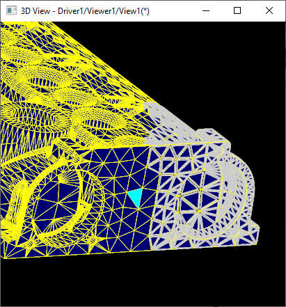

The [previous article](../2021-03-27/occt-minimal-viewer-setup/) has given a rapid introduction to the *Open CASCADE 3D Viewer* with a *Hello World* C++ sample showing viewer initialization.
Let's now take a deeper look into *AIS* (***Application Interactive Services***) classes and its basic concepts.

The article could be useful to beginners to complement or strengthen understanding of terms from
[Visualization User's Guide](https://dev.opencascade.org/doc/overview/html/occt_user_guides__visualization.html).

<!--break-->

## Viewers and Views

*OCCT* allows displaying the same scene from different viewpoints in multiple windows (***Views***) as well as multiple completely independent scenes (***Viewers***):

* `V3d_Viewer`<br>
  The *Viewer* defines the main scene contents (list of presentations).
  It is created using a specified graphic driver instance (`Graphic3d_GraphicDriver`) implementing a low-level rendering interface (like `OpenGl_GraphicDriver`).

* `V3d_View`<br>
  The *View* shows the *Viewer*'s contents from a specific camera position (`Graphic3d_Camera`)
  and is mapped to the native platform-specific window through the `Aspect_Window` interface
  (`WNT_Window` is a wrapper of *WinAPI* window on *Windows* platform, `Xw_Window` is *X11* window on *Linux* platform).
  `V3d_View` holds a `Graphic3d_CView` instance, which is a low-level interface for the specific graphic driver (like `OpenGl_View`).

The *Draw Harness* script below demonstrates creation of four `V3d_View` instances - three sharing the same `V3d_Viewer`/`AIS_InteractiveContext` instance and one extra *View* defining a dedicated *Viewer*.

|  |
|:--:|
| *Two viewers and four views.* |

```
pload MODELING VISUALIZATION
restore [locate_data_file occ/bottle.brep] b

# create 3 views (front/left/top)
vinit v1/front -left 100 -top 100
vviewcube vc
vdisplay -dispMode 0 b
vfront; vfit; vviewparams -scale 10

vinit v1/left  -left 500 -top 100 -cloneActive
Vleft;  vfit; vviewparams -scale 10

vinit v1/top   -left 100 -top 500 -cloneActive
vtop;   vfit; vviewparams -scale 10
vrenderparams -rendScale 2 -sync views

# create a dedicated viewer for a 4th view
vinit v2/axo   -left 500 -top 500
tcopy b bb
vdisplay -dispMode 1 bb
vaspect bb -material SILVER -isoOnTriangulation 1
vaxo;   vfit; vviewparams -scale 10
vzbufftrihedron
vrenderparams -rendScale 2
```

And here is a similar C++ pseudo-code:

```cpp
// graphic driver could be shared across multiple Viewers
Handle(OpenGl_GraphicDriver) aDriver = new OpenGl_GraphicDriver();
// first Viewer with 3 Views
Handle(V3d_Viewer) aViewer1 = new V3d_Viewer (aDriver);
aViewer1->SetDefaultLights();
aViewer1->SetLightOn();
// front View
Handle(V3d_View) aView11 = new V3d_View (aViewer1);
aView11->TriedronDisplay();
aView11->SetProj (V3d_TypeOfOrientation_Zup_Front);
aView11->SetWindow (theWindow11);
// left View
Handle(V3d_View) aView12 = new V3d_View (aViewer1);
aView12->TriedronDisplay();
aView12->SetProj (V3d_TypeOfOrientation_Zup_Left);
aView12->SetWindow (theWindow12);
// top View
Handle(V3d_View) aView13 = new V3d_View (aViewer1);
aView13->TriedronDisplay();
aView13->SetProj (V3d_TypeOfOrientation_Zup_Top);
aView13->SetWindow (theWindow13);
// second Viewer with 1 view
Handle(V3d_Viewer) aViewer2 = new V3d_Viewer (aDriver);
aViewer2->SetDefaultLights();
aViewer2->SetLightOn();
Handle(V3d_View) aView2 = new V3d_View (aViewer2);
aView2->SetWindow (theWindow2);
```

The following classes are tightly bound to the *Viewer*:

- `AIS_ViewController`<br>
  The *View Controller* is a handy class for redirecting user input (mouse movements, touchscreen touches, etc.) into camera manipulations and object picking / highlighting events.

- `Graphic3d_Camera`<br>
  The *Camera* object defines scene (`V3d_Viewer`) contents mapping onto the `V3d_View`.
  Camera parameters include eye position, view direction, up direction, orthographic or perspective projection, aspect ratio, field of view angle and near/far clipping planes of a view frustum.

- `Graphic3d_CLight`<br>
  *Light sources* (positional, directional, spot, ambient) could be defined per `V3d_View` or for all views within `V3d_Viewer`.

- `Graphic3d_ClipPlane`<br>
  The *clipping plane* cuts presentations and allows looking inside of geometry.
  The list of clipping planes could be assigned to a `V3d_View` instance, or to a specific `AIS_InteractiveObject`.
  This rendering algorithm doesn't perform an analytical Boolean operation on B-Rep geometry nor on triangulation and can be updated in a real time.

## Interactive Object

*AIS* applications display presentations as ***Interactive Objects***. The interface of such object is defined by `AIS_InteractiveObject` inheriting two base classes:

- `PrsMgr_PresentableObject`<br>
  Defines an interface of an object presentable onto the screen.

  `PrsMgr_PresentableObject::Compute()` is a key virtual method to be redefined.
  An object might have several presentations (`PrsMgr_Presentation`) defined by **Display Mode** (integer id) with *0* set by default.

  Object stores an instance of `Prs3d_Drawer` defining standard presentation attributes.

- `SelectMgr_SelectableObject`<br>
  Defines an object selectable by user input (mouse picking).

  `SelectMgr_SelectableObject::ComputeSelection()`  is a key virtual method to be redefined.
  An object might define several selections (`SelectMgr_Selection`) defined by **Selection Mode** (integer id) with *0* set by default.


`AIS_InteractiveContext` is one of the most important classes in *OCCT visualization* representing an entry point for the majority of functionality.
Context manages visibility of displayed objects (show/hide), their selection/detection state (unhighlighted / highlighted / temporary highlighted), active display mode and active selection modes.

- `AIS_InteractiveObject`<br>
  The *Interactive Object* is a selectable and presentable object managed by *Interactive Context*.

- `AIS_InteractiveContext`<br>
  The *Interactive Context* manages a list of interactive objects (`AIS_InteractiveObject`), their visibility, active Selection and Display Modes and other properties.
  *Context* is created for a single `V3d_Viewer` instance.

  *Context* holds an instance of `SelectMgr_SelectionManager` managing selectable entities,
  `StdSelect_ViewerSelector3d` defining picking logic and `AIS_Selection` defining a list of currently selected objects.
  It also stores an instance of `Prs3d_Drawer` defining global default presentation attributes.

`AIS_InteractiveContext::Display()` shows the object on the screen.
On first call, this method computes presentation, while further `AIS_InteractiveContext::Erase()`/`::Display()` calls
reuse cached presentation as long as it's contents was not invalidated by `PrsMgr_PresentableObject::SetToUpdate()`.
It is important to note the difference between `AIS_InteractiveContext::Erase()` and `AIS_InteractiveContext::Remove()` methods - the first one just sets the visibility flag to the object,
while the second completely removes object from context and clears it's cached presentations.

```cpp
Handle(AIS_InteractiveContext) theCtx = ...;
// display shape
TopoDS_Shape aShape1;
BRepTools::Read (aShape1, "shape1.brep", BRep_Builder());
Handle(AIS_Shape) aShapePrs = new AIS_Shape (aShape1);
theCtx->Display (aShapePrs, false);
theCtx->Viewer()->Update();
// recompute presentation from another shape
TopoDS_Shape aShape2;
BRepTools::Read (aShape2, "shape2.brep", BRep_Builder());
aShapePrs->SetShape (aShape2);
aShapePrs->SetToUpdate();
theCtx->Display (aShapePrs, false);
theCtx->Viewer()->Update();
// temporary hide object
theCtx->Erase (aShapePrs, false);
theCtx->Viewer()->Update();
// redisplay hidden object (no recomputing)
theCtx->Display (aShapePrs, false);
theCtx->Viewer()->Update();
// remove object (clear cached presentations)
theCtx->Remove (aShapePrs, false);
theCtx->Viewer()->Update();
```

*Objects* within `AIS_InteractiveContext` are defined in an unordered map, so that their ***drawing order is undefined*** by default
([Z depth buffer](https://en.wikipedia.org/wiki/Z-buffering) is used for [proper rendering](../2021-10-26-tkopengl-frame-render-graph/)),
but can be altered by display priorities and assigning *Layer* (see `Graphic3d_ZLayerId` / `PrsMgr_PresentableObject::ZLayer()`).

## Display Modes

Each *Interactive Object* may support a list of **Display Modes**, which are managed by an integer index.
Each display mode has an associated presentation, computed by `AIS_InteractiveObject::Compute()` method and stored (cached) inside `AIS_InteractiveObject`.
Only a single (active) *Display Mode* can be displayed on the screen as the main presentation of the object, and a one more *Display Mode* can be displayed on top of the main for *highlighting*.

*Computing* and recomputing presentations (*Display Modes*) is one of the most time consuming operations in displaying an object, but once computed (cached) they could be switched on-the-fly.
The number of supported *Display Modes* (see `PrsMgr_PresentableObject::AcceptDisplayMode()`) and their meaning depend on a specific interactive object class.
It is expected that an object implements at least *Display Mode* with *zero (0) index*.

`AIS_Shape` supports two *Display Modes* defined by `AIS_DisplayMode` enumeration - `AIS_Shaded` (*1*) and `AIS_Wireframe` (*0*)
 This object is a typical example of using different *Display Modes* for main presentation and highlighting,
 as a *wireframe* presentation is displayed on top of *shaded* presentation by default (see `PrsMgr_PresentableObject::HilightMode()`).

*Presentation* of specific *Display Mode* is computed during the first object display in this mode and then cached.
To *recompute* the presentation after some modifications it is necessary using `AIS_InteractiveContext::Redisplay()`
or `AIS_InteractiveObject::SetToUpdate()` + `AIS_InteractiveContext::Display()` calls.

|  |
|:--:|
| *`AIS_Shape` display modes: Wireframe (left), Shaded (middle) and Shaded + Wireframe highlighting (right)* |

```
pload MODELING VISUALIZATION
restore [locate_data_file occ/bottle.brep] b
vinit
vdisplay -dispMode 0 b
vfit
vdisplay -dispMode 1 b
vmoveto 200 200
```

It is a common mistake using `AIS_DisplayMode` enumeration for other interactive objects, as these modes are applicable only to `AIS_Shape` and it's subclasses,
although might be also mimicked by some other objects (check their documentation!).
Alas, this is the limitation of current API not reporting any error or warning on such API misuse.

```cpp
Handle(AIS_InteractiveContext) theCtx = ...;
TopoDS_Shape aShape;
BRepTools::Read (aShape, "shape1.brep", BRep_Builder());
Handle(AIS_Shape) aShapePrs = new AIS_Shape (aShape1);
// display shaded shape
aShapePrs->Attributes()->SetupOwnShadingAspect();
aShapePrs->Attributes()->ShadingAspect()
         ->SetMaterial (Graphic3d_NameOfMaterial_Bronze);
theCtx->Display (aShapePrs, AIS_Shaded, 0, false);
theCtx->Viewer()->Update();
// display wireframe
theCtx->Display (aShapePrs, AIS_Wireframe, 0, false);
theCtx->Viewer()->Update();
```

`Prs3d_Drawer` is another important class defining *presentation attributes* of an object:

- `Prs3d_Drawer`<br>
  *Drawer* is a map of standard presentation attributes (`Prs3d_BasicAspect`) managing computation of `PrsMgr_PresentableObject` presentation.
  *Drawer* may hold a *link* to another `Prs3d_Drawer` for inheriting properties in a cascade manner,
  in which case not overridden attributes are fetched from the link (which may also refer to another link).

- `Prs3d_BasicAspect`<br>
  This is a basic class for various presentation aspects of a specific domain (line, isoline, arrow, shaded surface, marker, etc.),
  normally storing a single `Graphic3d_Aspects` instance of rendering aspects plus a couple of computing attributes (like a number of isolines to display).
  Most notable aspects include:
  - `Prs3d_ShadingAspect`<br>
    *Shaded surface* presentation attributes (triangulations).
    - `Prs3d_LineAspect`<br>
      *Line* presentation attributes (curves, polylines).
    - `Prs3d_PointAspect`<br>
      *Marker* presentation attributes (points).

Some objects might define more than one *Drawer* like `AIS_ColoredShape` (assigning attributes to subshape) or define extra properties, which are not covered by `Prs3d_Drawer`.
Some properties are applicable to most / many presentable objects (like `Prs3d_Drawer::ShadingAspect()` allowing to set material to shaded triangulation),
while others are very object-specific (like `Prs3d_Drawer::DatumAspect()`) - in any case it would require checking which Drawer properties are actually used by specific presentation.
For example, `Prs3d_Drawer::UIsoAspect()` and `Prs3d_Drawer::UIsoAspect()` properties allow defining the number, color and style of *U*/*V* *isolines* of `AIS_Shape`'s wireframe presentation,
but apart from this presentations are not used anywhere else.

|  |
|:--:|
| *`AIS_Shape` with overridden `Prs3d_Drawer` parameters (material and number of isolines).* |

```
pload MODELING VISUALIZATION
psphere s 1
Vinit View1
vdisplay -dispMode 1 s
vfit
vaspects s -material COPPER
visos s 10 10 0
vmoveto 200 200
vpolygonoffset s 1 2 1
```

While modifying `Prs3d_Drawer` properties it is important to note that by default this map is defined ***empty***.
Internally, `Prs3d_Drawer::ShadingAspect()` would first check if this property was set to the *Drawer* (`Prs3d_Drawer::HasOwnShadingAspect()` flag) and if not,
it will return this property from *linked Drawer*, which would be a global `AIS_InteractiveContext::DefaultDrawer()` in case of displayed object (after `AIS_InteractiveContext::Display()`) or `NULL`.

*For versions earlier than OCCT 7.7.0, `Prs3d_Drawer::ShadingAspect()` and other similar properties did NOT return a `NULL` value before object is first displayed in Context;*
*instead a temporary object with default values was created and stored inside `Prs3d_Drawer` instance and returned.*

A common newbie's mistake is to modify `Prs3d_Drawer` properties at *AIS object* level without assigning them first
with help of `Prs3d_Drawer::SetShadingAspect()` or similar setter methods for other properties.
Skipping this setup wouldn't crash application, but would lead to the two undesired effects:

- *Applicable only to versions before OCCT 7.7.0: if an AIS object wasn't displayed yet, user modifications on temporary allocated properties would be lost.*
- If an *AIS object* was already displayed, modifying if unassigned properties would change global properties of the entire `AIS_InteractiveContext` and all displayed objects.

At the same time, `Prs3d_Drawer` properties should be set *before* displaying an object.
Otherwise, an *AIS object* should be explicitly recomputed after `Prs3d_Drawer` modifications.
There are some exceptions though for more advanced use cases (`AIS_InteractiveObject::SynchronizeAspects()`).

## Selection Modes

*Objects* in *AIS* are not just presentable but also selectable.
Object's selection properties are defined by activated **Selection Modes**.
*Selection Mode* is represented by an *integer number*, with *zero (0) mode* reserved for selection of an *entire object*.
Other modes (when supported) usually activate selection of the object's parts.

As in case of *Display Modes*, the meaning of *Selection Modes* depends on a specific *Interactive Object*.
For instance, `AIS_Shape` allows activation of sub-shapes of specific type (see `AIS_Shape::SelectionMode()`) - *Vertex (1), Edge (2), Wire (3), Face (4), Shell (5), Solid (6)*.

Selection/highlighting API in *AIS* operates with `SelectMgr_EntityOwner` objects, which is returned by methods like `AIS_InteractiveContext::DetectedOwner()`.
`SelectMgr_EntityOwner::Selectable()` refers to `AIS_InteractiveObject` it was created for, which is enough for identifying selection of entire object,
but when picking a subshape it is necessary to check information inside `SelectMgr_EntityOwner` (like `StdSelect_BRepOwner::Shape()` in case of `AIS_Shape`).

```cpp
Handle(AIS_InteractiveContext) theCtx = ...;
TopoDS_Shape aShape;
BRepTools::Read (aShape, "shape1.brep", BRep_Builder());
Handle(AIS_Shape) aShapePrs = new AIS_Shape (aShape1);
theCtx->Display (aShapePrs, AIS_Shaded, 0, false);
// activate sub-shape selection
theCtx->SetSelectionModeActive (aShapePrs,
                                AIS_Shape::SelectionMode (TopAbs_FACE),
                                true);
theCtx->SetSelectionModeActive (aShapePrs,
                                AIS_Shape::SelectionMode (TopAbs_VERTEX),
                                true);
// pick something in the viewer
theCtx->MoveTo (200, 200, theView, true);
Handle(SelectMgr_EntityOwner) aDetected = theCtx->DetectedOwner();
if (!aDetected.IsNull())
{
  Handle(AIS_InteractiveObject) aDetObject =
    Handle(AIS_InteractiveObject)::DownCast (aDetected->Selectable());
  theCtx->SetSelected (aDetected, false); // select owner
}
// fetch detected shape
Handle(StdSelect_BRepOwner) aDetShapeOwner =
  Handle(StdSelect_BRepOwner)::DownCast (aDetected);
if (!aDetShapeOwner.IsNull())
{
  TopoDS_Shape aDetSubShape = aDetShapeOwner->Shape();
}
```

|  |
|:--:|
| *`AIS_Shape` with activated selection of Faces and Vertices.* |

```
pload MODELING VISUALIZATION
restore [locate_data_file occ/bottle.brep] b
vinit View1
vdisplay -dispMode 1 b
vaspects b -faceBoundary 1
vfit
vselmode b FACE   1
vselmode b VERTEX 1
vselect 200 200
vmoveto 300 200
vrenderparams -msaa 8
```

Default *selection mode 0* normally indicates selection of the entire object, but practically speaking it is just a convention.
For instance, `AIS_ViewCube` enables picking of cube sides within it's default 0th mode as this is expected behavior of such type of object - there is no much point in picking an entire object here.
Other *interactive objects* might combine several logical parts in an application data model for performance reasons,
so that selectivity of individual parts within the *0th selection mode* would be also expected behavior, although it would break one-to-one relationship between *AIS object* and data model object.

## Standard Objects

*OCCT* provides plenty of standard *AIS objects* to start development of your own application rapidly.
The objects could be split into the following groups:

- **Shapes** [`AIS_KindOfInteractive_Shape`]<br>
  Objects of this group are designed to display a topological shape (`TopoDS_Shape`), although could be effectively used to display arbitrary triangulations.
  `AIS_Shape` is the simplest presentation, `AIS_ColoredShape` allows assigning different colors to sub-shapes
  and `XCAFPrs_AISObject` allows displaying a shape from *XCAF* document with mapped materials.
  - `AIS_Shape`, `AIS_ColoredShape`, `XCAFPrs_AISObject`.<br>
    

- **Objects** [`AIS_KindOfInteractive_Object`]<br>
  Various 3D objects not connected to topological geometry like *Point Clouds* (`AIS_PointCloud`) or mesh with *FEA*/*FEM* properties (`MeshVS_Mesh`).
  - `AIS_PointCloud`, `AIS_Triangulation`, `MeshVS_Mesh`.<br>
    

- **Widgets** [`AIS_KindOfInteractive_None`, `AIS_KindOfInteractive_LightSource`]<br>
  A set of objects used as 2D or 3D user interface elements and manipulators.
  Some widgets might implement clickable behavior (`SelectMgr_EntityOwner::HandleMouseClick()`) like `AIS_ViewCube`
  or draggable behavior (`AIS_InteractiveObject::ProcessDragging()`) like `AIS_Manipulator`.
  - `AIS_ColorScale`, `AIS_LightSource`, `AIS_Manipulator`, `AIS_MediaPlayer`, `AIS_RubberBand`, `AIS_TextLabel`, `AIS_ViewCube`, `AIS_CameraFrustum`, `AIS_XRTrackedDevice`<br>
    <br>

- **Datums** [`AIS_KindOfInteractive_Datums`]<br>
  Objects for displaying guidelines and complementary information to displayed/constructed geometry.
  - `AIS_Axis`, `AIS_Circle`, `AIS_Line`, `AIS_Plane`, `AIS_PlaneTrihedron`, `AIS_Point`, `AIS_Trihedron`.<br>
    

- **Dimensions** [`AIS_KindOfInteractive_Dimension`]<br>
  A set of classes inheriting `PrsDim_Dimension` for visual representation of dimension information.
  - `PrsDim_Dimension` (`PrsDim_AngleDimension`, `PrsDim_DiameterDimension`, `PrsDim_LengthDimension`, `PrsDim_RadiusDimension`)<br>
    

- **Relations** [`AIS_KindOfInteractive_Relation`]<br>
  A set of classes inheriting `PrsDim_Relation` for visual representation of relations between various geometry elements.
  - 

- **Connections**<br>
  Special *AIS objects* intended to display instanced and connected objects.
  With the help of `AIS_ConnectedInteractive`, the same `AIS_Shape` could be displayed multiple times at different locations without duplicating geometry.
  - `AIS_ConnectedInteractive`, `AIS_MultipleConnectedInteractive`.

New users are often curious - how to associate a standard *AIS object* with an application-specific data model? The common solutions include:

- `AIS_InteractiveObject::SetOwner()`/`::GetOwner()`<br>
  This property stores a `Handle(Standard_Transient)` object (a smart-pointer) which practically means any opaque object.
  The template classes `NCollection_Shared` and `NCollection_Handle` could be used to wrap application-defined class.
- Subclass an *AIS object* and add extra properties to it.
  - In addition, the application might also subclass `SelectMgr_EntityOwner` object and `AIS_InteractiveObject::ComputeSelection()` method to put information directly into selectable owners.
- Manage a dedicated map at application level between *AIS* and application data model.

While not part of an open-source framework, *Open Cascade* also provides a set of packages for embedding into *AIS* viewer *PMI annotations* (more advanced than provided by `PrsDim`),
large-scale point clouds, volumetric data (from computer tomography) and others.

## Further reading

This article described basic 3D Viewer classes and usage of existing *AIS interactive objects*.
While the list of built-in presentations might look exhaustive for a common application, actually - it is just a beginning of *OCCT* capabilities.
*AIS* provides a flexible interface for customizing behavior and visual look of existing objects through sub-classing,
as well as defining completely new presentations with application-specific properties.

The next session would show how to write an own *AIS object*.
