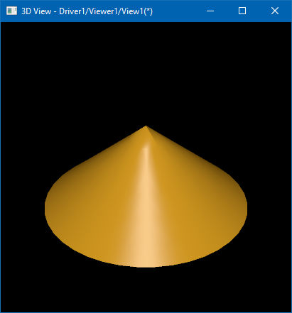

Previous article provided an [introduction into AIS](https://unlimited3d.wordpress.com/2021/11/08/application-interactive-services-or-ais/)
(***Application Interactive Services***) from the high-level point of view.
*OCCT* provides a strong set of built-in *Interactive Objects* for rapid application development,
but the real power and flexibility of *AIS* could be revealed by subclassing and implementing custom presentations.

In this article we will focus on the development of a custom `AIS_InteractiveObject` and show the basics step by step.
So that it will look more like a tutorial and you are encouraged to try to follow the described steps and repeat the experiment on your own.

<!--break-->

Let's start from the very beginning and try subclassing `AIS_InteractiveObject` object:

```cpp
class MyAisObject : public AIS_InteractiveObject
{
  DEFINE_STANDARD_RTTI_INLINE(MyAisObject, AIS_InteractiveObject)
public:
  MyAisObject() {}
public:
  virtual void Compute(const Handle(PrsMgr_PresentationManager)& thePrsMgr,
                       const Handle(Prs3d_Presentation)& thePrs,
                       const Standard_Integer theMode) override {}

  virtual void ComputeSelection(const Handle(SelectMgr_Selection)& theSel,
                                const Standard_Integer theMode) override {}

  virtual bool AcceptDisplayMode(const Standard_Integer theMode) const override
  { return true; }
};
```

`DEFINE_STANDARD_RTTI_INLINE()` macros will register the new class within the *OCCT Run-Time Type Information* (*RTTI*) system.
This step is *optional* (you may skip it if you are not going to use methods like `Standard_Transient::DynamicType()` in application code),
but it is a common practice while subclassing *OCCT* classes.

The `AIS_InteractiveObject` interface defines only a couple of pure *virtual methods* - `::Compute()` defining an object presentation and `::ComputeSelection()` defining a selectable (pickable) volume.
Selection and presentation are two independent mechanisms in *AIS*.
Presentation rendering is done with help of *OpenGL* or a similar low-level graphics library, while selection doesn't depend on a graphic driver at all.
Providing an empty implementation of these two methods would be enough for adding the object to `AIS_InteractiveContext` (`::Display()`), but obviously nothing will appear on the screen.

## Presentation builders

To go ahead, we need to define some presentation of our object.
*OCCT* provides a set of presentation building tools for common elements like arrows, shapes, boxes, etc.
These tools could be found within `Prs3d`, `StdPrs` and `DsgPrs` packages:

- `Prs3d`<br>
  Provides builders for *simple geometric elements*.
  - `Prs3d_Arrow`, `Prs3d_BndBox`, `Prs3d_Point`, `Prs3d_Text`, `Prs3d_ToolCylinder`, `Prs3d_ToolDisk`, `Prs3d_ToolSector`, `Prs3d_ToolSphere`, `Prs3d_ToolTorus`.
- `StdPrs`<br>
  Provides builders for *analytical geometry* and *B-Rep shapes* (`TopoDS_Shape`).
  - `StdPrs_WFShape`, `StdPrs_ShadedShape`, `StdPrs_BRepTextBuilder`.
- `DsgPrs`<br>
  Provides builders for *datums*, *dimensions* and *relations*.

Presentation builders are reusable bricks for constructing *AIS* objects.
Standard *OCCT* interactive objects highly rely on them, so that you may easily replicate `AIS_Shape` presentation for displaying a shape with just a couple of lines calling `StdPrs_ShadedShape`:

```cpp
void MyAisObject::Compute(const Handle(PrsMgr_PresentationManager)& thePrsMgr,
                          const Handle(Prs3d_Presentation)& thePrs,
                          const Standard_Integer theMode)
{
  TopoDS_Shape aShape = BRepPrimAPI_MakeCone (100.0, 0.0, 100.0);
  StdPrs_ShadedShape::Add (thePrs, aShape, myDrawer);
}
...
Handle(AIS_InteractiveContext) theCtx;
Handle(MyAisObject) aPrs = new MyAisObject();
theCtx->Display(aPrs, true);
```

|  |
|:--:|
| *Custom AIS object - `StdPrs_ShadedShape`.* |

`PrsMgr_PresentableObject::Compute()` method takes three arguments:

- Presentation Manager (`PrsMgr_PresentationManager`).<br>
  Rarely used parameter, but might be necessary for some advanced use cases.
- Presentation (`Prs3d_Presentation` or `Graphic3d_Structure`).<br>
  Defines the structure to fill in with presentation elements.
- **Display Mode** (integer number).<br>
  Defines the active display mode to compute.

For each supported *display mode*, the *Presentation Manager* creates a dedicated `Prs3d_Presentation`
and stores it within the object itself as a list of presentations `PrsMgr_PresentableObject::Presentations()`.
It is a good practice to reject unsupported display modes within `::Compute()` method:

```cpp
void MyAisObject::Compute(const Handle(PrsMgr_PresentationManager)& thePrsMgr,
                          const Handle(Prs3d_Presentation)& thePrs,
                          const Standard_Integer theMode)
{
  if (theMode != 0) { return; } // !!! reject non-zero display modes !!!

  TopoDS_Shape aShape = BRepPrimAPI_MakeCone(100.0, 0.0, 100.0);
  StdPrs_ShadedShape::Add(thePrs, aShape, myDrawer);
}
```

This wouldn't, however, prevent application from displaying the object with another display mode like this:

```cpp
Handle(AIS_InteractiveContext) theCtx = ...;
Handle(MyAisObject) aPrs = new MyAisObject();
theCtx->Display (aPrs, 100, -1, true);
```

The code above will display `MyAisObject` with *display mode* equal to *100*, and after `::Compute()` modifications nothing will be displayed on the screen.
*AIS* will still create a presentation with specified *display mode*, but it will be empty - method `::AcceptDisplayMode()`
should be overridden to disallow even creation of an empty presentation:

```cpp
bool MyAisObject::AcceptDisplayMode(const Standard_Integer theMode) const
{
  return theMode == 0; // reject non-zero display modes
}
```

`AIS_InteractiveContext::Display()` checks if requested display mode is actually supported by the object, and uses *default display mode* (*0*) if it is not.

`StdPrs_ShadedShape` prepares a shaded (triangulated) presentation of a shape, while `StdPrs_WFShape` creates a wireframe presentation with B-Rep wire boundaries:

```cpp
void MyAisObject::Compute(const Handle(PrsMgr_PresentationManager)& thePrsMgr,
                          const Handle(Prs3d_Presentation)& thePrs,
                          const Standard_Integer theMode)
{
  if (theMode != 0) { return; }

  TopoDS_Shape aShape = BRepPrimAPI_MakeCone(100.0, 0.0, 100.0);
  StdPrs_ShadedShape::Add(thePrs, aShape, myDrawer); // add shading
  StdPrs_WFShape    ::Add(thePrs, aShape, myDrawer); // add wireframe
}
```

|  |
|:--:|
| *Custom AIS object - `StdPrs_ShadedShape`+`StdPrs_WFShape`.* |

Presentation builders take the `Prs3d_Drawer` object defining various attributes - material of shaded shape, number of isolines in wireframe mode, tessellation quality, line colors and many others.
`PrsMgr_PresentableObject` defines `myDrawer` property with default attributes.

`StdPrs` makes it easy to display topological shapes. With the help of `Prs3d` tools we may display elements like arrows, boxes or text labels.
Let's extend our presentation with a second display mode 1 showing a bounding box using `Prs3d_BndBox` builder:

```cpp
bool MyAisObject::AcceptDisplayMode(const Standard_Integer theMode) const
{
  return theMode == 0 || theMode == 1;
}
void MyAisObject::Compute(const Handle(PrsMgr_PresentationManager)& thePrsMgr,
                          const Handle(Prs3d_Presentation)& thePrs,
                          const Standard_Integer theMode)
{
  TopoDS_Shape aShape = BRepPrimAPI_MakeCone(100.0, 0.0, 100.0);
  if (theMode == 0)
  {
    StdPrs_ShadedShape::Add(thePrs, aShape, myDrawer);
    StdPrs_WFShape    ::Add(thePrs, aShape, myDrawer);
  }
  else if (theMode == 1)
  {
    Bnd_Box aBox;
    BRepBndLib::Add(aShape, aBox);
    Prs3d_BndBox::Add(thePrs, aBox, myDrawer);
  }
}
```

Now, displaying an object with *display mode* `1` will show a box:

```cpp
Handle(AIS_InteractiveContext) theCtx = ...;
Handle(MyAisObject) aPrs = new MyAisObject();
theCtx->Display(aPrs, 1, 0, true);
```

|  |
|:--:|
| *Custom AIS object - `Prs3d_BndBox`.* |

*AIS* disallows activating multiple display modes at the same time, so that these presentation modes should be alternatives to each other.
But *AIS* may use non-active display mode for highlighting purposes - like wireframe (`AIS_Wireframe`) presentation displayed on top of shaded (`AIS_Shaded`) presentation for selected `AIS_Shape` objects.

Let's define a dedicated enumeration for display modes supported by our interactive object and setup the 1st (`MyDispMode_Highlight`)
display mode for highlighting with help of `PrsMgr_PresentableObject::SetHilightMode()`:

```cpp
class MyAisObject : public AIS_InteractiveObject
{
public:
  enum MyDispMode { MyDispMode_Main = 0, MyDispMode_Highlight = 1 };
...
MyAisObject::MyAisObject()
{
  SetDisplayMode(MyDispMode_Main);      // !!! main (active) display mode !!!
  SetHilightMode(MyDispMode_Highlight); // !!! auxiliary (highlighting) mode !!!
}
...
Handle(AIS_InteractiveContext) theCtx = ...;
Handle(MyAisObject) aPrs = new MyAisObject();
theCtx->Display(aPrs, MyAisObject::MyDispMode_Main, 0, false);
theCtx->HilightWithColor(aPrs, aPrs->HilightAttributes(), false);
theCtx->CurrentViewer()->Redraw();
```

| <span> </span> |
|:--:|
| *Custom AIS object - highlighting by color (left)<br>and highlighting by another display mode (right).* |

*In this particular use case we've used the method `AIS_InteractiveContext::HilightWithColor()`*
*instead of `::SetSelected()` - just because our object is not selectable yet and `::SetSelected()` wouldn't work.*

Highlighted presentation appears on the screen with modulated color (see left screenshot above).
Using a dedicated display mode for highlighting (right screenshot above) allows customizing presentation in selected / highlighted states.

## Primitive arrays

`Prs3d_Presentation` might be filled in by the following primitives:

- **Triangles**
  - `Graphic3d_ArrayOfTriangles`
  - `Graphic3d_ArrayOfTriangleFans`
  - `Graphic3d_ArrayOfTriangleStrips`
- **Lines**
  - `Graphic3d_ArrayOfSegments`
  - `Graphic3d_ArrayOfPolylines`
- **Points** or **Markers**
  - `Graphic3d_ArrayOfPoints`

This triplet of primitives is what graphics hardware is capable of rendering, so that it could be transferred directly to low-level graphics libraries in the form of *Vertex Buffer Objects* (*VBO*).
Each primitive array consists of an array of vertex attributes (position, normal, texture coordinates, vertex colors, etc.) and optional array of indices.
The latter one avoids duplicating vertices shared between connected elements (triangles, polylines) in attributes array.

`Graphic3d_ArrayOfPrimitives` and it's subclasses provide a convenient interface for filling in primitive arrays:

- Constructor takes a number of vertices, number of edges (indices) and a bitmask of optional vertex attributes.
- `Graphic3d_ArrayOfPrimitives::AddVertex()` appends a vertex with specified attributes to the end of the array (within the range specified at construction time).
- `Graphic3d_ArrayOfPrimitives::AddEdges()` appends indices, starting with *1*.
  Each line segment is defined by two consequential edges, each triangle is defined by three consequential edges.

Let's extend our sample and display a cone section contour defined by array of indexed segments (e.g. a polyline of three vertices):

```cpp
void MyAisObject::Compute(const Handle(PrsMgr_PresentationManager)& thePrsMgr,
                          const Handle(Prs3d_Presentation)& thePrs,
                          const Standard_Integer theMode)
{
  const double aRadius = 100.0, aHeight = 100.0;
  TopoDS_Shape aShape = BRepPrimAPI_MakeCone(aRadius, 0.0, aHeight);
  if (theMode == MyDispMode_Main)
  {
    StdPrs_ShadedShape::Add(thePrs, aShape, myDrawer);
    //StdPrs_WFShape::Add(thePrs, aShape, myDrawer);
    Handle(Graphic3d_ArrayOfSegments) aSegs =
      new Graphic3d_ArrayOfSegments(3, 3 * 2, Graphic3d_ArrayFlags_None);
    aSegs->AddVertex(gp_Pnt(0.0, 0.0, aHeight));
    aSegs->AddVertex(gp_Pnt(0.0, -aRadius, 0.0));
    aSegs->AddVertex(gp_Pnt(0.0,  aRadius, 0.0));
    aSegs->AddEdges(1, 2);
    aSegs->AddEdges(2, 3);
    aSegs->AddEdges(3, 1);
    Handle(Graphic3d_Group) aGroupSegs = thePrs->NewGroup();
    aGroupSegs->SetGroupPrimitivesAspect(myDrawer->WireAspect()->Aspect());
    aGroupSegs->AddPrimitiveArray(aSegs);
  }
  else if (theMode == MyDispMode_Highlight) { ... }
}
```

|  |
|:--:|
| *Custom AIS object - displaying `Graphic3d_ArrayOfSegments`.* |

The process is quite straightforward:

- Create a new `Graphic3d_Group` using `Prs3d_Presentation::NewGroup()`;
- Specify presentation aspects using `Graphic3d_Group::SetGroupPrimitivesAspect()`;
- Create and add an array of primitives using `Graphic3d_Group::AddPrimitiveArray()`.

Standard presentation builders like `StdPrs_ShadedShape`/`StdPrs_WFShape` internally do exactly the same thing - a tessellated representation of a shape
is added to presentation in form of triangles (shaded), line segments (wireframe and free edges) and markers (free shape vertices).

A single `Graphic3d_Group` normally defines just a single primitive array, but it is technically possible adding more arrays
to the same group `Graphic3d_Group::AddPrimitiveArray()` and with different aspects `Graphic3d_Group::SetPrimitivesAspect()`, which might be considered in advanced scenarios.

Method `Graphic3d_Group::AddText()` allows adding text labels to a presentation.
Internally, text labels are rendered as an array of textured triangles using texture atlas created from a font, but this complex logic is hidden from the user.

## Primitive aspects

`Graphic3d_Aspects` is a class defining display properties of a *primitive array* (`Graphic3d_Group::SetGroupPrimitivesAspect()`) - material,
shading model, color, texture maps, blending mode, line width and others.

There are also subclasses `Graphic3d_AspectFillArea3d` (triangles), `Graphic3d_AspectLine3d` (lines), `Graphic3d_AspectMarker3d` (markers)
and `Graphic3d_AspectText3d` (text labels) defined for as specializations for a specific primitive array type.
These subclasses exist for historical reasons and are treated by renderers in exactly the same way.

It is technically possible to create transient aspects directly within `::Compute()` method like this:

```cpp
void MyAisObject::Compute(const Handle(PrsMgr_PresentationManager)& thePrsMgr,
                          const Handle(Prs3d_Presentation)& thePrs,
                          const Standard_Integer theMode)
{
  Handle(Graphic3d_Aspects) anAspects = new Graphic3d_Aspects();
  anAspects->SetShadingModel(Graphic3d_TypeOfShadingModel_Unlit);
  anAspects->SetColor(Quantity_NOC_RED);
  Handle(Graphic3d_Group) aGroup = thePrs->NewGroup();
  aGroup->SetGroupPrimitivesAspect(anAspects);
  ...
}
```

While this code would work as expected, it is considered as a bad practice for several reasons.
It is better to separate a logic defining aspects and computing presentation.
Instead, it is preferred taking attributes from `PrsMgr_PresentableObject::myDrawer` / `::Attributes()` or storing custom attributes as class fields.
`Prs3d_Drawer` defines a set of attributes used by *AIS presentation builders*, but the same parameters might be used by a custom builder as well.

It is also preferred to preallocate attributes in the class constructor.
This would allow changing attributes without recomputing the entire presentation - just by calling `PrsMgr_PresentableObject::SynchronizeAspects()` after modifications.

Our custom object uses `myDrawer->ShadingAspect()` and `myDrawer->WireAspect()` aspects, so let's initialize them explicitly - assign silver material for shading and green color to line segments:

```cpp
MyAisObject::MyAisObject()
{
  SetHilightMode(MyDispMode_Highlight);
  myDrawer->SetupOwnShadingAspect();
  myDrawer->ShadingAspect()->SetMaterial(Graphic3d_NameOfMaterial_Silver);
  myDrawer->SetWireAspect(
    new Prs3d_LineAspect(Quantity_NOC_GREEN, Aspect_TOL_SOLID, 2.0));
}
```

## Quadric builders

Previously, we've used `StdPrs_ShadedShape` for displaying cylinder geometry.
The `Prs3d` package provides a simpler way for displaying geometry like *cylinders*, *spheres* and *toruses* - based on the `Prs3d_ToolQuadric` interface.
This interface allows bypassing creation of a complex B-Rep (`TopoDS_Shape`) definition of a simple geometry, and to avoid using general-purpose tessellators like `BRepMesh`.

*This difference could be negligible for a small number of such objects, but might become considerable for larger amounts.*
*The B-Rep definition of a valid cylinder includes 2 unique `TopoDS_Vertex`, 3 `TopoDS_Edge`, 3 `TopoDS_Wire`, 3 `TopoDS_Face`, 1 `TopoDS_Shell` and 1 `TopoDS_Solid`.*
*Internally each `TopoDS_Edge` also defines curves (`Geom_Curve` as well as 2D parametric `Geom2d_Curve`) and each `TopoDS_Face` defines analytical surface (`Geom_Surface`).*
*Meshing such geometry with the help of `BRepMesh` is much more complicated than one may think.*
*A plenty of data structures (memory!) and computations (time!) for displaying a geometry that could be triangulated by a simple for loop.*

`Prs3d_ToolQuadric` solves this problem by creating a triangulation for such kinds of shapes in a straight-forward way.
Let's try using `Prs3d_ToolCylinder` in our sample:

```cpp
void MyAisObject::Compute(const Handle(PrsMgr_PresentationManager)& thePrsMgr,
                          const Handle(Prs3d_Presentation)& thePrs,
                          const Standard_Integer theMode)
{
  const double aRadius = 100.0, aHeight = 100.0;
  TopoDS_Shape aShape = BRepPrimAPI_MakeCone(aRadius, 0.0, aHeight);
  if (theMode == MyDispMode_Main)
  {
    //StdPrs_ShadedShape::Add(thePrs, aShape, myDrawer); // add shading
    //StdPrs_WFShape::Add(thePrs, aShape, myDrawer); // add wireframe
    Handle(Graphic3d_ArrayOfTriangles) aTris =
     Prs3d_ToolCylinder::Create(aRadius, 0.0, aHeight, 10, 10, gp_Trsf());
    Handle(Graphic3d_Group) aGroupTris = thePrs->NewGroup();
    aGroupTris->SetGroupPrimitivesAspect(myDrawer->ShadingAspect()->Aspect());
    aGroupTris->AddPrimitiveArray(aTris);
    ...
  }
  ...
}
```

|  |
|:--:|
| *Custom AIS object - `Prs3d_ToolCylinder` (10 slices).* |

Well... that looks a little bit edgy. *Quadric builder* creates a triangulation taking the following parameters:

- Geometry parameters.<br>
  (in case of a cylinder - base radius, top radius and height).
- Number of subdivisions along U (slices) and V (stacks) parameters.<br>
  In some cases only one parametric scope matters.
- Transformation **gp\_Trsf** to apply<br>
  (default geometry is defined within some reference coordinate system).

Let's increase number of subdivisions from *10* to *25*:

```cpp
    Handle(Graphic3d_ArrayOfTriangles) aTris =
     Prs3d_ToolCylinder::Create(aRadius, 0.0, aHeight, 25, 25, gp_Trsf());
```

|  |
|:--:|
| *Custom AIS object - `Prs3d_ToolCylinder` (25 slices).* |

It looks much better now! It might look confusing to use `Prs3d_ToolCylinder` for building a cone, but the tool handles both cone and cylinder definitions.

Taking a look at the model from the other side reveals one issue - our cone doesn't have a bottom anymore:

|  |
|:--:|
| *Custom AIS object - `Prs3d_ToolCylinder`, a bottom side.* |

To fix this problem we will use one more quadric builder `Prs3d_ToolDisk`:

```cpp
void MyAisObject::Compute(const Handle(PrsMgr_PresentationManager)& thePrsMgr,
                          const Handle(Prs3d_Presentation)& thePrs,
                          const Standard_Integer theMode)
{
  const double aRadius = 100.0, aHeight = 100.0;
  if (theMode == MyDispMode_Main)
  {
    Prs3d_ToolCylinder aCyl(aRadius, 0.0, aHeight, 25, 25);
    Prs3d_ToolDisk aDisk(0.0, aRadius, 25, 1);
    Handle(Graphic3d_ArrayOfTriangles) aTris =
      new Graphic3d_ArrayOfTriangles(aCyl.VerticesNb() + aDisk.VerticesNb(),
                                     (aCyl.TrianglesNb() + aDisk.TrianglesNb()) * 3,
                                     Graphic3d_ArrayFlags_VertexNormal);
    aCyl .FillArray(aTris, gp_Trsf());
    aDisk.FillArray(aTris, gp_Trsf());
    Handle(Graphic3d_Group) aGroupTris = thePrs->NewGroup();
    aGroupTris->SetGroupPrimitivesAspect(myDrawer->ShadingAspect()->Aspect());
    aGroupTris->AddPrimitiveArray(aTris);
    aGroupTris->SetClosed(true);
   ...
  }
}
```

Now our cone looks solid! The sample above merges two triangulations into a single one instead of appending each primitive array individually.
This looks like a minor difference, but it might have a dramatic impact on performance in case of a large scene.
The article about [TKOpenGl Frame Render Graph](https://unlimited3d.wordpress.com/2021/10/26/tkopengl-frame-render-graph/)
roughly describes how groups of primitive arrays are mapped onto *OpenGL renderer* and why this affects performance.

|  |
|:--:|
| *Custom AIS object - `Prs3d_ToolCylinder`+`Prs3d_ToolDisk`.* |

## Graphics memory and OpenGL

Development of custom *AIS interactive objects* doesn't involve direct usage of the *OpenGL library*.
Low-level rendering code remains hidden behind the `Graphic3d_GraphicDriver` layer, which allows development of a portable application.
However, knowing how presentation computed by *AIS* is mapped onto lower-level graphics API might be useful in solving performance issues.

Primitive arrays `Graphic3d_ArrayOfPrimitives` passed to `Prs3d_Presentation` will be later sent to a graphics driver
in the form of *Vertex Buffer Objects* (*VBO*) and uploaded onto dedicated graphics memory for efficient rendering.

However, the API used for filling in presentations within `AIS_InteractiveObject::Compute()`
and similar *AIS* methods don't involve any direct interaction with the *OpenGL library* - `Graphic3d_Group::Clear()` doesn't immediately destroy old *VBOs*
and `Graphic3d_Structure::AddPrimitiveArray()` doesn't immediately allocate new *VBOs*.

Interactions with *OpenGL* are postponed till the drawing of the next frame - unused GPU memory resources are released at the beginning,
while GPU uploads are done before drawing a primitive array for the first time.
Once uploaded, the `Graphic3d_ArrayOfPrimitives` instance passed to `OpenGl_Group` is released (e.g. `Handle` is NULLified).

Texture maps defined by `Graphic3d_Aspects` are passed through the similar workflow - image data is loaded from file and decoded into CPU memory on demand
(e.g. when texture is needed for rendering something) through `Graphic3d_TextureRoot::GetImage()` interface, then uploaded to GPU memory and released from CPU memory.

## Further reading

In this part of the tutorial we have created a simple `AIS_InteractriveObject` computing a simple custom presentation.
But the presentation defines only a half of the interface inherited from `PrsMgr_PresentableObject::Compute()` - our object is still not interactive.

In the [next article](../2021-11-16-ais-object-computing-selection/) we will make our object selectable and implement `SelectMgr_SelectableObject::ComputeSelection()` interface.
