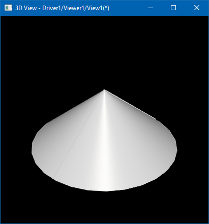
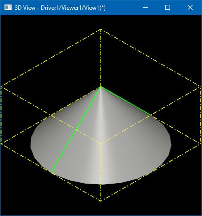
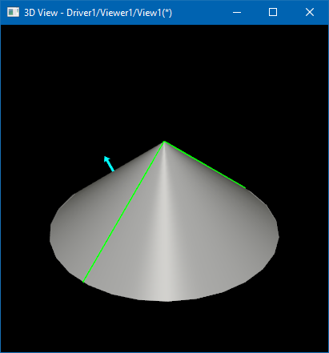
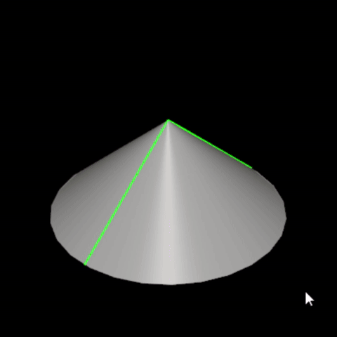

In the [first part of the tutorial](../2021-11-16/ais-object-computing-presentation/) we have created a custom *AIS object* `MyAisObject`
computing presentation by implementing the `PrsMgr_PresentableObject::Compute()` interface.

In this part we will extend our object with interactive capabilities and make it *selectable* through implementing `SelectMgr_SelectableObject` interface.

<!--break-->

Let's do the first step and put into `::ComputeSelection()` method some logic.
This method should fill in the `SelectMgr_Selection` argument with `SelectMgr_SensitiveEntity` entities defining selectable elements - triangulations, polylines, points and their composition.
`Select3D_SensitiveBox` is probably the simplest way to define selectable volume - by it’s bounding box:

```cpp
void MyAisObject::ComputeSelection(const Handle(SelectMgr_Selection)& theSel,
                                   const Standard_Integer theMode)
{
  const double aRadius = 100.0, aHeight = 100.0;
  TopoDS_Shape aShape = BRepPrimAPI_MakeCone(aRadius, 0.0, aHeight);
  Bnd_Box aBox;
  BRepBndLib::Add(aShape, aBox);
  Handle(SelectMgr_EntityOwner) anOwner  = new SelectMgr_EntityOwner(this);
  Handle(Select3D_SensitiveBox) aSensBox = new Select3D_SensitiveBox(anOwner, aBox);
  theSel->Add(aSensBox);
}
```

`SelectMgr_EntityOwner` is a key object in selection logic - it serves as an *identifier* of a pickable object or it's part.
You may see this object in methods like `AIS_InteractiveContext::DetectedOwner()`,
*Owners* are stored within the list of selection objects `AIS_Selection` and it received by methods like `AIS_InteractiveContext::SetSelected()` and `AIS_InteractiveContext::AddOrRemoveSelected()`.
From the *Selector's* point of view, `AIS_InteractiveObject` is just a drawer for `SelectMgr_EntityOwner`.

The *0th selection mode* normally defines a single *Owner* of the entire object.
To make a composite object selectable as whole, we add to *Selection* as many *SensitiveEntity* as necessary referring to the same **Owner**.
It might look confusing from first glance, that `SelectMgr_SensitiveEntity` stores `SelectMgr_EntityOwner` as a class field,
and not in the opposite way (`SelectMgr_EntityOwner` doesn't store the list of `SelectMgr_SensitiveEntity` defining it's picking volume).

For *local selection* (selection of object's parts) we create individual **Owners** for each part and add **SensitiveEntity** to *Selection* in the same way.
*Owner* may store an additional identifier as a class field, like `StdSelect_BRepOwner` stores `TopoDS_Shape` as an identifier of picked sub-shape with `AIS_Shape` object.

As `StdPrs_ShadedShape` serves as presentation builder for shapes, `StdSelect_BRepSelectionTool` computes selection of `TopoDS_Shape`:

```cpp
void MyAisObject::ComputeSelection(const Handle(SelectMgr_Selection)& theSel,
                                   const Standard_Integer theMode)
{
  const double aRadius = 100.0, aHeight = 100.0;
  TopoDS_Shape aShape = BRepPrimAPI_MakeCone(aRadius, 0.0, aHeight);
  Standard_Real aDefl =
    StdPrs_ToolTriangulatedShape::GetDeflection(aShape, myDrawer);
  StdSelect_BRepSelectionTool::Load(theSel, this, aShape, TopAbs_SHAPE, aDefl,
                                    myDrawer->DeviationAngle(),
                                    myDrawer->IsAutoTriangulation());
}
```

Internally, `StdSelect_BRepSelectionTool` iterates over sub-shapes and appends to *Selection* entities like `Select3D_SensitiveTriangulation` (for faces) and `Select3D_SensitiveCurve` (for edges).

Previously, we have used `Prs3d_ToolCylinder` to triangulate a cone, so let's try to construct `Select3D_SensitivePrimitiveArray` from the same triangulation:

```cpp
void MyAisObject::ComputeSelection(const Handle(SelectMgr_Selection)& theSel,
                                   const Standard_Integer theMode)
{
  const double aRadius = 100.0, aHeight = 100.0;
  Handle(SelectMgr_EntityOwner) anOwner = new SelectMgr_EntityOwner(this);
  Handle(Graphic3d_ArrayOfTriangles) aTris =
    Prs3d_ToolCylinder::Create(aRadius, 0.0, aHeight, 25, 25, gp_Trsf());
  Handle(Select3D_SensitivePrimitiveArray) aSensTri =
    new Select3D_SensitivePrimitiveArray(anOwner);
  aSensTri->InitTriangulation(aTris->Attributes(), aTris->Indices(),
                              TopLoc_Location());
  theSel->Add(aSensTri);
}
```

*Selection* is computed independently from presentation, so that they don't have to match each other.
But inconsistency between presentation and selection might confuse the user, when he will not be able to pick an object clearly displayed under the mouse cursor.
These issues might happen, for example, when selection uses tessellated representation of the same geometry computed with different parameters
(different number of subdivisions, or different deflection parameters).

As in case of `::Compute()`, it makes sense defining some enumeration of selection modes supported by specific object and reject unsupported ones to avoid unexpected behavior:

```cpp
void MyAisObject::ComputeSelection(const Handle(SelectMgr_Selection)& theSel,
                                   const Standard_Integer theMode)
{
  if (theMode != 0) { return; }
  ...
}
```

Unlike *display modes*, `AIS_InteractiveContext` allows activating an *arbitrary combination of selection modes*.
Application should be careful to activate only the modes that actually make sense and may work together.

*Selection mode* to activate could be specified while displaying the object (passing `-1` instead of `0` would display an object with deactivated selection):

```cpp
Handle(AIS_InteractiveContext) theCtx = ...;
Handle(MyAisObject) aPrs = new MyAisObject();
theCtx->Display(aPrs, MyAisObject::MyDispMode_Main, 0, false);
```

Later on `AIS_InteractiveContext::SetSelectionModeActive()`, or it's wrappers `AIS_InteractiveContext::Activate()` and `AIS_InteractiveContext::Deactivate()`,
could be used to enable or disable desired selection modes one by one.

## Highlighting selection owner

As has been mentioned in the previous section, `SelectMgr_EntityOwner` is a key object which can be used as an identifier of selectable part(s).
Naturally, you might want to subclass it to put some application-specific ids for identification of selected parts.
But there are more things you may do with the *Owner* class like customized highlighting.

Let's start from the beginning and define a custom *Owner* class:

```cpp
class MyAisOwner : public SelectMgr_EntityOwner
{
  DEFINE_STANDARD_RTTI_INLINE(MyAisOwner, SelectMgr_EntityOwner)
public:
  MyAisOwner (const Handle(MyAisObject)& theObj, int thePriority = 0)
  : SelectMgr_EntityOwner(theObj, thePriority) {}

  virtual void HilightWithColor(const Handle(PrsMgr_PresentationManager)& thePrsMgr,
                                const Handle(Prs3d_Drawer)& theStyle,
                                const Standard_Integer theMode) override
  { base_type::HilightWithColor(thePM, theStyle, theMode); }

  virtual void Unhilight(const Handle(PrsMgr_PresentationManager)& thePM,
                         const Standard_Integer theMode) override
  { base_type::Unhilight (thePM, theMode); }
protected:
  Handle(Prs3d_Presentation) myPrs;
};
```

`SelectMgr_EntityOwner` doesn't define any pure virtual methods, and can be instanced straight ahead, like it was done within `MyAisObject::ComputeSelection()` implementation above.
Let's revert usage of a dedicated display mode for highlighting (remove `SetHilightMode()` in `MyAisObject` constructor) and use our new class `MyAisOwner` within `::ComputeSelection()`:

```cpp
MyAisObject::MyAisObject()
{
  //SetHilightMode(MyDispMode_Highlight);
  myDrawer->SetupOwnShadingAspect();
  ...
}

void MyAisObject::ComputeSelection(const Handle(SelectMgr_Selection)& theSel,
                                   const Standard_Integer theMode)
{
  const double aRadius = 100.0, aHeight = 100.0;
  Handle(MyAisOwner) anOwner = new MyAisOwner(this);
  ...
}
```

The further logic creating sensitive entities and filling in Selection could be left as is.
Substitution of `SelectMgr_EntityOwner` with `MyAisOwner` currently doesn't change behavior and we see highlighting of the entire object through color modulation.
This is because default implementation of `SelectMgr_EntityOwner` for highlighting logic looks like this:

```cpp
void SelectMgr_EntityOwner::HilightWithColor (
  const Handle(PrsMgr_PresentationManager)& thePM,
  const Handle(Prs3d_Drawer)& theStyle,
  const Standard_Integer theMode)
{
  const Graphic3d_ZLayerId aHiLayer =
      theStyle->ZLayer() != Graphic3d_ZLayerId_UNKNOWN
    ? theStyle->ZLayer()
    : mySelectable->ZLayer();
  thePM->Color (mySelectable, theStyle, theMode, NULL, aHiLayer);
}
```

|  |
|:--:|
| *Custom AIS object - default `SelectMgr_EntityOwner::HilightWithColor()`.* |

Now, let's override the `SelectMgr_EntityOwner::HilightWithColor()` method and display a bounding box presentation:

```cpp
void MyAisOwner::HilightWithColor(const Handle(PrsMgr_PresentationManager)& thePM,
                                  const Handle(Prs3d_Drawer)& theStyle,
                                  const Standard_Integer theMode)
{
  if (myPrs.IsNull())
  {
    myPrs = new Prs3d_Presentation(thePM->StructureManager());
    auto anObj = dynamic_cast<MyAisObject*>(mySelectable);
    anObj->Compute(thePM, myPrs, MyAisObject::MyDispMode_Highlight);
  }
  if (!thePM->IsImmediateModeOn())
  {
    myPrs->Display();
  }
}
```

`SelectMgr_EntityOwner::HilightWithColor()` doesn't receive a presentation to fill in as an argument;
highlight presentation should be manually created and even explicitly displayed on the screen.
To avoid code duplication, the code above reuses `MyAisObject::Compute()` already implementing computation of highlight presentation.

|  |
|:--:|
| *Custom AIS object - custom `MyAisOwner::HilightWithColor()`.* |

The visual result of the selected object looks exactly the same as when we've used a dedicated highlight mode.
One thing became broken, though - highlighting remains displayed even after *clearing selection*.
To fix this issue, we need implementing `SelectMgr_EntityOwner::Unhilight()` and hide our custom presentation explicitly:

```cpp
void MyAisOwner::Unhilight const Handle(PrsMgr_PresentationManager)& thePM,
                           const Standard_Integer theMode)
{
  if (!myPrs.IsNull()) { myPrs->Erase(); }
}
```

Another problem is that the object is no longer *dynamically highlighted*.
To fix that we need to handle `PrsMgr_PresentationManager::IsImmediateModeOn()` specifically.
Within this mode turned ON, presentation should be displayed on the screen with help of `PrsMgr_PresentationManager::AddToImmediateList()` method
(it will be cleared from the screen automatically on the next mouse movement):

```cpp
void MyAisOwner::HilightWithColor(const Handle(PrsMgr_PresentationManager)& thePM,
                                  const Handle(Prs3d_Drawer)& theStyle,
                                  const Standard_Integer theMode)
{
  if (myPrs.IsNull())
  {
    myPrs = new Prs3d_Presentation(thePM->StructureManager());
    auto anObj = dynamic_cast<MyAisObject*>(mySelectable);
    anObj->Compute(thePM, myPrs, MyAisObject::MyDispMode_Highlight);
  }
  if (thePM->IsImmediateModeOn())
  {
    Handle(Prs3d_PresentationShadow) aShadow =
      new Prs3d_PresentationShadow(thePM->StructureManager(), myPrs);
    aShadow->SetZLayer(Graphic3d_ZLayerId_Top);
    aShadow->Highlight(theStyle);
    thePM->AddToImmediateList(aShadow);
  }
  else
  {
    myPrs->Display();
  }
}
```

We may create two dedicated presentations for dynamic highlighting or reuse existing one for both cases with help of a transient object `Prs3d_PresentationShadow`.

Let's go further and make dynamic highlighting a little bit more interesting - by drawing a surface normal at the point where mouse picked the object:

```cpp
void MyAisOwner::HilightWithColor(const Handle(PrsMgr_PresentationManager)& thePM,
                                  const Handle(Prs3d_Drawer)& theStyle,
                                  const Standard_Integer theMode)
{
  auto anObj = dynamic_cast<MyAisObject*>(mySelectable);
  if (thePM->IsImmediateModeOn())
  {
    Handle(StdSelect_ViewerSelector) aSelector =
      anObj->InteractiveContext()->MainSelector();
    SelectMgr_SortCriterion aPickPnt;
    for (int aPickIter = 1; aPickIter <= aSelector->NbPicked(); ++aPickIter)
    {
      if (aSelector->Picked(aPickIter) == this)
      {
        aPickPnt = aSelector->PickedData(aPickIter);
        break;
      }
    }

    Handle(Prs3d_Presentation) aPrs = mySelectable->GetHilightPresentation(thePM);
    aPrs->SetZLayer(Graphic3d_ZLayerId_Top);
    aPrs->Clear();
    Handle(Graphic3d_Group) aGroup = aPrs->NewGroup();
    aGroupPnt->SetGroupPrimitivesAspect(theStyle->ArrowAspect()->Aspect());
    gp_Trsf aTrsfInv = mySelectable->LocalTransformation().Inverted();
    gp_Dir  aNorm(aPickPnt.Normal.x(), aPickPnt.Normal.y(), aPickPnt.Normal.z());
    Handle(Graphic3d_ArrayOfTriangles) aTris =
      Prs3d_Arrow::DrawShaded(gp_Ax1(aPickPnt.Point, aNorm).Transformed(aTrsfInv),
        1.0, 15.0,
        3.0, 4.0, 10);
    aGroupPnt->AddPrimitiveArray(aTris);
    thePM->AddToImmediateList(aPrs);
  }
}
```

Code above does not store our new highlight presentation as a property of `MyAisOwner`,
and instead uses `SelectMgr_SelectableObject::GetHilightPresentation()` method to create a presentation stored directly inside of our interactive object.

Next trick is passing through the last picking results in `StdSelect_ViewerSelector`.
*Dynamic highlighting* is expected to be called right after picking, so that highlighted *Owner* should be always found in picking results.
`StdSelect_ViewerSelector::Picked()` returns entities in the descending order of their distance from picking ray origin (mouse cursor);
normally our *Owner* should be the very first one in this list when no *selection filters* are assigned to `AIS_InteractiveContext`.

`SelectMgr_SortCriterion` provides us useful information like 3D point on detected object lying on the picking ray,
and surface normal direction at this point (actually, it would be a normal to a picked triangle),
which we display as an arrow with help of `Prs3d_Arrow` presentation builder.

|  |
|:--:|
| *Custom AIS object - surface normal on mouse over.* |

Result looks pretty nice on the screenshot, but has interaction problems - once displayed, an arrow is no longer updated with further mouse movements.
But this behavior is not a bug - *AIS* calls `MyAisOwner::HilightWithColor()` only when picking *Owner* changes to avoid unnecessary *Viewer* updates.
To override this behavior, we may override `SelectMgr_EntityOwner::IsForcedHilight()` option:

```cpp
class MyAisOwner : public SelectMgr_EntityOwner
{
...
  virtual bool IsForcedHilight() const override { return true; }
};
```

This solves the problem within our specific use case.
Keep in mind that most objects don't need updating highlight presentation on every mouse move;
overriding this flag everywhere would be a waste of resources and may cause performance issues - use it sparingly.

## Alternative approaches to highlighting

*AIS* provides one more alternative to handle presentation highlighting, which is managed by option `SelectMgr_SelectableObject::IsAutoHilight()`.
By default, this option is turned ON and redirects highlighting logic to `SelectMgr_EntityOwner::HilightWithColor()` demonstrated in the previous section.
Turning this option OFF redirects highlighting logic to the interactive object itself `SelectMgr_SelectableObject::HilightSelected()`.

Apart from moving the logic from *Owner* to *Interactive Object*, this approach allows handling highlighting of all
selected *Owners* within the same *Object* at once and sharing a common presentation instead of per-Owner presentation - improving performance
and reducing memory utilization in case of a large number of small selectable elements, like mesh nodes in `MeshVS_Mesh` object.

The further optimization of such a scenario would be using a single *Owner* for the entire *Object*
storing the list of selected elements within the *Owner* itself - as utilized by `AIS_PointCloud` object for highlighting individual points.

We wouldn't describe these advanced techniques here in detail - let's just summarize main highlighting approaches available in *AIS*:

- Highlighting of a main presentation of Interactive Object (active display mode)<br>
  filled in by `PrsMgr_PresentableObject::Compute()` and displayed with color modulation by *AIS* logic.
  - Example: `AIS_TextLabel`.
- Highlighting of a secondary presentation of Interactive Object<br>
  filled in by `PrsMgr_PresentableObject::Compute()` and displayed with color modulation by *AIS* logic.
  - Example: `AIS_Shape`, displayed in `AIS_Shaded` display mode and highlighted using `AIS_Wireframe` display mode (default behavior).
    See also `PrsMgr_PresentableObject::SetHilightMode()`.
- Highlight presentation stored within a custom `SelectMgr_EntityOwner`<br>
  and managed by `SelectMgr_EntityOwner::HilightWithColor()`.
  - Example: `StdSelect_BRepOwner` for selection of sub-shapes.
- Custom highlight presentation stored within *Interactive Object* itself<br>
  (see `SelectMgr_SelectableObject::GetHilightPresentation()` / `::GetSelectPresentation()` methods).
  - Filled in by `SelectMgr_EntityOwner::HilightWithColor()`<br>
    with `SelectMgr_SelectableObject::IsAutoHilight()` turned ON.
    - Example: `AIS_PointCloud`.
  - Filled in by `SelectMgr_SelectableObject::HilightSelected()`<br>
    with `SelectMgr_SelectableObject::IsAutoHilight()` turned OFF.
    - Example: `MeshVS_Mesh`.
- Main presentation of *Interactive Object* (active display mode)<br>
  filled in by `PrsMgr_PresentableObject::Compute()` and manually updated (recomputed or modified aspects) on highlight events.
  - Example: `AIS_Manipulator`.

The number of options looks overwhelming but in general, it is better to stick to the simplest approach working for you and consider alternatives only when you have to.

## Mouse click

*Dynamic highlighting* is only one of scenarios where `SelectMgr_EntityOwner` could be useful.
Another feature is an interface for handling a mouse click `SelectMgr_EntityOwner::HandleMouseClick()`.

This interface is useful for defining some user interface elements like buttons, and most likely your application will use a more comprehensive GUI framework for this purpose instead of *AIS*.
But let's have some fun and make our object to change a color on each mouse click:

```cpp
class MyAisOwner : public SelectMgr_EntityOwner
{
...
  virtual bool HandleMouseClick(const Graphic3d_Vec2i& thePoint,
                                Aspect_VKeyMouse theButton,
                                Aspect_VKeyFlags theModifiers,
                                bool theIsDoubleClick) override;
};

bool MyAisOwner::HandleMouseClick(const Graphic3d_Vec2i& thePoint,
                                  Aspect_VKeyMouse theButton,
                                  Aspect_VKeyFlags theModifiers,
                                  bool theIsDoubleClick)
{
  static math_BullardGenerator aRandGen;
  Quantity_Color aRandColor(float(aRandGen.NextInt() % 256) / 255.0f,
                            float(aRandGen.NextInt() % 256) / 255.0f,
                            float(aRandGen.NextInt() % 256) / 255.0f,
                            Quantity_TOC_sRGB);
  mySelectable->Attributes()->ShadingAspect()->SetColor(aRandColor);
  mySelectable->SynchronizeAspects();
  return true;
}
```

Looks pretty simple. Now let's make things more interesting and launch some simple object animation on each click.

```cpp
class MyAisOwner : public SelectMgr_EntityOwner
{
...
  void SetAnimation(const Handle(AIS_Animation)& theAnim)
  { myAnim = theAnim; }
...
  Handle(AIS_Animation) myAnim;
};

bool MyAisOwner::HandleMouseClick(const Graphic3d_Vec2i& thePoint,
                                  Aspect_VKeyMouse theButton,
                                  Aspect_VKeyFlags theModifiers,
                                  bool theIsDoubleClick)
{
  static bool isFirst = true;
  isFirst = !isFirst;
  auto anObj = dynamic_cast<MyAisObject*>(mySelectable);
  gp_Trsf aTrsfTo;
  aTrsfTo.SetRotation(gp_Ax1 (gp::Origin(), gp::DX()),
                      isFirst ? M_PI * 0.5 : -M_PI * 0.5);
  gp_Trsf aTrsfFrom = anObj->LocalTransformation();
  Handle(AIS_AnimationObject) anAnim =
    new AIS_AnimationObject("MyAnim", anObj->InteractiveContext(),
                            anObj, aTrsfFrom, aTrsfTo);
  anAnim->SetOwnDuration(2.0);

  myAnim->Clear();
  myAnim->Add(anAnim);
  myAnim->StartTimer(0.0, 1.0, true);
  return true;
}
```

Animation is a complex subject that is worth a dedicated article - let's not go too deep in detail here.
To perform animation in a non-interrupted way, it should be handled by some class like `AIS_ViewController`,
which is responsible for managing user input events and for 3D viewer updates.
To utilize it, you need adding a custom object animation to `AIS_ViewController::ObjectsAnimation()` or adding custom view animation to `AIS_ViewController::ViewAnimation()`.
Somewhere in application this might look like this:

```cpp
Handle(AIS_InteractiveContext) theCtx;
Handle(AIS_ViewController) theViewCtrl;
Handle(MyAisObject) aPrs = new MyAisObject();
aPrs->SetAnimation(theViewCtrl->ObjectsAnimation());    // <-------
theCtx->Display(aPrs, MyAisObject::MyDispMode_Main, 0, false);
```

|  |
|:--:|
| *Custom AIS object - animation on mouse click.* |

## Final sample

If you have problems following some steps – you may take a look onto [final sample](https://github.com/gkv311/occt-hello-viewer/tree/master/aisobject).
