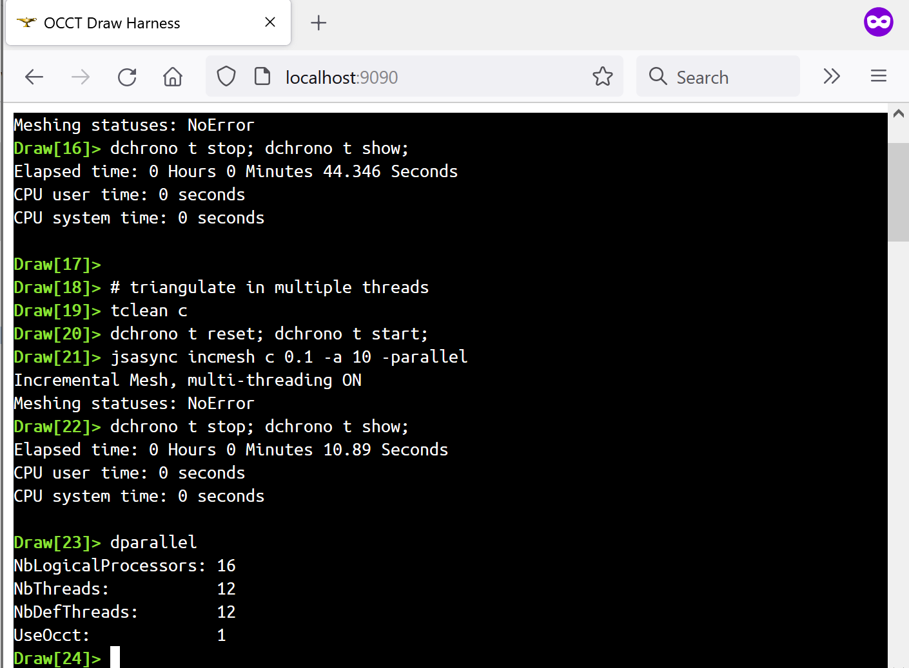
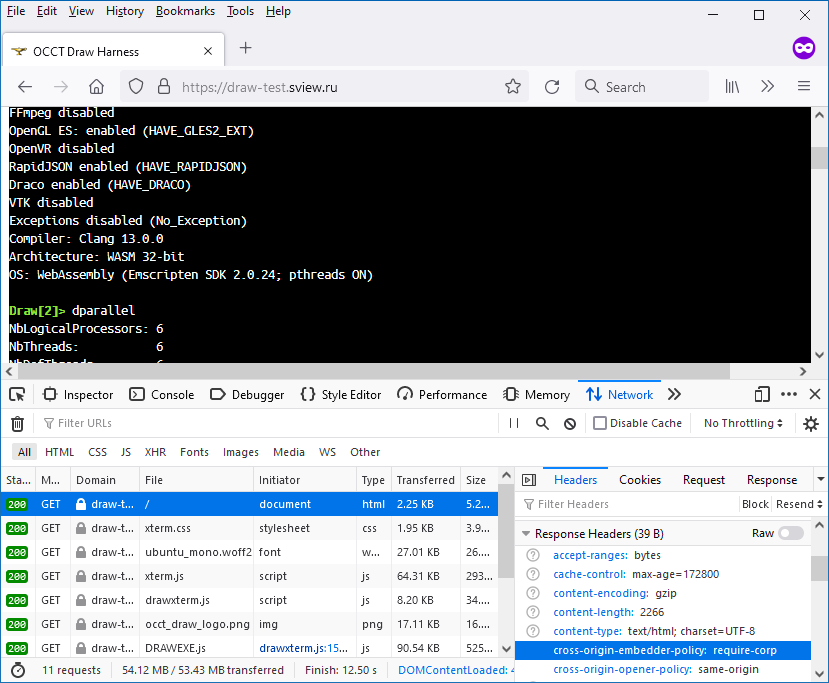
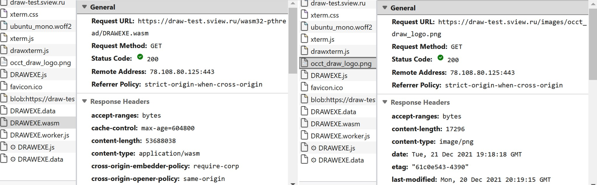
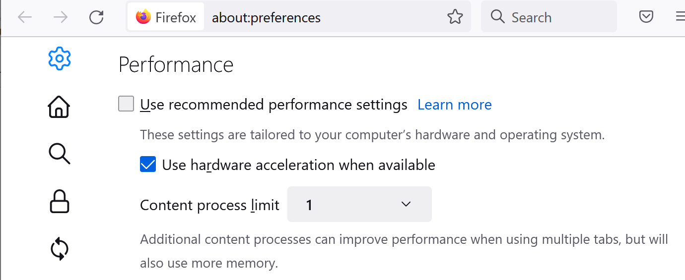
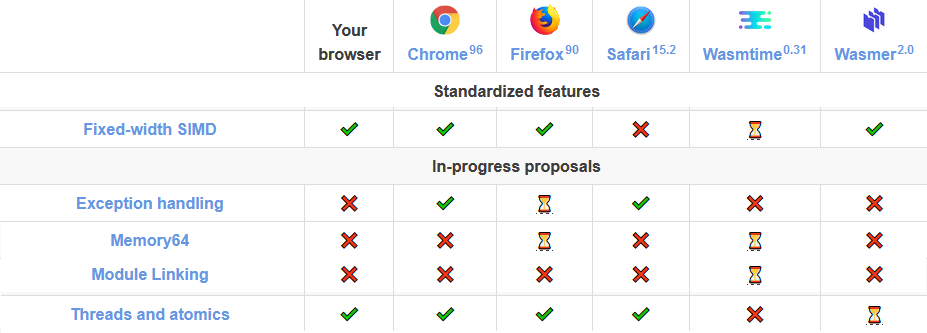
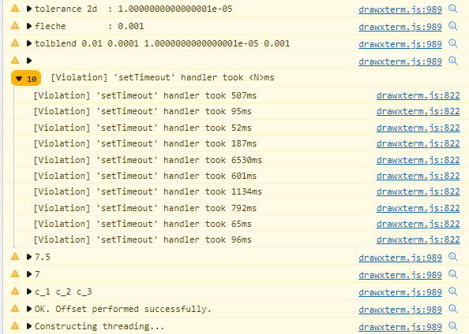

[Previous publication](../2021-06-16-occt-draw-in-the-browser/) described first steps in running *Draw Harness* in a Browser as a *WebAssembly module*.
As a result, the project was able to run complex *Tcl scripts*, to be embedded into web-site, to display objects in 3D Viewer and to run smooth animations.

The [gallery of samples](https://draw.sview.ru) still has rough edges like ugly 3D Viewer layout,
but even in its current state the project looks helpful to demonstrate *OCCT* usage and capabilities.
The gallery is being slowly extended with new samples when I get some new question or idea about *OCCT* usage that I could demonstrate in *Draw Harness*.

Previous article indicated some further directions for improvements, and now we will experiment with **multi-threading**.

<!--break-->

|  |
|:--:|
| &nbsp; |

Enabling it in *WebAssembly* requires two key ingredients:

1. Passing [`-pthread`](https://emscripten.org/docs/porting/pthreads.html) compiler/linker flag.<br>
   The flag should be passed to the main executable as well as to all libraries that may utilize multiple threads.

2. Returning [cross-origin isolation headers](https://web.dev/coop-coep/) by HTTP(S) server.<br>
   This includes **Cross Origin Opener Policy** (*COOP*) set to **"same-origin"** and **Cross Origin Embedder Policy** (*COEP*) set to **"require-corp"**.

Looks pretty simple from the first glance, but a lot of troubles hide in the corners...

## Building multi-threaded WebAssembly

Modern CPUs, even mobile ones, have *6+ cores*, with some models reaching *12 cores* and more.
Algorithms parallelization is no longer a feature, but the bare necessity in modern applications to show high performance results.
*OCCT* already utilizes multi-threading to speed up many algorithms like meshing of a geometry or decoding *Draco*-compressed *glTF* file.
So enabling these capabilities in *OCCT* should allow improving performance of some long operations in *Draw Harness*.

Bringing multi-threading to the web, however, required a lot of effort from Browser developers to provide reliable implementations and to standardize interfaces across vendors.
For this reason, the first version of **WebAssembly 1.0** didn't come with any threading capabilities at all.

Currently, this feature is provided by Browsers as [Threads and atomics extension](https://webassembly.org/roadmap/) to *WebAssembly 1.0*,
and for compatibility reasons *Emscripten SDK* doesn't activate this feature by default.
This feature is currently managed by `-pthread` compiler/linker flag, which can be easily amended to *CMake* configuration while building *OCCT*:

```
  -D CMAKE_CXX_FLAGS="-pthread"
```

You may also find helpful building recipes like `wasm_build.bat`, which can be found in the `adm/scripts/` folder of *OCCT* repository - take a look at the option `USE_PTHREADS`.

But wait! This means that all this time we have built *OCCT* without the `-pthread` option.
How could previous builds even succeed, if *OCCT* source code always expects [POSIX Threads](https://en.wikipedia.org/wiki/Pthreads) API being available?
Just take a look into `OSD_Thread.cxx` to see that there are no any preprocessor macro checks for *pthread* being available or not.
So what  `-pthread` option actually does?

With or without the `-pthread` option *Emscripten SDK* always implements the *POSIX threads API*,
but without this option it is emulated using just a single working thread.
Otherwise it would be clearly a pain to build any mature project using *Emscripten SDK* as most projects do not make *POSIX threads* usage configurable.
*Emscripten* defines `__EMSCRIPTEN_PTHREADS__` macro so that application code may actually check if threads are available or not.

Multi-threaded *WASM* looks pretty the same as a single-threaded one within the build folder.
But you may notice one extra file `DRAWEXE.worker.js`, which is an important implementation detail of threads in *WebAssembly* showing that it actually relies on **Web Workers** API.

*Update: Emscripten 3.1.68 (released on 2024-09-30) no longer generates `.worker.js` files.*

## Cross-origin isolation headers

I'll not pretend to be a guru of all these [cross-origin isolation headers](https://web.dev/coop-coep/) on the web,
and you may find a lot of resources describing this topic in detail.
Here I will focus on a very local problem - how to run my precious multi-threaded *WebAssembly module*.
From the beginning of the article, a web-server should be configured to return the following headers:

- *Cross Origin Opener Policy* (*COOP*) set to `"same-origin"`;
- *Cross Origin Embedder Policy* (*COEP*) set to `"require-corp"`.

### Isolating multi-threaded WebAssembly - what for?

*Cross-origin isolation* layers is an attempt to protect web applications and their users from untrusted code coming from different origins (e.g. sites / domains).
In the case of *WebAssembly*, the major concerns have arisen after revealed vulnerabilities in modern CPUs known as
[Spectre](https://en.wikipedia.org/wiki/Spectre_(security_vulnerability)) and **Meltdown**,
which potentially allows threads of the same process to read memory of another thread.

While this is not a problem for most applications, where sharing a common memory across the process's threads is actually a feature,
these CPU vulnerabilities affect Browsers executing different websites in parallel threads of the same process.
Consider that you have opened your bank Internet client in one Tab while suspicious *JavaScript code* is executed
in the other Tab - and you get an idea that this might cause some risks to the user's personal data.

To make multi-threaded web applications safer from these kinds of attacks, browsers now have to isolate web-sites more aggressively,
relying on system-level protection mechanisms - by creating dedicated processes.
Such isolation comes with extra costs, and applies some restrictions to web-applications to load resources from the origin and similar.
*Cross-origin isolation* headers tell Browser to force these restrictions.

OK, but to force the cross-origin isolation policy you need to configure your ***server***.
But why server? Why couldn't *JavaScript code* loading *WebAssembly* just tell a Browser to apply *cross-origin* policies?
The problem is that such strong isolation requires extra measures from Browser - including creation of a dedicated process.
If some *JavaScript* would suddenly say that the isolation policy should change - Browser would have to reload the entire page from the beginning.
In fact, some researchers have been able to [implement](https://dev.to/stefnotch/enabling-coop-coep-without-touching-the-server-2d3n)
this approach by overriding headers and reloading the page with help of the **Service Workers** API.
While these tricks could be tolerated in experiments, they are barely applicable to web applications in production.

### Python simple HTTP server

I don't like *Python* at all, but taking into account that *Emscripten SDK* requires a *Python shell* anyway, it should be already at hand in your environment.

*Python* comes with a simple HTTP server module - unreliable for a serious server (I have to restart it from time to time when it suddenly "hangs"), but more than enough for simple tests.
The server can be started by launching the following command in the working directory:

```
> python -m http.server 8080
```

Moreover, it can be easily adjusted to return *cross-origin isolation* headers with the following Python script:

```py
#!/usr/bin/env python3
from http.server import HTTPServer, SimpleHTTPRequestHandler, test
import sys
class CORSRequestHandler (SimpleHTTPRequestHandler):
  def end_headers (self):
    # setup mandatory MIME types
    self.extensions_map.update({
      ".js": "application/javascript",
      ".wasm": "application/wasm",
    });

    # setup CORS and COEP policies
    self.send_header('Cross-Origin-Embedder-Policy', 'require-corp')
    self.send_header('Cross-Origin-Opener-Policy',   'same-origin')
    SimpleHTTPRequestHandler.end_headers(self)

if __name__ == '__main__':
  aPort = int(sys.argv[1]) if len(sys.argv) > 1 else 8000
  test(CORSRequestHandler, HTTPServer, port=aPort)
```

Just put the script `"test_server.py"` at web-site location and start as:

```
> python test_server.py 8080
```

That's it! This should be enough to open multi-threaded WebAssembly builds via `http://localhost:8080` URL in the Browser.
It wouldn't work, though, when started as an external server, as Browsers which would require a secure HTTPS connection.

Browser debugging tools might be helpful to verify if **Response Headers** from the server contain our magic words or not.

|  |
|:--:|
| *Debugging Response Headers in Firefox.* |

### GitHub Pages

In previous experiments, I've used a free *GitHub Pages* service to host a site with *WebAssembly*, which worked surprisingly well (with some small concerns).
But now, when I want to use *multi-threaded WASM* and need to configure *cross-origin headers* for that - I've been stuck with no solution.
Unfortunately, as of the end of 2021, there is [no way](https://stackoverflow.com/questions/68609682/is-there-anyway-to-use-sharedarraybuffer-on-github-page/68675301)
to manage cross-origin isolation headers on a site hosted on **GitHub Pages**.

The workflow looked like a dream came true - just push your modifications to git and see the site being automatically regenerated by *Jekyll* and hosted, everything for free (for an open source project).
But now I have to face the harsh reality and to return back to alternative hosting solutions just to be able to start *multi-threaded WebAssembly*! This shouldn't end like this...

### Apache HTTP server

Luckily, I have at hand one classical [Apache HTTP server](https://httpd.apache.org/) with the *NGINX* on top of it, which could be used for further tests with *multi-threaded DRAWEXE* builds.
I expected to find a configuration trick very fast for such a well-known server, but search results were quite misleading suggesting solutions to some other problem.
Finally, I've been figured out how to adjust `.htaccess` file to setup cross-origin headers in desired way:

```
<IfModule mod_headers.c>
  # setup CORS and COEP policies to strict isolation
  # and allowing multi-threaded WebAssembly
  Header always set Cross-Origin-Embedder-Policy "require-corp"
  Header always set Cross-Origin-Opener-Policy   "same-origin"
</IfModule>
<IfModule mod_mime.c>
  AddType application/wasm   wasm
  AddType text/javascript    js mjs
</IfModule>
```

That was enough to load *multi-threaded WASM*, but running any commands creating new threads ended up with the following error:

```
> pthread sent an error! undefined:undefined: undefined
>   https://test/wasm32-pthread/DRAWEXE.worker.js
>   net::ERR_BLOCKED_BY_RESPONSE 200
```

After digging up into *Response Headers* for different files, I've realized that while most files had desired `"cross-origin-opener-policy"` fields, files with `.js` and `.png` extensions didn't.

|  |
|:--:|
| &nbsp; |

Then I've found *NGINX* settings on hoster's control panel where exactly the same extensions have been checked to be cached!
The Internet tells me that it should be possible to configure headers returned by *NGINX*, but unfortunately I've been unable to figure out how this could be applied to external hosting services.

So I ended up just excluding `.js` from *NGINX* caching on my hosting control panel.
This setup is enough for a pet project, but configuring a server for a complex and intensively used web application would certainly require digging much deeper into technical details.

### Checking Isolation

Out of curiosity, I've decided to check how *cross-origin isolation headers* affect web-site execution in *Firefox 92*.
For this, the *Content process limit* within Browser performance settings have been changed to *1*.

|  |
|:--:|
| *Performance settings in Firefox.* |

Modern Browsers are complex multi-process software, so that even with this *1 process limit* set, *Firefox* still starts at least *5 processes* as can be seen in *Task Manager*.
Then I've opened a simple [static page](https://download.sview.ru/) in several Tabs to see that the number of processes remains *5*.
Then I've started a web-server ***without*** *cross-origin headers* and opened a *single-threaded DRAWEXE* application in the new Tab - same result, *5 processes*.

Then I've started a web-server ***with*** *cross-origin headers* and repeated the test - the number of processes has *increased by one*.
But opening more Tabs with the same URL hasn't increased process count.
Then I've opened an URL to another web-server with *cross-origin headers* - process count has increased again, and kept the same while opening this URL in more tabs.

|  |
|:--:|
| *Firefox process group in the Task Manager.* |

This naive test doesn't reveal much details about *cross-origin isolation* implementation in Browsers, but demonstrates that at least it forces Browser to start a dedicated process.
On slow and memory-limited hardware configurations this behavior might cause potential performance issues - something that should be also considered while enabling these policies.
From the other side, Browsers keep going into stronger isolation enabled by default, so that *Edge* starts a dedicated process even while opening the same website in different Tabs.

## Dynamic loading of WASM modules

Most Browsers already support [Threads and atomics extension](https://webassembly.org/roadmap/) to *WebAssembly 1.0*,
but multi-threaded modules still might be **rejected** due to Browser security settings and server configuration issues.
And this becomes a portability problem as not just multi-threading capabilities are disabled - unfortunately,
currently there is no way to use the same *WebAssembly module* in both multi-threaded and single-threaded environments.

|  |
|:--:|
| *Matrix of WebAssembly 1.0 extensions.* |

Therefore, for compatibility reasons, the web application has to stock up *several WASM modules* built with different compiler flags and choose which one to load dynamically.

Conventional loading of a single *WASM module* looks pretty straightforward - relying on `<script>` tags
and just calling a single factory function `createDRAWEXE()` generated by *Emscripten SDK* (in case of `MODULARIZE=1` building flag):

```html
<script type="text/javascript" src="wasm32/DRAWEXE.js" charset="utf-8"></script>
<script>
DRAWEXE = new DrawTerm();
var aDrawWasmLoader = createDRAWEXE (DRAWEXE);
</script>
```

Trying to load two *WASM* builds in this way would obviously lead to name collisions,
which could be theoretically resolved by providing different project/function names in `DRAWEXE/CMakeLists.txt`:

```cmake
project(DRAWEXE)
set(CMAKE_EXE_LINKER_FLAGS "${CMAKE_EXE_LINKER_FLAGS} -s MODULARIZE=1")
set(CMAKE_EXE_LINKER_FLAGS "${CMAKE_EXE_LINKER_FLAGS} -s EXPORT_NAME='createDRAWEXE'")
```

But the idea of multiple build artifacts being put into the same folder with different suffixes like `DRAWEXE-wasm32.wasm` / `DRAWEXE-wasm32-pthread.wasm` doesn't look appealing to me.
Moreover, although `.wasm` files (largest artifacts) are always loaded on demand, Browser will have to load all script files specified via `<script>` tag,
while only one of them will be actually used to load the necessary `.wasm` file.
The size of these scripts is relatively small, though, - just about *0.5 MiB* for each `DRAWEXE.js` in case of *DRAWEXE* application.

So that instead of putting everything into a single folder, it was decided to put each configuration into a dedicated subfolder and keep file names as is.
The result structure looks like this:

- **wasm32**
  - `DRAWEXE.data`
  - `DRAWEXE.js`
  - `DRAWEXE.wasm`
- **wasm32-pthread**
  - `DRAWEXE.data`
  - `DRAWEXE.js`
  - `DRAWEXE.worker.js`
  - `DRAWEXE.wasm`

Within this approach, application first tries to dynamically import the *JavaScript file* associated with the *multi-threaded WASM* build from folder `wasm32-pthread`,
and then loads the fallback *single-threaded WASM* build from folder `wasm32` in case of failure:

```js
/**
 * Check if multithreading is allowed.
 */
isAllowMultithreading() {
  return window.Worker !== undefined && window.Atomics !== undefined
      && window.SharedArrayBuffer !== undefined;
}

/**
 * Init Module and load WASM file.
 */
async wasmLoad() {
  return new Promise (
    async (theResolve, theReject) => {
      try {
        let aLoaderModule = async () => {
          let aLoaderPthreadModule = async () => {
            this._myWasmBuild = "wasm32-pthread";
            this.mainScriptUrlOrBlob = './DRAWEXE.js'; // for pthreads
            let aModPath = this.locateFile ("DRAWEXE.js", "");
            let aRet = await fetch (aModPath);
            let aSrc = await aRet.text();
            if (!aRet.ok) { throw new Error ("Fail to fetch DRAWEXE.js; "
                                             + aRet.status); }
            aSrc += '\nexport default createDRAWEXE';
            const aBlob = new Blob ([aSrc], {type: 'text/javascript'});
            let aModPThread = await import (URL.createObjectURL (aBlob));
            return aModPThread;
          }

          let aLoaderFallbacktModule = async () => {
            this._myWasmBuild = "wasm32";
            let aModPath = this.locateFile ("DRAWEXE.js", "");
            let aRet = await fetch (aModPath);
            let aSrc = await aRet.text();
            if (!aRet.ok) { throw new Error ("Fail to fetch DRAWEXE.js; "
                                             + aRet.status); }
            aSrc += '\nexport default createDRAWEXE';
            const aBlob = new Blob ([aSrc], {type: 'text/javascript'});
            let aMod32 = await import (URL.createObjectURL (aBlob));
            return aMod32;
          }

          if (this.isAllowMultithreading()) {
            try {
              return await aLoaderPthreadModule();
            } catch (theError) {
              this.terminalWriteError ("Unable to load threaded DRAWEXE: "
                                       + theError);
            }
          }

          return await aLoaderFallbacktModule();
        };

        let aMod = await aLoaderModule();
        await aMod.default (this);

        theResolve();
      } catch (theError) {
        this._myIsWasmLoaded = true;
        this.terminalWriteError ("WebAssembly initialization failed:\r\n"
                                 + theError);
        theReject (theError);
      }
    });
}
```

You may find `"export default createDRAWEXE"` amendments to dynamically loaded *JavaScript* tricky and confusing - probably it would be better modifying *DRAWEXE* building scripts instead.
Hopefully, this dynamic loading routine doesn't break caching capabilities in Browsers...

Another interesting moment is how we check if Browser supports *multi-threaded WebAssembly*.
We may try just to load the threaded *WASM* and see if it will fail or not, but that would be clearly a waste of time and traffic if we know in advance that Browser will not load it.
Instead, we check for `window.SharedArrayBuffer`, `window.Atomics` and `window.Worker` as main construction bricks in supporting multi-threading required by *WebAssembly*.

## Threading in Draw Harness

Multi-threading capabilities are useful not just to speed up algorithms by parallelization,
but might be also used to improve application interface responsiveness by moving long calculations from the main GUI thread to background working thread(s).

Complex modeling algorithms or a large model import might take several seconds and even minutes.
Such delays in GUI thread lead to sluggish ragged response of the user interface and might even look like freezes of the entire application.
You don't need to open a *JavaScript console* to see them causing usability issues.

|  |
|:--:|
| *Warnings about too long `setTimeout` handlers.* |

*Emscripten* provides some extra options to this problem like moving the whole main loop of application to a background thread - which might be a reasonable,
but troublesome solution, considering various limitations of *Emscripten SDK* related to *WebGL* and *Emulated FS* usage from non-GUI threads.

It might be worth implementing this approach directly in *DRAWEXE*, like it is already done on the *Windows* platform, where a dedicated thread retrieves interactive command line input.
Following this way would likely require considerable efforts for redesigning *DRAWEXE* and debugging numerous problems - something that I would prefer to avoid at this step, if possible.

But let's take a look at the problem from the other side.
There is already the function `jsupload` performing asynchronous file loading - why not create a new function `jsasync`, which would execute desired *Draw Harness* commands in a background thread?

The last approach moves the complexity from Draw Harness itself to a script using it - so that it is the responsibility of a user to execute specific *Tcl commands* synchronously or asynchronously.
Under the hood, *DRAWEXE* might export a new method `DRAWEXE.evalAsync()` to *JavaScript* level:

```cpp
//! Signal async command completion to Module.evalAsyncCompleted callback.
EM_JS(void, occJSEvalAsyncCompleted, (int theResult), {
  if (Module.evalAsyncCompleted != undefined) {
    Module.evalAsyncCompleted (theResult);
  } else {
    console.error ("Module.evalAsyncCompleted() is undefined");
  }
});

//! Draw Harness interface for JavaScript.
class DRAWEXE
{
  //! Evaluate Tcl command asynchronously.
  static void evalAsync (const std::string& theCommand)
  {
  #if defined(__EMSCRIPTEN_PTHREADS__)
    std::string* aCmdPtr = new std::string (theCommand);
    OSD_Thread aThread (&evalAsyncEntry);
    aThread.Run (aCmdPtr);
  #else
    // fallback synchronous implementation
    int aRes = eval (theCommand);
    occJSEvalAsyncCompleted (aRes);
  #endif
  }

#if defined(__EMSCRIPTEN_PTHREADS__)
private:
  //! Thread entry for async command execution.
  static Standard_Address evalAsyncEntry (Standard_Address theData)
  {
    OSD::SetSignal (false);
    std::string* aCmdPtr = (std::string* )theData;
    const std::string aCmd = *aCmdPtr;
    delete aCmdPtr;
    int aRes = eval (aCmd);
    emscripten_async_run_in_main_runtime_thread (
      EM_FUNC_SIG_VI,
      evalAsyncCompletedEntry, aRes);
    return 0;
  }

  //! Notify Module.evalAsyncCompleted about async cmd completion.
  static void evalAsyncCompletedEntry (int theResult)
  {
    occJSEvalAsyncCompleted (theResult);
  }
#endif
};
```

It is clear that users ***should not*** execute any *Tcl commands* in parallel or data races will crash the program.
Therefore, the user should call `jsasync` and wait for command completion, so that it is the only GUI that could benefit from this interface and do some extra work.

An important limitation of this interface is that *WebGL* functions cannot be called from non-GUI threads.
So that `jsasync` shouldn't be called with any commands explicitly redrawing 3D viewer contents.
Although this shouldn’t prevent calling a command computing some *AIS presentations* in the background, just avoid calling `V3d_View::Redraw()`.

## Testing multi-threaded WebAssembly

So let's do some testing at the end!

First of all, let's check which *DRAWEXE* build has been actually loaded.
Two commands could be useful for that - `dversion` and `dparallel`.
The single-threaded build will return something like that (truncated output):

```
Draw[1]> dversion
...
OS: WebAssembly (Emscripten SDK 2.0.24; pthreads OFF)
Draw[2]> dparallel
NbLogicalProcessors: 1
```

And the output of multi-threaded build will look like this:

```
Draw[1]> dversion
...
OS: WebAssembly (Emscripten SDK 2.0.24; pthreads ON)
Draw[2]> dparallel
NbLogicalProcessors: 8
```

The number of logical processors will depend on your hardware, but it might be also limited by Browser settings.
Let's try some multi-threading now:

```
pload MODELING
psphere s 1
incmesh s 1 -parallel
```

Alas! Our brand-new multi-threaded web application has just been hung!
[Emscripten documentation](https://emscripten.org/docs/porting/pthreads.html#blocking-on-the-main-browser-thread) clarifies:

> *Blocking on the main thread is __very__ __dangerous__.*

The **deadlock** happens when the background thread is waiting for some command being executed in the main thread
(the one that *JavaScript* allows to be run only in GUI thread and which *Emscripten* has kindly redirected for us),
which in turn is waiting for background thread completion.
So that we have just revealed one of the critical limitations of *Emscripten* implementation of *POSIX threads* which developers should take into account.

*Emscripten* proposes several workarounds to this problem, but the most straightforward one is to move blocking to a background working thread.
This is where our new command `jsasync` comes to rescue - as it executes *Tcl commands* in the background thread,
it may safely execute multi-threaded algorithms without a risk to hang. Let's try again:

```
pload MODELING
psphere s 1
jsasync incmesh s 1 -parallel
```

Looks much better now!

### 3D Viewer commands in background

Let's try `jsasync` with 3D Viewer commands:

```
pload MODELING VISUALIZATION
psphere s 1
vinit View1
jsasync vdisplay s -dispMode 1
vfit
```

As expected, attempt to execute *WebGL* functions from non-GUI thread leaded to problems:

```
> pthread sent an error! http://localhost:9090/wasm32-pthread/DRAWEXE.worker.js:1:
> Uncaught TypeError: Cannot read properties of undefined (reading 'lineWidth')
```

To avoid this, we may combine commands like `vdisplay` with `-noupdate` option to suppress 3D Viewer redraw:

```
pload MODELING VISUALIZATION
psphere s 1
vinit View1
jsasync vdisplay s -dispMode 1 -noupdate
vfit
```

There is a bug, though, in the current implementation of `jsasync` command - the output
of the called *Tcl command* doesn't appear in our *emulated Terminal*, but could be found in the *JavaScript console*.

### Multi-threaded meshing

Let's now simulate some long computations by *meshing 1000 spheres*:

```
pload MODELING VISUALIZATION
#dparallel -nbThreads 12 -nbDefThreads 12

# create compound of 1k spheres
set aNbSpheres 10
set aSpheres {}
for {set i 0} {$i < $aNbSpheres} {incr i} {
  for {set j 0} {$j < $aNbSpheres} {incr j} {
    for {set k 0} {$k < $aNbSpheres} {incr k} {
      set aName s_${i}_${j}_${k}
      lappend aSpheres $aName
      psphere $aName 25.0
      ttranslate $aName 100.*$i 100.*$j -100.*$k
    }
  }
}
compound {*}$aSpheres c

# triangulate sequentially
tclean c
dchrono t reset; dchrono t start;
jsasync incmesh c 0.1 -a 10
dchrono t stop; dchrono t show;

# triangulate in multiple threads
tclean c
dchrono t reset; dchrono t start;
jsasync incmesh c 0.1 -a 10 -parallel
dchrono t stop; dchrono t show;
```

Calling a long algorithm synchronously (without `jsasync`) might result in the following message showed to user by Browser:

|  |
|:--:|
| *Page not responding warning in Edge.* |

The script has been executed on several configurations, including native *64-bit* build for *Windows* and collected into the table:

|                     |   Windows 10, Ryzen 9,<br>12 threads     |     Firefox 92, Ryzen 9,<br>12 threads    |    Edge 97, Ryzen 9,<br>12 threads       |    Chrome 96, Kryo 585,<br>8 threads      |
| ------------------: | :--------------------------------------: | :---------------------------------------: | :--------------------------------------: | :---------------------------------------: |
|      **Sequential** | <span style='color:green'>10.53 s</span> | <span style='color:red'>   45.11 s</span> | <span style='color:red'>30.10 s</span>   | <span style='color:red'>  90.79 s</span>  |
|  **Multi-threaded** | <span style='color:green'> 1.51 s</span> | <span style='color:orange'>10.62 s</span> | <span style='color:red'>10.33 s</span>   | <span style='color:green'>23.73 s</span>  |
|   **Native / WASM** | <span style='color:green'>   100%</span> | <span style='color:red'>       23%</span> | <span style='color:red'>    35%</span>   |                               N/A         |
| **seq. / threaded** | <span style='color:green'>     7x</span> | <span style='color:orange'>   4.2x</span> | <span style='color:red'>   2.9x</span>   | <span style='color:green'>   3.8x</span>  |

*Multi-threaded meshing of 1k spheres, with C++ exceptions disabled.*

<br>
Good news - multi-threading works and provides a considerable boost.
The bad news - the overall performance looks horrifying as best multi-threaded execution results in Browser are comparable to ***single-threaded*** execution of the same script of native builds.
For some reason, the mobile version of *Firefox* doesn't run multi-threaded *WebAssembly* - so I guess this feature is not yet implemented there.

Recently, one of *OCCT* community members has shared experience in using *WebAssembly* and highlighted a severe performance penalty caused by a *slow C++ exception* handling in *STEP* file import.
Algorithms like *BRepMesh* involve a lot of geometrical calculations tightly relying on *C++ exceptions*, so that this might indeed be a hotspot in a particular scenario.

Exception handling is intensively used in many *OCCT algorithms* for robustness and properly handling even valid (expected) results in some cases.
So disabling exception handling is not an option here, but we can temporarily remove the `-fexceptions` flag from *OCCT* building options just to check the assumption.

|                     |    Windows 10, Ryzen 9,<br>12 threads    |     Firefox 92, Ryzen 9,<br>12 threads    |    Edge 97, Ryzen 9,<br>12 threads       |    Chrome 96, Kryo 585,<br>8 threads      |
| ------------------: | :--------------------------------------: | :---------------------------------------: | :--------------------------------------: | :---------------------------------------: |
|     **Sequential**  | <span style='color:green'>10.53 s</span> | <span style='color:orange'>15.76 s</span> | <span style='color:green'>11.82 s</span> | <span style='color:green'> 29.31 s</span> |
|  **Multi-threaded** | <span style='color:green'> 1.51 s</span> | <span style='color:red'>    6.63 s</span> | <span style='color:red'>   7.32 s</span> | <span style='color:orange'>10.82 s</span> |
|   **Native / WASM** | <span style='color:green'>   100%</span> | <span style='color:orange'>    67%</span> | <span style='color:green'>    89%</span> |                                N/A        |
| **seq. / threaded** | <span style='color:green'>     7x</span> | <span style='color:red'>      2.4x</span> | <span style='color:red'>     1.6x</span> | <span style='color:orange'>   2.7x</span> |

*Multi-threaded meshing of 1k spheres, with C++ exceptions disabled.*

<br>
The new numbers for sequential execution look much closer to the native build - in fact, performance has been improved almost *3 times* in this particular case!
The size of `DRAWEXE.wasm` has also been reduced from **51 MiB** to **30 MiB**.
At the same time, the benefits of multi-threaded execution have lowered down.

### Multi-threaded decoding of Draco files

An extra test case has been prepared to check one more multi-threaded usage scenario - decoding of [Draco-compressed](https://google.github.io/draco/) *glTF* model.
The *glTF* model of size *22 MiB* has been used for tests:

```
pload XDE OCAF MODELING VISUALIZATION
jsupload /data/test-draco.glb
dchrono t reset; dchrono t start;
jsasync ReadGltf D test-draco.glb -parallel
dchrono t stop; dchrono t show;
```

*Draco compression* considerably reduces the file size, but requires extra time on decoding data.
Transferring large models over the Internet is an important topic - reducing file size by *10 times* considerably reduces overall model loading time (downloading + decoding).
Multi-threaded decompression might optimize loading time even more.

|  *(Ryzen 9, 12 threads)* | Windows 10, with except. |        Firefox 92, with except.          |           Firefox 92, no except.          |           Edge 97, with except.           |            Edge 97, no except.            |
| -----------------------: | :----------------------: | :--------------------------------------: | :---------------------------------------: | :---------------------------------------: | :---------------------------------------: |
|           **Sequential** |          3.22 s          | <span style='color:red'> 10.925 s</span> | <span style='color:orange'>6.691 s</span> | <span style='color:orange'>6.984 s</span> | <span style='color:green'>3.915 s </span> |
|       **Multi-threaded** |          0.71 s          | <span style='color:green'>2.164 s</span> | <span style='color:green'> 1.118 s</span> | <span style='color:green'> 1.311 s</span> | <span style='color:green'>0.766 s </span> |
|        **Native / WASM** |            100%          | <span style='color:red'>      29%</span> | <span style='color:orange'>    48%</span> | <span style='color:orange'>    46%</span> | <span style='color:green'>    82%</span>  |
|      **seq. / threaded** |            4.5x          | <span style='color:green'>     5x</span> | <span style='color:green'>      6x</span> | <span style='color:green'>    5.3x</span> | <span style='color:green'>    5x</span>   |

*Multi-threaded decoding of Draco-compressed glTF file.*

<br>
Once again, *C++ exception handling* in *WebAssembly* drops performance almost twice in this particular scenario.
But multi-threaded scalability looks better here with comparable results across native / *WebAssembly* builds.

## Afterwords

*Draw Harness* prototype on *WebAssembly* platform has received experimental multi-threading support.
Current implementation suggests using a dedicated function `jsasync` for running long operations in background and to execute multi-threaded algorithms,
which requires ad-hoc optimizations in *Tcl scripts* and extra care to prevent dead-locks and *WebGL* errors.

While bringing a noticeable performance boost, current multithreading implementation in *WebAssembly* shows a large overhead.
Moreover, *C++ exception handling* popped up as a severe performance bottleneck in reaching performance comparable to native builds.

High C++ exception handling overhead might be leveraged in some future with help of
[Exception handling](https://github.com/WebAssembly/exception-handling/blob/master/proposals/exception-handling/Exceptions.md) extension to *WebAssembly 1.0*.
According to the roadmap, some Browsers already implemented this feature, but I've been unable to build *OCCT* with `-fwasm-exceptions`
[option](https://emscripten.org/docs/porting/exceptions.html#webassembly-exception-handling-proposal) as it resulted in *CLang* compiler crashes.
