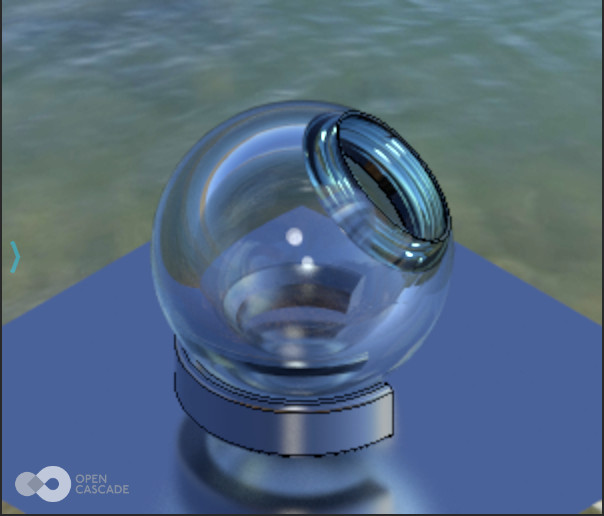

Users ask from time to time how to set up an *offscreen* instance of *OCCT 3D Viewer* for making screenshots.
Offscreen viewer setup is pretty straightforward, but some extra hints and comments described in this article might be helpful.

<!--break-->

## Offscreen 3D Viewer

The key component in *OCCT 3D Viewer* setup is creation of *OpenGL context* for GPU-accelerated rendering.
Most *OpenGL* implementations require a native window to create a context,
and the general workflow for offscreen rendering is the same as for onscreen rendering - you create an instance of `Aspect_Window` through platform-dependent subclasses
(`WNT_Window`, `Xw_Window` or a wrapper over a window created by some GUI framework), and set it to `V3d_View::SetWindow()`, as usual.

The only difference is that you don't need to actually map the window on the screen to the user (`Aspect_Window::Map()` or similar).
It is also useful to stamp the window with `Aspect_Window::SetVirtual()` flag, to prevent *OCCT* from querying native window properties like dimensions.
In most cases you don't even need to handle window events for such a window, though this might depend on the platform.

The next step is the usual scene setup (lighting, background, objects, camera view) - the usual stuff.
The following code snippet demonstrates creation of an offscreen window (taken from [sample](https://github.com/gkv311/occt-hello-viewer/tree/master/offscreen)):

```cpp
// create graphic driver
Handle(Aspect_DisplayConnection) aDisp =
  new Aspect_DisplayConnection();
Handle(OpenGl_GraphicDriver) aDriver =
  new OpenGl_GraphicDriver(aDisp, true);
aDriver->ChangeOptions().swapInterval = 0; // no window, no swap
Handle(V3d_Viewer) myViewer = new V3d_Viewer(aDriver);

// create offscreen window
const TCollection_AsciiString aWinName("OCCT offscreen window");
Graphic3d_Vec2i aWinSize(512, 512);
#if defined(_WIN32)
  const TCollection_AsciiString aClassName("OffscreenClass");
  // empty callback!
  Handle(WNT_WClass) aWinClass =
    new WNT_WClass(aClassName.ToCString(), nullptr, 0);
  Handle(WNT_Window) aWindow =
    new WNT_Window(aWinName.ToCString(), aWinClass, WS_POPUP,
                   64, 64, aWinSize.x(), aWinSize.y(),
                   Quantity_NOC_BLACK);
#elif defined(__APPLE__)
  Handle(Cocoa_Window) aWindow =
    new Cocoa_Window(aWinName.ToCString(),
                     64, 64, aWinSize.x(), aWinSize.y());
#else
  Handle(Xw_Window) aWindow
    = new Xw_Window(aDisp, aWinName.ToCString(),
                    64, 64, aWinSize.x(), aWinSize.y());
#endif
aWindow->SetVirtual(true);

// create 3D view from offscreen window
Handle(V3d_View) myView = new V3d_View(myViewer);
myView->SetWindow(aWindow);
```

Some implementations, like *EGL*, provide ways to create a [truly windowless](https://developer.nvidia.com/blog/egl-eye-opengl-visualization-without-x-server/) OpenGL context.
But practically speaking, there is not much difference in most usage scenarios - as long as the user doesn't actually see the window.

## Image dump

Then we may perform image dump using `V3d_View::ToPixMap()` method, which will redraw the frame and copy it's content into `Image_PixMap` object:

```cpp
Image_PixMap anImage;
if (!myView->ToPixMap(anImage, aWinSize.x(), aWinSize.y()))
{ std::cerr << "View dump failed\n"; }
```

*Earlier OCCT versions just copied the displayed window surface.*
*Depending on windowing system implementation, an image dumped in this way might contain artifacts of other overlapping windows, might be clipped by screen viewport or corrupted.*
*This instability also affected the automated regression testing system implemented by Draw Harness.*
*Offscreen rendering using OpenGL frame buffer object (FBO) was one of my [earliest contributions](https://tracker.dev.opencascade.org/view.php?id=21902)*
*to the OCCT project (included into release OCCT 6.5.0), intended to solve this problem.*

`V3d_View::ToPixMap()` performs rendering into an offscreen [framebuffer object](https://www.khronos.org/opengl/wiki/Framebuffer_Object)
(*FBO*) created by *OpenGL* itself, without directly involving the windowing system.
*FBO* became a part of *OpenGL 3.0* (available earlier through extensions) and implemented by all major OpenGL drivers nowadays.

There is just one known exception - *software OpenGL 1.1 implementation by Microsoft* that pops up in case of *broken OpenGL*
driver installation or on configurations / non-interactive sessions without access to GPU.
On GPU-less systems you might consider using [Mesa](https://en.wikipedia.org/wiki/Mesa_(computer_graphics)) software implementation of OpenGL.

`Image_PixMap` implements an interface storing an image bitmap in memory.
It subclass `Image_AlienPixMap` could be used to save the screenshot into an image file:

```cpp
Image_AlienPixMap anImage;
if (!myView->ToPixMap(anImage, aWinSize.x(), aWinSize.y()))
{ std::cerr << "View dump failed\n"; }
if (!anImage.Save("image.png"))
{ std::cerr << "Unable to save image file\n"; }
```

`Image_AlienPixMap` relies on [FreeImage](https://freeimage.sourceforge.io/) library for supporting coming image formats (*PNG*, *JPEG*, etc.),
so that `USE_FREEIMAGE` dependency should be enabled within *OCCT* build configuration.

|  |
|:--:|
| *Example of image screenshot.* |

## Enhancing quality

Interactive applications have to find a delicate balance between image quality and performance to keep 3D Viewer interactive on various hardware devices.
But in case of a static high resolution screenshot, an application may tune up rendering quality to make it visually attractive.
The most obvious thing to tune up is antialiasing properties:

```cpp
Handle(V3d_View) theView = ...;
Graphic3d_RenderingParams& aRendParams =
  theView->ChangeRenderingParams();
//aRendParams.NbMsaaSamples = 8; // multisampling
aRendParams.RenderResolutionScale = 2.0f; // supersampling
```

OCCT provides two solutions for antialiasing - `Graphic3d_RenderingParams::RenderResolutionScale` and `::NbMsaaSamples` that cannot be combined together.
Each option has its benefits and drawbacks - see also an [interactive sample](https://draw.sview.ru/visualization-anti-aliasing/):

- `RenderResolutionScale` performs rendering at a different resolution and then scales the result into target image resolution.
  - Scale 2.0 double rendering resolution.
    Downsampling from higher resolution produces a nice antialiasing effect, also known as [supersampling](https://en.wikipedia.org/wiki/Supersampling).
  - This option doesn't require *MSAA* and is compatible with features like *clipping planes*.
  - Lines will be automatically rendered with higher width, but it is impossible within *OpenGL Core Profile*
    and some other OpenGL implementations, where this approach will produce thinner lines.
- `NbMsaaSamples` relies on [Multisample anti-aliasing](https://en.wikipedia.org/wiki/Multisample_anti-aliasing) capabilities implemented by graphics hardware.
  - This feature is expected to show higher performance compared to the true supersampling rendering thanks to it's tricks
    (fragment shader will be performed only once for multiple samples per fragment).
  - Different graphics hardware use different grids of samples per fragment and produce different visual results.
    *2 samples* is the fastest option, but usually looks terrible; *4* and *8 samples* bring nice antialiased results.
    The maximum number of samples is defined by *OpenGL* implementation.
  - This option doesn't make lines thinner within *OpenGL Core Profile*.
  - This option doesn't bring antialiasing to clipping planes functionality.

| <span> </span> |
|:--:|
| *Aliased and antialiased lines.* |

`V3d_View::ToPixMap()` interface allows specifying image dimensions independently from window dimensions.
The effect should be the same as resizing the window itself, so that this option might be useful
to perform a higher-resolution screenshot from an onscreen viewer, where temporarily resizing the window is not an option.
A special care should be taken while making screenshots with proportions / aspect ratio different from the window,
as it may result in unexpected clipping or view extension not visible in the window.

In the case of an offscreen viewer, passing a different image resolution to `V3d_View::ToPixMap()` doesn't look that useful.
However, some windowing systems might allocate an extra memory for an offscreen window, even if it is not going to be displayed on the screen.

Let's check this theory on *Windows* platform.
Creating a full-sized *8192x8192* native window shows the following memory usage numbers within our image dump sample:

```
    Private memory: 	3124 MiB
    Working Set:    	 485 MiB (peak:  486 MiB)
    Pagefile usage: 	3124 MiB (peak: 3189 MiB)
    Virtual memory: 	7478 MiB
    Heap memory: 	 214 MiB
```

`WNT_Window` could be created with smaller resolution, stamped virtual and then resized to the larger size (virtually):

```cpp
Graphic3d_Vec2i aWinSize(8192, 8192);
Handle(WNT_Window) aWindow =
  new WNT_Window("Offscreen window", aWinClass, WS_POPUP,
                 64, 64, 64, 64, Quantity_NOC_BLACK);
aWindow->SetVirtual(true);
aWindow->SetPos(0, 0, aWinSize.x(), aWinSize.y());
...
myView->ToPixMap(anImage, aWinSize.x(), aWinSize.y());
Message::SendInfo() << OSD_MemInfo::PrintInfo();
```

Reducing native window to *64x64* while keeping offscreen resolution to *8192x8192* gives the following numbers on *Windows 10*:

```
    Private memory: 	2288 MiB
    Working Set:    	 485 MiB (peak:  486 MiB)
    Pagefile usage: 	2288 MiB (peak: 2352 MiB)
    Virtual memory: 	6646 MiB
    Heap memory: 	 214 MiB
```

As can be seen, utilization of physical RAM hasn't changed here (heap and working set), while virtual memory has been *reduced by 836 MiB*.
This extra memory hasn't been actually committed to physical memory by system, only allocated/reserved within address space.

`Graphic3d_Camera::SetTile()` is another handy tool in *OCCT* usually coupled with `V3d_View::ToPixMap()`.
It allows a user to perform an image dump of a specific subregion of the visible window.
The same tiling interface could be also used to perform a dump at extra-high resolution by smaller pieces in several steps.


|  |
|:--:|
| *Image dump split into tiles.* |

While rendering high-resolution screenshots, you may notice 2D elements like text, trihedron and line width to appear smaller / thinner.
You might want to increase the size of particular presentations proportionally using `AIS_ViewCube::SetSize()`
and similar APIs - in the same way as you would do to support [HiDPI screens](../../sview/2019-12-22-scalable-ui-and-high-dpi-screens/) in your application.
In case of 2D text and line width, they could be scaled by adjusting `Graphic3d_RenderingParams::Resolution` option:

```cpp
Handle(V3d_View) theView = ...;
Graphic3d_RenderingParams& aRendParams =
  theView->ChangeRenderingParams();
aRendParams.Resolution = (unsigned)(96.0*aScaleRatio + 0.5);
```

Note, however, that this option will have no effect on line width within *OpenGL Core Profile* and some *OpenGL* implementations
(*WebGL* on *Windows* implemented by [ANGLE library](https://en.wikipedia.org/wiki/ANGLE_(software)) on top of *Direct3D*).

## Photorealistic images

The next level of improving image quality could be using a [Path-Tracing](https://en.wikipedia.org/wiki/Path_tracing) rendering engine integrated into *OCCT 3D Viewer*.
This engine enables *global illumination*, recursive reflections, refractions, smooth shadows producing images of a photorealistic quality.
This rendering requires a considerable amount of computations, though.
Which makes it a perfect candidate for offscreen rendering, where time is less critical!

To benefit from the *Path-Tracing engine*, the scene should have a light sources' setup with realistic intensity levels,
might benefit from *Image-Based Lighting* (background cubemap) as well as properly configured *PBR materials* assigned to objects.
Without these preconditions, the result image would be rather dark and not well-looking.
Material & Lighting setup comes out of scope of this article.

|  |
|:--:|
| *PBR within different environments.* |

It is a good idea, first trying to set up scene looking realistic within a [real-time PBR renderer](../2020-07-18-pbr-in-occt-3d-viewer/)
(`Graphic3d_RM_RASTERIZATION` + `Graphic3d_TypeOfShadingModel_Pbr`) and only afterwards enabling the Path-Tracing engine (`Graphic3d_RM_RAYTRACING` + `IsGlobalIlluminationEnabled`).
This would allow configuring the scene in a more comfortable immediate manner even on not very fast graphics hardware.

| <br> |
|:--:|
| *Real-time PBR rendering vs photorealistic Path-Tracing.* |

*Path-Tracing engine* relies on advanced *BSDF* material workflow `Graphic3d_MaterialAspect::BSDF()`
(*Bidirectional Scattering Distribution Function*, defined by `Graphic3d_BSDF` structure).
*BSDF material* could be also initialized from a simpler and more commonly used (see [glTF 2.0](https://www.khronos.org/registry/glTF/specs/2.0/glTF-2.0.html))
*metal-roughness* material workflow `Graphic3d_MaterialAspect::PBRMaterial()` (defined by `Graphic3d_PBRMaterial` structure) using tools like `Graphic3d_BSDF::CreateMetallicRoughness()`.

Path-Tracing is an *incremental* [stochastic renderer](../2020-01-06-atomic-float-arithmetic-on-gpu/), so that the more frames you draw, the better visual result you have.
You might need to draw plenty of frames to achieve an image of really good quality without notable *noise*.
The number would depend on scene complexity - ideally polished metallic surfaces might be ideally traced with a small amount of samples, while other materials might need a while of them.

Accumulation is done implicitly by *OCCT renderer*, so that you will need to call `V3d_View::Redraw()` many times without changing scene parameters
(including camera viewport and frame resolution) before calling `V3d_View::ToPixMap()` to gather desired quality.

```cpp
Handle(V3d_View) theView = ...;
Graphic3d_RenderingParams& aRendParams =
  theView->ChangeRenderingParams();
aRendParams.Method = Graphic3d_RM_RAYTRACING;
aRendParams.IsGlobalIlluminationEnabled = true;
aRendParams.RaytracingDepth = 10;
...
for (int aFrameIter = 0; aFrameIter < 1000; ++aFrameIter)
{
  theView->Redraw();
}
myView->ToPixMap(anImage, aWinSize.x(), aWinSize.y());
```

|    |
|:--:|
| *Path-Tracing - 1 frame, 10 frames and 1000 frames.* |

## Video recorder

There are plenty of screen recording tools available nowadays for free, so it doesn't look reasonable duplicating similar functionality inside the application itself.
But some applications might want to record video animations in a predictable way and with higher quality.

`Image_VideoRecorder` provides a small wrapper over [FFmpeg framework](https://www.ffmpeg.org/) for recording videos.
You'll need to build an *OCCT* with the `USE_FFMPEG` option turned on to use this class.
It provides a relatively simple interface for recording videos using the *OCCT framework*,
but don't forget to check the difference between *LGPL* / *GPL* configurations available for *FFmpeg*.

`AIS_Animation` is the best match for video recording.
The *Draw Harness plugin* allows recording animations into the video file within `vanimation` command.
The implementation related to video recorder looks like this:

```cpp
Handle(V3d_View) myView = ...;
Handle(AIS_Animation) theAnim = ...;
...
// setup video recording parameters / video codec
Image_VideoParams aRecParams;
aRecParams.Width  = aWinSize.x();
aRecParams.Height = aWinSize.y();
aRecParams.FpsNum = 24; // 24 frames per second
aRecParams.Format = "matroska";
aRecParams.PixelFormat = "yuv420p";
aRecParams.VideoCodec = "mjpeg";
Handle(Image_VideoRecorder) aRecorder = new Image_VideoRecorder();
if (!aRecorder->Open("video.mkv", aRecParams))
{ std::cerr << "Error"; }

// start animation loop for recording the video
int64_t aNbFrames = 0;
for (; aPts <= anUpperPts && aPS.More();)
{
  // calculate presentation timestamp
  double aPts = (double(aRecParams.FpsDen)/double(aRecParams.FpsNum))
               * double(aNbFrames);
  ++aNbFrames;

  // update animation to current time
  if (!theAnim->Update(aPts)) { break; }

  // dump a single frame
  V3d_ImageDumpOptions aDumpParams;
  aDumpParams.Width  = aRecParams.Width;
  aDumpParams.Height = aRecParams.Height;
  aDumpParams.BufferType = Graphic3d_BT_RGBA;
  aDumpParams.ToAdjustAspect = true;
  if (!myView->ToPixMap(aRecorder->ChangeFrame(), aDumpParams))
  {
    std::cerr << "Error: view dump is failed";
  }
  Image_PixMap::FlipY(aRecorder->ChangeFrame());

  // push frame to video recorder
  if (!aRecorder->PushFrame()) { break; }
}
```
