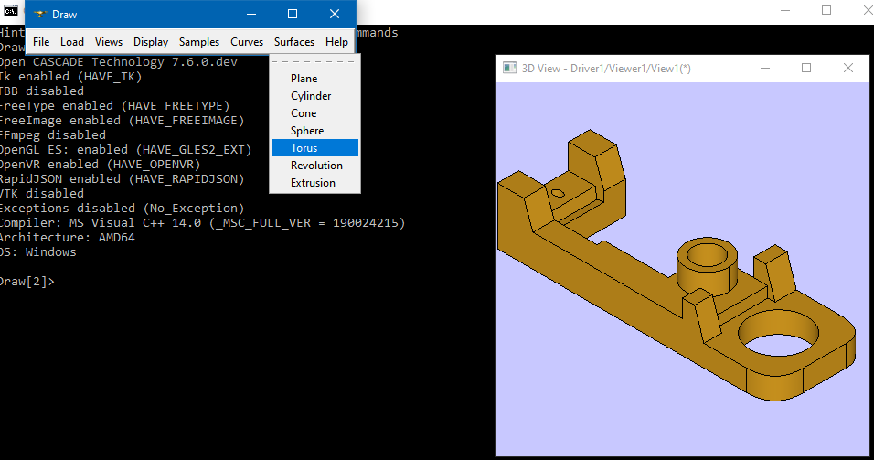
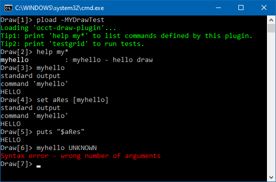
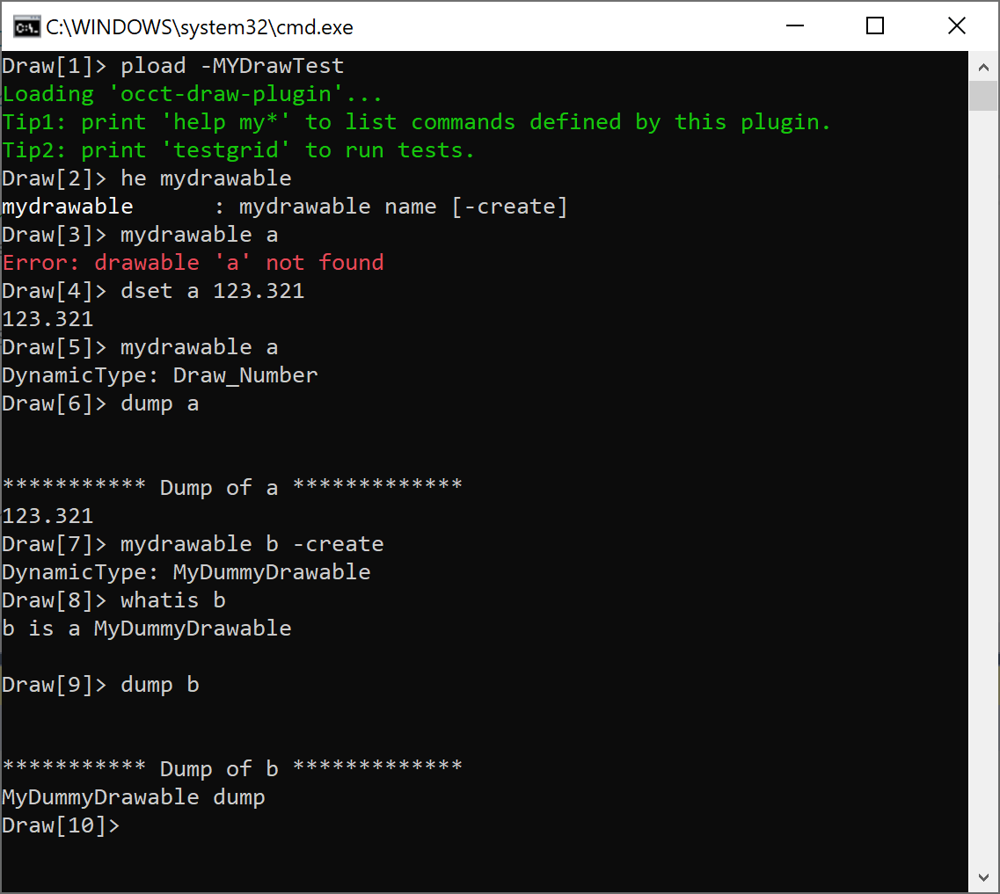

[Draw Harness](https://dev.opencascade.org/project/draw-harness) is a powerful interactive and *Tcl-scriptable* interface to the *Open CASCADE Technology*.
Many *OCCT* learners go directly to learning C++ interface and don't notice the *DRAWEXE* application at all, which I believe is a great loss.

At first glance, *Draw Harness* might look like an old-fashioned internal tool.
But it is widely used by *OCCT* developers for learning, testing and prototyping algorithms, and there are no reasons why other users couldn't use it as well.
Basic functionality includes commands for *modeling*, *data exchange*, displaying models in *3d viewer*, and tools for automated *regression testing*.

Furthermore, *Draw Harness* supports dynamic loading of custom plugins with project-specific extensions,
bringing up a flexible scriptable interface for development and testing application algorithms.
In this tutorial we will write a hello-world *Draw Harness plugin*.

<!--break-->

|  |
|:--:|
| &nbsp; |

## Tcl commands

*Draw Harness* exposes *OCCT* C++ algorithms to *Tcl language* , but it doesn't attempt to wrap every single class and method of the *OCCT framework*.
Instead, it aggregates functionality into powerful *Tcl commands* with unique syntax.
This approach allows C++ developers to write the majority of code in their native language,
while bringing *Tcl* at hand only for scripting and combining commands together.

There are other projects like [C#](https://dev.opencascade.org/project/occ-c-wrapper), [Java](https://dev.opencascade.org/project/occ-java-wrapper),
[Python](https://dev.opencascade.org/project/pyocct) or [JavaScript](https://dev.opencascade.org/project/opencascadejs) wrappers for the *OCCT framework*,
designed to develop entire applications in other languages.
*Draw Harness* is different in this context, as it is actually focused on writing algorithms in C++.
You don't even need to learn the *Tcl language* to start using *Draw Harness* - in many cases *Tcl script* looks like a sequence of simple commands, like calling programs using *CLI*.

Using other *OCCT wrappers* normally looks like calling C++ classes redeclared in a different language.
Let's take a look at a *Python script* creating and displaying a simple shape in 3D viewer:

```py
# imports
from OCC.Display.SimpleGui import init_display
from OCC.Core.BRepPrimAPI import *
from OCC.Core.AIS import *
from OCC.Core.Graphic3d import *
from OCC.Core.TopAbs import *
from OCC.Core.TopExp import *
from OCC.Core.Quantity import *
# modeling
aShape = BRepPrimAPI_MakeBox (50.0, 20.0, 30.0).Shape()
aFace = TopExp_Explorer (aShape, TopAbs_FACE).Value()
# adjusting presentation
aShapePrs = AIS_Shape (aFace)
aShapePrs.Attributes().SetupOwnShadingAspect()
aFillAspect = aShapePrs.Attributes().ShadingAspect().Aspect()
aFillAspect.SetDistinguish (True)
aMatFront = Graphic3d_MaterialAspect (Graphic3d_NameOfMaterial_Silver)
aMatBack  = Graphic3d_MaterialAspect (Graphic3d_NameOfMaterial_Silver)
aMatBack.SetColor (Quantity_Color (Quantity_NOC_RED))
aFillAspect.SetFrontMaterial (aMatFront)
aFillAspect.SetBackMaterial  (aMatBack)
# displaying
aDisplay, start_display, add_menu, add_function_to_menu = init_display()
aDisplay.Context.Display (aShapePrs, False)
aDisplay.View.FitAll (0.01, False)
```

And here is a *Draw Harness* (*Tcl*) script doing similar steps:

```tcl
# imports
pload MODELING VISUALIZATION
# modeling
box aShape 50.0 20.0 30.0
explode aShape F
renamevar aShape_1 aFace
# displaying
vinit View1
vdisplay aFace -dispMode 1
vfit
# adjusting presentation
vaspects aFace -material SILVER -backfaceColor RED
```

In the *Python script* you may clearly see classes `AIS_Shape`, `BRepPrimAPI_MakeBox`, `TopExp_Explorer` coming directly from *C++ OCCT API*, but wrapped into Python language.

But in *Tcl script* the eye could barely catch any names familiar from *C++ API* - the command language looks completely different, which requires some learning.
At the same time, it's more compact and laconic - much easier to write interactively in a command-line shell, which is a stronger part of *Draw Harness*.
And even if you forget the syntax of a specific command, you may always call `help CommandName` to see the description.

## Loading standard plugins

Bare Draw Harness environment right after launching *DRAWEXE* includes only a minimal list of built-in commands.
Command `pload` performs loading of *Draw Harness* plugins (`pload` = *(p)lugin* + *load*).
The shortcut `pload ALL` loads all (most) standard plugins, which is pretty handy when you don't know in which plugin your command resides.
This approach has drawbacks, though - loading of unused plugins takes some extra time and pollutes the global namespace.

The more reliable and optimal way is loading only plugins necessary for a specific script.
Plugins could be loaded by their direct names, but also using aliases. Most used groups:

- **MODELING**<br>
  Includes commands for *modeling* - creating cylinders, spheres, performing Boolean operations and many others.
- **VISUALIZATION**<br>
  Includes commands for working with *3D Viewer* (*AIS*).
- **XDE**<br>
  Includes *Data Exchange* commands for loading/exporting models in *STEP*/*IGES*/*glTF* formats and working with *XCAF* documents.
- **OCAF**<br>
  Includes commands for working with *OCAF* documents.

You may load several plugins at once by passing a list of names like `pload MODELING VISUALIZATION`.
After loading a plugin, you may list available commands using command `help`.
Without arguments `help` will list all commands, `help CommandName` will print detailed description of a single command and `help <mask>*` could be used to filter out commands by mask.

Many plugins define a common prefix to its commands, which helps to figure out to which specific plugin they belong.
For instance, most commands related to *XCAF document* starts with upper `X` (`help X*`: `XAddShape`, `XGetOneShape`, `XDisplay`, etc.),
commands belonging to *3D Viewer* starts with `v` (`help v*`: `vinit`, `vdisplay`, `vremove`, `vcamera`, etc.).

There is also a dedicated [User Guide](https://dev.opencascade.org/doc/overview/html/occt_user_guides__test_harness.html) listing *Draw Harness commands*.
Functionality and usage syntax of some plugins might be described better in this guide, while others could be elaborated in depth by `help` output.
A couple of commands provide self-description by calling them without arguments.

## Custom plugin library

Development of a *Draw Harness plugin* starts from creation of a new library project with a single *'factory'* function defined by `DPLUGIN` macros.
Here is a sample code defining a very basic plugin with just a single command `myhello`:

```cpp
#include <Draw.hxx>
#include <Draw_Interpretor.hxx>
#include <Draw_PluginMacro.hxx>
#include <Message.hxx>

//! Class defining static method 'Factory()'
//! for 'DPLUGIN' macros.
class OcctDrawPlugin
{
public:
  //! Add commands to Draw_Interpretor.
  static void Factory(Draw_Interpretor& theDI);
};

//! Command just printing "hello" message.
static int myhello(Draw_Interpretor& theDI, int, const char**)
{
  theDI << "HELLO from OcctDrawPlugin!";
  return 0;
}

// Add commands to Draw_Interpretor.
void OcctDrawPlugin::Factory(Draw_Interpretor& theDI)
{
  // just some welcome message
  Message::SendInfo() << "Loading 'OcctDrawPlugin'...";

  // register commands with description
  // that could be retrieved via 'help CommandName'
  const char* aGroup = "My draw commands";
  theDI.Add("myhello", "myhello - hello draw",
            __FILE__, myhello, aGroup);
}

// Implement exported function that will be called
// by DRAWEXE on loading plugin
DPLUGIN(OcctDrawPlugin);
```

## Loading custom plugin

*Draw Harness plugin* is a dynamically loaded (shared) library. On the *Windows* platform it is represented by a *DLL file*.
Command `pload`, however, doesn't take a direct path to the library, and instead relies on special files declaring plugins.

File `src/DrawResources/DrawPlugin` provides declaration of *standard OCCT plugins*.
In case of a *custom plugin*, this file could look like `c:/project/MYDrawTest` file:

```
! Hierarchy of plug-ins
ALL        : MYDRAWTEST
DEFAULT    : MYDRAWTEST
! Mapping from naming to toolkits (libraries)
MYDRAWTEST : occt-draw-plugin
```

Loading of plugin would look like this:

```
> set "CSF_MYDrawTestDefaults=C:/project"
> pload -MYDrawTest MYDRAWTEST
```

It is important to pay special attention on names and *environment variables*:

- Create plugin library `occt-draw-plugin.dll`:
  - Library should be accessible through `$LD_LIBRARY_PATH` on *Linux* or `%PATH%` on *Windows*.
- Create plugin(s) descriptor file `MYDrawTest`:
  - `MYDRAWTEST` defines an alias to a real library name `occt-draw-plugin`;
  - `DEFAULT` defines plugins to be loaded when plugin name is omitted;
  - `ALL` is just a convenient alias to load all known plugins.
- Declare the environment variable `CSF_MYDrawTestDefaults` pointing to the folder with the descriptor file `MYDrawTest`.
  The variable name is concatenated from `CSF_` + `MYDrawTest` + `Defaults`:
  - `set CSF_MYDrawTestDefaults=C:/project"`
  - If environment variable will not be found, `pload` will try looking for the file
    within default location `src/DrawResources/MYDrawTest` relative to `DRAWEXE.exe` folder.
    Consider putting files in this structure to avoid environment variables.
- Provide plugins description filename to `pload` with a hyphen and plugin name alias without hyphen:
  - `pload -MYDrawTest MYDRAWTEST`<br>
    To load plugin `MYDRAWTEST` from the descriptor file `MYDrawTest`;
  - `pload -MYDrawTest`<br>
    To load plugin(s) referred by `DEFAULT` from the descriptor file `MYDrawTest` (could be undefined);
  - `pload -MYDrawTest ALL`<br>
    To load alias `ALL` from the descriptor file `MYDrawTest` (could be undefined).
- Use `help` command to verify your commands being actually loaded:
  - `help myhello`

## Custom commands

To add your own command, you need to register a function using `Draw_Interpretor::Add()` method with plugin factory callback.
Function prototype includes a reference to interpreter and a list of command arguments - pretty similar to `main()` function declared by a command-line application:

```cpp
static int myhello(Draw_Interpretor& theDI,
                   int theNbArgs,
                   const char** theArgVec)
{
  if (theNbArgs != 1)
  {
    theDI << "Syntax error - wrong number of arguments";
    return 1; // throw Tcl exception
  }

  // std::cout/std::cerr will appear in terminal,
  // but will be inaccessible to Tcl
  std::cout << "standard output\n";

  // first argument equals to command name, e.g. "myhello"
  std::cout << "command '" << theArgVec[0] << "'\n";

  // output to theDI will be accessible to Tcl
  theDI << "HELLO";
  return 0; // normal result
}
```

Arguments are passed as an array of strings - which is in touch with *"everything is a string"* concept of *Tcl language*.
This means that it is up to command implementation to interpret arguments - as *strings*, *real values*, *integer values*, *enumeration names*, or a name of an object declared in some global map.
*Draw* provides auxiliary method for parsing most commonly used types - *integer numbers* (`Draw::ParseInteger()` or `Draw::Atoi()`) and *real numbers* (`Draw::ParseReal()` or `Draw::Atof()`).

Returned value(s) should also be a string in the *Tcl* world. But command might also print some information directly into standard output:

- `Draw_Interpretor::operator<<()` or `::Append()`<br>
  would return some string to the *Tcl interpreter*, which could be further evaluated / processed in script.
  It will also be printed into the terminal within an interactive session.
- `std::cout` / `std::cerr`<br>
  would print some message into standard output streams (displayed in the terminal), which will be **inaccessible** in *Tcl script*.
- `Message::Send()`<br>
  same as a standard output stream, but supports colorized terminal output (red for errors, yellow for warnings, green for information messages).

For example, calling `myhello` as defined above would bring the following output in the terminal:

```
Draw> myhello
standard output
command 'myhello'
HELLO
```

Text put into `std::cout` and into the *Tcl interpreter* will be interleaved in the terminal's output.
However, if we would put result into *Tcl variable* the variable will contain only value put into *Tcl interpreter* (`Draw_Interpretor`):

```
Draw> set aRes [myhello]
Draw> puts "$aRes"
HELLO
```

OK, we see that *Tcl output* should be put into the *Tcl interpreter* for further usage in *Tcl script* (e.g. `theDI << "HELLO"`). But C++ command also returns some integer number.
This number indicates Tcl command [exceptional return code](https://www.tcl.tk/man/tcl/TclCmd/return.html#M5), with `0` meaning normal execution and `1` used for raising a *Tcl exception*.
This could be used to interrupt further execution of *Tcl script* in case if the command struggles with some blocking issue (like syntax error on wrong input, or file reading/writing failure).

In a sample below, the second command (`puts`) will not be called because `myhello` will raise a *Tcl exception* due to wrong syntax (see `return 1` in C++ code above):

```
Draw> set aRes [myhello "UNKNOWN"]; puts "$aRes"
```

*Tcl script* may [catch exceptions](https://wiki.tcl-lang.org/page/catch) to prevent such interruption and handle some failure scenarios:

```
Draw> if {[catch {set aRes [myhello "UNKNOWN"]} anErr]} {
Draw>   puts "Tcl exception catched: '$anErr'"
Draw> }
```

|  |
|:--:|
| &nbsp; |

It should be noted that *OCCT commands* handle errors differently - in most cases, failure of an algorithm doesn't raise a *Tcl exception* and returns state as a text message.

*OCCT Coding Style* declares some [basic suggestions](https://dev.opencascade.org/doc/overview/html/occt_contribution__coding_rules.html#occt_coding_rules_10)
in attempt to unify commands syntax and behavior, including:

- Validate command arguments before passing them to some algorithm - like the checking number of arguments, their type (`Draw::ParseReal()` and similar) and accepted range.
- Throw a *Tcl exception* only on wrong syntax and return algorithm failures through messages.
- Use `Message::Send()` to print *colorized messages* in the terminal.
- Pass named arguments like `-flag1 Value` or `-flag2 X Y Z` as alternative to a long list of real values for clarity and flexibility (allow passing arguments in arbitrary order).
  Tolerate insufficient deviations like checking flag names or enumeration values in a case-insensitive manner (`TCollection_AsciiString::LowerCase()`).
- Provide clear syntax usage description within the command's `help` message.

## Drawables

Passing numeric values looks trivial, but what about more complex objects like a *B-Spline curve* or a *topological shape*?
To manage such objects, *OCCT* defines `Draw_Drawable3D` - an interface for storing objects in the form of a *Tcl variable*.

As the class name suggests, this is not just an object, it defines an interface method `Draw_Drawable3D::DrawOn()`
which could be implemented to draw an object in a legacy axonometric or 2D viewer (not to be confused with *AIS Viewer*).
But the *drawable interface* is a supplementary one, and some *Draw Harness plugins* define *drawable objects* which cannot be directly displayed - like an *OCAF document* (`DDocStd_DrawDocument`).
There are also simple objects like `Draw_Number` defining a *real number*.

But it won't surprise anyone that the *most common drawable* is `DBRep_DrawableShape` - an object holding `TopoDS_Shape`.
There are numerous commands creating and accepting topological shapes on input - from *Modeling* and *Boolean operations* to *Data Exchange* and *3D Viewer* (*AIS*).
A typical script looks like this:

```
# create a box
pload MODELING
box b 100 200 300

# print description
whatis b
# explore box into faces
explode s D

# write shape into a file
writebrep b b.brep

# open legacy axonometric viewer
axo
fit

# display shape in AIS viewer
pload VISUALIZATION
vinit View1
vdisplay -dispMode 1 b
vfit
```

Custom plugin might also operate with these *drawable objects* or define its own one.
Lets add another simple *command* to our plugin to play a little bit with *drawables*:

```cpp
//! A dummy drawable object.
class MyDummyDrawable : public Draw_Drawable3D
{
  DEFINE_STANDARD_RTTI_INLINE(MyDummyDrawable, Draw_Drawable3D)
public:
  MyDummyDrawable() {}

  //! Drawing in axonometric viewer - not implemented.
  void DrawOn(Draw_Display& theDisp) const override
  { (void )theDisp; }

  //! For 'dump'.
  void Dump(Standard_OStream& theStream) const override
  { theStream << "MyDummyDrawable dump"; }

  //! For 'whatis' command.
  void Whatis(Draw_Interpretor& theDI) const override
  { theDI << "MyDummyDrawable"; }
};

//! Command working with drawables.
static int mydrawable(Draw_Interpretor& theDI,
                      int theNbArgs, const char** theArgVec)
{
  Handle(Draw_Drawable3D) aDrawable;
  TCollection_AsciiString aName;
  for (int anArgIter = 1; anArgIter < theNbArgs; ++anArgIter)
  {
    TCollection_AsciiString anArg(theArgVec[anArgIter]);
    anArg.LowerCase();
    if (anArg == "-create" && aDrawable.IsNull())
    {
      aDrawable = new MyDummyDrawable();
    }
    else if (aName.IsEmpty())
    {
      aName = theArgVec[anArgIter];
    }
    else
    {
      theDI << "Syntax error at '" << anArg << "'";
      return 1;
    }
  }
  if (aName.IsEmpty())
  {
    theDI << "Syntax error: wrong number of arguments";
    return 1;
  }

  if (aDrawable.IsNull())
  {
    // get existing drawable
    const char* aNameStr = aName.ToCString();
    aDrawable = Draw::Get(aNameStr);
    if (aDrawable.IsNull())
    {
      theDI << "Error: drawable '" << aName << "' not found";
      return 1;
    }
  }

  // print basic info
  theDI << "DynamicType: "
    << aDrawable->DynamicType()->Name();
  Draw::Set(aName.ToCString(), aDrawable);

  // try handling a subclass
  if (Handle(MyDummyDrawable) aMyDraw =
        Handle(MyDummyDrawable)::DownCast(aDrawable))
  {
    theDI << "\nIt is my drawable!";
  }
  if (Handle(DBRep_DrawableShape) aDrawShape =
        Handle(DBRep_DrawableShape)::DownCast(aDrawable))
  {
    const TopoDS_Shape& aShape = aDrawShape->Shape();
    theDI << "\nShapeType: "
      << TopAbs::ShapeTypeToString(aShape.ShapeType());
  }

  return 0;
}
```

Our class `MyDummyDrawable` is not very useful in current form - it is just a placeholder for some plugin-specific storage.
Command `mydrawable` allows creating this object or printing information about already registered objects. The following script plays with this new command:

```
pload -MyDrawTest
help mydrawable
# check non-existing object
mydrawable a
# create drawable-number
dset a 123.321
mydrawable a
whatis a
dump a
# create our drawable
mydrawable b -create
whatis b
dump b
```

You may see how built-in commands `whatis` and `dump` redirect to methods of our class `MyDummyDrawable::Whatis()` and `MyDummyDrawable::Dump()`.

|  |
|:--:|
| &nbsp; |

## Sample project

You may find a complete project demonstrating a basic sample *Draw Harness plugin* within the folder [occt-draw-plugin](https://github.com/gkv311/occt-hello).
