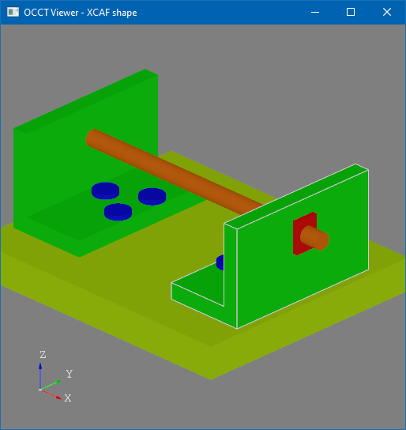
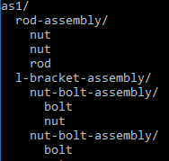
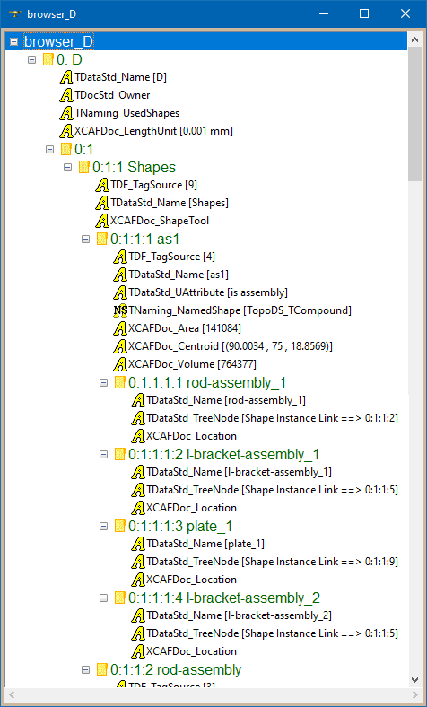
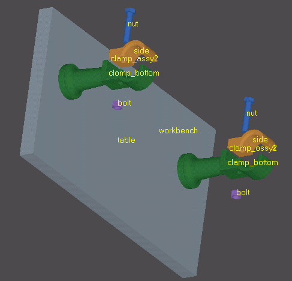

Visual materials are an essential part in games. In a CAD world, however, geometry definition is the most important component, which CAD algorithms are dealing with.
Colors and visual properties are often put into a somewhat auxiliary, optional category here.

Colors might help to highlight important details, features or to just separate parts of different types in an assembly structure.
Multicolored model looks perceptually much more attractive than a boring single-colored geometry.

In this short tutorial, we will pass through reading a colorful *STEP model* into an *XCAF document* and displaying it in the *AIS viewer* with colors using the `XCAFPrs_AISObject` presentation.

<!--break-->

|  |
|:--:|
| &nbsp; |

## Creating empty XCAF document

*OCCT* newcomers could easily find samples reading *STEP* and *IGES* files into `TopoDS_Shape`, but soon realize that `TopoDS_Shape` defines only topological structure, geometry and nothing more.
The *XCAF document* allows mapping additional attributes like colors and names to topological shapes.
A short overview about *XCAF document* could be found in a chapter at the end of this tutorial.

Before translating anything into *XCAF*, we need creating a document represented by `TDocStd_Document` class:

```cpp
Handle(TDocStd_Application) anXdeApp = new TDocStd_Application();
BinXCAFDrivers::DefineFormat(anXdeApp); // to load XBF files
Handle(TDocStd_Document) anXdeDoc;
anXdeApp->NewDocument(TCollection_ExtendedString("BinXCAF"), anXdeDoc);
```

You may find it confusing to deal with some *"application"* class, but this is how an *OCAF* pipeline works.
*OCAF* declares a plugin interface to register persistence formats, and `BinXCAFDrivers::DefineFormat()` is a way to register reading/writing *XBF* files (binary *XCAF* persistence).
After defining format, document could be saved to and restored from a file using methods `TDocStd_Document::Open()` and `TDocStd_Document::SaveAs()`:

```cpp
PCDM_ReaderStatus aReadStatus = anXdeApp->Open("doc.xbf", anXdeDoc);
if (aReadStatus != PCDM_RS_OK) { std::cerr << "Error\n"; }
PCDM_StoreStatus aWriteStatus = anXdeApp->SaveAs(anXdeDoc, "new_doc.xbf");
if (aWriteStatus != PCDM_SS_OK) { std::cerr << "Error\n"; }
```

*Users of older OCCT versions might recall that OCAF plugins required much more boilerplate to work - with files defining formats, environment variables and dynamically loaded libraries (DLL).*
*All of this could be avoided nowadays in favor of straight-forward API with explicitly linked libraries defining necessary formats.*

## Reading STEP into XCAF

`STEPControl_Writer` class reads the *STEP model* into `TopoDS_Shape`, but this is not what we are looking for.
Instead, we need to use a class from a neighbor package `STEPCAFControl_Reader`, which deals with *XCAF documents*.

To read a *STEP file* we need using `STEPCAFControl_Controller` tool like this:

```cpp
OSD::SetSignal(false); // catch signals

// initialize STEP reader parameters
STEPCAFControl_Controller::Init();
STEPControl_Controller::Init();

// read and translate STEP file into XCAF document
STEPCAFControl_Reader aReader;
try
{
  // read model from file
  if (aReader.ReadFile("cad.step") != IFSelect_RetDone)
  {
    Message::SendFail() << "STEP reader failed";
    return false;
  }
  // translate model into document
  if (!aReader.Transfer(anXdeDoc))
  {
    Message::SendFail() << "STEP translator failed";
    return false;
  }
}
catch (const Standard_Failure& theFail)
{
  Message::SendFail() << "STEP import exception\n["
                      << theFail.GetMessageString() << "]";
  return false;
}
```

You may find similar translators for other file formats in *OCCT* - `IGESCAFControl_Reader` for *IGES*, `RWGltf_CafReader` for *glTF*,  `RWObj_CafReader` for *OBJ*.
Commercial components from *Open Cascade* provide similar interfaces for some other file formats as well.
Forthcoming *OCCT 7.7* also introduces `DEWrapper` that should provide a single entry point
for working with supported file formats and avoid an extra per-format boilerplate, but this is another topic.

## Exploring assembly structure

So, we read a *STEP file* into an *XCAF*, but how could we see what document defines? Let's try `XCAFPrs_DocumentExplorer` to print an *assembly tree*:

```cpp
for (XCAFPrs_DocumentExplorer aDocExp(anXdeDoc,
                             XCAFPrs_DocumentExplorerFlags_None);
     aDocExp.More(); aDocExp.Next())
{
  const XCAFPrs_DocumentNode& aNode = theExp.Current();
  TCollection_AsciiString aName(aDocExp.CurrentDepth() * 2, ' ');
  Handle(TDataStd_Name) aNodeName;
  if (aNode.RefLabel.FindAttribute(TDataStd_Name::GetID(), aNodeName)
   || aNode.Label.FindAttribute(TDataStd_Name::GetID(), aNodeName))
  {
    aName += aNodeName->Get();
  }
  std::cout << aName << " [id: " << aNode.Id << "]\n";
}
```

The code would print something like this:

|  |
|:--:|
| &nbsp; |

*Assembly tree* presents the document's structure in a convenient and natural way - what most users expect to see.
This tree, however, doesn't reflect an actual *XCAF data model* structure, which is much more complicated.

Instead of using `XCAFPrs_DocumentExplorer`, application may iterate over shape labels in the document in a recursive manner,
starting from root shapes returned by `XCAFDoc_ShapeTool::GetFreeShapes()`:

```cpp
TDF_LabelSequence aRootLabels;
XCAFDoc_DocumentTool::ShapeTool(anXdeDoc->Main())
  ->GetFreeShapes(aRootLabels);
for (TDF_LabelSequence::Iterator aRootIter(aRootLabels);
     aRootIter.More(); aRootIter.Next())
{
  TDF_Label aRefLabel = theLabel;
  XCAFDoc_ShapeTool::GetReferredShape(theLabel, aRefLabel);
  if (XCAFDoc_ShapeTool::IsAssembly(aRefLabel))
  {
    for (TDF_ChildIterator aChildIter(aRefLabel);
         aChildIter.More(); aChildIter.Next())
    {
      ...
    }
  }
  ...
}
```

If you are familiar with *Draw Harness*, you may find useful a helpful tool `DFBrowse` for investigating *XCAF document* structure in more details:

```
pload XDE
ReadStep D "as1-oc-214.stp"
DFBrowse D
```

|  |
|:--:|
| &nbsp; |

Within *XCAF document*, shapes could be defined by *assemblies* (`XCAFDoc_ShapeTool::IsAssembly()`), by *"product"* references (`XCAFDoc_ShapeTool::GetReferredShape()`) and by *"instances"*.
The same shape *"product"* might have multiple *"instances"* in a tree structure, and shapes that are not referenced as childs of any *assemblies* are considered as *"free" shapes* (e.g. *root shapes*).
Each shape label might have assigned attributes like names and colors.
Beware that *product*/*instance* terminology might vary across applications and documentation.

## Displaying XCAF in 3D Viewer with colors

`XCAFPrs_AISObject` presentation handles most of the complexity of displaying shapes in the *XCAF document* with color mapping.
This presentation inherits `AIS_ColoredShape`, with `::Compute()` method internally fetching a `TopoDS_Shape` from the given *XCAF label*
(`XCAFDoc_ShapeTool::GetShape()`) and filling in a map of sub-shape styles (`XCAFPrs::CollectStyleSettings()).

Let's use `XCAFPrs_DocumentExplorer` tool to iterate over document shape nodes:

```cpp
Handle(AIS_InteractiveContext) theCtx = ...;
Handle(V3d_View) theView = ...;
for (XCAFPrs_DocumentExplorer aDocExp(anXdeDoc,
                    XCAFPrs_DocumentExplorerFlags_None);
     aDocExp.More(); aDocExp.Next())
{
  const XCAFPrs_DocumentNode& aNode = aDocExp.Current();
  if (aNode.IsAssembly) { continue; } // handle only leaves
  Handle(XCAFPrs_AISObject) aPrs =
    new XCAFPrs_AISObject(aNode.RefLabel);
  aPrs->SetLocalTransformation(aNode.Location);
  // AIS object's owner is an application-owned property;
  // it is set to string object in this sample
  aPrs->SetOwner(new TCollection_HAsciiString(aNode.Id));
  theCtx->Display(aPrs, AIS_Shaded, 0, false);
}
theView->FitAll(0.01, false);
theView->Redraw();
```

In the code snippet above we are iterating over leaves in an *assembly tree* - so that we would be able to pick each part individually in *3D Viewer*.
We also assign *Node's location* to an *interactive object* to transform it properly in space.

In addition, `AIS_InteractiveObject::SetOwner()` calls put application-specific context inside each object, which is just a string id in our case.
`TDF_Label` doesn't define a complete path to the shape in the assembly structure, so such identifiers would be necessary to perform some actions on a shape picked in a 3D Viewer,
like synchronization with an *Object's Tree* in a user interface.

|  |
|:--:|
| &nbsp; |

If picking of individual parts is not required by application, we might iterate over free (root) shapes in the document (`XCAFDoc_ShapeTool::GetFreeShapes()`) and display them instead.

## eXtended Data Exchange

*XDE*, or [eXtended Data Exchange](https://dev.opencascade.org/doc/overview/html/occt_user_guides__xde.html), provides data structures
and tools complementing B-Rep geometry with various attributes, like colors, names, materials, validation properties, PMI and others.
These data structures are represented by an *XCAF document* - *XDE attributes* for *Open CASCADE Application Framework* (*OCAF*).

*XCAF document* structure and capabilities largely rely on *STEP format* specification.
This exhaustive *ISO standard* covers many aspects of *CAD data exchange*,
which makes it the perfect foundation for *XDE* - simpler formats like *IGES* just use a subset of its full capabilities.

|  |
|:--:|
| &nbsp; |

Most CAD translators in *OCCT* are designed in two layers - a lower level closely following data structures defined by specific 3D format,
and translators of these low-level structures into *B-Rep* (`TopoDS_Shape`) and into an *XCAF document*.

*XCAF document* structure tries to accumulate features of different CAD formats, and serves as a translation basis.
Within *OCCT* itself, it is supported by *STEP*, *IGES*, *glTF*, *OBJ* and *VRML* readers and writers,
while commercial *Open Cascade* products extend this list with formats like *JT*, *DXF*, *XT*, *IFC* and others.

Being initially designed not as a high-level API, *XCAF* doesn't look friendly to newcomers.
Moreover, it doesn’t protect a user from preparing a document structure unsuitable for further translation.
However, *XCAF* still serves a good basis as (mostly) format-independent document structure available in *OCCT*.

In most cases, users don't actually need to modify existing *XCAF documents* or handle all its features.
Instead, it might be preferred writing translators between *XCAF documents* and application-specific *Data Model* preserving details that are really important.

## Sample project

You may find a complete project demonstrating reading of a *STEP file* into an *XCAF document* and displaying it in *3D viewer* within the folder
"[occt-xcaf-shape](https://github.com/gkv311/occt-hello)".
