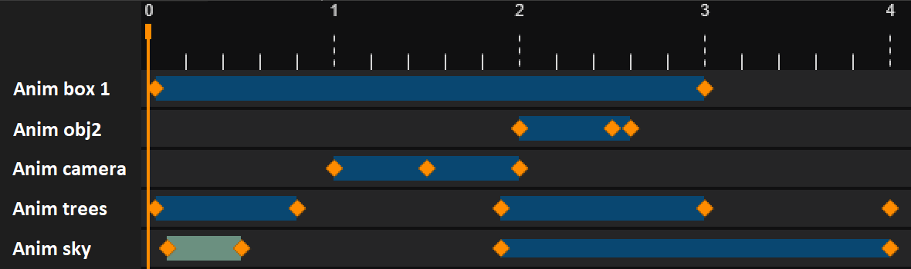

*Animation playback* is an integral part of real-time graphics, and sooner or later any *CAx* application has to implement animation of
some sort - would that be a simulation of robotics kinematics, embedded video playback, simulation of some process or just a smooth camera transition.
These animations look very different, but raise common questions for managing smooth and timely viewer updates.

For a long while, each application utilizing *OCCT 3D Viewer* had to implement animation in its own way.
These implementations were usually both complicated, error-prone, and suffered from bugs and limitations.
At some point we've decided that animation logic could be generalized to some extent and put into the *AIS framework*.

`AIS_Animation` introduced in *'2016* and [`AIS_ViewController`](../2019-11-06-ais_viewcontroller-in-occt-7-4-0/)
introduced later on (landed in *OCCT 7.4.0*) - are two bricks of this animation API accumulating years of experience in development of *CAx* applications.
This article provides a short overview of this API and animation in general, briefly shares my background and ideas put into it.

<!--break-->

## Naturally broken

One may say that implementing animation is a very simple and straightforward process.
Just split your process into a fixed number of steps and draw your frames one by one.
I've seen this basic approach (with some upgrades) being implemented in various applications numerous times.
Not just *CAx* applications, but also in (top) games and especially in many GUI applications demonstrating simple animation effects in their user interface.

Why can I say that for sure? Because all of them suffered from common issues - too fast animation, too slow, stuttering playback, blocked user input and others...
Developers test their code on their own computers, where everything works as they expect.
The tricky part is that when everything is good, users might not even notice any issues with a simple animation approach.

But most applications are running not on a [real-time OS](https://en.wikipedia.org/wiki/Real-time_operating_system).
Computer performance varies wildly over end users, and a time matter is very different on each system.
In such conditions developers should pay more attention to implement a more robust animation playback mechanic that would work not only on the same machines as of their own.

My personal background might be very uncommon to other developers.
My first acquaintance with animation principles was reading an article about [writing a video player in 1000 lines](http://dranger.com/ffmpeg/) of code using FFmpeg framework,
which instantly inspired me to add a video playback to sView a long time ago.
That wasn't a perfect sample of an ideal video player, but it has elaborated the very basics - key frames, audio/video synchronization and balancing framerate (dropping frames).
These basics could be applied (to some extent) not only to video playback, but to playing animation in a 3D viewer as well.

Once in a while, I've managed a small project based on *FreeCAD* involving simple animation in a 3D viewer.
Based on my prior experience, I've put extra efforts to describe animation logic in a technical proposal with very precise implementation details.
Could you imagine my anger, when a young developer has ignored my detailed description and implemented animation logic in a *"wrong" way*?!
And to see that, I don't even have to see the source code - it was obvious just because of issues in application behavior that I've already foreseen...

## Naive animation player

Consider a simple animation scenario - you would like animating a box [translation](../2021-03-28-transformations-in-occt/).
The very first attempt might look like this - let's show *100 animation frames* in a loop:

```cpp
Handle(AIS_Shape) theBox = ...;
Handle(AIS_InteractiveContext) theCtx = ...;
const int aNbFrames = 100;
gp_Vec aFullTranslation(10.0, 0.0, 0.0);
gp_Trsf aTrsfStep;
aTrsfStep.SetTranslation(aFullTranslation / aNbFrames);
for (int aFrame = 0; aFrame < aNbFrames; ++aFrame)
{
  theCtx->SetLocation(theBox, theBox->LocalTransformation() * aTrsfStep);
  theCtx->UpdateViewers();
}
```

You may find similar animation samples written in any language (*C*, *C++*, *JavaScript*, *C#*) and framework all around the web.
Is there something wrong with it? Consider the following scenarios:

- Computer is fast, the framerate is locked to a *60 Hz* monitor refresh rate (*VSync is ON*).
  - *OK*, animation will be displayed as expected by a developer.
- Computer is slow.
  - *KO*, animation will take (much) more time than expected.
- Computer is fast, framerate is unlimited or locked to a *90*/*120 Hz* monitor refresh rate.
  - *KO*, animation will take (much) shorter time than expected.
- User wants to exit the program or rotate a viewer during animation.
  - *KO*, the user HAS to wait the whole animation to finish before being able to interact.

Animation might work as expected most of the time, some users will see the problem, while others might be unable to understand
what is actually wrong and even blame graphic drivers or computer performance for these issues.
But from a development point of view all these issues clearly indicate limitations / bugs in the application itself!
It is amazing how many developers actually stop at this very first step considering animation being "well done".

## Multimedia timers

The first code sample didn't define an ***animation duration*** explicitly, but obviously the author expected animation to last within a fixed amount of time based on his computer performance.
The next "upgrade" to this simple loop would be using a ***multimedia timer*** drawing animation frames with a predefined delay based on animation duration:

```cpp
Handle(AIS_Shape) theBox = ...;
Handle(AIS_InteractiveContext) theCtx = ...;
const int aNbFrames = 100;
gp_Vec aFullTranslation(10.0, 0.0, 0.0);
gp_Trsf aTrsfStep;
aTrsfStep.SetTranslation(aFullTranslation / aNbFrames);
double aDurationSeconds = 20.0;
double anAnimStepSeconds = aDurationSeconds / aNbFrames;
SetupAnimation(anAnimStepSeconds, [=]() {
  theCtx->SetLocation(theBox, theBox->LocalTransformation() * aTrsfStep);
  theCtx->UpdateViewers();
});
```

The implementation details of `SetupAnimation()` are behind the scope of this article as they highly depend on a GUI framework used by the project
(like [WinAPI timers](https://docs.microsoft.com/en-us/windows/win32/winmsg/about-timers)).
The idea is simple - setup some timer triggering animation updates with the specified time interval.
In such a way we define a total animation time (duration) and split it into some number of frames to achieve a desired framerate like *30* or *60 frames per second*.
This is much better than a first naive implementation, but it still suffers from issues:

- Computer is fast, *VSync is turned OFF*.
  - *OK*, animation will be displayed as expected by a developer.
- Computer is slow.
  - *KO*, animation callbacks might be called with expired time leading to longer overall animation duration time.
- *VSync* is turned ON and monitor refresh rate is smaller than animation rate.
  - *KO*, animation might be bulky or longer.
- User interacts with the camera / viewer in parallel to animation.
  - *KO*, animation might be bulky or longer due to additional viewer redraws.

Is it possible to handle these issues as well?

## Interpolation between keyframes

Animation is usually defined not by an action or impulse, but by a series of object / camera states, called ***key frames***.
The sample above has defined just a pair of key frames - a box at initial position and translated by a vector `(10, 0, 0)`.
The other *frames in-between* normally represent some *interpolation* result.
In case of translation vector, *linear interpolation* is pretty straight-forward to compute:

```cpp
gp_Vec Interpolate(gp_Vec theStart, gp_Vec theEnd, double theT)
{
  return (1.0 - theT) * theStart + theT * theEnd;
}
```

*You may ask why this strange `(1.0 - theT)` and not more natural `theStart + (theEnd-theStart) \* theT`.*
*Both should give the same result, but the formula above tries to handle floating point math issues to ensure*
*that `0.0` parameter will return exactly `theStart` and `1.0` will return exactly `theEnd` without additional error.*

This is a replica of `NCollection_Lerp::Interpolate()` template class method computing an interpolated result between two vectors for a specified weight factor `theT` defined in range `[0, 1]`.
Defining the weight factor behind this interval would require extrapolation and usually gives an unexpected result in animation, so the range should be respected.

Straightforward linear interpolation might give obviously incorrect results for some transformation.
In such cases animation should be split into smaller keyframe steps, where deviations of linear interpolation are not noticeable.
Another option would be replacing linear interpolation with an alternative, better reflecting the nature of applied transformation - like spherical interpolation for quaternions.

To apply interpolation keyframes are put onto the ***playback timeline*** at required ***presentation timestamps*** (often abbreviated as ***PTS***).
So that before redrawing any frame, application should apply current playback time to active animation(s):

```cpp
Handle(AIS_Shape) theBox = ...;
Handle(AIS_InteractiveContext) theCtx = ...;
double anAnimFPS = 30;
gp_Vec aFullTranslation(10.0, 0.0, 0.0);
gp_Trsf aTrsfStart = theBox->LocalTransformation();
double aDurationSeconds = 20.0;
double anAnimStepSeconds = 1.0 / anAnimFPS;
SetupAnimation(anAnimStepSeconds, aDurationSeconds, [=](double thePts) {
  double aFactor = thePts / aDurationSeconds;
  gp_Trsf aTrsf;
  aTrsf.SetTranslation(aFullTranslation * aFactor);
  theCtx->SetLocation(theBox, aTrsfStart * aTrsf);
});

void RedrawFrame()
{
  UpdateAnimations();
  theCtx->UpdateViewers();
}
```

Such implementation allows updating animation properly regardless of active framerate.
Frame is always drawn in an up-to-date animation state - smoothly and interleaved with other user interactions (when allowed).

## AIS_Animation interface

`AIS_Animation` defines an API for an arbitrary animation in 3D viewer. Basic ideas behind this interface:

- `AIS_Animation::Children()`<br>
  Each animation could be defined by a combination of several smaller animations, organized sequentially or/and nested.
  Basic implementation would simply iterate over children and request their updates.
- `AIS_Animation::Duration()`, `AIS_Animation::StartPts()`<br>
  Each animation defines playback duration and starting time.
- `AIS_Animation::Timer()`, `AIS_Animation::StartTimer()`<br>
  Animation playback is managed by a timer, which could be started, paused and stopped.
- `AIS_Animation::update()`<br>
  Animation subclass implements some viewer update logic that takes information about the current progress `AIS_AnimationProgress` on input.
  The progress could be represented by a timestamp from the beginning or as a fraction within animation duration - whatever would be more applicable to a particular animation logic.

|  |
|:--:|
| &nbsp; |

**AIS** framework comes with a couple of implementations of this interface:

- `AIS_AnimationCamera`<br>
  Defines smooth transitions between two camera points (a pair of `Graphic3d_Camera` for `V3d_View`).
- `AIS_AnimationObject`<br>
  Defines smooth transition between two object locations (a pair of `gp_Trsf` for `AIS_InteractiveObject`).

The previous box animation sample could look like this using `AIS_AnimationObject`:

```cpp
Handle(AIS_Shape) theBox = ...;
Handle(AIS_InteractiveContext) theCtx = ...;
gp_Vec aFullTranslation(10.0, 0.0, 0.0);
gp_Trsf aTrsfStart, aTrsfTo;
aTrsfTo.SetTranslation(aFullTranslation);
double aDurationSeconds = 20.0;
Handle(AIS_AnimationObject) anObjAnim =
  new AIS_AnimationObject("MyAnim", theBox->InteractiveContext(),
                       	  theBox, aTrsfStart, aTrsfTo);
anObjAnim->SetOwnDuration(aDurationSeconds);
anObjAnim->StartTimer(0.0, 1.0, true);
...
void RedrawFrame()
{
  anObjAnim->UpdateTimer();
  theCtx->UpdateViewers();
}
```

If you will try using these classes you may easily observe their limitations due to linear interpolation math:

- Consider you need to rotate an object around its center by *360 degrees*.
- Consider that linear interpolation between object locations (`gp_Trsf`) or camera viewpoints provides unexpected / undesired results.

Obviously, *linear interpolation* is only one way to interpolate complex transitions.
You may compensate for these limitations by providing more steps in animation, or by subclassing and implementing interpolation logic of your own.
In many cases the latter might be much more straightforward and efficient.

Here is how might looks an animation class rotating object over an axis, for instance:

```cpp
class MyAxisRotation : public AIS_Animation
{
public:
  MyAxisRotation(const Handle(AIS_InteractiveObject)& theObj,
                 const gp_Ax1& theAxis,
                 const double  theAngleFrom,
                 const double  theAngleTo)
  : AIS_Animation("MyAxisRot"), myObject(theObj), myRotAxis(theAxis),
    myAngleFrom(theAngleFrom), myAngleTo(theAngleTo) {}

protected:
  //! Update the progress.
  virtual void update(const AIS_AnimationProgress& theProgress) override
  {
    gp_Trsf aTrsf;
    double anAngle = (1.0 - theProgress.LocalNormalized) * myAngleFrom
                   + theProgress.LocalNormalized * myAngleTo;
    aTrsf.SetRotation(myRotAxis, anAngle);

    myObject->GetContext()->SetLocation(myObject, aTrsf);
    myObject->GetContext()->CurrentViewer()->Invalidate();
  }

private:
  Handle(AIS_InteractiveObject) myObject;
  gp_Ax1 myRotAxis;   //!< rotation axis
  double myAngleFrom; //!< start angle for rotation
  double myAngleTo;   //!< end   angle for rotation
};
```

## `vanim` in Draw Harness

*Draw Harness* comes further and implements `ViewerTest_AnimationProc` subclass which allows executing an arbitrary *Tcl script* as a callback to `AIS_Animation` updates.
This brings a lot of flexibility to `vanimation` command that allows implementing complex animation scenarios even without subclass `AIS_Animation` at C++ level.

```tcl
pload MODELING VISUALIZATION
restore [locate_data_file occ/CrankArm.rle]     a
restore [locate_data_file occ/CylinderHead.rle] h
restore [locate_data_file occ/Propeller.rle]    p
restore [locate_data_file occ/EngineBlock.rle]  e

vclear
vinit View1 width=912 height=512
vaspects -defaults -isoOnTriangulation 1 -faceBoundaryDraw 1
vrenderparams -rendScale 2
vzbufftrihedron -position right_lower
vcamera -persp -fovy 60
vdisplay -dispMode 1 -mutable a h p e
vfit
vsetcolor p GREEN
vsetcolor e RED
vsetcolor h PURPLE

vanimation anim -clear

# skydome
vanimation anim/sky -start 0 -dur 2.0 -cmd {
  vbackground -skydome -time %localPts -noupdate
}

# onscreen text
vanimation anim/osd -start 0 -dur 2.0 -cmd {
  vdrawtext lab "Current PTS: %pts sec" -2d -persPos -1 -1 30 -noupdate
}

# propeller animation
vanimation anim/prop -start 0 -dur 2.0 -cmd {
  set aSpeed  [expr 360.0]
  set anAngle [expr %localPts * $aSpeed]
  #puts "anAngle=$anAngle"
  vlocation p -reset -rotate 0 0 0 0 0 1 $anAngle
}

# start playback
vanimation anim -play -playSpeed 0.2
```

|  |
|:--:|
| &nbsp; |

## Embedding animation into scene updates

Most games continuously redraw viewer content as fast as hardware can or targeting some desired framerate, optimal for game engine (*30 FPS*, *60 FPS*, etc.).
This makes it trivial to realize that in games animation should be updated at the beginning of each drawn frame.

*CAD software*, however, avoids such continuous redraw loops.
Instead, A *CAD viewer* is normally updated when it has to - after scene modification or viewer interactions.
There are a couple of reasons for this distinction between CAD and game software - first,
CAD software has to operate with larger data sets close to hardware limits,
so that continuous viewer updates would make software less interactive.
The other reason is that games are used exclusively (normally full-screen),
while CAD software is used in parallel to dozens of other applications - unnecessary viewer updates
will lead to excessive utilization of hardware resources and would make all runned applications working slower.

The simplest approach to implement viewer updates on demand is *"immediate" updates*.
Within this approach, each viewer modification (like adding object to scene, changing aspects, rotating camera and others) should be followed by immediate redraw of viewer content.
This ensures that viewer content shown to the user is always in sync with its state in the memory.
The obvious drawback is that excessive number of viewer updates leading to poor viewer performance in general.

The common way for implementing *OCCT viewer* animation in the past was starting a GUI animation timer applying animation and redrawing viewer content with desired frequency.
But what would happen when user interactions (camera navigation) happen concurrently with objects animation?
The result wouldn't look nice to the user - the viewer will respond with a strong *jittering effect*.

`AIS_ViewController` tries to normalize this process by defining a single place redrawing viewer.
In this concept, `AIS_ViewController` should iterate over all input events (camera interactions) as well as active animations (`AIS_Animation`)
to ensure the *Viewer* content shown on the screen matches the most recent application state.

`AIS_ViewController` provides to properties for straightforward integration:

- `AIS_ViewController::ObjectsAnimation()`<br>
  Intended for defining animated objects.
- `AIS_ViewController::ViewAnimation()`<br>
  Intended for defining camera animations.

The main difference between the two is responding to user input.
Camera animations `AIS_ViewController::ViewAnimation()` will be interrupted by input involving camera manipulations,
while objects' animation `AIS_ViewController::ObjectsAnimation()` will keep running.
This separation helps to keep the viewer responsive and interactive while playing long animations.

## More about video playback

There are other kinds of animations that are not yet covered by *AIS* out-of-the-box - like skeletal animations (popular in games, but not that useful for *CAx*).
It would be nice to see more animation scenarios working in the *AIS framework* in the future.
Some other scenarios like real-time physical simulation / dynamics / collision detection could be handled by `AIS_Animation` as well, though they do not fit into the fixed-duration concept.

The latter chapters will be less interesting to developers working with 3D viewer animations.
Video playback is uncommon in a 3D viewer, but such use cases appear in practice from time to time - like in the case of a
[ROBINS project](https://youtu.be/78hcIlx6H4g?list=PLLlxfvhrTCyfb5gUD_G3T0yGYpha3tido) for displaying photogrammetry videos.

You may find the interactive object `AIS_MediaPlayer` helpful, if you have similar needs.
Though, don’t expect too much from this video playback API in *OCCT* as it is pretty basic and experimental.

## Audio / video synchronization

Being a video stream or 3D animation, it is often accompanied by an audio stream, which are expected to be played simultaneously and in-sync.
Synchronization of streams is a source of numerous implementation problems and issues,
because even small delay becomes noticeable to users - just imagine an artist talking with their mouth closed and vice versa.

Audio streams have much higher discretization frequency (*48 kHz* and higher) compared to video (*24+ FPS*).
At the same time audio distortions due to dynamic varying playback speed are much more noticeable
to the human ear than similar deviations in a video framerate playback to the human eye.
Combined with much smaller sizes, makes the audio stream a perfect source of synchronization for a video or other stream - it is almost never done in the opposite direction!

Practically speaking, the audio synchronization introduces just a small change
to the animation workflow defined above - the presentation timestamp should be calculated from the beginning of audio playback
(e.g. considering even a small delay at animation start and audio playback interruptions).

## Dropping frames

The mechanism described in the previous chapter assumes that key frames are defined in advance and always could be interpolated - which are the perfect conditions for an ideal animation.
But there are scenarios where such conditions are not met. For instance, the video decoding process has several limitations.

***1. Uninterpolated video frames.***

Interpolation between video frames makes no sense - a trivial algorithm will show just a blurred mess.
Practically speaking, this limitation doesn't make much difference to the previously described animation pipeline - it just requires finding
a frame with the closest timestamp instead of interpolating two frames.

If video framerate is higher than display rate, some frames behind the time will be discarded without being displayed at all.
***Dropping frames*** allows playing video on slow hardware at expected motion speed, although may result in losing some details in animation up to a non-acceptable output (too low framerate).

Video recorded at traditional low framerate (*24* or *30 FPS*) commonly suffers from  a "strobe" or "choppy" effect at fast camera motions - without frame interpolation,
the display refresh rate (usually *>= 60 Hz*) makes no difference, and eyes notice defects in animation.
For that reason, there are software solutions "upscaling" traditional videos having low framerate (*24* / *30 FPS*) to higher values,
but quality of such conversion is doubtful and cannot be considered as a general solution (apart from complexity of involved algorithms).
Interestingly, *Peter Jackson* in *"The Hobbit"* trilogy has tried [pushing new HFR](https://www.theverge.com/2014/12/19/7422633/hfr-might-work-even-though-it-looks-really-awful)
(high-frame rate) standard to big cinema with mixed success...

***2. Sequential video decoding.***

Video decoding is a sequential process. To achieve a high compression ratio, video stream is encoded into key-frames,
[B-frames, P-frames, I-frames](https://en.wikipedia.org/wiki/Video_compression_picture_types), where non-key frames are defined as a delta to the nearest key-frame.
This highly impacts the logic of dropping video frames decoded behind their playback time as there is no way to effectively skip frames.

This is one of the reasons why a video player is unable to show a video reliably smooth even if performance of hardware is just *10-20%* slower than necessary to decode video at full framerate.
As there is no efficient way to skip ***decoding*** of these *10-20%* of frames, such video will be displayed either choppy
(only keyframes will be shown - which might be *2-7* seconds between!) or unnaturally slow.
Though there might be a bunch of other places in application to optimize and win this *10-20%* of speed.

Any blocking and heavy-weight operation like reading file content or decoding video is desired to be offloaded into the background working thread (or even several threads).
The rendering thread should only flush already parsed and decoded data onto the GPU keeping the viewer responsive and interactive.

## Afterwords

This article looks a little bit chaotic and probably lacks practical tutorial-alike elements.
But I started it many years ago and felt a little bit sorry for not sharing it for so long due to lack of time and unimplemented ideas.
Hopefully, somebody will find some answers to their questions in this article and will help in their development.
