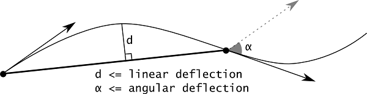
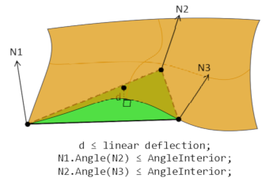
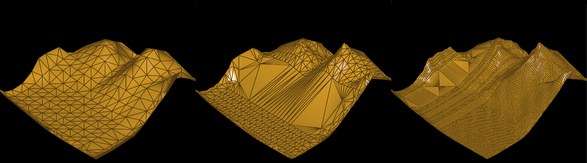
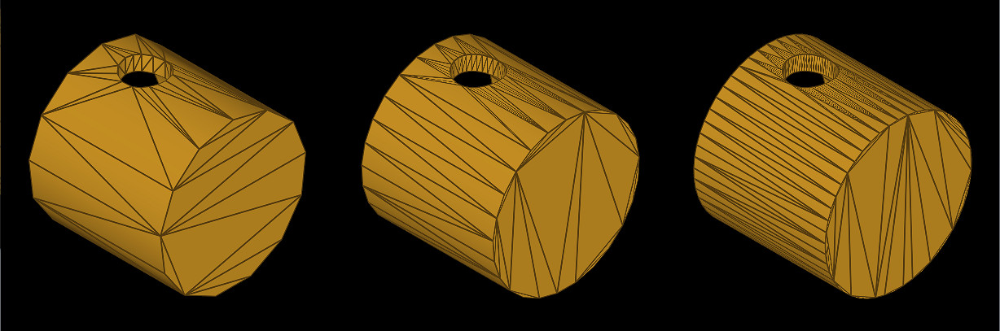
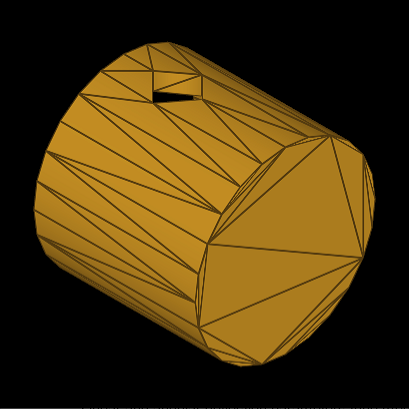
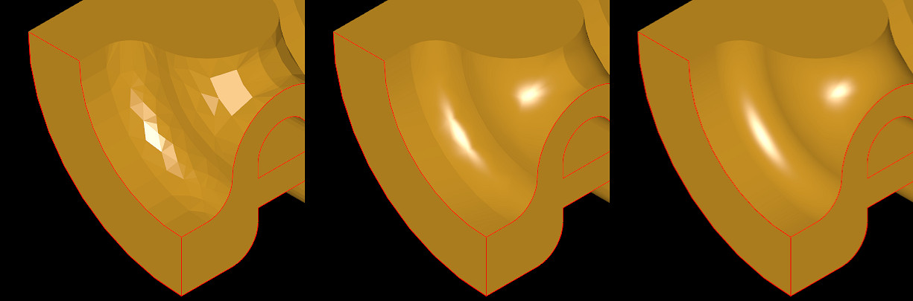
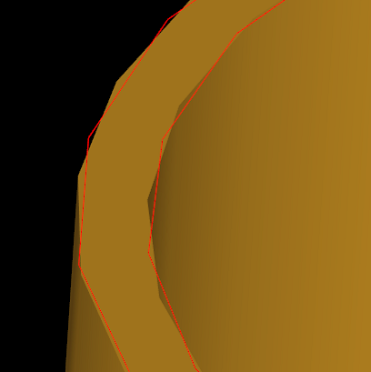
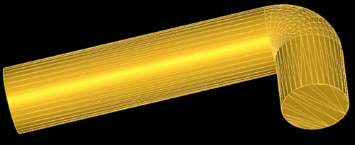
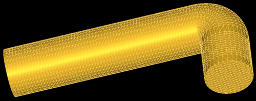

**BRepMesh** is an essential part of *Open CASCADE Technology*, which handles generation of triangulated representation of analytical surfaces in *B-Rep shapes*.
Whether you want to display a shape in 3D Viewer, to speedup some geometrical algorithm like collision detection,
to convert *STEP file* into *STL format* for 3D printer or into *glTF format* for web application - *BRepMesh* is the first step to go.
This post provides a short introduction to new *BRepMesh* users.

<!--break-->

## Meshing Process

*OCCT* relies on [boundary representation](https://en.wikipedia.org/wiki/Boundary_representation), or *B-Rep*, for defining geometrical objects.
This *topological structure* might be rather complex and flexible - analytical surfaces bound by curves, connected into complex chains with tolerances, covering imprecision of geometry.
*Triangulation* provides an *approximated representation* of this complex B-Rep which has plenty of applications, and the BRepMesh tool allows generation of it.

The detailed description of *BRepMesh algorithm* could be found in it's [documentation](https://dev.opencascade.org/doc/overview/html/occt_user_guides__mesh.html),
this post will describe just a high-level workflow:

- Algorithm computes tessellation of each `TopoDS_Edge`, e.g. bounding curves lying on surfaces, considering linear and angular deflection parameters.<br>
  

- Then the algorithm computes tessellation of each `TopoDS_Face` in 2D parametric space - as 2D polygons with bounds (outer and holes),
  defined by tessellation of `TopoDS_Edge`'s computed on the previous step.
  This is done by either Watson or [DelaBella](https://github.com/msokalski/delabella) algorithms.
- Final triangulation of `TopoDS_Face` is computed from the initial one incrementally via [Delaunay](https://en.wikipedia.org/wiki/Delaunay_triangulation)
  algorithm by applying linear deflection in 3D space.<br>
  

The *BRepMesh algorithm* is much more complicated in reality, but this overview should help to understand basic steps.

**Linear** and **angular deflection** are fundamental input parameters of the *BRepMesh algorithm* defining desired mesh quality and precision.
`IMeshTools_Parameters` defines a dozen of other parameters, but `IMeshTools_Parameters::Deflection` and `IMeshTools_Parameters::Angle` pair is what the user adjusts first.
Reducing deflection makes a mesh finer, while increasing them - makes it rough.

Here is a code sample using *BRepMesh algorithm*:

```cpp
TopoDS_Shape theShape = ...;
IMeshTools_Parameters aMeshParams;
aMeshParams.Angle = 30.0 * M_PI / 180.0; // 30 degrees
aMeshParams.Deflection = 0.01;
aMeshParams.InParallel = true;
BRepMesh_IncrementalMesh aMesher;
aMesher.SetShape (theShape);
aMesher.ChangeParameters() = aMeshParams;
aMesher.Perform();
```

|  |
|:--:|
| *Linear deflection 5000 (left), 1000 (center) and 500 (right).* |

```
pload MODELING VISUALIZATION
restore [locate_data_file terrain.brep] b
vinit View1; vdefaults -autoTriang 0
vdisplay b -dispMode 1; vaspects b -drawEdges; vfit
tclean b; incmesh b 5000; vdisplay b -redisplay
tclean b; incmesh b 2000; vdisplay b -redisplay
tclean b; incmesh b 1000; vdisplay b -redisplay
tclean b; incmesh b 500;  vdisplay b -redisplay
```

*Linear deflection* restricts deviation of mesh from curve/surface along the distance.
*Angular deflection* is useful to preserve small curved elements, which are considered too small within specified linear distance:

|  |
|:--:|
| *Angular deflection 60° (left), 30° (center), 15° (right).* |

```
pload MODELING VISUALIZATION
restore [locate_data_file Piston.rle] b
vinit View1; vdefaults -autoTriang 0
vdisplay b -dispMode 1; vaspects b -drawEdges; vfit
tclean b; incmesh b 100 -min 0.001 -angular 60; vdisplay b -redisplay
tclean b; incmesh b 100 -min 0.001 -angular 30; vdisplay b -redisplay
tclean b; incmesh b 100 -min 0.001 -angular 15; vdisplay b -redisplay
```

*BRepMesh algorithm* also has a 'handbrake' parameter `IMeshTools_Parameters::MinSize`, which prevents shrinking of a triangle size
below some meaningful barrier, even when the linear/angular deflection criteria are not met.
By default, `MinSize` will be deduced as a fraction of Linear deflection:

|  |
|:--:|
| *Hole is tessellated ignoring angular deflection<br>when Linear size is set to 100 with automatic MinSize.* |

API users soon notice that the `BRepMesh_IncrementalMesh` class doesn't define any 'output' properties.
This is because *BRepMesh* stores generated mesh directly into `TopoDS_Shape` - you may use methods `BRep_Tool::Triangulation()`
to get `Poly_Triangulation` out of `TopoDS_Face` and `BRep_Tool::PolygonOnTriangulation()` to get polyline `Poly_PolygonOnTriangulation` out of `TopoDS_Edge`, bounding `TopoDS_Face`:

```cpp
TopoDS_Shape theShape = ...;
for (TopExp_Explorer aFaceIter(theShape, TopAbs_FACE);
     aFaceIter.More(); aFaceIter.Next())
{
  const TopoDS_Face& aFace = TopoDS::Face(aFaceIter.Current());
  TopLoc_Location aLoc;
  const Handle(Poly_Triangulation)& aPolyTri =
    BRep_Tool::Triangulation(aFace, aLoc);
  if (aPolyTri.IsNull()) { continue; } // error
  for (int aTriIter = 1; aTriIter <= aPolyTri->NbTriangles(); ++aTriIter)
  {
    const Poly_Triangle& aTri = aPolyTri->Triangle(aTriIter);
    gp_Pnt aTriNodes[3] =
    {
      aPolyTri->Node (aTri(1)),
      aPolyTri->Node (aTri(2)),
      aPolyTri->Node (aTri(3))
    };
  }
}
```

Moreover, `BRepMesh_IncrementalMesh` will not compute the mesh from scratch, if the shape has already defined some triangulation in it.
Instead, the algorithm will use such triangulation as the initial step to speed up the process.
If this is undesired - `BRepTools::Clean()` could be used to clean up the shape from previously computed triangulations.

At this point, you may notice that *BRepMesh* doesn't compute nodal normals - `Poly_Triangulation::HasNormals()` will return `FALSE` within the code snippet above.
Instead, *BRepMesh* puts UV coordinates to each node pointing to the originating surface, which could be used to compute smooth normals.
Tool `BRepLib_ToolTriangulatedShape::ComputeNormals()` will add missing normal attributes, essential for proper visualization.

|  |
|:--:|
| *Mesh normals - flat shading (left), averaged normals (middle), surface normals (right).* |

```cpp
TopoDS_Shape theShape = ...;
for (TopExp_Explorer aFaceIter(theShape, TopAbs_FACE);
     aFaceIter.More(); aFaceIter.Next())
{
  const TopoDS_Face& aFace = TopoDS::Face(aFaceIter.Current());
  TopLoc_Location aLoc;
  const Handle(Poly_Triangulation)& aPolyTri =
    BRep_Tool::Triangulation(aFace, aLoc);
  if (aPolyTri.IsNull()) { continue; }

  BRepLib_ToolTriangulatedShape::ComputeNormals(aFace, aPolyTri);
}
```

## Mesh quality

So, how to determine meshing parameters to achieve desired mesh quality?
*Linear deflection* is an essential factor here - it defines *maximum deviation* (distance) of triangles from the original surface.
There are two common ways to define it - *relative* to the bounding box of shape and as an *absolute* distance.

Applications that work with specific models should specify **absolute linear deflection** that would present desired level of detail of modeled objects.

Applications that operate on externally imported models of unknown origin might prefer defining
a **linear deflection** parameter **relative to the bounding box** of the model (see `StdPrs_ToolTriangulatedShape::GetDeflection()` tool).
This approach allows importing objects of size and complexity within a very wide range, but doesn't guarantee that mesh quality will be enough to a user.

Adding new objects would expand the bounding box of the scene, which would affect computed deflection.
As an alternative, relative deflection could be applied to each individual shape in the scene (like `AIS_Shape` does by default),
but this may lead to small parts being over-tessellated / large parts under-tessellated.

Application may provide to a user an option controlling visualization meshing quality as a list of presets.
*Angular deflection* is supplementary to *linear* one, but it is also important to adjust within quality presets.

## AIS_Shape implicit meshing

When it comes to visualization of `TopoDS_Shape`, the user should look at the [`AIS_Shape`](../2021-11-08-application-interactive-services-or-ais/) interactive object.
*AIS* is pretty friendly to the user here and will triangulate shape automatically for you (`Prs3d_Drawer::IsAutoTriangulation()`) by calling *BRepMesh* with default parameters under the hood.
Implicit meshing helps displaying shape in the 3D viewer in shaded mode effortlessly, but hides undesired side effects.

`Prs3d_Drawer::MaximalChordialDeviation()` defines a relative deflection (see `Prs3d_Drawer::TypeOfDeflection()`), which is then recalculated an actual deflection from `AIS_Shape` bounding box.
If the shape will be decomposed into sub-shapes, the algorithm might **re-mesh** already meshed shapes implicitly just because of smaller bounding boxes.

Remeshing hurts not only performance, but also visualization quality by providing inconsistent tessellation of connected shapes.
If an application uses triangulation for other purposes (e.g. in algorithms), implicitly replaced mesh may also break application logic.

|  |
|:--:|
| *Example of inconsistent tessellation.* |

The other issue with implicit meshing is the limited performance.
Application may dramatically benefit in performance by packing all shapes into single `TopoDS_Compound` and calling *BRepMesh* with `IMeshTools_Parameters::InParallel` option turned on.

For these reasons, it is highly recommended to *disable auto-triangulation* in *AIS* and perform meshing explicitly:

```cpp
Handle(AIS_InteractiveContext) theContext = ...;
theContext->DefaultDrawer()->SetAutoTriangulation(false);

TopoDS_Shape theShape1 = ..., theShape2 = ...;
TopoDS_Compound aComp;
BRep_Builder().MakeCompound(aComp);
BRep_Builder().Add(aComp, theShape1);
BRep_Builder().Add(aComp, theShape2);
BRepMesh_IncrementalMesh aMesher;
aMesher.SetShape (aComp);
aMesher.ChangeParameters() = theMeshParams;
aMesher.Perform();
// for each Face -> BRepLib_ToolTriangulatedShape::ComputeNormals()
Handle(AIS_Shape) aPrs1 = new AIS_Shape(theShape1);
Handle(AIS_Shape) aPrs2 = new AIS_Shape(theShape2);
theContext->Display(aPrs1, AIS_Shaded, 0, false);
theContext->Display(aPrs2, AIS_Shaded, 0, false);
```

Passing all shapes at once to *BRepMesh* would help to ensure that shared elements will not be remeshed multiple times,
and moreover - ensure that they will be meshed with exactly the same parameters (to preserve connectivity / avoid visual artifacts).

`AIS_Shape` will call `BRepLib_ToolTriangulatedShape::ComputeNormals()` tool implicitly, but it would be better to do this in advance.

```
# read STEP file into XCAF document
pload XDE OCAF MODELING VISUALIZATION
ReadStep D myStep.stp

# perform meshing
XGetOneShape s D
incmesh s -prs -parallel
trinfo  s

# display the document in 3D viewer using XCAFPrs_AISObject
vinit View1; vdefaults -autoTriang 0
XDisplay -dispMode 1 D -explore
vfit
```

## Other Meshing Tools

*BRepMesh* was designed to prepare a mesh, good enough for visualization purposes, and for some supplementary algorithms.
However, there are many applications, where computed triangulation would lack some critical properties - like [element skewness](https://en.wikipedia.org/wiki/Types_of_mesh#Skewness),
element aspect ratio, restricted element size, structured mesh, quadrangular mesh and others.

These requirements are common in the *CAE domain*, where the solver performs simulation of some physical properties on the mesh, and such algorithms are quite demanding to mesh quality.
One may rely on *BRepMesh* to compute initial triangulation and then apply a mesh refining algorithm to achieve desired mesh properties.
Otherwise, one may consider using the open-source meshing tool [Netgen](https://github.com/NGSolve/netgen), or some commercial tool for such purposes.

| <br> |
|:--:|
| *BRepMesh (above) vs. structured mesh (below).* |
