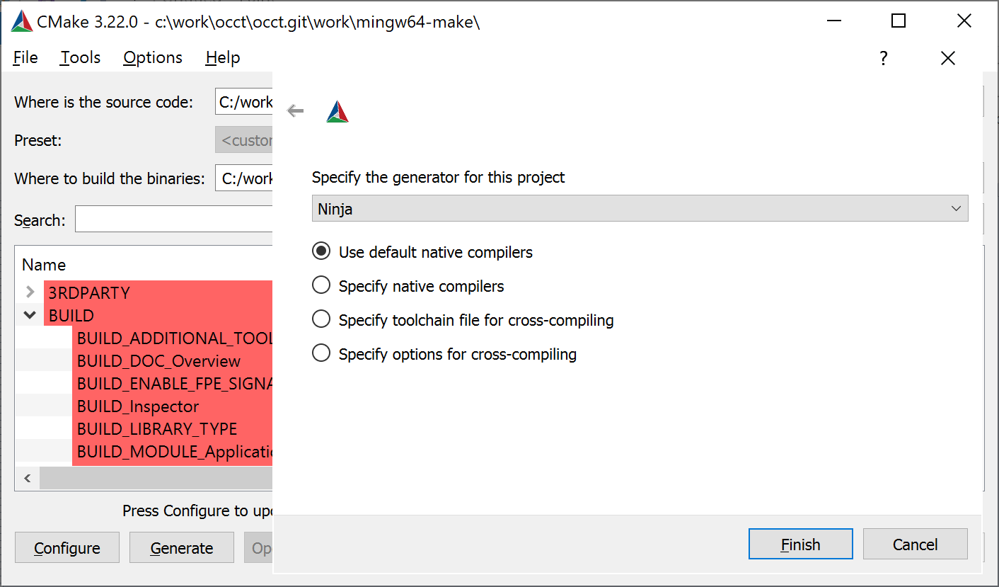
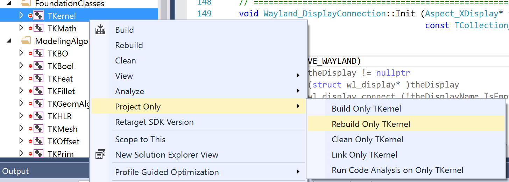
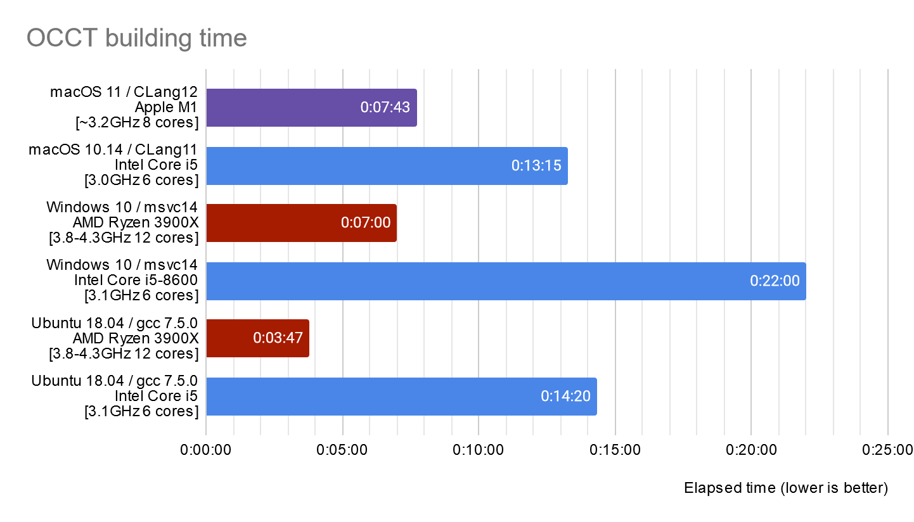

Recently, I've run into a project using the **Ninja + Visual Studio** compilers combination in *CMake Presets*.
I've compared this preset with the classical *Visual Studio project* generated by *CMake* and found the difference between two amusing to me.

Whereas traditional *Visual Studio projects* have shown usability issues (adding `/MP` to compiler flags resulted in swapping memory - *16 GB* of RAM wasn't enough for the project,
and I have to tune flag to `/MP8` to get reasonable behavior), *Ninja* builds were faster and more convenient.
Then I've decided to check if this approach will bring any boost to *OCCT* building procedure.

<!--break-->

|  |
|:--:|
| &nbsp; |

## Incremental builds

So, what is [Ninja](https://ninja-build.org/manual.html)? It is a building system focused on faster build times.
*Ninja* is usually seen as an alternative to [GNU Make](https://www.gnu.org/software/make/) and *Makefiles*;
it lacks some flexibility of *GNU Make*, but brings a set of improvements like supporting multiple configurations (*Release*/*Debug*) in one place.
Unlike Makefiles, *Ninja* configuration files are not designed to be written by hand, and usually they are generated by *CMake* or another generator.

In my previous experience, I used *Ninja* for building *OCCT* as a replacement for *Makefiles* on *Linux* (*GCC*) and *Windows* (*MinGW*) platforms.
*GNU Make* and *Ninja* showed similar times for complete project rebuilds when used with *GCC*.
The main advantage I found at that time is considerably improved ***incremental build*** times, especially on *Windows* host.

*GNU Make* needs plenty of time to just pass-through all (unmodified!) dependencies in the project.
In a large project like *OCCT*, you'll need to wait some *30-60 seconds* for building a solution
after modifying a very single line in source code - which is ridiculously slow for routine development.
*Ninja* behaves much better in this context.

Compared to *MinGW*+*Make*, partial rebuilds in *Visual Studio* and its *MSBuild* always demonstrated much better user experience (at least starting from *Visual Studio 2010*).
Let's not talk here about the nightmare with messed up builds, when *Visual Studio* generates a broken application within incremental builds that misbehaves - which happens from time to time...

Within particular building environments, one may struggle from slow additional post-building scripts or from an extremely large number of projects.
Here, options to rebuild a specified single project could be found very helpful, when you know what to do.

|  |
|:--:|
| &nbsp; |

## Complete rebuilds

However, the overall building time in *Visual Studio* bothered me for a while.
Why does *GNU Make* + *GCC* on *Linux* on the same workstation demonstrate considerably better building times than *Visual Studio* on *Windows*?
For some time I believed that it is the *Visual Studio* compiler itself (*MSVC*), which is just slower than *GCC* or *CLang*.
For instance, here is a chart from [one of my previous posts](../2020-12-18-testing-occt-on-apple-m1-arm64/):

|  |
|:--:|
| &nbsp; |

Modern *Visual Studio 2022* releases provide built-in support of *CMake* and [CMake Presets](https://cmake.org/cmake/help/latest/manual/cmake-presets.7.html),
and [official documentation](https://learn.microsoft.com/en-us/cpp/build/customize-cmake-settings?view=msvc-170#cmake-generator) suddenly suggests using *Ninja* here:

> *Because Ninja is designed for fast build speeds instead of flexibility and function, it's set as the default.*
> *However, some CMake projects might be unable to correctly build using Ninja.*
> *If that occurs, you can instruct CMake to generate a Visual Studio project instead.*

Let's finally play with *OCCT* and get some numbers. I don't use *CMake Presets* here - this is a nice improvement to *CMake*-based development workflow,
but they have some usability flaws (different IDEs handle the same preset differently).
*CMake GUI* is also not helpful here, as it doesn't provide a natural way to configure *Ninja* + *MSVC* without writing auxiliary toolchain scripts.

Instead, I've written a new batch script `adm/scripts/msvc_build.bat` batch script.
The script does something like this (with extra flags omitted for simplicity):

```bat
rem Visual Studio project file generator
cmake -G "Visual Studio 14 2015 Win64" -D CMAKE_BUILD_TYPE="Release"  -B "./work/msvc-make" -S "."
cmake --build "./work/msvc-make" --config "Release"

rem Ninja + MSVC generator
call "%VS140COMNTOOLS%..\..\VC\vcvarsall.bat" x64
cmake -G "Ninja" -D CMAKE_BUILD_TYPE="Release"  -B "./work/ninja-make" -S "."
cmake --build "./work/ninja-make" --config "Release"
```

*OCCT CMake* script `adm/cmake/occt_defs_flags.cmake` automatically adds
[`/MP` compiler flag](https://learn.microsoft.com/en-us/cpp/build/reference/mp-build-with-multiple-processes?view=msvc-170)
to speedup builds in *Visual Studio* through utilization of multiple CPU cores.
**Ninja** implements its own multi-threaded optimizations and doesn't require this compiler flag - moreover it may cause additional performance issues
mentioned at the beginning of the article, so I've also tried to remove this flag.

Testing has been done on *AMD Ryzen* CPU with *12 cores* (*24 logical processors*):

|          Generator |  no `/MP` flag  | with `/MP` flag |
| -----------------: | :-------------: | :-------------: |
| Visual Studio 2015 |    00:49:37     |    00:07:43     |
|       Ninja + MSVC |    00:04:48     |    00:04:45     |

## Conclusions

The numbers show that the *Ninja building system* brings **1.6x speedup** for complete rebuild of *OCCT* in *Release mode* on specific workstation.
In the other project I've experienced even *2x speedup* for *Debug builds*.

If you are still not using *Ninja* in your building environment for large projects, then it might be a good opportunity to speed up your development process!
