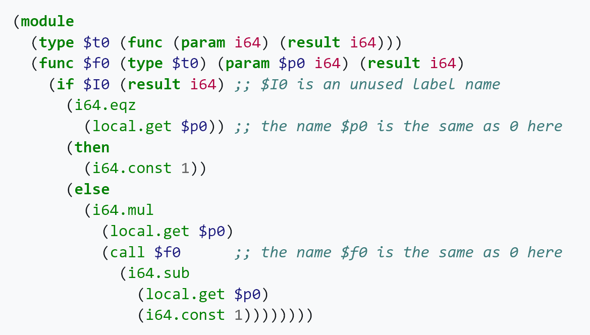
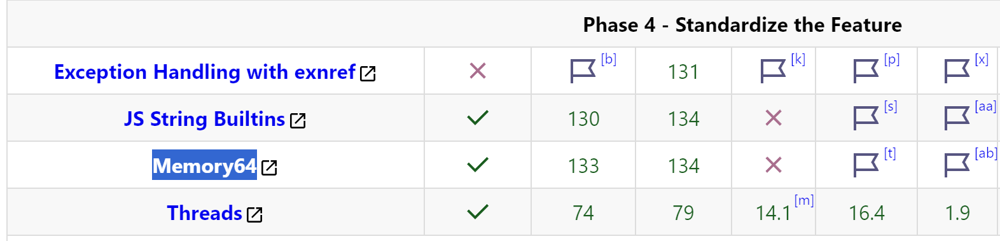
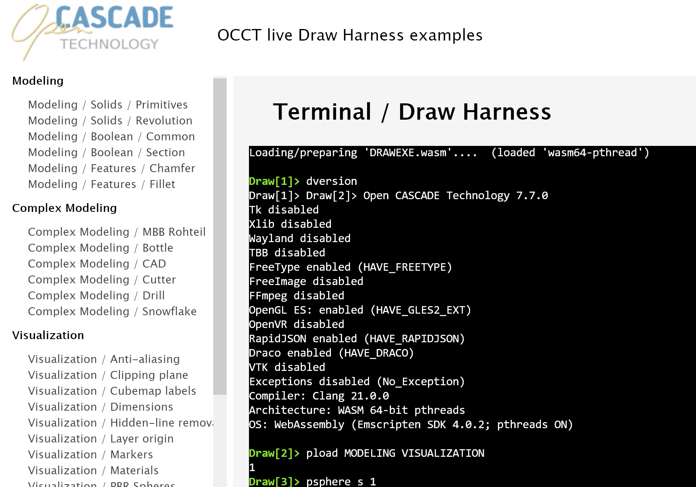

**Firefox 134** and **Chrome 133** have finally pushed the ***WASM***/***Memory64*** extension from development builds to stable releases.
This announce made me eager to try this **WebAssembly** extension on **DRAWEXE.js**.

<!--break-->

|  |
|:--:|
| &nbsp; |

## So long to wait...

[WebAssembly](https://en.wikipedia.org/wiki/WebAssembly) 1.0 released in 2017 and offered only *32-bit* address space
to applications running inside browsers, when most native platforms already moved to *64-bit* memory.
Later on, extensions to *WASM* offered performance improvements and [multi-threaded capabilities](../2021-12-21-webassembly-and-multi-threading/).

Browsers gradually dropped support of legacy native plugin interfaces (*NPAPI* and *ActiveX*) in *2015*-*2018*,
making *WebAssembly* the last resort technology for writing computationally-intensive client-side Web applications
with close-to-native performance and reuse of existing C/C++ code bases.
This includes modern 3D graphic/game engines, which are able to work pretty well in the browser with help of GPU-accelerated *WebGL* / *WebGPU*.

*32-bit address space* soon became a limiting factor to such applications, as they have to deal with pretty large datasets nowadays.
Experienced developers know perfectly well the endless nightmare of trying to fit large data into *32-bit memory*, and avoid out-of-memory issues due to address space fragmentation.
Efficient multithreading demands even more memory address space, making optimization of such applications even harder.

|  |
|:--:|
| &nbsp; |

I've followed the development of the [Memory64 extension](https://github.com/WebAssembly/memory64/blob/main/proposals/memory64/Overview.md)
for many years, and felt frustrated to see quite slow progress...
But one day, my usual mediation on the [WebAssembly roadmap](https://webassembly.org/roadmap/) suddenly revealed that *Memory64*
suddenly became green in the table and marked supported by *Firefox 134*! This triggered my interest to test this extension on **DRAWEXE.js**.

## Memory64 performance

Putting aside euphoria from the long-awaited extension being finally released, one should be aware that *64-bit* address space comes at some price to *WebAssembly*,
which may [drop performance from 10% to 100%](https://spidermonkey.dev/blog/2025/01/15/is-memory64-actually-worth-using.html).
The linked article provides a good and deep technical explanation for the reasons, so I'll skip details here.

Still, the larger address space may allow things that were just impossible with a *32-bit* address space or would come at considerable performance costs.
Hence, the final *WASM64* application workflow might outperform *WASM32* in some scenarios.

For instance, applications dealing with large datasets may now avoid regular data streaming from *JavaScript* to *WASM*
(through *emulated File System* or other means) and just map them entirely into *WASM* memory for efficient processing.
Multi-threaded applications may now utilize faster (but more hungry)
[memory allocators](https://emscripten.org/docs/porting/pthreads.html#allocator-performance) like **mimalloc** instead of slower **dlmalloc**.
These are just general ideas - one still has to evaluate different approaches to conclude cons and pros of *Memory64*.

## Upgrading DRAWEXE.js to EMSDK4

*Draw Harness* is a *Tcl*-scriptable command-line interface to *Open CASCADE Technology* C++ framework.
At some point I've experimented with [porting it to WebAssembly](../2021-06-16-occt-draw-in-the-browser/).
This isn't a perfect Web application, but it is a good testbed for *WebAssembly* technology and *Emscripten* toolchain as it relies on
a pretty large and complex CAD framework with high demands to performance.

The previous build of **DRAWEXE.js** was done several years ago (at the end of '2021),
so it became a challenge upgrading from *Emscripten 2.x* to *Emscripten 4.x* considering the high development pace of the project.
Rebuilding *OCCT* itself is not enough - you need to rebuild all 3rd-party libraries as well (*Tcl*, *FreeType*, etc.),
and I've started from re-writing batch scripts for better consistency and uniform environment for building all components.

*Emscripten* deprecates some things over time, replaces compiler/linker parameters with new syntax, upgrades *LLVM*, changes behavior of linker, etc...
You may lose yourself just by passing through their [endless changelog](https://github.com/emscripten-core/emscripten/blob/main/ChangeLog.md) and trying to catch the most important things.
New interesting features come too! But you need to pay attention to compatibility changes first, and *Emscripten* breaks things quite regularly.
Tracing C++ API changes is simple (and I'll omit them in this article), figuring out why linker fails or why application crashes in runtime - that's where the real challenge starts!

## EM_JS and BigInt

*Emscripten* provides interfaces `EM_JS`/`EM_ASM` and for calling *JavaScript* functions from C++.
Here is a simple function passing `const char*` (*C* string) to `console.debug()` in *JavaScript*:

```cpp
  EM_JS(void, occJSConsoleDebug, (const char* theStr), {
    console.debug(UTF8ToString(theStr));
  });
```

The syntax is pretty simple and straight-forward - you define the *C* function interface and *Emscripten* does conversion from *C* types to *JavaScript* and back.
But then *WASM64* comes and suddenly all pointer-size dependent types like `char*` and `size_t`
are now mapped to `BigInt` instead of `Number` and existing code becomes broken (in runtime)!
For some reason, built-in utility functions like `UTF8ToString()` expect `Number` on input and not `BigInt`, and one have to write something like this:

```cpp
  EM_JS(void, occJSConsoleDebug, (const char* theStr), {
    const aStr = Number(theStr); // bigintToI53Checked(theStr);
    console.debug(UTF8ToString(aStr));
  });
```

JavaScript doesn’t have native 64-bit integer type, instead it has **Number** \- 64-bit double floating point number that is able to store up to 53 bits integer without losing precision. New type **BigInt** allows storing 64-bit integers without precision losses, but it has implications on performance…
WASM64 relies on 64-bit address pointers, but practically speaking the address space is much more limited. JavaScript engine has to allocate the continuous array for WebAssembly memory, which is much smaller (up to 8/16GB for now) than what modern native 64-bit platforms are able to operate (128GB and even larger). This makes it possible to address all valid pointers from WebAssembly memory using **Number**, hence we may simply cast a string pointer to Number in the code fragment above. The wrapper bigintToI53Checked()  will do the same, but also will throw an exception if a 64-bit integer doesn’t fit into 53-bits.
The problem appears in opposite direction as well like **‘char\***’ returned by JavaScript function:

```cpp
  EM_JS(char*, occJSModuleCanvasId, (), {
    const aCanvasId = Module.canvas.id;
    const aNbBytes  = lengthBytesUTF8 (aCanvasId) + 1;
    const aStrPtr   = Module._malloc (aNbBytes);
    stringToUTF8 (aCanvasId, aStrPtr, aNbBytes);
    return aStrPtr;
  });
```

In this case we have to explicitly convert a pointer returned by `Module._malloc()`  into `BigInt`.
Alternative approach could be replacing `char*` (`BigInt`) into something like `double` (`Number`),
but then you'll end-up with counter-intuitive C++ code and suppressing *CLang compiler* warnings on casts...

The newer versions of *Emscripten* might fix these `EM_JS` issues in some future, but then these changes will break existing code again...

## 64K should be enough for stack...

This one hit my nerves pretty bad... Major *OCCT* functions suddenly become broken for no reason with cryptic `RuntimeError: memory out of bounds` in the log.
I wasted some time suspecting uninitialized variables, *CLang compiler* (over)optimizations, broken `longjmp`/`setjmp` + `OSD::SetSignal()` and some other mysterious things.
I even tried to rebuild *DRAW* on numerous versions of *Emscripten SDK*, but there are too many versions to test...

Playing with debug builds and putting simple prints in the crashing for no reason `Extrema_GenExtPS::FindSolution()`,
I've suddenly realized that the problem is somehow related to the local stack - but not with the code itself.
Then I passed through the *Emscripten changelog* again, now looking specifically for *"stack"*
and finally [found the root cause](https://github.com/emscripten-core/emscripten/pull/14177):

> *3.1.27 – 11/29/22*
> - ...
> - *The default `STACK_SIZE` was reduced from 5MB to 64KB.*

Very nice optimization! Except that *64KB* is *too small* for *OCCT algorithms*...
Then I've increased stack size to *1MiB* via `-sSTACK_SIZE=1048576` linker flag and finally confirmed that *OCCT* now works as expected!

Then I've also tried to add some diagnostics to the code to detect actual stack size,
and found `GetCurrentThreadStackLimits()` / `pthread_attr_getstacksize()` functions for *Windows* and other platforms:

```cpp
#ifdef _WIN32
  #include <windows.h>
  #include <process.h>
#else
  #include <pthread.h>
#endif
#include <iostream>

void printStackSize() {
#ifdef _WIN32
#if (_WIN32_WINNT >= 0x0602)
  auto printer = [](void*) -> unsigned {
    ULONG_PTR aStackLow = 0, aStackUp = 0;
    GetCurrentThreadStackLimits(&aStackLow, &aStackUp);
    const size_t aStackSize = size_t(aStackUp - aStackLow);
    std::cout << "WinAPI [" << GetCurrentThreadId() << "] stack size: " << aStackSize << " bytes\n";
    return 0;
  };
  // main thread info
  printer(nullptr);

  // custom thread with defaults
  HANDLE aThread1 = (HANDLE)_beginthreadex(NULL, 0, printer, 0, 0, 0);
  WaitForSingleObject(aThread1, INFINITE); CloseHandle(aThread1);

  // thread with customized stack size
  HANDLE aThread2 = (HANDLE)_beginthreadex(NULL, 10*1024*1024, printer, 0, 0, 0);
  WaitForSingleObject(aThread2, INFINITE); CloseHandle(aThread2);
#endif
#else
  // Linux provides non-POSIX extension pthread_getattr_np()
  // to get attributes of specific thread,
  // while pthread_attr_init() returns defaults
#if defined(__ANDROID__)
#define HAS_GETATTR_NP
#elif defined(__GLIBC__) && defined(__GLIBC_PREREQ)
#if __GLIBC_PREREQ(2,4) && !defined(__EMSCRIPTEN__)
#define HAS_GETATTR_NP
#endif
#endif
  struct PAttr {
    pthread_attr_t m_attr = {};
    int m_err = -2;

    PAttr(bool theGet) {
      m_err = !theGet ? pthread_attr_init(&m_attr) : m_err;
    #if defined(HAS_GETATTR_NP)
      m_err = theGet ? pthread_getattr_np(pthread_self(), &m_attr) : m_err;
    #endif
    }

    size_t stackSize() const {
    #ifdef __APPLE__
      // macOS has alternative non-POSIX API
      if (m_err != 0) { return pthread_get_stacksize_np(pthread_self()); }
    #endif
      size_t aSize = 0;
      return m_err == 0 && pthread_attr_getstacksize(&m_attr, &aSize) == 0 ? aSize : 0;
    }

    void setStackSize(size_t theSize) {
      if (m_err == 0) { pthread_attr_setstacksize(&m_attr, theSize); }
    }

    ~PAttr() { if (m_err == 0) { pthread_attr_destroy(&m_attr); } }
  };

  auto printer = [](void*) -> void* {
    std::cout << "pthread [" << pthread_self() << "]" <<
      " get stack size: " << PAttr(1).stackSize() << " bytes\n";
    return 0;
  };
  std::cout << "pthread [" << pthread_self() << "]" <<
    " def stack size: " << PAttr(0).stackSize() << " bytes\n";
  printer(nullptr);

  pthread_t aPThread1 = {};
  if (pthread_create(&aPThread1, nullptr, printer, nullptr) == 0) {
    pthread_join(aPThread1, nullptr);
  }

  pthread_t aPThread2 = {};
  PAttr anAttr2(0);
  anAttr2.setStackSize(10*1024*1024);
  if (pthread_create(&aPThread2, &anAttr2.m_attr, printer, nullptr) == 0) {
    pthread_join(aPThread2, nullptr);
  }

  pthread_t aPThread3 = {};
  PAttr anAttr3(0);
  anAttr3.setStackSize(768*1024);
  if (pthread_create(&aPThread3, &anAttr3.m_attr, printer, nullptr) == 0) {
    pthread_join(aPThread3, nullptr);
  }
#endif
}

int main() {
  printStackSize();
  return 0;
}
```

Note `pthread_attr_getstacksize()` works as expected for **pthread** *WASM* builds, but returns *4KB* for non-pthread builds (but stack size is actually larger).

|              System | Def. attributes<br>stack size |   Main thread<br>stack size  |   New thread<br>stack size   | Custom thread<br>10 MiB stack size | Custom thread<br>768 KiB stack size |
| ------------------: | ----------------------------- | ---------------------------- | ---------------------------- | ---------------------------------- | ----------------------------------- |
|   Windows 10, AMD64 |                           N/A |     1 MiB<br>(1048576 bytes) |     1 MiB<br>(1048576 bytes) |      10 MiB<br>(10485760 bytes)    |       1 MiB<br>(1048576 bytes)      |
| Ubuntu 20.04, AMD64 |      8 MiB<br>(8388608 bytes) |    ~8 MiB<br>(8380416 bytes) |     8 MiB<br>(8388608 bytes) |      10 MiB<br>(10485760 bytes)    |     768 KiB<br>(786432 bytes)       |
|   macOS 11.2, ARM64 |    512 KiB<br>(524288 bytes)  |    ~8 MiB<br>(8372224 bytes) |   524 KiB<br>(536576  bytes) |     ~10 MiB<br>(10498048 bytes)    |     780 KiB<br>(798720 bytes)       |
|   Android 13, ARM64 |    992 KiB<br>(1015808 bytes) |     8 MiB<br>(8388608 bytes) | ~1000 KiB<br>(1023152 bytes) |     ~10 MiB<br>(10493104 bytes)    |    ~775 KiB<br>(793776 bytes)       |
|    Emscripten 4.0.2 |                               |    64 KiB                    |                              |                                    |                                     |

In this table, *'Def. attributes'* refer to stack size, returned for default pthread attributes
(e.g. the value passed implicitly on creation new thread via `pthread_create()`),
*'Main thread'* - actual stack size for the main application thread,
*'New thread'* - actual stack size for the thread created with default parameters,
*'Custom thread'* - actual stack size for the thread with explicitly requested stack size.

## WASM Exceptions

Initially, *WebAssembly* provided no special means to handle *C++ exceptions* (`-fexceptions` compiler flag),
so [Emscripten emulated](https://emscripten.org/docs/porting/exceptions.html) them via an expensive *JavaScript bridge*
(with the similar issue for [longjmp/setjmp](https://emscripten.org/docs/porting/setjmp-longjmp.html)).

The overhead of this emulation is quite considerable for the C++ code intensively relying on exceptions, like *OCCT* does.
At some point, `-fwasm-exceptions` extension to *WebAssembly* has been introduced, supposed to handle this problem.
Browsers already implemented this extension, but then suddenly the development of the
[newer and better proposal](https://github.com/WebAssembly/exception-handling/blob/main/proposals/exception-handling/Exceptions.md) has been started,
moving the previous one into a [legacy deprecated state](https://github.com/WebAssembly/exception-handling/blob/main/proposals/exception-handling/legacy/Exceptions.md)
(see `-sWASM_LEGACY_EXCEPTIONS`, `-sWASM_EXNREF` flags)...

Anyhow... *C++ exception* handling affects *OCCT* performance badly as was measured by some [previous tests](../2021-12-21-webassembly-and-multi-threading/).
But 'legacy' *WASM* exceptions are still supported by all major browsers, why not use them?
Indeed, some experiments with a small *OCCT*-based project showed benefits from the `-fwasm-exceptions` option in final binary size and performance.
Unfortunately, enabling this option for building `DRAWEXE.js` *fails* with some internal error in *Emscripten linker* with no workaround found so far
(reducing optimization level from `-O3` to `-O1` allow to pass through the linkage stage, but then browsers fail to load broken *WebAssembly module*).

## Allocating more memory!

After porting efforts and fighting with ghosts, I've finally got **DRAWEXE.js** working, improved logic for loading *WASM* build from
the longer list (`wasm32`, `wasm32-pthread`, `wasm64`, `wasm64-pthread`), and uploaded it to my life testbench [https://draw.sview.ru/](https://draw.sview.ru/).

|  |
|:--:|
| &nbsp; |

Lets try allocating large blocks of memory using simple script generating uniform grid:

```
pload MODELING VISUALIZATION
psphere s 1
explode s F
tessellate r1 s_1 4000 4000; meminfo
tessellate r2 s_1 4000 4000; meminfo
tessellate r3 s_1 4000 4000; meminfo
tessellate r4 s_1 4000 4000; meminfo
```

***WASM32 output***

```
Architecture: WASM 32-bit
OS: WebAssembly (Emscripten SDK 4.0.2; pthreads OFF)
Draw[5]> meminfo
  Working Set:    1 MiB (peak: 1 MiB)
  Virtual memory: 21 MiB (limit: 2048 MiB)
  Heap memory:    1 MiB
Draw[6]> tessellate r1 s_1 4000 4000; meminfo
  Working Set:    733 MiB (peak: 733 MiB)
  Virtual memory: 834 MiB (limit: 2048 MiB)
  Heap memory:    733 MiB
Draw[8]> tessellate r2 s_1 4000 4000; meminfo
  Working Set:    1466 MiB (peak: 1466 MiB)
  Virtual memory: 1567 MiB (limit: 2048 MiB)
  Heap memory:    1466 MiB
Draw[11]> tessellate r3 s_1 4000 4000; meminfo
An exception was caught 0x2e2cfc10 : Standard_OutOfMemory
```

***WASM64 output***

```
Architecture: WASM 64-bit pthreads
OS: WebAssembly (Emscripten SDK 4.0.2; pthreads ON)
Draw[5]> meminfo
  Working Set:    31 MiB (peak: 32 MiB)
  Virtual memory: 69 MiB (limit: 8000 MiB)
  Heap memory:    1 MiB
Draw[6]> tessellate r1 s_1 4000 4000; meminfo
  Working Set:    775 MiB (peak: 775 MiB)
  Virtual memory: 877 MiB (limit: 8000 MiB)
  Heap memory:    738 MiB
Draw[7]> tessellate r2 s_1 4000 4000; meminfo
  Working Set:    1519 MiB (peak: 1519 MiB)
  Virtual memory: 1685 MiB (limit: 8000 MiB)
  Heap memory:    1474 MiB
Draw[8]> tessellate r3 s_1 4000 4000; meminfo
  Working Set:    2263 MiB (peak: 2263 MiB)
  Virtual memory: 2507 MiB (limit: 8000 MiB)
  Heap memory:    2210 MiB
Draw[9]> tessellate r4 s_1 4000 4000; meminfo
  Working Set:    3007 MiB (peak: 3007 MiB)
  Virtual memory: 3397 MiB (limit: 8000 MiB)
  Heap memory:    2946 MiB
Draw[10]> tessellate r5 s_1 4000 4000; meminfo
  Working Set:    3751 MiB (peak: 3751 MiB)
  Virtual memory: 4205 MiB (limit: 8000 MiB)
  Heap memory:    3682 MiB
```

So far, it looks workable - we are able to allocate ***more than 4 GiB*** now!
*WASM64* build is done with `-sMAXIMUM_MEMORY=8000MB` parameter, so that `emscripten_get_heap_max()` returns *8000 MiB*,
while *WASM32* relies on defaults and get only *2 GiB* (but it could be actually increased to somewhat like *3 GiB* for modern browsers).

The question about performance impact remains open. But let it become a subject for further experiments, as I'm feeling exhausted right now.
