As a developer of CAD software, one cannot underestimate the importance of a *wireframe presentation*
(drawing B-Rep model with topological edges and surface isolines, not triangle boundaries).
Most 3D-graphics API support rendering (poly)lines with thickness fixed in pixels
like `GL_LINES` in OpenGL - and this is what most users expected to see.

But *"drama"* happened at some point - *OpenGL 3* specification released in 2008
deprecated the possibility to change line width via `glLineWidth()`,
and newer APIs like *WebGPU* don't even expose this feature!
*OCCT* users may experience unnaturally thin `AIS_Wireframe` presentation on some systems because of that.

So, what actually happened?

<!--break-->

*OpenGL 3* deprecated some legacy features of this API and *OpenGL 3.2* defined two profiles
one with old features still available called *"Compatible Profile"*
and one with deprecated features removed called *"Core Profile"*.
The API cleanup was mostly intended to get rid of legacy [Fixed-Function Pipeline](../2016-08-04-glsl-to-become-the-main-rendering-path-in-occt/),
but also removed wide (thick) line rendering with doubtful justification.
The function [`glLineWidth()`](https://registry.khronos.org/OpenGL-Refpages/gl4/html/glLineWidth.xhtml) is still preserved,
but calls with values other than `1.0` generate an error within *Core Profile*,
which could be requested by option `OpenGl_Caps::contextCompatible=false` when creating `OpenGl_GraphicDriver` in *OCCT*.

```
pload MODELING VISUALIZATION;
box b 1 2 3;
# with next flag enabled line width will be ignored
vcaps -core;
vinit View1;
vglinfo;
vdisplay -dispMode 1 b;
vfit;
vaspects b -faceBoundaryDraw 1 -faceBoundaryWidth 4 -faceBoundaryColor RED;
```

The reasoning behind deprecation of wide lines in *OpenGL* was that this feature is not supported by GPU itself
(e.g. it is always emulated by OpenGL driver), and requires great complexity within the drivers.

But what's the point in rendering `GL_LINES` with one-pixel width?
This limitations makes rendering of line primitives almost *useless* nowadays,
with high pixel density screens everywhere - from smartphones to desktop displays.
One-pixel width makes lines barely visible on such screens!

| 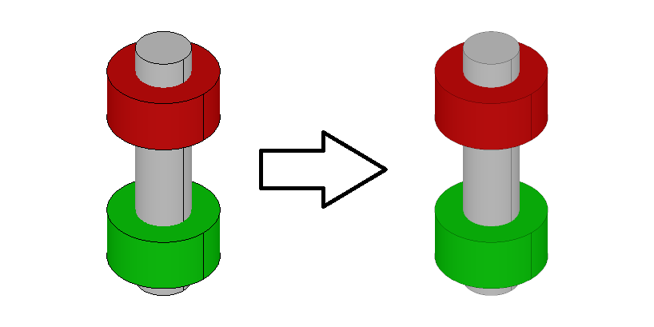 |
|:--:|
| *Thin lines become barely seen on HiDPI screens.* |

The deprecation notice could be found within "Appendix E"
to [OpenGL 4.6 Core Profile](https://registry.khronos.org/OpenGL/specs/gl/glspec46.core.pdf) specifications:

> The following features are deprecated, but still present in the core profile.
> They may be removed from a future version of OpenGL, and are removed in a forward-compatible context implementing the core profile.
>
> **E.2.1 Deprecated But Still Supported Feature**
> - Wide lines - __LineWidth__ values greater than 1.0 will generate an `INVALID_VALUE` error.

The wording looks rather vague. When *Core Profile* support was introduced in *OCCT*, the calls to `glLineWidth()`
with values other than `1.0` generated errors and didn't work.
But some sources qualify, that the feature should be removed only
when application requests *"forward-compatible"* profile, not just *Core Profile*.

However, recent improvements to `wglinfo` tool added output of various OpenGL limits including `GL_ALIASED_LINE_WIDTH_RANGE`
suddenly revealed, that on *Windows* platform all modern drivers report support of wide lines in *Core Profile*:

```
[WGL] OpenGL (core profile) vendor   string: NVIDIA Corporation
[WGL] OpenGL (core profile) renderer string: NVIDIA GeForce RTX 3060 Laptop GPU/PCIe/SSE2
[WGL] OpenGL (core profile) version  string: 4.6.0 NVIDIA 555.97
[WGL] OpenGL (core profile) limits:
  GL_ALIASED_LINE_WIDTH_RANGE = 1, 10
  ...

[WGL] OpenGL (core profile) vendor   string: ATI Technologies Inc.
[WGL] OpenGL (core profile) renderer string: AMD Radeon(TM) Graphics
[WGL] OpenGL (core profile) version  string: 4.6.0 Core Profile Context 22.20.14.220712
[WGL] OpenGL (core profile) limits:
  GL_ALIASED_LINE_WIDTH_RANGE = 1, 8191
  ...

[WGL] OpenGL (core profile) vendor   string: Intel
[WGL] OpenGL (core profile) renderer string: Intel(R) Iris(R) Xe Graphics
[WGL] OpenGL (core profile) version  string: 4.6.0 - Build 27.20.100.9664
[WGL] OpenGL (core profile) limits:
  GL_ALIASED_LINE_WIDTH_RANGE = 1, 2047
  ...
```

This wasn't the case for some older drivers, and it is still not the case for *Core Profile* on *macOS* with `[1, 1]` range.
But apparently, wide lines still could be used within *Core Profile* on Windows platform.

## Does glLineWidth() look really bad?

The main concern around thick lines rendering in 3D-graphics API is handling of corners connected between line segments.
Indeed, setting line width to large values reveals visual artifacts:

```
pload MODELING VISUALIZATION;
box b 100 200 300;
vdisplay b -dispMode 0;
vfit;
vaspects b -width 10;
```

| 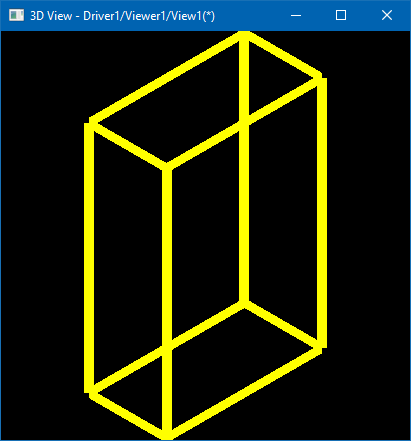 |
|:--:|
| *Visual artifact with glLineWidth(10.0f).* |

There are plenty of algorithms that would smoothen connected lines.
So that *Khronos Group* decided - lets remove the wide line support from *OpenGL* altogether
and let application developers implement their own algorithms!

At the same time, within a reasonable range, the "old good" *OpenGL* thick lines provide
acceptable visual results - at least for CAD needs.
Unlike most of the other legacy features removed from *OpenGL Core Profile*,
implementing an efficient substitute for the removed wide lines merely *replicating* an old behavior
(with its known caveats) isn't a straightforward task at all due to limitations of OpenGL API.
And it is [even harder](https://mattdesl.svbtle.com/drawing-lines-is-hard)
on more limited APIs like *WebGL* without *Geometry/Compute shader* support.
For instance, *OCCT* supports nice rendering of thick [mesh edges](../2019-03-26-displaying-mesh-edges-in-occt/)
with help of *Geometry Shaders*, but this technique is simply unportable to *WebGL*.

| 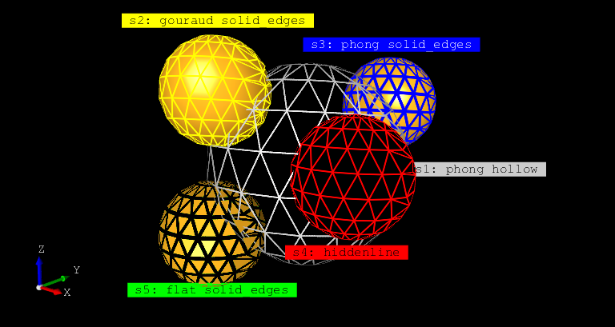 |
|:--:|
| *Mesh edges drawn via Geometry Shader in OCCT.* |

## Is OpenGL Core Profile really needed?

That's the good point! The main rationale for introduction of *OpenGL Core Profile*
was to simplify/lighten driver implementations by dropping legacy functionality (*Fixed-Function Pipeline*).
But practically speaking, most proprietary *OpenGL drivers* from *AMD*, *NVIDIA*, and *Intel*
were developed before *OpenGL 3*, already implement legacy pipelines,
and there isn't much of a benefit for them to drop it in the future (for compatibility with numerous legacy applications).

Most of these vendors gradually added new features into *OpenGL Compatible Profile*
(new API versions up to the latest OpenGL 4.6), while exposing Core Profile in parallel with disabled old features.
Some [comments from NVIDIA developers](https://community.khronos.org/t/3-0-wide-lines-deprecated/55426)
indicate no plans to remove features like line width or `GL_QUADS` primitives from *NVIDIA* hardware and drivers.

There were also provisional expectations that *Core Profile* may expose a better performance
due to dropped old features - but this wasn't proved in practice.
Developers of *OpenGL drivers*, supporting the latest versions within *Compatible Profiles*
were able to keep them optimized enough to be comparable with *Core Profiles* (or, at least, there is no proof of this so far).

[Mesa](https://mesa3d.org/) - an open source implementation of *OpenGL*, - was one of the 'vendors'
that tried to speed up driver development by focusing on *Core Profile(s)*.
For a while, this project released *OpenGL* implementations that provided a higher version of *OpenGL Core Profile*
than one available for *OpenGL Compatible Profile*.
Here is an example of `glxinfo` output with old *Mesa 17.0.3* release demonstrating this:

```
OpenGL vendor string: Intel Open Source Technology Center
OpenGL renderer string: Mesa DRI Intel(R) HD Graphics 400 (Braswell)
...
OpenGL core profile version string: 4.5 (Core Profile) Mesa 17.0.3
OpenGL core profile shading language version string: 4.50
...
OpenGL version string: 3.0 Mesa 17.0.3
OpenGL shading language version string: 1.30
```

That difference in *Mesa* has vanished over time, as *OpenGL Compatible Profile* support level
has grown up (and now matches *Core Profile* version in most cases).

There is one exceptional OS vendor that decided to push developers aggressively towards *OpenGL Core Profiles*.
[macOS implemented](https://developer.apple.com/opengl/OpenGL-Capabilities-Tables.pdf) in practice the differentiation
between *OpenGL profiles*, so that their *Compatible Profile* implementation has stuck in the past of *OpenGL 2.1* version,
with new features available only to applications requesting *Core Profile*:

| 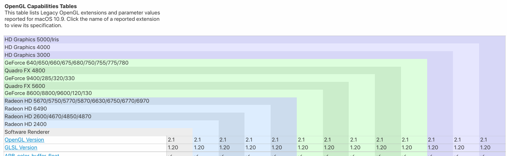 <br/> 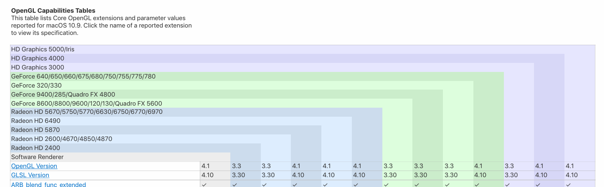 |
|:--:|
| &nbsp; |

At some point *Apple* lost interest in *OpenGL* altogether and switched to their own proprietary *Metal API*,
so that OS support stuck on *OpenGL 4.1* version and never received updates to *4.2+*, which became mainstream on other platforms,
until *Apple* finally [deprecated OpenGL API](https://stackoverflow.com/questions/65802625/develop-using-opengl-4-x-on-osx-big-sur/65806319#65806319)
altogether in newer *macOS* releases.

*As a short conclusion, for most users it is preferred to keep using OCCT with OpenGL Compatible Profile*
*(and thus, keep using thick line support from OpenGL driver), which has a wide support across most systems.*
*With the only exception - macOS platform, where limitations of OpenGL 2.1 will make some OCCT features like RayTracing unavailable.*

## Thick lines in OpenGL ES / WebGL

As a matter of fact, the specifications of *OpenGL ES* (as of *OpenGL ES 3.2*),
as well as *WebGL* based on them, never deprecated the wide line API, unlike its more powerful desktop counterpart!

Although implementations are not required to support values other than `1.0`,
practically speaking, __most__ *OpenGL ES drivers* - on *Android*, *Linux* and even on *macOS* and *iOS* platforms
__do__ __support__ lines thicker than one pixel to day!

| 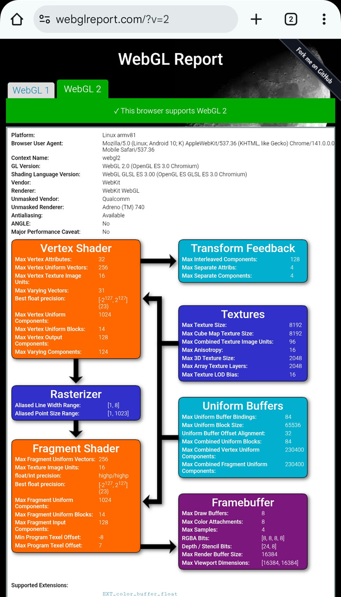 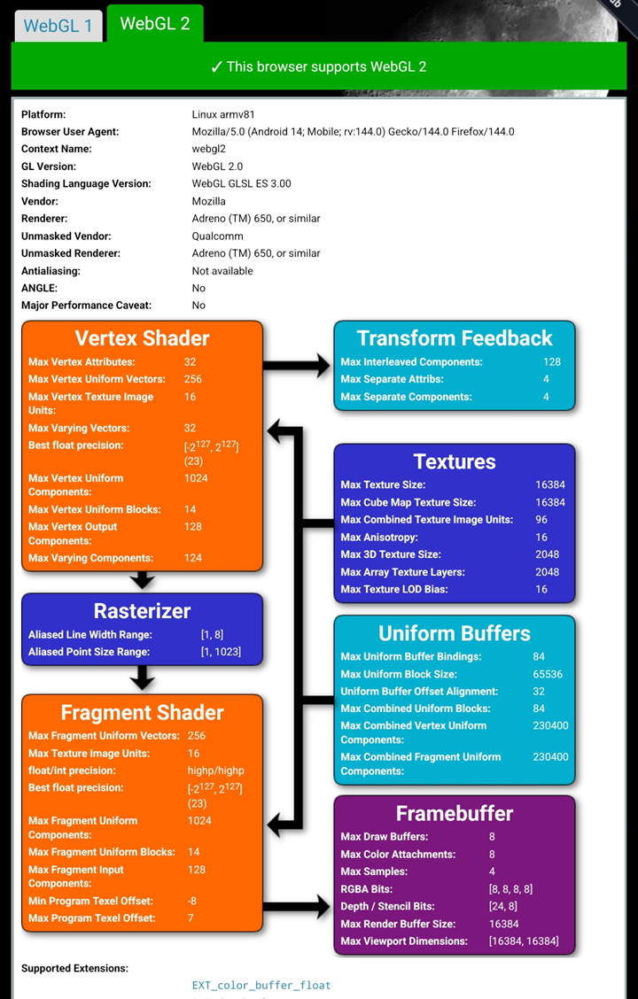 |
|:--:|
| *Firefox and Chrome on Adreno 740 / Android 14 (see Rasterizer section).* |

The major exception here is the unfortunate [ANGLE project](https://github.com/google/angle),
implementing *OpenGL ES* on top of *Direct3D*, which all browsers on *Windows* platform use for *WebGL* support nowadays.
As a result, *Windows* users become outsiders in the list!

## So what is it about Direct3D?

Initially, *DirectX* developers have been focused on the game industry, where line rendering is rarely needed.
For this reason, this *API* supports only one-pixel width line rendering,
and even after pushing *Direct3D* towards industrial and *CAD* software,
the developers still neglect the necessity to extend support of line rendering in their *API*.

One could see *Direct3D* as a niche API for games and just forget about it and its limitations,
if there wouldn't be projects like [ANGLE](https://github.com/google/angle) implementing *OpenGL ES* on top of *Direct3D*,
and which is used by browsers for *WebGL* support on *Windows* platform.
Some browsers like *Firefox* allow to use *OpenGL* instead of *ANGLE*, which would make thick lines available on *Windows*:

| 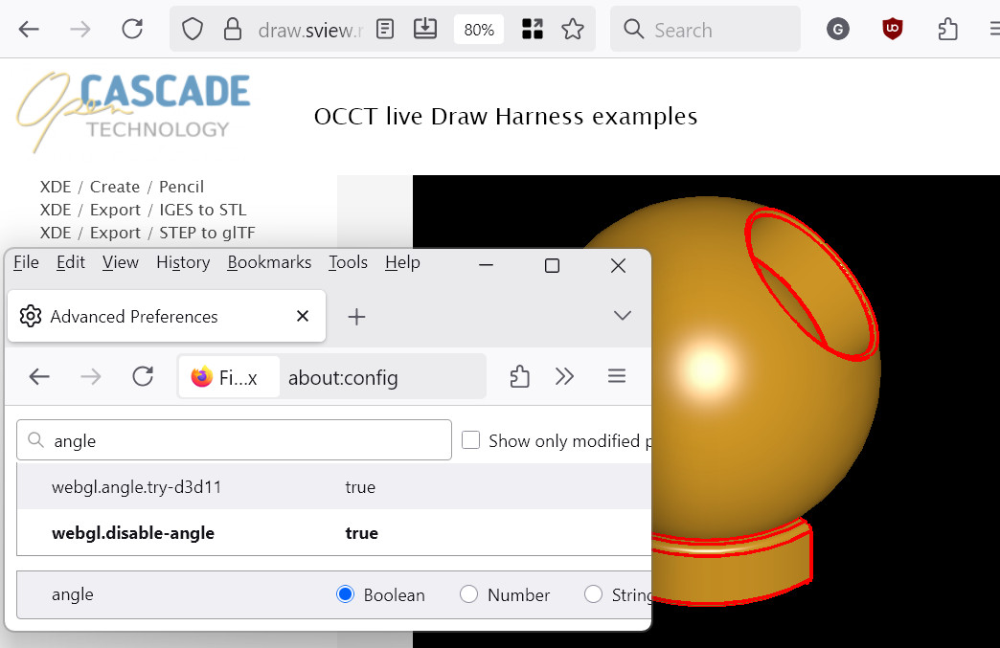 |
|:--:|
| *Advanced option `about:config` -> `webgl.disable-angle` in Firefox allows drawing thick lines.* |

Unfortunately, *Chromium*-based browsers don't have such option (anymore):

| 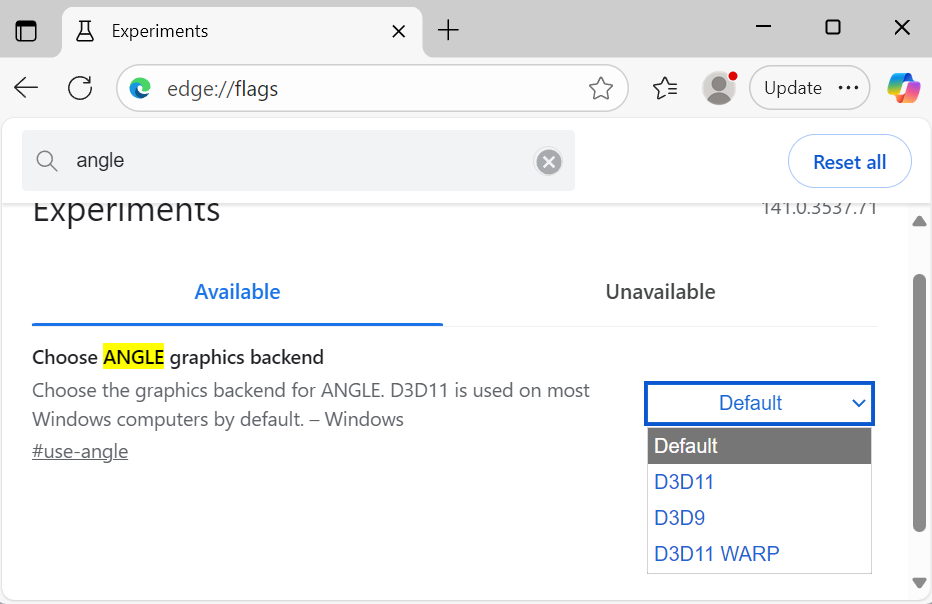 |
|:--:|
| &nbsp; |

If at this point you think that *WebGL* emulation problem is of no concern to desktop developers,
then I'm afraid you are wrong, as there are environments emulating *OpenGL* on top of *Direct3D*!
Virtualized environments like *VirtualBox* or [*WSL2* (*Windows Subsystem for Linux*)](https://devblogs.microsoft.com/directx/directx-heart-linux/)
with GPU virtualization turned on are such examples:

| 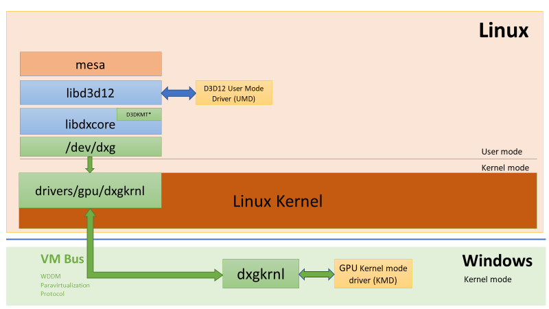 |
|:--:|
| *OpenGL Mesa working over libd3d12 in WSL2.* |

```
Extended renderer info (GLX_MESA_query_renderer):
    Vendor: Microsoft Corporation (0xffffffff)
    Device: D3D12 (NVIDIA GeForce GTX 1650 Ti with Max-Q Design) (0xffffffff)
    Version: 24.0.9
    Accelerated: yes
    Video memory: 11996MB
    Unified memory: no
    Preferred profile: core (0x1)
    Max core profile version: 4.6
    Max compat profile version: 4.6
    Max GLES1 profile version: 1.1
    Max GLES[23] profile version: 3.1
OpenGL vendor string: Microsoft Corporation
OpenGL renderer string: D3D12 (NVIDIA GeForce GTX 1650 Ti with Max-Q Design)
OpenGL version string: 4.6 (Compatibility Profile) Mesa 24.0.9-0ubuntu0.2
```

And even though the driver pretends to support *OpenGL 4.6 Compatible Profile*
(over *Direct3D 12*) - this implementation supports only one-pixel width lines!

## What about Vulkan?

*Vulkan API* was born as an attempt to create the next generation of *OpenGL*.
This *API* provides [wideLines](https://docs.vulkan.org/spec/latest/chapters/features.html#features-wideLines)
support from the first version, although specification made this feature optional
so that implementations may opt out and support only one-pixel width lines.
But wide lines are available on many implementations on desktop and on *Android* platforms:

- GeForce GTX 1060 3GB<br/>
  `lineWidthRange: 1, 64`
- AMD Radeon (TM) R9 380 Series<br/>
  `lineWidthRange: 0, 8191.88`
- Intel(R) UHD Graphics 630<br/>
  `lineWidthRange: 0, 7.99219`
- Adreno (TM) 650<br/>
  `lineWidthRange: 1, 1`
- Adreno (TM) 740<br/>
  `lineWidthRange: 1, 127.5`

| 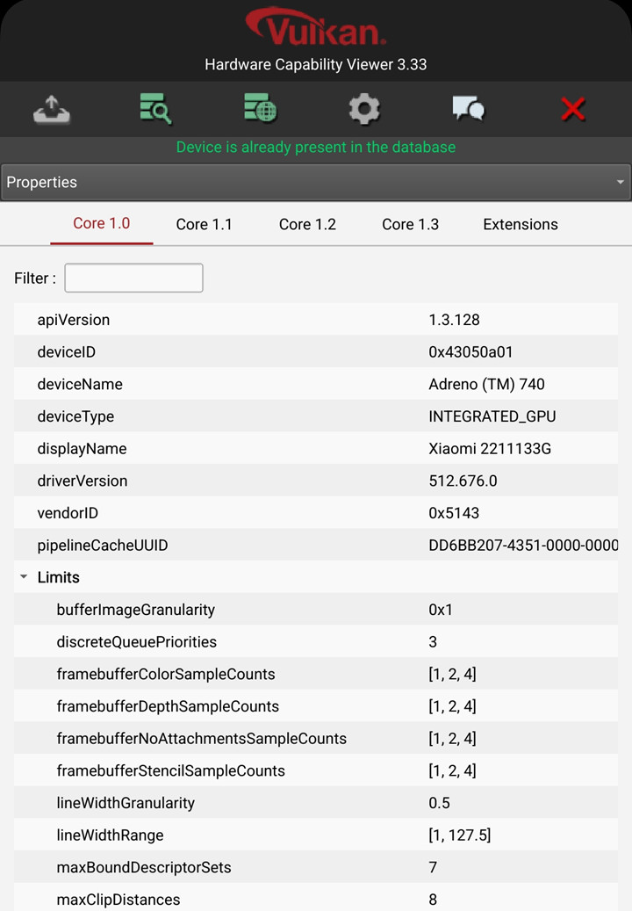 |
|:--:|
| *Adreno 740 on Android 14 supporting wideLines in Vulkan.* |

The *Vulkan 1.4* extended line rasterization with more options like *bresenham* vs. *rectangular* method
via [`VK_KHR_line_rasterization`](https://docs.vulkan.org/refpages/latest/refpages/source/VK_KHR_line_rasterization.html#_description),
which would make behavior closer to *OpenGL* implementations of the past.
Though availability of this feature across *Vulkan* implementations is currently limited.

The diversity of the *Vulkan* ecosystem makes it difficult to predict the actual availability of a
[particular feature](https://github.com/godotengine/godot/issues/75654),
but it seems that `wideLine` support has not dropped from history
and vendors understand the importance of this feature in some domains.

Its a pity that *Khronos Group* hasn't fixed this issue in *OpenGL* retrospectively.

## WebGPU - next

*WebGPU* was born as a replacement of *WebGL* for web browsers, that solves weak points of legacy *WebGL API*
and exposes newer features of modern 3D-graphics APIs like command queues and *Compute Shaders*.
Hopefully, the developers considered prior experience of other APIs and kept the wide line feature intact?

__Wrong!__ *WebGPU* developers (which was [w3c](https://www.w3.org/groups/wg/gpu/) in contrast to *WebGL* developed by *Khronos Group*)
decided that as there is no common ground across various native APIs for rendering points and lines,
then they would allow only rendering one-pixel width lines and one-pixel size points!
With no extensions nor provisions to remove this limitation. Welcome to the future!

[*toji wrote*](https://github.com/gpuweb/gpuweb/discussions/4755):

> As for line rendering, [WebGPU does support line primitives](https://gpuweb.github.io/gpuweb/#enumdef-gpuprimitivetopology).
> It does not currently have any mechanisms, however, for controlling line width,
> and as such all lines will rasterize as 1px wide.
> This limitation existed is WebGL as well, and is in place because of lacking support
> of wide line rendering across the various backends that WebGL/WebGPU need to operate on top of.
> Besides, we find that most people that want wide line rendering also have specific needs
> in terms of how things like end caps are rendered, which is not something that the native APIs typically provide control over.
> If wide lines are needed the recommendation is to render them with triangles so that you have full control over their appearance.

## What's next?

At this point, one could realize that line width, once a native feature of APIs like *OpenGL*,
is no longer generally available in low-level 3D-graphics libraries.
Either, an application developer should limit the scope where this feature is available
and inform users about limitations (*OpenGL*, *OpenGL ES*, *Vulkan* in tested environments), or give up and emulate the feature.

| 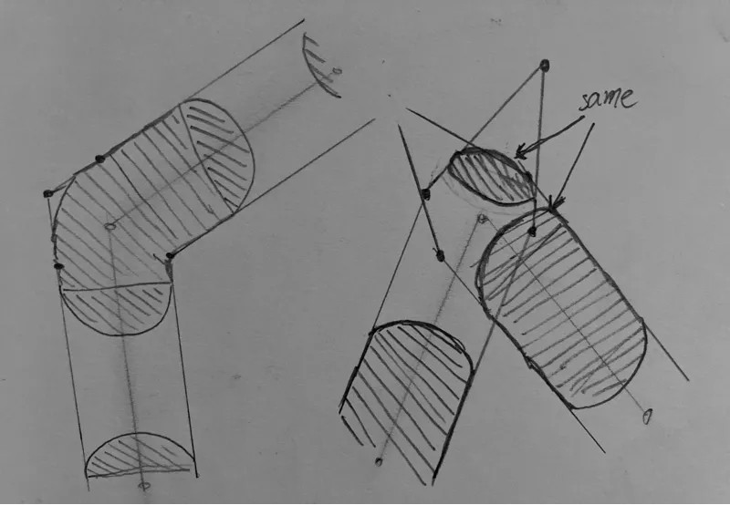 |
|:--:|
| *Drawing joints from [drawing lines](https://almarklein.org/line_rendering.html) article.* |

The emulation of the feature is, however, non-trivial, largely depends on particular API features and acceptable side effects.
In a web browser environment this is, however, seems to be the only available option if the Windows platform must be supported.
Newer APIs like *WebGPU* bring more flexibility in [implementations](https://github.com/m-schuetz/webgpu_wireframe_thicklines) compared to *WebGL*,
but it still doesn't provide *Geometry* nor [Mesh Shaders](https://github.com/gpuweb/gpuweb/issues/3015).

Possible solutions:
- Brute-force computing triangulation on CPU for each draw call.
  - Universal, but obviously expensive.
  - Compute Shader or [transformation feedback](https://registry.khronos.org/OpenGL-Refpages/gl4/html/glBeginTransformFeedback.xhtml)
    might be used to do math on GPU, but implementation would be very messy.
- Geometry Shader taking a line segment on input and generating a pair of triangles on output.
  ```
  layout(lines) in;
  layout(triangle_strip, max_vertices=4) out;
  ```
  - Geometry Shaders are unavailable in many APIs and somewhat messy to incorporate into general workflow.
  - Using [`lines_adjacency`](https://vicrucann.github.io/tutorials/osg-shader-3dlines/) will allow drawing polylines smoothly,
    but will break the idea of using original VBO (with indexed line segments) as is.
- [Instancing-based](https://stackoverflow.com/questions/3484260/opengl-line-width) approaches with line segments accessed
  not from main VBO but from TBO or similar and computing triangle vertices within Vertex Shader
  based solely on vertex index (`gl_VertexID`).
  - Could be adopted on wider range of APIs, but requires even more changes in general rendering workflow.
  - Might also handle smoothly connected polyline segments if vertex data will be prepared with adjacency.

One of the main concerns for drawing wide lines using alternative approaches is that you usually cannot draw original
primitive arrays (indexed line segments or line strips) as is and have to draw triangles instead.
Supporting extra features like stipple lines, semitransparent lines, polygon offsets, texture-mapping,
custom GLSL programs and other things would become impossible or more complicated.
