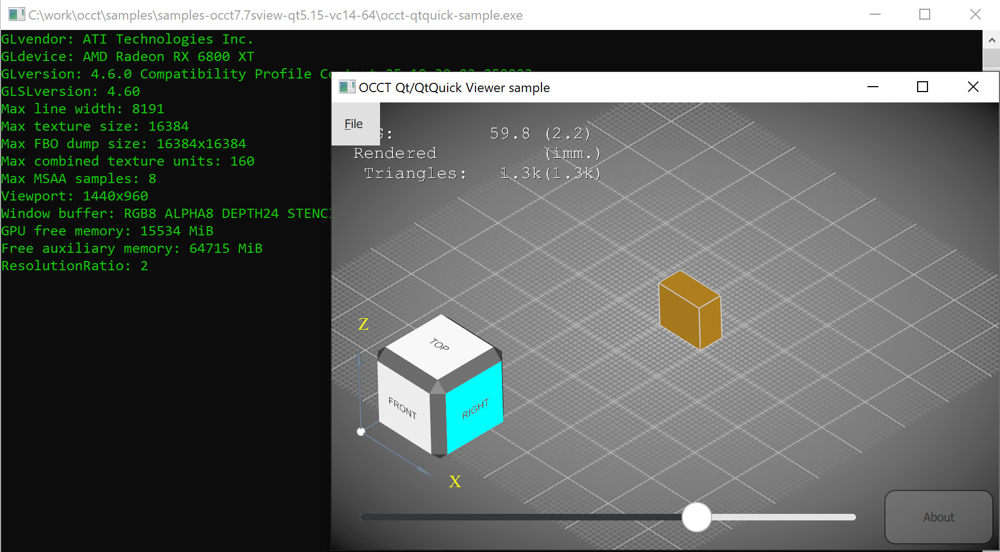
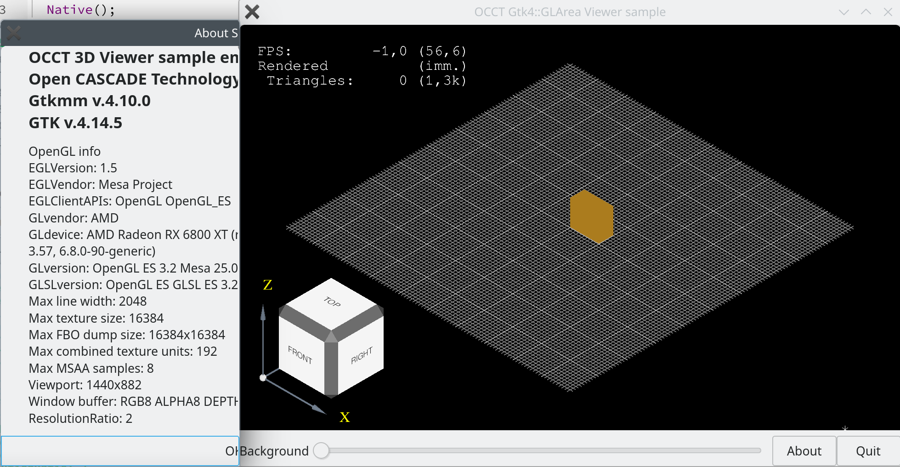

Recently I've spent some time on updating my OCCT samples
demonstrating *OCCT 3D Viewer* integration into **Qt** and **GTK** frameworks.
This small post is about some highlights of these changes and some background.

<!--break-->

3D Viewer integration into a GUI framework comes with challenges,
and the challenges only grew with time, as GUI frameworks became more and more complex.
Basic viewer integration includes the following steps:
- Connecting to display server (Linux-specific `Aspect_DisplayConnection`);
- Creation of an OpenGL-compatible window (`Aspect_Window`);
- Viewer initialization (`V3d_Viewer`, `V3d_View`);
- Displaying of interactive objects (using `AIS_InteractiveContext`);
- Mapping user input (mouse movements and clicks, touchscreen gestures)
  to camera manipulations (zooming, panning, rotation of `Graphic3d_Camera`).

## Camera interactions

In the past, the mapping of mouse input gestures was mostly implemented at application side,
and, as such, was massively duplicated across OCCT-based applications.
This lead to inconsistent experience, various bugs and limitations depending on how much effort developers put into this logic.

This trend changed with introduction of `AIS_ViewController` in [OCCT 7.4](../2019-11-06-ais_viewcontroller-in-occt-7-4-0),
that unified and improved this logic considerably across applications, supporting not only mouse input,
but also touchscreen gestures, smooth view camera animations,
and even [VR teleport navigation](../2020-06-06-occt-receives-openvr-support).

`AIS_ViewController` allowed considerably reducing the amount of code for camera manipulations at application side,
making basic integration of OCCT 3D Viewer much simpler.

## OpenGL surfaces

Each GUI framework provides a unique API for managing windows and user input.
Historically, GUI frameworks relied on 'native' windows provided by systems (*WinAPI* on *Windows*, *Xlib* on *UNIX*, etc.),
so that each control or widget in the GUI framework was mapped to some (sub)window with a native handle.
As such, integration of *OpenGL* surface was as simple as creating a control/widget,
taking its native window handle and creating OpenGL context for it via OCCT.

At some point, however, the design of GUI frameworks shifted towards window-less controls,
painted off-screen and composed into top-level native window(s) by GUI framework itself.
Moreover, GUI frameworks introduced own means of rendering controls using *OpenGL* and other libraries.
These induced new complexities into integration of external OpenGL-based renderers like OCCT into GUI frameworks.

## Hello-world samples

Most samples distributed with OCCT itself are designed to demonstrate OCCT capabilities.
These samples are useful for evaluation of technology,
but they are not that good for helping to start development of applications by new learners.

At some point, I've decided to create a set of smaller samples, each one:
- To be distributed as a self-sustained project.
  - *E.g. avoid creation of a 'basic framework for samples', that would spread logic and complicate navigation.*
- Should focus on a particular feature in OCCT and minimize the code for auxiliaries.
- Distributed separately from OCCT itself and updated on demand.

The purpose of these samples is not to supersede samples coming with OCCT itself, but to complete them.
To provide users *another perspective* on learning OCCT technology and finding some answers easily.

The result of these efforts could be found in the following *git* repositories:
- [occt-hello](https://github.com/gkv311/occt-hello)
  - `occt-ais-hello` - sample creating [OCCT 3D Viewer](../2021-03-27-occt-minimal-viewer-setup) on *Windows*, *Linux* and *macOS* platforms.
  - `occt-ais-object` - sample defining [customized *AIS* presentation](../2021-11-16-ais-object-computing-presentation).
  - `occt-ais-offscreen` - sample creating an [offscreen OCCT 3D Viewer](../2022-01-30-offscreen-occt-viewer) for dumping image screenshots.
  - `occt-draw-plugin` - sample defining a [custom *DRAW Harness* plugin](../2022-06-23-draw-harness-custom-plugin) for application testing.
  - `occt-xcaf-shape` - sample displaying XCAF presentation imported from STEP file with colors.
- [occt-samples-qt](https://github.com/gkv311/occt-samples-qt)
  - `occt-qwidget` - sample demonstrating OCCT 3D Viewer setup inside `QWidget` with native window.
  - `occt-qopenglwidget` - sample demonstrating OCCT 3D Viewer setup inside `QOpenGLWidget`.
  - `occt-qtquick` - sample demonstrating OCCT 3D Viewer setup inside `QQuickFramebufferObject`.
- [occt-samples-gtk](https://github.com/gkv311/occt-samples-gtk)
  - `occt-gtk3-glarea` - sample demonstrating OCCT 3D Viewer setup inside `Gtk::GLArea` for GTK3.
  - `occt-gtk4-glarea` - the same sample for GTK4.

## Qt framework

*Qt* is one of the most popular cross-platform C++ frameworks for GUI and not only.
OCCT package traditionally included a couple of Qt-based samples in the folder `samples/qt`.
The structure of the samples was, however, more suggested to demonstrate OCCT itself,
and wasn't a good source to clarify how to develop your own application with OCCT 3D Viewer.

In construct, [occt-samples-qt](https://github.com/gkv311/occt-samples-qt)
is focused exclusively on a single topic - how to integrate OCCT 3D Viewer inside the Qt framework.

As integration with `QWidget` having native window was more or less known to OCCT users,
the first sample added to this project demonstrated integration using `QOpenGLWidget`.
`QOpenGLWidget` was designed by the Qt team specifically for embedding OpenGL-based renderers
and covers various aspects like redrawing the widget in a proper time and composing its content with other widgets.
This allows drawing semi-transparent widgets on top of `QOpenGLWidget`.

Later on, I've decided to add also a more conventional sample based on `QWidget` for the sake of completeness.
With the latest updates, this sample set now includes a sample for embedding 3D Viewer into *QtQuick* application.
To handle multiple Qt samples efficiently, I have to perform code refactoring
to separate reusable common logic into `OcctQtTools.h` and `OcctGlTools.h`.

The highlights of the [latest release](https://github.com/gkv311/occt-samples-qt/releases/tag/V7_7_0):
- Added **Qt6** support.
- Added **QtQuick/QML** sample.
- Added **QWidget** sample as alternative to `QOpenGLWidget`.
- Added handling of **HiDPI** screens via `Qt::AA_EnableHighDpiScaling`.
- Added support of **multi-touch gestures** in 3D Viewer (camera rotation, panning, zooming gestures).
- Fixed various reported bugs.
- Improved project structure.
- Added CI/CD actions building and running samples on *Ubuntu 24.04* with *OCCT 7.6.3* + *Qt 5.15* and *Qt 6.4*.

*Patches improving HiDPI support in OCCT, automatically scaling text fonts,*
*line width and objects like `AIS_ViewCube` are currently available only in*
*[my OCCT repository](https://github.com/gkv311/OCCT).*

|  |
|:--:|
| &nbsp; |

Luckily, *Qt6* support required not much of porting efforts as most API was preserved;
although newer Qt6 revisions already introduced new interfaces and deprecated older ones currently used by sample.
So that there is still some work to do if you are ready to hold an edge of Qt technology.

*QtQuick* sample implies additional multi-threading considerations due to `QSGRenderThread`,
so I've given users a hint with `QSG_RENDER_LOOP=basic` in case they are not ready
to deal with these complexities in their applications.

## GTK framework

[*GTK framework*](https://www.gtk.org/) has a long history,
but it is more adopted by open-source application developers rather than commercial projects.
As such, one could barely find a working example of an OCCT application based on this framework.

In the days of *GTK2*, the OpenGL viewer integration was not much different from a sample for `QWidget`,
as it was possible to create GTK control with native window and put OpenGL context into it.
Although I haven't seen anybody sharing such a sample, some users indicated that they did it in the past.

Since *GTK3* the things become more complicated - it introduced `Gtk::GLArea`
conceptually similar to `QOpenGLWidget` in Qt, but integration into such kind of widgets
requires much more efforts and understanding how OpenGL context is managed by both OCCT and GUI framework.

Users asked from time to time for such a sample, and although I've written any GTK-based applications,
I've decided to [create such a sample](https://github.com/gkv311/occt-samples-gtk).
The initial sample was tested on *GTK3* and suffered from various issues reported by users,
but I haven't much time to work on them.

Now I've revisited this sample, synchronized approaches from Qt samples, and solved some bugs.
The highlights of the [latest release](https://github.com/gkv311/occt-samples-gtk/releases/tag/V7_7_0):
- Added **GTK4** support.
- Added **Windows** support.
- Added **About** button.
- Fixed various reported bugs.
- Improved projects structure to be more consistent with `occt-samples-qt`.
- Added CI/CD actions building and running samples on *Ubuntu 24.04* with *OCCT 7.6.3* + *GTK3* and + *GTK4*.

|  |
|:--:|
| &nbsp; |

I was at first frustrated by *GTK* documentation, but later on I've put my head into GTK source code,
and was able to find answers to some of my questions.

Porting to *GTK4* implied amount of modifications in the sample that I've found impractical to keep inside the same files,
so that the sample project was duplicated inside the repository to keep code more readable (with an exception for `OcctGtkTools.h`).

I still have some confusion about *GTK4* event controllers,
so hopefully experienced GTK developers will be able to fix some bugs in the sample related to input management.

## Afterwards

I know that the samples are not perfect, but hope that users find them helpful
in starting their new projects or porting legacy projects to newer Qt and OCCT versions.

OCCT in current state relies on *Xlib* and *GLX* on Linux platform for managing OpenGL context,
while GUI frameworks massively migrate to *Wayland*.
As such, current samples rely on environment variables forcing GUI framework to use *Xlib*:
- `QT_QPA_PLATFORM=xcb` for Qt;
- `GDK_BACKEND=x11` for `GDK_DISABLE=egl` (or `GDK_DEBUG=gl-glx` for older GTK4).

This implies some side limitations and side effects of such applications running in *Wayland* session
(e.g. via *XWayland* and its bugs).
In the future, OCCT should be able to deal with *Wayland* session, so that this temporary workaround could be dropped.
