Sometimes `TopoDS_Shape` might look pretty fine in the 3D viewer, while actually it does not.
Dealing with *toleranced B-Rep* might be tricky due to the issues hidden by these invisible tolerances.

This post provides some guidance on how to make tolerances visible in OCCT.

<!--break-->

OCCT topology defines three levels of tolerances:
- `TopoDS_Vertex` is virtually covered by an invisible sphere where the tolerance value defines the radius of this sphere;
- `TopoDS_Edge` is covered by a tube along its 3D curve, where the tolerance defines the radius of this tube;
- `TopoDS_Face` is covered by an offset from its 3D surface, where the tolerance defines the thickness in each direction.

with the following requirement:
- `tolerance(TopoDS_Face) <= tolerance(TopoDS_Edge) <= tolerance(TopoDS_Vertex)`

| 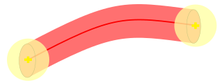 |
|:--:|
| &nbsp; |

The tolerance defines a maximal allowed deviation between nominal and actual geometric entities.
Tolerance is a glue that stitches objects together.
This deviation is unavoidable due to the nature of floating point numbers used to store geometry and due to insufficient precision of various modeling operations.

Even when somebody proclaims 'toleranceless' B-Rep, this doesn't mean a zero gap between geometry,
but rather that this gap shouldn't exceed some fixed kernel-specific threshold, when a model is used within the rules of this kernel.

The concept of toleranced B-Rep is a good thing on its own - it makes definition more robust and flexible.
Real-world manufacturing also happens with limited precision.
Though the B-Rep tolerance adds an additional factor to take into account within all operations in the CAD kernel.
Whether the two entities have intersection - the answer may be different
on [geometric and topological levels](http://cupofcad.org/2026/06/03/reflection-on-cad-algorithms/).

The mechanism of tolerances allows making a B-Rep valid, to preserve original design intent, even when geometrical algorithms suffer in precision.
Practically speaking, any invalid B-Rep model might become a 'valid' one by increasing tolerances to cover gaps of imprecision.
Any geometry might end-up being approximated as a sole `TopoDS_Vertex` with a gigantic tolerance covering the whole shape, why not?
Such B-Rep might be still considered 'valid' in terms of CAD kernel rules (e.g. it will pass `ShapeAnalysis` checks in OCCT),
but it is obviously useless for real manufacturing.

But how can one even notice the issue, if all these tolerances are just numbers hidden inside `TopoDS_Shape`?

## Visualizing tolerances

[Draw Harness](/occt/2022-06-23-draw-harness-custom-plugin/) was specifically designed to help developing and testing OCCT algorithms,
and for sure it provides plenty of useful commands for this.

The command `tolsphere`, added to *OCCT 7.2*, serves exactly the purpose of visualizing tolerances.
It displays `TopoDS_Vertex` tolerance as a sphere. The main drawback of this command is that it does so in a non-interactive AXO viewer...
So I've decided to make a new command `vtolvertex` which does the same (and a little bit more) in the `AIS` viewer.

The basic implementation of the command is pretty trivial:

```cpp
TopoDS_Shape aShape = DBRep::GetExisting(argv[1]);
TopTools_IndexedMapOfShape aShapeMap;
TopExp::MapShapes(aShape, TopAbs_VERTEX, aShapeMap);
for (int i = 1; i <= aShapeMap.Extent(); ++i)
{
  const TopoDS_Vertex& aV = TopoDS::Vertex(aShapeMap.FindKey(i));
  const double  aTol      = BRep_Tool::Tolerance(aV);

  const TCollection_AsciiString aVertName = aName + "_v" + i;
  theDI << aVertName << ": " << aTol << "\n";

  static constexpr int aNbSlices = 10;
  Prs3d_ToolSphere aTool(aTol, aNbSlices, aNbSlices);
  Handle(Poly_Triangulation) aTris = aTool.CreatePolyTriangulation(gp_Trsf());

  TopoDS_Face aTrisFace;
  BRep_Builder().MakeFace(aTrisFace, aTris);

  Handle(AIS_Shape) aPrs  = new AIS_Shape(aTrisFace);
  aPrs->SetColor(Quantity_NOC_RED);
  aPrs->SetTransparency(0.5f);

  gp_Trsf aTrsf; aTrsf.SetTranslationPart(BRep_Tool::Pnt(aV).XYZ());
  aPrs->SetLocalTransformation(aTrsf);

  ViewerTest::Display(aVertName, aPrs, false);
}
```

But I was curious to be able to see the tolerance of `TopoDS_Edge` as well, which has a more complicated shape than a simple sphere.
The exact tolerance shape should be presented as a smooth tube, but computing such non-trivial geometry for debugging purposes looks too expensive and redundant.
Instead, my `vtoledge` implementation displays the tolerance of `TopoDS_Edge` as a sequence of cylinders along the 3D curve discretization:

```cpp
TopoDS_Shape aShape = DBRep::GetExisting(argv[1]);
TopExp::MapShapes(aShape, TopAbs_EDGE, aShapeMap);
for (Standard_Integer i = 1; i <= aShapeMap.Extent(); ++i)
{
  const TopoDS_Edge& anEdge = TopoDS::Edge(aShapeMap.FindKey(i));
  const double       aTol   = BRep_Tool::Tolerance(anEdge);

  const TCollection_AsciiString anEdgeName = aName + "_e" + i;
  theDI << anEdgeName << ": " << aTol << "\n";
  if (BRep_Tool::Degenerated(anEdge))
    continue;

  Handle(Prs3d_Drawer) aDrawer = new Prs3d_Drawer();
  aDrawer->Link(aCtx->DefaultDrawer());
  const double aDefl = StdPrs_ToolTriangulatedShape::GetDeflection(aS, aDrawer);

  Prs3d_NListOfSequenceOfPnt aPolylines;
  StdPrs_WFShape::AddEdges(anEdge, aDrawer, aDefl,
                           &aPolylines, &aPolylines, &aPolylines, &aPolylines);
  if (aPolylines.Size() != 1 || aPolylines.First()->Size() < 2)
    continue;

  const TColgp_SequenceOfPnt& aPnts = aPolylines.First()->Sequence();

  const int aNbSegs  = aPnts.Size() - 1;
  const int aNbVerts = Prs3d_ToolQuadric::VerticesNb (aNbSlices, aNbSlices) * aNbSegs;
  const int aNbTris  = Prs3d_ToolQuadric::TrianglesNb(aNbSlices, aNbSlices) * aNbSegs;

  Handle(Graphic3d_ArrayOfTriangles) aTris =
    new Graphic3d_ArrayOfTriangles(aNbVerts, aNbTris * 3, Graphic3d_ArrayFlags_VertexNormal);

  TColgp_SequenceOfPnt::Iterator aPntIter(aPnts), aPntIterNext(aPnts);
  aPntIterNext.Next();
  for (; aPntIterNext.More(); aPntIter.Next(), aPntIterNext.Next())
  {
    const gp_Pnt& aPnt1 = aPntIter.Value();
    const gp_Pnt& aPnt2 = aPntIterNext.Value();

    const double aLen = aPnt2.Distance(aPnt1);
    if (aLen <= gp::Resolution())
      continue;

    gp_Trsf aTrsf;
    aTrsf.SetTransformation(gp_Ax3(aPnt1, gp_Dir(aPnt2.XYZ() - aPnt1.XYZ())), gp::XOY());

    Prs3d_ToolCylinder aTool(aTol, aTol, aLen, aNbSlices, aNbSlices);
    aTool.FillArray(aTris, aTrsf);
  }

  Handle(AIS_InteractiveObject) aPrs = new MyPArrayObject(aTris);
  aPrs->SetColor(Quantity_NOC_BLUE);
  aPrs->SetTransparency(0.5f);

  ViewerTest::Display(anEdgeName, aPrs, false);
  theDI << anEdgeName << " ";
}
```

Visualizing tolerances for `TopoDS_Face` would be even more complicated, but has low practical value.
Modeling experts conclude that the tolerance at `TopoDS_Face` level is rather redundant for real applications.
For instance, *Parasolid kernel* doesn't use them at all; OCCT uses face tolerance in face/face intersection stage within Boolean operations.

Let's try to make some screenshots with new tools at hand:

```
pload MODELING VISUALIZATION
box b 100 200 300
tolerance b
vdisplay b
vfit
vtolvertex b
```

| 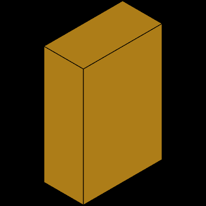 |
|:--:|
| &nbsp; |

```
Tolerance MAX=9.9999999999999995e-08 AVG=9.9999999999999995e-08 MIN=9.9999999999999995e-08
FACE    : MAX=9.9999999999999995e-08 AVG=9.9999999999999995e-08 MIN=9.9999999999999995e-08
EDGE    : MAX=9.9999999999999995e-08 AVG=9.9999999999999995e-08 MIN=9.9999999999999995e-08
VERTEX  : MAX=9.9999999999999995e-08 AVG=9.9999999999999995e-08 MIN=9.9999999999999995e-08
```

and... nothing could be seen on display!
Well, this is actually *expected* result, as the box modeling algorithm will put `1.e-7` (`Precision::Confusion()`) as a tolerance,
which makes it kind of a *toleranceless* model within the OCCT kernel.
This number is too small to be visually observed compared to the size of the whole model.

Lets 'hack' the model a little bit by changing tolerance with help of `settolerance` command:

```
pload MODELING VISUALIZATION
box b 100 200 300
settolerance b v 10.0
tolerance b
vdisplay b
vfit
vtolvertex b
```

| 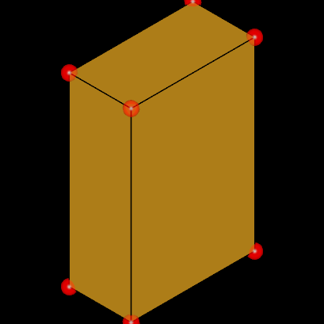 |
|:--:|
| &nbsp; |

Now we can see the spheres!

When tolerance values in the model grow high, they may cause troubles in further modeling operations and even break an original design intent.
The CAD kernel itself, however, doesn't define any upper bound for tolerance values,
because practical restrictions depend on the application domain (what is fine for a sea vessel could be too bad for an aircraft). 

But where do large tolerance values actually come from?

## Floating point math

Lets model a simple box (`BRepPrimAPI_MakeBox`) with a couple of blended edges (*fillets* created by `BRepFilletAPI_MakeFillet` algorithm):

```
pload MODELING VISUALIZATION
box b 100 200 300
explode b E
blend r b 10 b_10 1 b_6 30 b_5
tolerance r
vdisplay  r
vtolshape r
vfit
```

| 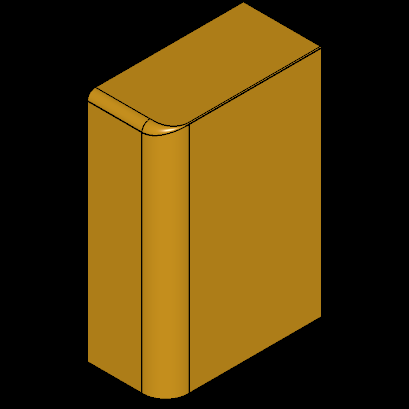 |
|:--:|
| &nbsp; |

```
Tolerance MAX=7.9952429279906296e-05 AVG=9.0044743644453535e-06 MIN=9.9999999999999995e-08
FACE    : MAX=7.9952429172558622e-06 AVG=8.8952429172558636e-07 MIN=9.9999999999999995e-08
EDGE    : MAX=7.9952429172558622e-06 AVG=1.5354987122283391e-06 MIN=9.9999999999999995e-08
VERTEX  : MAX=7.9952429279906296e-05 AVG=1.3661115607908377e-05 MIN=9.9999999999999995e-08
```

The model looks fine, the tolerances are a little bit larger than `1.e-7` but within a reasonable range compared to the size of the whole model.
Now lets apply `BRepBuilderAPI_Transform` moving geometry to a distant point `1e15 0 0` and back:

```
ttranslate r  1e15 0 0
fixshape  r r
ttranslate r -1e15 0 0
tolerance r
vclear
vdisplay  r
vtolshape r
vfit
```

| 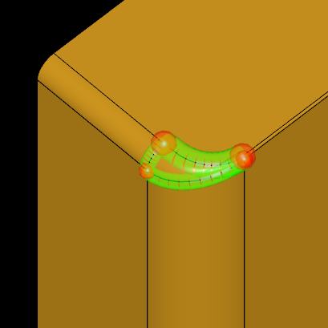 |
|:--:|
| &nbsp; |


```
Tolerance MAX=0.50000500000000003 AVG=0.1267619612341051 MIN=9.9999999999999995e-08
FACE    : MAX=7.9952429172558622e-06 AVG=8.8952429172558636e-07 MIN=9.9999999999999995e-08
EDGE    : MAX=0.50000500000000003 AVG=0.090910081818181818 MIN=9.9999999999999995e-08
VERTEX  : MAX=0.50000500000000003 AVG=0.15909256818181811 MIN=9.9999999999999995e-0
```

What happened? The tolerance or blended edges considerably increased.
The precision was lost as a result of *floating point math*, when the large number has been added to (small) geometry coordinates.

```
  double a = 1.0/3.0;
  // a = 0.3333333333333333
  double b = a + 1e15;
  // b = 1000000000000000.4
  double c = b - 1e15;
  // c = 0.3700000000000000
```

The further applied shape healing algorithm tries to fix the problem of truncated geometry precision by increasing tolerances at topological level.

But even though the model is still considered 'valid', it might be considered not precise enough for application purposes and may cause OCCT algorithms to fail.
If we will further translate shape by even larger distance like `1e16` or `1e17`, we will be able to finally see a 'cracked' the shape:

| 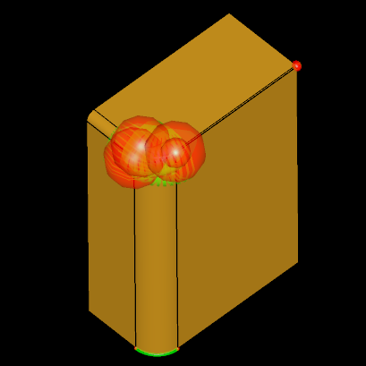 |
|:--:|
| &nbsp; |

The large distance increment is just one obvious sample of floating point limitations,
but these limitations might happen in normal modeling algorithms and moreover they *accumulate* along the long history of geometrical transformations.

There is no simple solution for floating point math issues - the [long double](https://en.wikipedia.org/wiki/Long_double)
type still has no wide support across C++ compilers nor uniform hardware support.
And emulated floating point types, which are commonly used in astronomical computations, are usually impractical for CAD modeling due to performance issues.

The rounding/truncation issues might be reduced by carefully reordering operands of floating point math,
but this requires careful considerations in real algorithms at different levels (cannot be fixed just at low-level algorithm).

## Data Exchange

One of the most common origins of shapes with large tolerances is *Data Exchange*.
There are many reasons for that:
- The modeling operation in original CAD kernel produced too rough result;
- The precision of original model has been lost while converting internal CAD kernel representation into exchange format or back from it;
- The bugs in Data Exchange algorithms (export and/or import) that lead to model consistency issues, which have to be covered by increased tolerances.

It is important to understand that although we have several CAD kernels relying on B-Rep, these kernels have dramatic differences in their B-Rep definition.
The exchange ISO standards like [STEP](https://en.wikipedia.org/wiki/ISO_10303-21) define B-Rep as some neutral specifications, which every CAD kernel has to adapt.

Despite the numerous known issues, OCCT is known to provide one of the most robust import/export implementations of *STEP* standard.
And shape healing is the critical of this component to provide a valid B-Rep after importing a *STEP* file written by various kernels.

But *'valid'* still doesn't mean *'good'*, and imported models might suffer from too large tolerances.

Lets try to import a sample [*IGES*](https://en.wikipedia.org/wiki/IGES) model `data/iges/bearing.iges`:

```
pload MODELING XDE VISUALIZATION
testreadiges [locate_data_file bearing.iges] b
tolerance b
vdisplay  b
vtolshape b
```

| 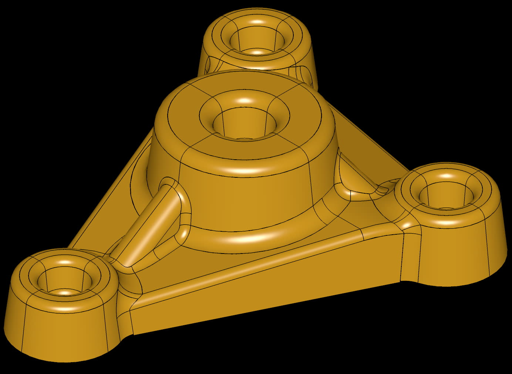 |
|:--:|
| &nbsp; |

The shape looks pretty good at first glance, but with tolerances visualized it is clear that model is not OK:

| 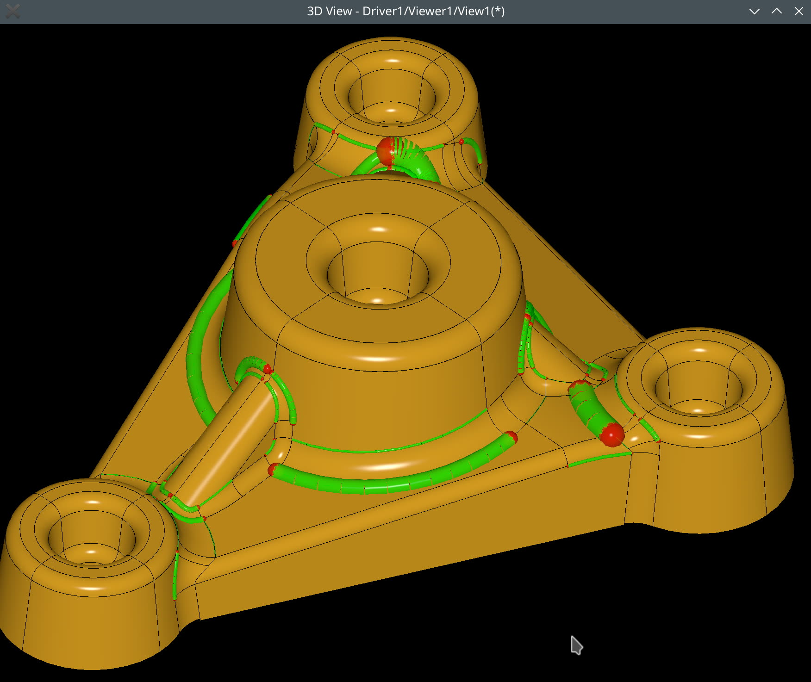 |
|:--:|
| &nbsp; |

```
Tolerance MAX=0.0021699434985010986 AVG=4.5360808804742987e-05 MIN=9.9999999999999995e-08
FACE    : MAX=9.9999999999999995e-08 AVG=9.9999999999999995e-08 MIN=9.9999999999999995e-08
EDGE    : MAX=0.0021697265258485139 AVG=2.947789240415292e-05 MIN=9.9999999999999995e-08
VERTEX  : MAX=0.0021699434985010986 AVG=5.8424770870824593e-05 MIN=9.9999999999999995e-08
```

Lets extract a couple of `TopoDS_Face` from the whole model and take a closer look.

```
explode b F
tcopy b_182 f1
tcopy b_195 f2
compound f1 f2 c
incmesh f1 1e-7 -angular 10
incmesh f2 1e-7 -angular 10
vdefaults -autoTriang 0
vclear
vdisplay c
vaspects c -transparency 0.5
#vtolshape c
vfit
```

| 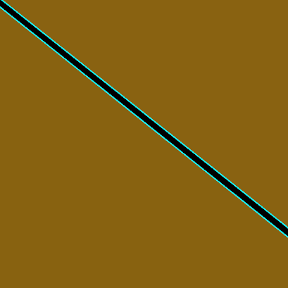 |
|:--:|
| &nbsp; |

We may see these two faces are not stitched together.
That's actually expected result considering limitations of *IGES* format (compared to *STEP*).
The tool `BRepBuilderAPI_Sewing` is specifically designed to solve this issue and stitch neighbor faces together into `TopoDS_Shell`.
This tool, however, cannot know an original design intent, and a user has to provide a tolerance for neighbor faces selection.

```
sewing s 1e-7 c
vdefaults -autoTriang 1
vclear
vdisplay  s
vtolshape s
```

| 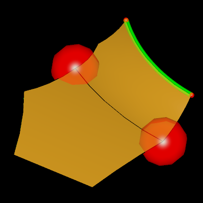 |
|:--:|
| &nbsp; |

The sewing operation has merged two `TopoDS_Edge` between a pair of `TopoDS_Face`, so that now we see only one 3D-curve in-between.
Moreover, `BRepMesh_IncrementalMesh` has recomputed triangulation and now it looks continuous across faces.
This is what magic of toleranced B-Rep does for a user to show design intent, but at the same time this trick hides the exact geometry and potential issues in it.

Sewing has created a `TopoDS_Edge` with a nice tolerance value for us, but as we may see from `vtolshape`,
there are still two `TopoDS_Vertex` with abnormally large tolerances.

Even if we call `ShapeFix_Shape` on this shape, it will have no effect, as there is nothing to heal - B-Rep model is valid!
But we may try another trick - first use `ShapeFix_ShapeTolerance` to reset tolerances to `1.e-7` (`Precision::Confusion()`),
and then call `ShapeFix_Shape`, which would recalculate minimal tolerances for us:

```
fixshape  s s
tolerance s
# no effect

settolerance s 1e-7
fixshape  s s
tolerance s
vclear
vdisplay  s
vtolshape s
```

| 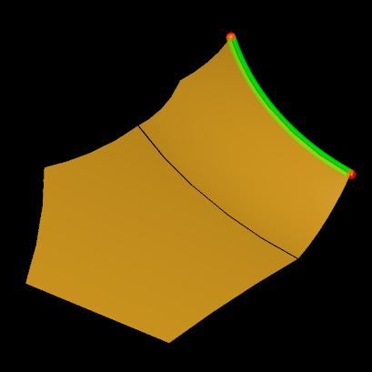 |
|:--:|
| &nbsp; |

```
Tolerance MAX=0.00021281723103625587 AVG=3.5123265030357587e-05 MIN=9.9999999999999995e-08
FACE    : MAX=9.9999999999999995e-08 AVG=9.9999999999999995e-08 MIN=9.9999999999999995e-08
EDGE    : MAX=0.00021281723103625587 AVG=2.281297780227287e-05 MIN=9.9999999999999995e-08
VERTEX  : MAX=0.00021281723103625587 AVG=4.4780735147435712e-05 MIN=1.3851242290197822e-06
```

Now we may see a model that has reasonable tolerances.

## P-Curves and orientation

2D profile (curves defined in parametric space of faces) and shape orientations is another peculiar aspect hidden within 3D view of a model.
Experienced Draw Harness users should be already aware of the commands `pcurve` and `vori`:

```
pload MODELING VISUALIZATION
pcone s 50 0 100
explode s F
av2d
donly s_1
vori  s_1
fit
pcurve s_1
2dfit
```

I wouldn't go into details of the importance of a valid 2D profile here as it is worth a dedicated article.
Here I just want to share that I've reimplemented the similar functionality for AIS viewer in the form of a new command `vorishape`,
which should make the debugging process more convenient to OCCT experts.

| 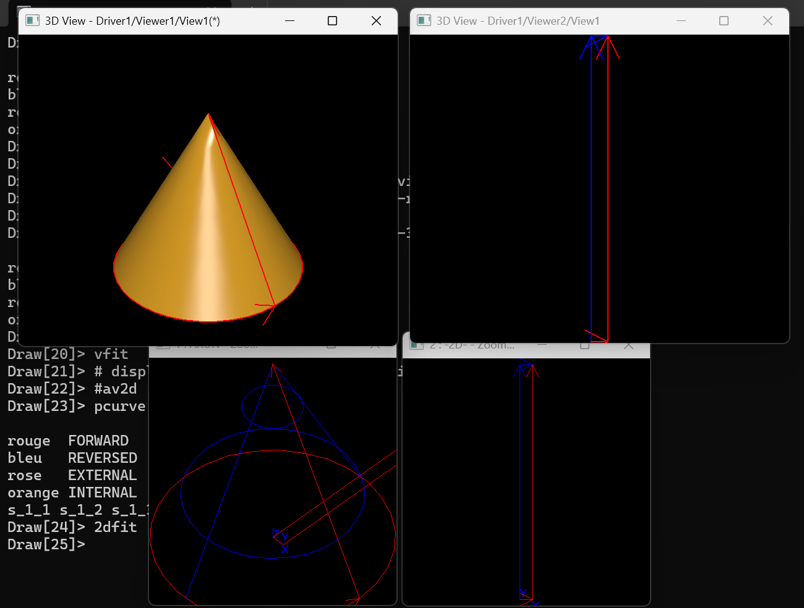 |
|:--:|
| &nbsp; |

