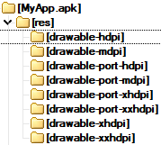
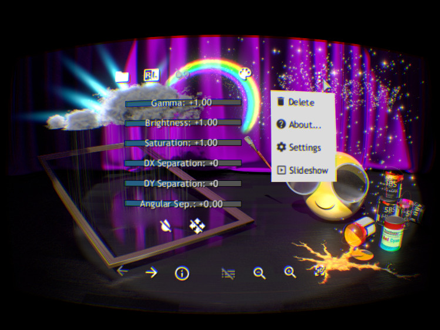

*HiDPI* screens, *4K* screens, *Retina* screens - high pixel density became a new standard for modern displays.
Various platforms and *GUI* frameworks have chosen different paths in supporting such displays, bringing new challenges to developers of cross-platform applications.

Most developers are focused on supporting devices they have at hand, and do not recognize the vast diversity of hardware available on the market, and problems that such diversity brings.
A curious application developer needs to broaden his look to design a truly scalable User Interface.

This article makes an overview of program interfaces related to high-density screens from several platforms (*Android*, *macOS* and *Windows*),
lists important aspects to consider in a scalable User Interface, and gives advice to cross-platform development.

<!--break-->


## Terminology

Screen sizes vary a lot - from tiny smart watches, through smartphones and tablets, to notebooks and desktop monitors.
An application with a scalable User Interface should be flexible enough and provide the best user experience considering small screens, screens in portrait orientation, extra-wide screens, large screens.
And when it comes to high-pixel density screens - a user expects an application interface being crisper and properly scaled.

User Interface scalability consists of handling a combination of several variables:

- [Screen size](https://en.wikipedia.org/wiki/Display_size)
  - Diagonal length - 5", 17", 24", 30", etc.
- [Aspect ratio](https://en.wikipedia.org/wiki/Display_aspect_ratio) and layout
  -   *4x3* \[old TV’s\];
  - *16x9* \[HDTV\];
  - *21x9* \[ultra-widescreen\];
  - Landscape or portrait;
  - Others.
- [Pixel density](https://en.wikipedia.org/wiki/Pixel_density)
  - *macOS*: *72 PPI* (default), *Retina* displays 2x, 3x
  - *Windows*: *96 PPI* (default), *HiDPI*
  - *Android*: *LDPI*, *MDPI*, *HDPI*, *XHDPI*, *XXHDPI*, *XXXHDPI*

Standard [display resolutions](https://en.wikipedia.org/wiki/Graphics_display_resolution) like `1920x1080` (*FullHD*), `2560x1440` (*WQHD*) or `3840x2160` (*4K UHD*)
specify only screen's Width \* Height resolution in pixels and aspect ratio (proportions).
Pixel density defined in *DPI* or similar units is another major variable in an equation.

**DPI** stands for [Dots Per Inch](https://en.wikipedia.org/wiki/Dots_per_inch), and **PPI** stands for [Pixels Per Inch](https://en.wikipedia.org/wiki/Pixel_density).
These terms define the physical density, or resolution, with which printer, monitor or another device is able to display an image.

|  |
|:--:|
| *Monitor (PPI) vs. printer (DPI) - image from [Wikimedia](https://commons.wikimedia.org/wiki/File:DPI_and_PPI.png).*  |

Matrix printers of the past used needles to put color on the paper, so that the result of their work looked exactly as a grid of dots - so that DPI term is applicable.
Modern *LCD* screens have physical cells for each pixel on the screen, so that *PPI* term is applicable.
In practice, however, the terms become interchangeable and DPI is used more often.

Based on a physical screen dimensions and it's pixel resolution, one could easily calculate a *physical DPI*.
However, the ***logical PPI*** used for rendering content and defined
at Operating System or *GUI* framework level does not necessarily match the ***physical DPI*** of the screen, which will be mentioned later.

While considering *DPI* as screen resolution capacity, one should note a different distance at which the user looks onto the screen:

- Smartphone: *~25 cm* (very close)
- Tablet: *~38 cm*
- Computer Monitor: *~50-70 cm* (average)
- TV, Projector: *120+ cm* (distant and much wider range)

*DPI* is a useful metric of screen density, but only combined with the distance it defines if the user will see pixels on the screen or if user interface elements will be readable or not.

|  |
|:--:|
| *Projector at different distances from a screen.* |

There was an attempt to introduce a new metric [**Pixel Per Degree**](https://en.wikipedia.org/wiki/Retina_display) (*PPD*)
or [**Angular pixel density**](https://en.wikipedia.org/wiki/Fovea_centralis#Angular_size_of_foveal_cones) - the measurement
intended to represent pixel density depending on the eye distance to the screen (so that *PPD* is not a property of a display itself).
The practical usage of this metric is complicated, though.

Screen can be called **High-DPI**, when its pixel density is considerably higher than that of a common screen.
Within more than two decades (90's and 00's), the majority of PC monitors was *96 DPI* in average, so this is how "common" screen is actually defined.

*Apple* was one of the first vendors pushing higher-density screens on the market with their [Retina brand](https://en.wikipedia.org/wiki/Retina_display) (introduced in '2010),
which nowadays is available on *iPhones*, *iPads*, *MacBooks* and on *iMac*.
*Retina* screens have a pixel density of *300+ PPI* (for tablets) or *57+ PPD*.

|  |
|:--:|
| *Screens of different pixel densities on a macro photo shot.* |

On a macro shot above you can see two screens of the same size having different pixel density - the right screen looks crisper.
Low density makes content like smooth lines and text appear on the screen pixelated, difficult to read, and reveal an aliasing issue.
*High-DPI* screens diminishes the problem, and might even work well without antialiasing algorithms being applied.

## System APIs managing DPI

### Early systems

At some point, OS developers have decided to define a "standard resolution" - a resolution of average monitor,
for which the user interface of the system itself has been designed for.
Since the *1980s* the *Microsoft Windows* operating system uses [**96 DPI**](https://en.wikipedia.org/wiki/Dots_per_inch#Computer_monitor_DPI_standards) by default,
while *Apple*/*Macintosh* computers use **72 DPI**.

Appearance of high pixel density screens revealed scalability issues within existing platforms.
That doesn't mean, however, that OS developers haven't thought about pixel density in the '90s.
In fact, all major systems provided DPI settings, but practically screens had very close characteristics for a long time.

|  |
|:--:|
| *DPI settings in Windows 9x / XP.* |

*Windows 9x*, *Linux* (*X11*) and *OS X* provided "DPI settings" a long time ago, although on *OS X Snow Leopard* this control was actually hidden (non-default values produced artifacts).

|  |
|:--:|
| *"UI resolution" control in OS X Snow Leopard.* |

Here is an example of APIs in *Windows*, *Linux* and *macOS* returning *DPI* settings:

- Windows 9X / XP  
  - ```
      HDC aDeskCtx = GetDC(NULL);
      const int aDpiX = GetDeviceCaps(aDeskCtx, LOGPIXELSX);
      float aScale = float(aDpiX) / 96.0f; // 96 is 100% in Windows
      ReleaseDC(NULL, aDeskCtx);
    ```
- Linux / XLib
  - ```
      Display* theDispX;
      const char* aDpiStr = XGetDefault(theDispX, "Xft", "dpi");
      float aScale = float(atoi(aDpiStr)) / 96.0f; // 96 is 100% in Linux
    ```
- OS X Snow Leopard
  - ```
    NSScreen* theScreen;
    float aScale = [aScreen userSpaceScaleFactor];
    ```

Appearance of new-class displays with pixel density greater in times revealed severe issues
in platforms - not much in APIs themselves, but rather in their usage by GUI frameworks.
In fact, DPI management in systems was ***focused on making text readable***, and that's probably all.
And many users with vision problems changed these controls on common screens.

The older systems expected DPI settings to be adjusted within the range *75-125%* of default scale,
making it barely useful for a modern *High-DPI* display having *200%* scale factor or larger.

|  |
|:--:|
| *200% DPI scale on Windows XP.* |

Upscaled text fonts without proportionally scaled interface layout and low-resolution bitmaps make the interface look distorted and text labels clamped as DPI grows high.
On a *Windows XP* screenshot with *200% DPI* scale you can see such distortions (small icons on desktop, clamped labels and tabs),
although particular applications might look even worse and also have usability problems.

To support new high pixel density screens, developers have to scale the whole User Interface proportionally (not just a text) and provide bitmaps of higher resolution.
User experience on a *High-DPI* screen should be a crisper User Interface with more details having the same proportions as on an older *low-density* screen.
Moreover, as monitors of different density can be connected to the same computer simultaneously, one should consider rendering the user interface at a different scale per monitor.

The legacy of old applications, that were unable to scale the user interface properly on new screens,
pushed system developers to implement compatibility layers for pre and after *High-DPI* worlds.
So new APIs for *High DPI* screens have been introduced by most systems.

### Windows DPI Awareness

*Microsoft* introduced a new API called "[DPI Awareness](https://docs.microsoft.com/en-us/windows/win32/hidpi/high-dpi-desktop-application-development-on-windows)" with *Windows Vista*.
New applications supporting *High-DPI* monitors should put a special flag into a *Manifest file* embedded into an executable.

No new API determining *DPI scale factor* has been actually introduced - the flag was basically needed to indicate
that the application actually retrieves *DPI* information using legacy API, and applies it properly on modern screens.

|  |
|:--:|
| *Windows DPI awareness and old application.* |

In *Windows 8.1* this API received an important update to support *per-monitor DPI* settings.
This update introduced new calls - including the one to determine *DPI* being changed at runtime.
Before update, changes of *DPI* in monitor settings required re-logginging or rebooting the system.
Here is an example of new API callback:

```cpp
case WM_DPICHANGED:
  POINT thePnt;
  HMONITOR hMonitor = MonitorFromPoint(thePnt, MONITOR_DEFAULTTONULL);
  UINT aDpiX = 96, aDpiY = 96;
  GetDpiForMonitor(hMonitor, 0, &aDpiX, &aDpiY);
  float aScale = float(aDpiX) / 96.0f; // 96 is 100% in Windows
```

As result of evolution, the modern *Windows* define several levels of *DPI awareness*, that could be specified in *application Manifest*:

- **DPI Unaware**<br>
  (legacy);
- **System DPI Awareness**<br>
  (no dynamic DPI changes are supported);
- **Per-Monitor DPI Awareness**<br>
  (having two revisions V1 and V2).

The latest was introduced only in *Windows 10* and intended to solve severe usability problems
overlooked in initial V1 revision - scalability of non-client areas (e.g. window title and system dialogs,
see also [EnableNonClientDpiScaling](https://docs.microsoft.com/en-us/windows/win32/api/winuser/nf-winuser-enablenonclientdpiscaling)() hack required for V1 applications).

Applications not supporting particular *DPI Awareness mode* are subject to *fallback* at system level.
For a legacy DPI Unaware applications system emulates window size, screen size as it is of a lower resolution,
renders window into smaller bitmap and then upscales it within desktop composer.
In case of other DPI levels (save the latest), basically the same fallback is performed on specific event - e.g. application
not supporting Per-Monitor DPI Awareness would be upscaled or downscaled by system when application window
is moved to another monitor or DPI settings are changed by user in system settings.

The usual result of such compatibility is a blurry window content - including badly readable text and distorted bitmaps.
This is especially painful as *WinAPI* allows fractional scale factors, which has no good upscaling image processing algorithm.

One of the biggest pitfalls of *WinAPI* is that the application itself is ***responsible for resizing the window*** while moving it across monitors.
On the video you can see how the *Calculator* application looks while it is moved from one monitor to another - the process looks very clumsy,
and invisible boundaries makes it also quite tricky from a user point of view.

|  |
|:--:|
| *Application moving between High-DPI / Low-DPI screens in Windows 10.* |

It took painfully long (many many years) for *high-DPI* monitor users to wait until existing applications received *DPI Awareness* updates.
And this is not only legacy applications - even some parts of *Windows 10* itself worked through compatibility layers for many years after initial OS release!

### macOS/iOS backing store

With the introduction of new *Retina* displays, *Apple* engineers have no choice but to provide appropriate software support within their platform.
Legacy applications also received an essential fallback upscaling solution similar to *Windows*,
but in other aspects *macOS*/*iOS* API for supporting *Retina* displays looks very different.

First thing to mention, is that *Apple* decided not to bother with displays having fractional scale factors compared to old *low-DPI* screens.
Instead, a new API defined an *integer scale factor* - 1x, 2x or 3x!
The PC ecosystem is extremely versatile, so that *Microsoft* has to support almost any combinations,
but *Apple* is more centralized and self-closed, defining their own rules.

The old DPI information API has been marked "deprecated" in the new *macOS* version, and instead a new API introduced called **Backing Store**.
In this approach, pixels defining window dimensions, cursor position and other events are no more bound to physical pixels of real display.
These pixels are now virtualized and basically match pixels on an old low density.

An application "tells" the system if it wants a window content (backing store) to be rendered in full size or at (lower) virtual size.
Here is a code sample of APIs introduced for backing store support - including methods converting point across coordinate systems:

```cpp
// OpenGL application requests backing store resolution
NSOpenGLView* theView;
[theView setWantsBestResolutionOpenGLSurface: YES]

// retrieve backing store scale factor from a Screen
NSScreen* theScreen;
float aScale = [theScreen backingScaleFactor];

// conversion between backing store and logical units
NSView* theView;
NSPoint aPntIn = {10.0f, 20.0f};
NSPoint aRes   = [theView convertPointToBacking: aPntIn];
```

Nice feature of the approach chosen by *macOS*/*iOS* compared to *WinAPI* is that moving a window
across monitors looks very smooth and natural - without nasty resizing, invisible boundaries, etc.
Visually, one can see that while the window center crosses monitor boundaries, it adjusts the backing store to render content at higher or lower resolution.

### Android screen DPI

An interesting point of *Android* compared to previously mentioned platforms,
is that they have defined a provisional *DPI-aware* API at earlier stages of new OS development.
Instead of an arbitrary DPI settings, *Android* defines
a [grid of standard configurations](https://developer.android.com/reference/android/util/DisplayMetrics.html), including fractional scale factors:

- LDPI - low density
  0.75x
- MDPI - medium density
  1.0x: 160 DPI
- HDPI - high density
  1.5x: 240 DPI
- XHDPI - extra density
  2.0x: 320 DPI
- XXHDPI
  3.0x: 480 DPI
- XXXHDPI
  4.0x: 640 DPI

If the physical DPI of a real device doesn't match exactly the number in the grid, it is rounded up or down to the closest one,
and the application should care only about scales within the grid, not arbitrary ones.
It is still possible to retrieve a real physical resolution of the screen, though.

The baseline was defined as *160 DPI*, which can be considered as *100% scale factor* for user interface on mobile screen.
Considering view distance differences between desktop computer and mobile phone - it roughly matches *96 DPI* used as *100%* on desktops.
Within native SDK, this information is retrieved from `AConfiguration`:

```cpp
AConfiguration* theConfig = ...;
int aDpi = AConfiguration_getDensity(theConfig);
float aScale = float(aDpi) / 160.0f; // 160 is 100% or MDPI in Android
```

And from **DisplayMetrics** within Java API:

```java
DisplayMetrics aMetrics = getResources().getDisplayMetrics();
float aScale = aMetrics.density;
//float aScale = aMetrics.scaledDensity; // for text
```

It is interesting to note, that *Android* allows defining a separate scale factor for User Interface as whole and to Text font in particular.
The latter should have a similar effect as DPI scaling in old *Windows*.
As another side note, multiple connected displays are not much of an issue for *Android*, as it is focused on mobile devices.

### WebGL device scale factor

User Interface defined by *HTML* and *CSS* is inherently scalable - browsers supported arbitrary scale factors applied to web-pages for a long time.
And basically, it worked as *DPI Aware* applications - interface proportionally scaled,
text and vector graphics (*SVG*) automatically rendered at higher resolution, bitmaps upscaled or downscaled as necessary.

But one aspect still required some API extensions for handling *high-DPI* screens - specifying
a rendering resolution of [WebGL](https://www.khronos.org/webgl/wiki/HandlingHighDPI)
or HTML5 [canvas](https://www.html5rocks.com/en/mobile/high-dpi/).
By default, a browser creates the drawing buffer of a lower size on a high-pixel density screen for compatibility reasons,
and an application developer should take control to render at native resolution.

Basically, [high-pixel density support](https://www.khronos.org/webgl/wiki/HandlingHighDPI) in browsers looks pretty similar to *macOS backing store* approach.
Here you can see a code sample resizing *WebGL canvas* according to pixel density property of window:

```js
var aDipWidth = 800, aDipHeight = 600;
var aCanvas = document.getElementById("myCanvas");

// canvas size in density-independent units
aCanvas.style.width  = aDipWidth  + "px";
aCanvas.style.height = aDipHeight + "px";

// size of Drawing Buffer
var aDevicePixelRatio = window.devicePixelRatio || 1;
aCanvas.width  = Math.round(aDipWidth  * aDevicePixelRatio);
aCanvas.height = Math.round(aDipHeight * aDevicePixelRatio);

var aGl = aCanvas.getContext("webgl");
```

It is also necessary to handle changes of this property on browser window movements
from one to another monitor (e.g. by tracking `window.onresize` events).

There are some tricky issues in browsers on mobile platforms.
Zooming in and out of the page may happen in the browser on a mobile phone,
so that optimal rendering resolution of a WebGL element might become not obvious and cause performance issues.

## Application development

My personal experience in development of cross-platform applications is based on two main projects - **sView** media player and **CAD Assistant**.

|  |
|:--:|
| &nbsp; |

[sView](https://sview.ru) is an open source stereoscopic viewer available on *Windows*, *Linux*, *macOS*, and *Android* platforms.
It implements its own minimalistic GUI framework `StGLWidgets` based on *OpenGL* renderer and bound to low-level system APIs (*WinAPI*, *Xlib*, *Cocoa*, *Android NDK* + *SDK*).

*sView* was initially developed for desktop platforms, and later on ported onto *Android*,
revealing some challenges in making a desktop-only application in the past user-friendly on touch screens and small-sized screens.
Learning platform-specific APIs for *High-DPI* screens was just a matter of library evolution.

[CAD Assistant](https://dev.opencascade.org/project/cad-assistant) is a 3D Viewer for CAD models
available on *Android*, *iOS*, *macOS*, *Linux* and *Windows* platforms.
This project has been initially developed as proof of concept of using Open CASCADE Technology 3D Viewer on mobile platforms,
and only later on became available on desktop platforms as well.
Therefore, *CAD Assistant* user interface was initially designed for *Android* and only later on adopted for desktops.
Unlike sView, *CAD Assistant* relies on an external cross-platform framework for User Interface development - *Qt5*/*QtQuick*.

This experience allowed me to see UI scalability issues from two perspectives - a low-level system APIs and a high-level GUI framework (*Qt*).

### Scale factor

In the previous chapter we have passed through details of DPI support on different platforms.
And now we will try to consolidate this information for development of a cross-platform application.

Most system APIs return screen resolution information as DPI values,
but practically speaking these numbers are misleading and difficult to use directly.
It is proposed to convert DPI information provided by the system into a **scale factor**.
**96 DPI** on a desktop monitor is roughly equals to **160 DPI** on a mobile phone,
which is held at closer distance, - so that these numbers could be used as a baseline for **100% scale factor**.

Some systems and frameworks like *Qt* provide information about the physical DPI of the screen,
and from a first glance it sounds logical to apply these numbers to compute scale factor.
Physical DPI instead is not rounded to a grid of standard resolutions supported by a system, like *100%*/*125%*/*150%*/*175%*/*200%*,
and if GUI framework is capable of applying an arbitrary scale, it could show to a user a "perfect match"
(for example, real screen might have *2.87x* scale factor, which will be rounded to *3x* by system).

|  |
|:--:|
| *Display scale factor in Windows 10 settings.* |

But this ignores the fact that systems allow configuring screen scale, which can be adjusted for better readability, and may be different from a physical DPI.
So that using logical DPI returned by the system will provide a better user experience than trying to be a smarter guy and use physical DPI instead.
In addition, some devices like projectors have no meaningful physical DPI at all.

|  |  |  |
|:--:|
| | *Android settings - display size.* | |

*Android* documentation invented a new term "**dip**" (or **dp**, [density-independent pixels](https://developer.android.com/training/multiscreen/screendensities))
as replacement of commonly used "pixels" for defining sizes and distances in user interface.
*1 dp* corresponds to a *1 px* on an *MDPI* screen, so that based on DPI grid rendered pixels should be computed as: `px = dp * (dpi / 160)`.

Although this term is not used outside *Android SDK*, it looks handy to denote sizes defined within *100% scale* in a cross-platform application internally:

```cpp
//! Return scaled pixels.
inline int scale (int theDip) const
{
  return int(myScaleGUI * float(theDip) + 0.1f);
}
```

*Android* has one more term called "sp", or *scale-independent pixels*.
This one is more confusing and closer to the old DPI concept of legacy platforms,
when additional scaling is applied to the text (independent to the whole UI scale).

|  |
|:--:|
| &nbsp; |

### Scalable resources (icons, bitmaps)

Resources like UI layout, text labels and vector graphics (*SVG*) can be naturally scaled by computed scale factor.
There are some tricky points, though. As the final result is represented in integer numbers (rendered as pixels),
scaling math should avoid accumulating integer errors. And line thickness should avoid fractional scale factors.

Modern GUI frameworks and browsers natively support *SVG*, so that it is a common practice
replacing conventional bitmaps with *SVG* images in application resources.
Vector graphics have some caveats, though - an additional rasterization step may affect performance,
and bitmaps can be more optimal for storing some graphics.

|  |
|:--:|
| *SVG image rasterized into bitmap.* |

Different DPI configurations require packaging bitmaps of different sizes within application resources, as scaling might be costly and produce imperfect results.
There are two common approaches to generate a set of such bitmaps - generation from SVG or downscaling from high-resolution bitmap source.

For the lowest resolutions, artists may apply manual corrections or even draw a different version of bitmap to make it easily recognizable/readable on low-DPI screens.
Hopefully, low-resolution displays will become rare in future, and there will be no need to hack bitmaps in this way.

|  |
|:--:|
| *Bitmaps for Android resolutions grid.* |

The grid of bitmap resolutions depends on the system and may include options like *1x*, *1.5x*, *2x*, *3x*, *4x* (as suggested by *Android* documentation).
As scaling bitmaps is undesired, for non-exact scale factors an equal or lower resolution image should be used.

*Icons* are pretty much the same as *Bitmaps*, with one possible difference - the same icon can be used
at different sizes within the same application (regardless of screen resolution). Consider, for example, a *toolbar* and *popup menu*.
Of course, it is possible to create two icons from one and call them "small" and "big".
But as they usually come from the same source, it might be nicer to treat icons specifically within application resources.

For this, an extended set of bitmaps is created for each *icon*, which could be: *16x16*, *24x24*, *32x32*, *48x48*, *64x64*, *72x72*, *96x96*, *128x128*, *144x144*, *192x192*, *256x256*.

|  |
|:--:|
| *Bitmaps of an icon.* |

Within my applications, *icons* of standard sizes are pre-generated and the application chooses the closest one based on expected size on the screen and scale factor.
This allows reusing the same bitmap across scale factors, but also brings a redundancy in resources as some generated icons sizes might be never used.

|  |
|:--:|
| *Grayscale icons reused at different sizes and with different colors applied in CAD Assistant.* |

Another trick is defining icons in a compact grayscale format (instead of *RGBA*) and applying different color themes on the fly within user interface composition.

[Google "Material Design" Icons](https://material.io/resources/icons/?style=baseline) is a nice set of *SVG* icons available
under permissive license (`CC-BY 4.0` since '2014, `Apache license 2.0` since '2016).
These icons look nice not only on the *Android* platform, but on other systems as well, and can be naturally extended by application-specific images.

|  |
|:--:|
| *Google "Material Design" Icons.* |

Generation of a set of *PNG* bitmaps of different sizes from *SVG* images can be automated with scripts
using open-source tools like [Inkscape](https://inkscape.org/), [FFmpeg](https://www.ffmpeg.org/), [pngcrush](https://pmt.sourceforge.io/pngcrush/).
*Inkscape* exports *PNG* image of necessary size, *ffmpeg* generates grayscale image from *RGB* one and *pngcrush* squashes out the most compact PNG file:

```
set "anSvg=%1"
set "aPng=%2"
if ["%aPng%"] == [""] set "aPng=%1"
if not exist "%anSvg%" set "anSvg=%anSvg%.svg"
for %%s in (16 24 32 48 64 72 96 128 144 192 256) do (
  if exist "%aPng%%%s.png" del "%aPng%%%s.png"
  inkscape --file "%anSvg%" ^
    --export-area-page ^
    --export-height=%%s ^
    --export-background=#ffffff ^
    --export-background-opacity=1.0 ^
    --export-png "%aPng%_%%spx.tmp.png"
  ffmpeg -i "%aPng%_%%spx.tmp.png" -pix_fmt gray "%aPng%_%%spx.tmp2.png"
  pngcrush -noreduce -rem allb "%aPng%_%%spx.tmp2.png" "%aPng%_%%spx.png"
  del "%aPng%_%%spx.tmp.png"
  del "%aPng%_%%spx.tmp2.png"
)
```

Packaging bitmaps resources have different schemes on various platforms.
*Android APK* archive, for instance, uses "**x-dpi**" folder suffixes (**-hdpi**, **-xhdpi**, **-xxhdpi**, etc.), *iOS* assets use *integer scale* numbers for files (**@2x**, **@3x**).

|   |
|:--:|
| *Name conventions for packaging bitmap DPI sets, Android (left) and iOS (right).* |

Non-standard application resources can be packaged in a custom way.
Icons may have a pixel size suffix (`16px`, `24px`, `32px`, `48px`); images might have size suffix in percentages (`@100`, `@150`, `@200`, `@300`) to allow fractional numbers.  

Application bundle should include bitmap resources of all possible resolutions to support arbitrary screens, which affects application size.
This is inevitable for desktop systems, where indeed, screens of different resolution may be connected any time.
On mobile platforms, however, screen resolution is normally predefined, so that *Google* suggests
using [App Bundles](https://developer.android.com/guide/app-bundle) to load only assets, necessary to a specific device during installation time.

|  |
|:--:|
| *"Unoptimized APK" warning in Android developer console suggesting splitting resources.* |

Practically speaking, though, this optimization makes sense only to graphics-rich applications.
Here you may see proportions of bitmap assets relative to the whole *APK* package for two applications:

- *CAD Assistant*
  1 MiB PNGs / 38.4 MiB APK *(~2.6%)*
- *sView*
  1.3 MiB PNGs / 12.1 MiB APK *( ~10%)*

All bitmaps at all sizes take *less than 3%* of CAD Assistant APK size, making a further "optimization" of such APK pointless to the end user.
This is because the main payload within CAD Assistant are native libraries for reading CAD files and displaying them in 3D viewer - not images of user interface.
And CAD Assistant is already split into APK per CPU architecture to reduce installation size.
Of course, applications having a richer graphics in user interface (and smaller code) would show different proportions.

### Scalable user input (touchscreen, mouse)

Screens of mobile phones are very small compared to desktop monitors.
Showing considerable amounts of information on such screens is a challenging task.
Modern applications provide a lot of functionality, and application developers are trying to squeeze as much as possible onto screen to make it available to a user.

The question appears here - how small User Element could be to remain accessible to a user?
Several [researching groups](https://www.scotthurff.com/posts/how-to-make-truly-tappable-user-interfaces/)
from different countries investigated the problem of touch screen user input to determine the optimal physical size of the button.
For this, [one of the groups](http://nhenze.net/uploads/100000000-Taps-Analysis-and-Improvement-of-Touch-Performance-in-the-Large.pdf)
developed a small game with bubbles of different sizes, which players should tap into, and collected statistics of success and failures.
As bubbles become smaller, players miss them more often, with error level growing via exponent function.

|  |
|:--:|
| *100,000,000 Tap Analysis and Improvement Of Touch Performance.<br>(Niels Henze, University of Oldenburg;<br>Enrico Rukzio,University of Duisburg-Essen,<br>Susanne Boll, University of Oldenburg)* |

Research concluded **10 mm** being a minimal button size, and suggested even larger numbers like **12 mm** to further reduce user input error rate.
Making an element just a little bit smaller makes the user experience worse by degree,
by being unable to click onto a tiny button or by accidentally clicking the neighbor button - which might be even worse!

It is interesting to note that even developers from companies such as *Apple* sometimes make mistakes by creating too small User Interface elements in their applications.

How could numbers from the research be practically used? Minimal button size (`button size = image/text + gap`) for touch-screens should be:

- **56 dp** (8.8 mm) is a bare minimum;
- **64 dp** (10 mm or greater) is recommended.

|  |
|:--:|
| *Thumb size compared to sView interface on a touch screen.* |

It is important to keep some gaps between the buttons on the touch screen to avoid misclicks.
At the same time, the mouse is a much more precise input controller.
This leads to the conclusion that the user interface has to distinguish between user input devices (to calculate tolerance and gaps),
and interface layout optimal to touch input would inevitably explode the interface.

Trying to catch both rabbits will only make a user angry and frustrated.
Ideally the application should allow the user to switch between layout optimal to precise input (more compact) and layout optimal to an inaccurate touch input (more gaps).

### Variable screen sizes (small screen, desktop, VR HMD)

Another user interface scalability issue is handling various screen sizes and proportions.
It might be tricky to squeeze a complex user interface into a tiny mobile screen,
so that application developer should first define the very smallest screen size to be supported by that application.
Extra-large screens give extra space to the user, so that using it efficiently (not just displaying three big buttons) is also beneficial to a user.

|  |
|:--:|
| *sView interface squeezed into a tiny window.* |

Screenshot above shows important usability issues in sView user interface,
when it is squeezed into a window of too small size - some controls are misplaced, others are inaccessible.
It is desired to define the minimal size of the application window that would keep it accessible, and disallow resizing it smaller.

|  |
|:--:|
| *Flickable elements in CAD Assistant interface.* |

Here (above) is an example of squeezing toolbars into a small screen in *CAD Assistant* by making them *flickable*.
The main idea is to avoid clamping / overlapping of user interface elements, and to keep it accessible at small screens.

|  |
|:--:|
| *Resizing sView window.* |

Another example (above) shows how a user interface might be dynamically updated to efficiently utilize horizontal space.

Adoption of user interface to Virtual Reality could be a subject for another research.
I took just a small attempt adopting a classical user interface to such applications.
It is feasible, but I have to say that VR requires developing a very different user interface to be really useful.

|  |
|:--:|
| *sView with classical UI in HMD.* |

Mouse and keyboard are barely usable with *HMD* on the head (spacial controllers should be supported instead),
there are text readability issues, effective display range for UI is very small (tricks like "theater mode" are needed for a complex interface) and others.
In general, a dedicated UI should be developed for a VR application not to make it usable, but also immersive, and classic UI is not a good friend here.

### Qt5 QtQuick

As has been mentioned before, *CAD Assistant* uses the *QtQuick* framework.

Scaling of the user interface in *QtQuick* for different screens has been done using custom routines.
Here are some code snippets for scaling *QML* - global function `dp()` used everywhere for user interface layout:

```qml
function dp (theValue)
{
  return Math.round (scaleController.scaleRatioDp() * theValue)
}

Rectangle
{
  width:  dp(170)
  height: dp(8 + 96 + 48)
}
```

Below you can see an example of incorrect scaling within an old version of *CAD Assistant*:

| <br> |
|:--:|
| *125% scaling - correct and with wrong proportions.* |

Properties `implicitWidth` and `implicitHeight` are treated differently from normal width and height properties,
and have to be hacked to be used with *macOS* and *iOS* backing store:

```qml
function dp_inv (theValue)
{
  return Math.round (theValue / Screen.devicePixelRatio)
}

Image
{
  source: "images/test@100.png"
  width:  dp_inv(implicitWidth)
  height: dp_inv(implicitHeight)
}
```

Special controller has been written for selecting bitmap of necessary size:

```cpp
Q_INVOKABLE QString imagePath (const QString& theImg)
{
  return QString("qrc:///images/") + theImg + myScaleName + ".png";
}
```

```qml
Image
{
  source: scaleController.imagePath("testImage")
  width:  dp_inv(implicitWidth)
  height: dp_inv(implicitHeight)
}
```

Originally, I had good expectations from Qt being able to provide a unified abstraction layer
for development of user interface in a cross-platform manner, including [scaling](https://doc.qt.io/qt-5/scalability.html) and High-DPI matters.
For example, *QtQuick* supports backing stores on *macOS*, and it would be natural that *HiDPI* support  would work the same on all platforms - like it is done in Web browsers.

But at some point I realized that what *Qt* actually tries to do is to wrap platform-specific low-level API of every supported system.
So it is kind of cross-platform, but you still have to write a platform-specific code
using *Qt* wrappers - specific to *Windows*, specific to *Android* and specific to *iOS*/*macOS*.
Instead of a cozy platform-independent API for user interface scalability,
development has run into the nightmare of supporting each platform independently - requiring testing on all platforms as well due to platform-specific bugs...

Nowadays *QtQuick* has a dedicated property [`Qt::AA_EnableHighDpiScaling`](https://doc.qt.io/qt-5/highdpi.html) for automatic scaling of the user interface.
Although it was introduced by *Qt 5.6* in '2016, it became practically useful only *Qt 5.14* released in '2019 - earlier versions
didn't support *fractional scale factors* and also have been often reported as broken.
It has been released too late - the main GUI code for *CAD Assistant* has been written a long time before using manual scaling routines.
So far, I haven't had a chance to check this *Qt* functionality personally.

### OCCT 3D Viewer

A couple of words about 3D Viewer integration. 3D content doesn't need any adjustments for High-DPI screens, but elements like text and textures do.

- Open CASCADE 3D Viewer  
  - `Graphic3d_RenderingParams::Resolution`
    - DPI value (with *72 DPI* baseline)
  - 3D content
    - Naturally scalable
  - Line width, Textured fonts
    - Automatically scaled
  - Custom markers
    - Higher-resolution bitmaps
      should be provided by application
  - 2D and zoom-persistent objects
    - Should be resized by application

## Afterwards

In the modern world, developers should pay a special attention in adopting application to
a wide range of devices - phones, tablets, small monitors, wide monitors, multi-monitor configurations.
A good adoption should not be limited to bare accessibility (making interface accessible), but should unveil the full potential of specific device or layout.

*High-DPI screen* is an important ingredient in this puzzle, that cannot be ignored today, even when majority of PC monitors still has conventional DPI parameters.

This cannot be done by some magic API - it is rather a complex work for designers, UX experts and developers.
This article does not pretend to provide all answers and a guidance to the matters, but I hope you found something interesting and new from shared experience.

Bonus - a humble video from GDG DevFest Gorky 2019:

| [](https://www.youtube.com/watch?v=J8wJe9C6_bE) |
|:--:|
| *▶️ Video.* |
