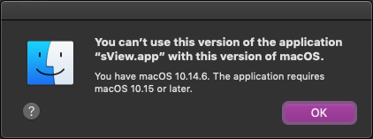
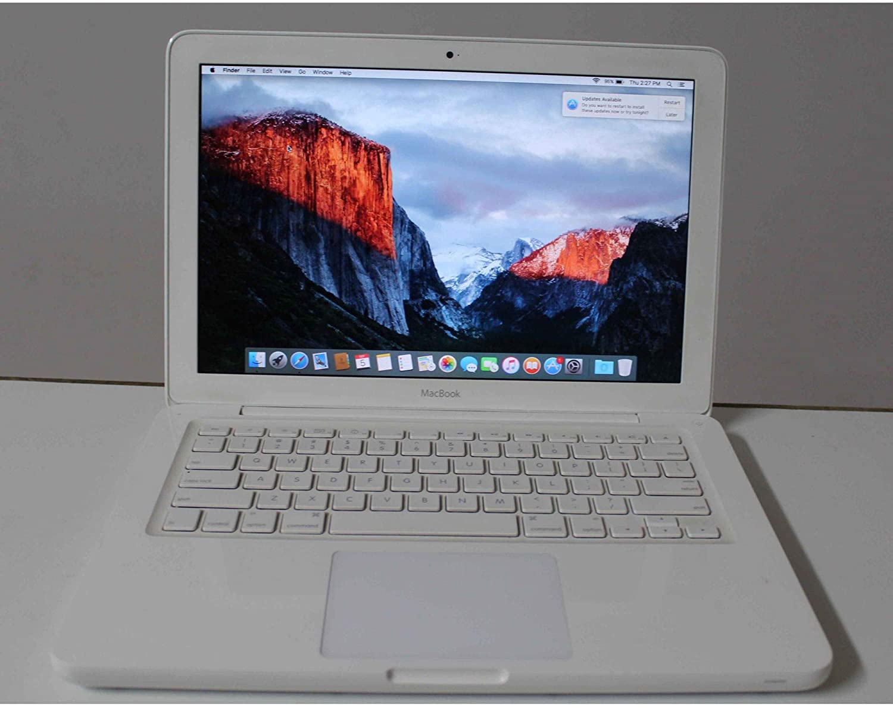
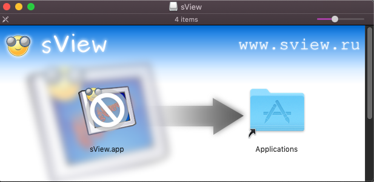
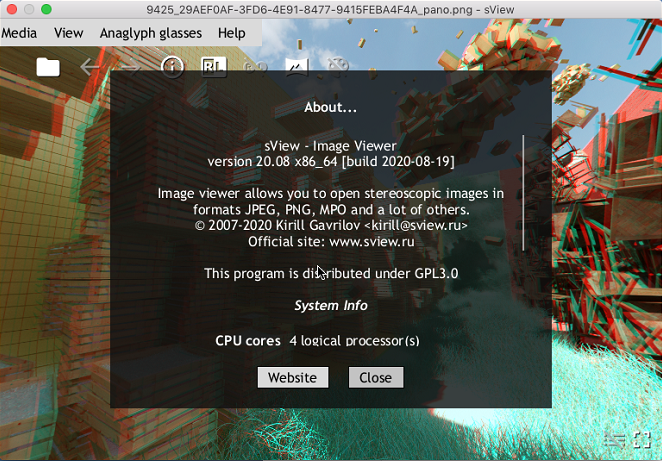

Recent *sView 20.08* release includes *macOS builds* - after a three years break.
Release promises support of *macOS 10.10+*, but several users have reported a very strange thing - *macOS 10.13* and *10.14* declined
to start an application indicating that *sView* requires *macOS 10.15 or later* for unknown reason...

This error has deeply puzzled me, as I have personally installed *sView* on *macOS 10.10* without any errors - an older *macOS* version than reported by users. A nonsense I would say!

<!--break-->

|  |
|:--:|
| &nbsp; |

Let's come back to *sView* release history to see what changed.
There was a reason for a long three years break - my *mid-2010 MacBook* with an ancient, utterly slow *Core2Duo* processor and slow mobile hard-drive became nothing but a piece of room's furniture.
Hardware was slow from the very beginning (I had to upgrade *RAM* from *2 GiB* to *8 GiB* right after taking this *MacBook*), but nowadays it is just unbearable.

Since it's very first release on this platform and until *17.04* release, *sView* supported *OS X 10.6* (*Snow Leopard*) and any later versions of the system.
Supporting old OS versions might be challenging and could be decoupled into two steps:

1. Availability of an older OS.
2. An SDK targeting an older OS.

## Older OS X device at hand

First point is very important, because without an older OS at hand, an application developer relies on a blind assumption that a building toolchain does everything right.
But practice shows numerous hidden compatibility issues breaking this assumption as a tiny glass. Such issues might happen on any target OS, including *Windows*, *Linux* and *Android*.

To keep older OS available for testing, a developer has to be careful with system updates and care on some old devices,
as in many cases installing an old OS version on a brand-new device shipped with the most recent OS version - this is especially related to rolling-style system updates practiced for *macOS*.
Yearly rolling updates give users new features and improvements, but also bring instability, compatibility and usability issues annoying conservative users.

The first problem becomes more desperate in case of *macOS* due to limited access to OS installation images and poor virtualization capabilities for running *macOS* as a guest system.

## Building toolchains targeting an older OS X

Second point is more flexible - technically, it is possible to build an application on a newer OS version targeting an older one.
In the past, this usually meant using a toolchain with an OS SDK of minimal version - older *XCode* releases came with several *OS X* SDKs at once.

*Building against a specific SDK version by default defines a minimum OS version that application could run on.*
*Even if an application doesn't use any new OS features, there is no guarantee that some implicit dependencies will not occur.*

In practice, however, restrictions appeared very soon - *newer XCode* versions required *newer OS X* versions to start and also left behind older SDKs,
at the same time older XCode versions declined to work properly on newer OS X versions!

To overcome these issues, *sView* development environment has been configured on *OS X 10.6 Snow Leopard* with help of dual-boot setup for a *newer OS X* version for regular use.
This configuration served well for many years with seldom issues building newer *FFmpeg* versions using an old *GCC* toolchain.
But as has been mentioned at the beginning of the article, old hardware made it unreliable today.

It's true that *Apple* and other OS vendors push hard users and developers towards regular updates
and usage of only the most recent version(s) of their OS, making older releases outdated quite fast.
However, problems of backward compatibility still bothers OS developers.
Building toolchains shipping several OS SDKs in the past have been mutated into toolchains shipping the single most recent OS SDK,
but has modified it to be able to target earlier versions as well.

So that focus has changed - developer uses as most recent SDK version as possible, and just configures building toolchain to target a minimal OS version application should run onto.
In case of *macOS* this could be:

- `MACOSX_DEPLOYMENT_TARGET` environment variable<br>
  (e.g. export `MACOSX_DEPLOYMENT_TARGET=10.10`);
- `-mmacosx-version-min` compiler flag<br>
  (e.g. `EXTRA_CXXFLAGS += -mmacosx-version-min=10.10`).

*CMake has a similar alias variable `CMAKE_OSX_DEPLOYMENT` and qmake has `QMAKE_MACOSX_DEPLOYMENT_TARGET` variable for the same purpose.*
*If you are using XCode directly, you can find an appropriate option deep inside project building properties.*

Sounds simple enough, but a lot of questions come to my mind: what is the minimal OS version supported by a specific version of XCode
(project settings allows selecting 10.6, but building fails until *10.7+* is specified instead)?
What is the reasonable minimal OS version to target? How to ensure that application dependencies target the same minimum?
How to verify that application actually starts? What system will show to the user in case of an issue?

After lurking into *macOS* release history, I have chosen *OS X 10.10 Yosemite* to be a bare minimum - released almost *6 years ago* and *5 versions behind* the most recent update *macOS 10.15 Catalina*.
Sounds like a good basis - it is difficult to imagine a user working on an older release considering an aggressive *Apple* update policy and that many popular applications require even newer *macOS* versions.
*OS X 10.10* has been already installed on my old *MacBook* - too old for development, but still alive for testing purposes.

*Interesting to note - while looking for macOS 10.14 Mojave, I have realized that this release does not support my old mid-2010 MacBook*
*(photo below is from the Internet - mine doesn't look that good nowadays), and the latest compatible version is macOS 10.13 High Sierra released in '2017.*
*So that Apple has supported device with OS updates just around 7 years.*

|  |
|:--:|
| &nbsp; |

Deal done! `Makefile` in *sView* project has been updated to *target 10.10* by aforementioned parameters (as well as *FFmpeg* building scripts),
`Info.plist` has been updated to set `LSMinimumSystemVersion=10.0`, build was done on *macOS 10.15* installed on a fresh *MacMini*
(*6 CPU cores*, but just *8 GiB of RAM* and a small-capacity drive!) and tested on *OS X 10.10* installed on an ancient *MacBook*. Looks perfect!

## Minos mystery

And then, users suddenly tell me that *sView* fails to start on *macOS* versions newer than tested one with an error indicating *macOS 10.15* as a minimal supported version.
Nonsense! Where did the system even take this `10.15` from, if `LSMinimumSystemVersion` clearly specifies `10.10` - the way *OS X* used to show such error messages before?

|  |
|:--:|
| &nbsp; |

Digging the neighborhood, I've been finally able to find some device with *macOS 10.13* showing the same error.
Unbelievably, running *sView* executable directly from the *Terminal* started just fine without any error!
Looking around with the application package didn't help to identify a place, where the system finds `10.15` from,
but finally I have concluded that it is somewhere inside sView executable itself!

Playing with `otool -l` revealed the truth:

```
Load command 9  
        cmd LC_BUILD_VERSION
    cmdsize 32
   platform macos
   	sdk 10.15
      minos 10.15    <-------------
     ntools 1
       tool ld
    version 450.3
```

Gotcha! Looking around the Internet didn't reveal much information about `minos` information in a binary header,
but I have observed that this property is relatively new.
This answers the question - how is it possible that an older *OS X 10.10* was able to start *sView*, while newer *macOS 10.13-10.14* were unable?
*OS X 10.10* just knows nothing about `minos`.

One question remained open - what should be fixed?
Analyzing the *sView* package, I've realized that `minos` occurs only in *sView* shared libraries and executable, while *FFmpeg* built using the very same toolchain was clean from it.
So there was definitely something wrong in a `Makefile`, and after some tryouts it was identified that the `-mmacosx-version-min` option was specified only to the compiler via `EXTRA_CXXFLAGS`, but not to linker.
Adding the option to `EXTRA_LDFLAGS` has finally solved the problem:

```
TARGET_OS_VERSION = 10.10  
EXTRA_CFLAGS   += -mmacosx-version-min=$(TARGET_OS_VERSION)
EXTRA_CXXFLAGS += -mmacosx-version-min=$(TARGET_OS_VERSION)
EXTRA_LDFLAGS  += -mmacosx-version-min=$(TARGET_OS_VERSION)
```

XCode also introduced a new tool `vtool` that could be used to modify *Mach-O* header of existing binaries:

```
# vtool executable -set-build-version platform minos sdk -output newexecutable
# where platform=1 means MACOS
vtool ./sView -set-build-version 1 10.0 10.0 -output ./sViewMod
```

|  |
|:--:|
| &nbsp; |
