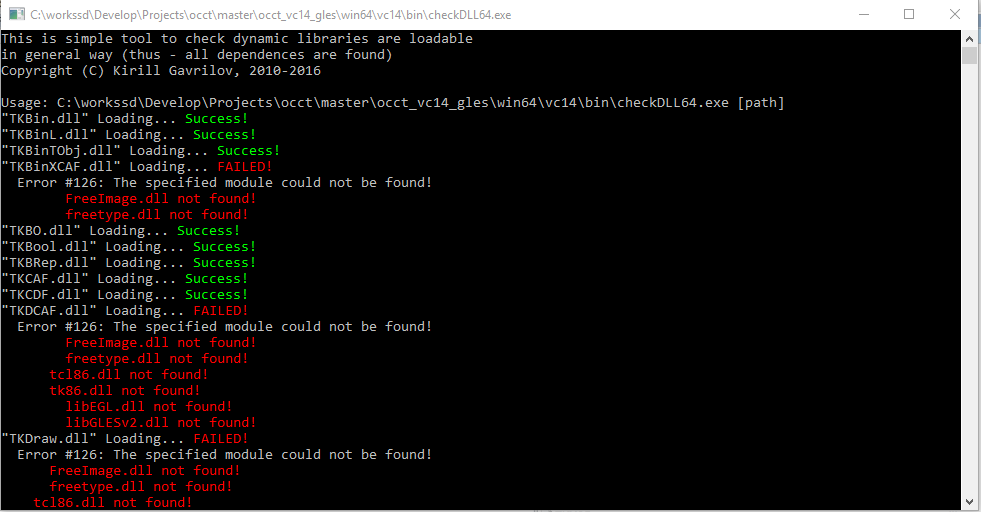

One more handful tool without user interface – [CheckDLL](https://github.com/gkv311/checkdll/releases).
This one I've developed a long time ago (since '2010), but just recently have decided making it available to everybody:

<!--break-->

It is a common problem for developer (and less common for user) that application doesn't show up due to some libraries missing.
There might be a plenty of reasons for that – mess up in environment variables (and/or batch scripts),
mess up in system (some dump application decided installing a version-less DLL in System32),
some libraries haven't been copied by delivery script, mess up with 32-bit and 64-bit DLLs, forgetting dependency from C/C++ runtime libraries, etc.

The most common way for developer to check which dependencies library/application has on *Windows* platform is using *Dependency Walker* tool.
This is a powerful tool, but in most cases it is over-complicated for simple use cases.
In practice, I prefer using a *Fileinfo* plugin for *Total Commander* instead.

Still, when I need to know if there are some broken DLLs in a folder, I'm using **CheckDLL**.
Just put this tool into your folder and launch from explorer to see that every library can be loaded.
Alternatively, the tool can be also started from command-line with a path to the folder.

